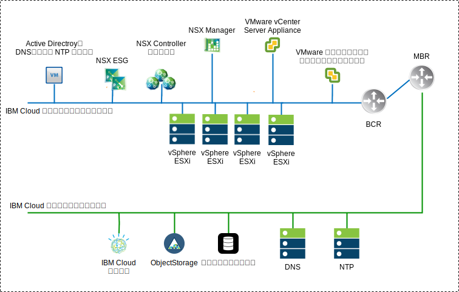
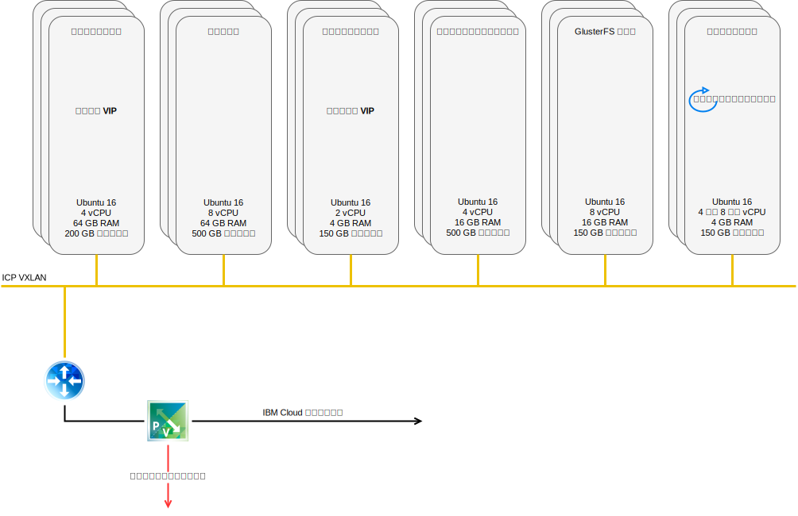
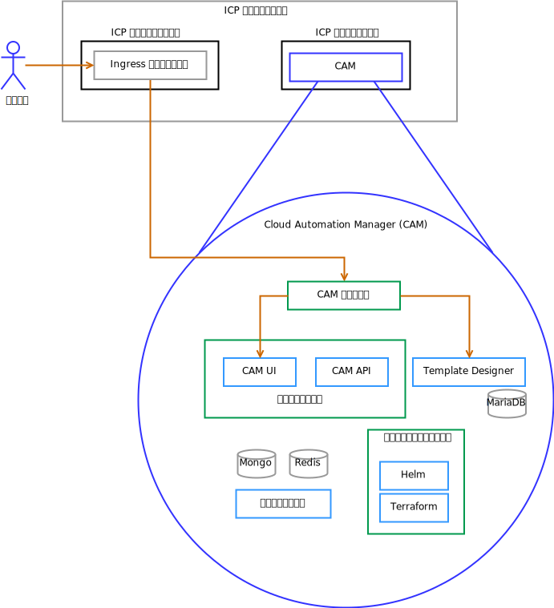

---

copyright:

  years:  2016, 2018

lastupdated: "2018-10-10"

---

# ソリューション・コンポーネント

## VCS コンポーネント

図 1. VCS 環境図

### Platform Service Controller
VCS デプロイメントでは、管理仮想マシンに関連付けられたプライベート VLAN 内のポータブル・サブネット上にインストールされた単一の外部プラットフォーム・サービス・コントローラーを使用します。このデフォルト・ゲートウェイは、バックエンド・カスタマー・ルーター (BCR) に設定されます。

### vCenter Server
プラットフォーム・サービス・コントローラーと同様に、vCenter Server はアプライアンスとしてデプロイされます。さらに、vCenter Server は、管理仮想マシンに関連付けられたプライベート VLAN 上のポータブル・サブネット上にインストールされます。そのデフォルト・ゲートウェイは、その特定のサブネットの BCR に割り当てられた IP アドレスに設定されます。

### NSX Manager
NSX Manager は初期クラスター内にデプロイされます。さらに、管理コンポーネント用に指定されたプライベート・ポータブル・アドレス・ブロックから VLAN–backed IP アドレスが NSX Manager に割り当てられ、DNS サーバーと NTP サーバーが構成されます

### NSX Controller
IBM Cloud の自動化機能によって、初期クラスター内に 3 つの NSX Controller がデプロイされます。管理コンポーネント用に指定されたプライベート・ポータブル・サブネットから VLAN–backed IP アドレスがコントローラーに割り当てられます。

### NSX Edge / DLR
NSX Edge Services Gateway (ESG) のペアがデプロイされます。すべての場合において、プライベート・ネットワークに常駐する自動化コンポーネントからのアウトバウンド・トラフィックにゲートウェイ・ペアが 1 つ使用されます。 vCenter Server と ICP のための 2 つ目のゲートウェイ (ICP 管理エッジと呼ばれる) がデプロイされ、パブリック・ネットワークへのアップリンクとプライベート・ネットワークに割り当てられたインターフェースが構成されます。分散論理ルーター (DLR)、論理スイッチ、ファイアウォールなどの必要な NSX コンポーネントは、管理者が構成できます。[IBM Cloud VCS ネットワーキング参照アーキテクチャー](../vcsnsxt/vcsnsxt-intro.html)に、ネットワーク設計に関する詳細情報があります。

次の表は、ICP ESG/DLR の仕様を要約したものです。

表 1. ICP ESG の仕様

属性  |  仕様
--|--
Edge Service Gateway  |  仮想アプライアンス
Edge サイズ「大」|   vCPU 数	2
メモリー	| 1-GB ディスク	| ローカル・データストアに 1000 GB

表 2. ICP DLR の仕様

属性  |  仕様
--|--|
分散論理ルーター | 	仮想アプライアンス
Edge サイズ「コンパクト」| vCPU 数	1
メモリー	| 512-MB ディスク	| ローカル・データストアに 1000 GB

## ICP コンポーネント
IBM Cloud Private は、オンプレミスのコンテナー化されたアプリケーションを開発して管理するためのアプリケーション・プラットフォームです。これは、コンテナー・オーケストレーター Kubernetes、プライベート・イメージ・リポジトリー、管理コンソール、モニター・フレームワークを含む、コンテナーを管理するための統合環境です。

図 2. VCS を含めた仮想 ICP のデプロイメント

###	ブート・ノード
ブート (ブートストラップ) ノード (オプション) は、インストール、構成、ノード・スケーリング、クラスター更新の実行に使用されます。クラスターに必要なブート・ノードは 1 つのみです。単一ノードをマスターとブートの両方に使用できます。

### マスター・ノード
マスター・ノードは管理サービスを提供し、クラスター内のワーカー・ノードを制御します。マスター・ノードは、リソース割り振り、状態保守、スケジューリング、モニターを行うプロセスをホストします。高可用性 (HA) 環境には複数のマスター・ノードが含まれているので、先行マスター・ノードで障害が発生した場合は、フェイルオーバー・ロジックによって別のノードが自動的にマスター役割にプロモートされます。マスターとして機能できるホストは、マスター候補と呼ばれます。

###	ワーカー・ノード
ワーカー・ノードは、タスクを実行するためのコンテナー化された環境を提供するノードです。要求の増加に対応してパフォーマンスと効率を向上させるために、クラスターにさらにワーカー・ノードを簡単に追加できます。クラスターには任意の数のワーカー・ノードを含めることができますが、少なくとも 1 つのワーカー・ノードが必要です。

### プロキシー・ノード
プロキシー・ノードは、クラスター内で作成されたサービスに外部要求を送信するノードです。高可用性 (HA) 環境には複数のプロキシー・ノードが含まれているので、先行プロキシー・ノードで障害が発生した場合は、フェイルオーバー・ロジックによって別のノードが自動的にプロキシー役割にプロモートされます。単一ノードをマスターとプロキシーの両方として使用できますが、マスター・ノードの負荷を軽減するために専用プロキシー・ノードを使用するのが最善です。クラスター内でロード・バランシングが必要な場合は、少なくとも 1 つのプロキシー・ノードがクラスターになければなりません。

### 管理ノード
管理ノードは、モニター、課金、ロギングなどの管理サービスのみをホストするオプション・ノードです。専用の管理ノードを構成することにより、マスター・ノードが過負荷になることを防止できます。管理ノードを有効にできるのは、IBM Cloud Private のインストール時のみです。

###	VA ノード
VA (Vulnerability Advisor: 脆弱性アドバイザー) ノードは、脆弱性アドバイザー・サービスの実行に使用されるオプション・ノードです。脆弱性アドバイザー・サービスはリソース集中型です。脆弱性アドバイザー・サービスを使用する場合は、専用の VA ノードを指定してください。

高可用性 ICP インスタンスに必要な仮想マシンの仕様を以下に示します。

表 3. ICP 仮想マシンの仕様

ノード | 	インスタンス	| IP	| CPU	| RAM (GB)	| ディスク (GB)
:-----|------------:|:----|----:|----------:|----------:|
マスター|	3	| IP (x3) VIP (x1)	| 4	| 64	| 200
管理	|3	| IP (x3)	|8	|64	|500
プロキシー	| 3	| IP (x3)VIP (x1)	|2	|4	|150
脆弱性アドバイザー	|3	| IP (x3)	| 4	| 16	|500
GlusterFS	| 3	| IP (x3)	|8	|16	|150
ワーカー	| 3-6	| IP (x3)	|4-8	|4	|150

CAM が機能するためには、ワーカー・ノードの vCPU とメモリーの構成を大きくする必要があります。

表 4. ICP 仮想マシンの仕様

ノード | 	インスタンス	| IP	| CPU	| RAM (GB)	| ディスク (GB)
:-----|------------:|:----|----:|----------:|----------:|
ワーカー  |  3 | IP (x3)  |  4-8 |16-20   |  150

## CAM コンポーネント

IBM Cloud Automation Manager (CAM) は、ICP 上で実行されるマルチクラウド・セルフサービス管理プラットフォームであり、開発者と管理者がビジネス要求に対応できるようにします。

図 3. CAM コンポーネント・リファレンス

### CAM プロキシー
CAM への nginx プロキシー・アクセスを提供します。

### 	CAM UI
UI コンポーネントは、複数のコンテナー (クラウド接続 UI、テンプレート・ライブラリー UI、およびデプロイ済みインスタンス UI) に分割されます。

### CAM API
CAM API は複数のコンテナーに分割されます。

###	Helm
Helm チャートを Kubernetes クラスターにデプロイするために必要なバイナリーを入れたコンテナー。

###	Terraform
Terraform リソースを複数のクラウドにデプロイするために必要なバイナリーを入れたコンテナー。

### ログ
コンテナー・ログのロケーション。

###	Mongo データベース
CAM アプリケーションのコア・データベース。

###	Redis
Redis データベースは、セッションのキャッシュとロックを CAM 内に保管するために使用されます。

###	Template Designer
Terraform テンプレートを作成するためのグラフィカル・ユーザー・インターフェース。Terraform モジュールのドラッグ・アンド・ドロップ機能を備えています。

###	Maria DB
Template Designer アプリケーションのデータベース。

### 関連リンク

* [VMware vCenter Server on IBM Cloud with Hybridity Bundle](../vcs/vcs-hybridity-intro.html)
