---

copyright:

  years:  2016, 2019

lastupdated: "2019-08-05"

subcollection: vmware-solutions

---

# アーキテクチャーの概要
{: #vcsicp-arch-overview}

{{site.data.keyword.vmwaresolutions_full}} オファリングは、世界中の {{site.data.keyword.CloudDataCents_notm}}に VMware テクノロジー・コンポーネントをデプロイできる自動化機能を備えています。
このアーキテクチャーは単一のクラウド領域で構成されます。また、別の地域にある追加のクラウド領域、または同じデータ・センター内の別の {{site.data.keyword.cloud_notm}} ポッドに拡張する機能をサポートします。

{{site.data.keyword.cloud_notm}} Private および Cloud Automation Manager (CAM) 製品は、オンプレミスの仮想化プラットフォームに手動でデプロイできるので、オンプレミス・ロケーションからクラウド管理を行うことができます。 また、{{site.data.keyword.icpfull_notm}} および CAM は、既存または新規の VMware vCenter Server on {{site.data.keyword.cloud_notm}} デプロイメントのサービス拡張として提供されているので、自動化機能を使用して {{site.data.keyword.cloud_notm}} からクラウドを管理することもできます。

{{site.data.keyword.cloud_notm}} Private は、オンプレミスのコンテナー化されたアプリケーションを開発および管理するためのアプリケーション・プラットフォームです。 {{site.data.keyword.cloud_notm}} Private は、コンテナー・オーケストレーター Kubernetes、プライベート・イメージ・リポジトリー、管理コンソール、モニター・フレームワークを含む、コンテナーを管理するための統合環境です。

IBM Multi-Cluster Manager (MCM) は、複数のクラウドおよびクラスターにおけるユーザー可視性、アプリケーション中心の管理 (ポリシー、デプロイメント、正常性、操作)、ポリシー・ベースのコンプライアンスを提供します。 MCM を使用することで、Kubernetes クラスターを制御できます。 MCM を使用すれば、クラスターを安全かつ効率的に運用できるだけでなく、{{site.data.keyword.cloud_notm}} Private 上で実行されるサービス管理プラットフォームを利用できるので、ビジネス要求を満たそうとしている開発者と管理者の力になります。

Cloud Automation Manager Service Composer を使用すると、{{site.data.keyword.cloud_notm}} Private カタログ内のハイブリッド・クラウド・サービスを表示できます。

## IBM Cloud サイドのクラウド管理プラットフォーム
{: #vcsicp-arch-overview-ibm-cloud-side-platform}

次の図は、{{site.data.keyword.cloud_notm}} インフラストラクチャーに {{site.data.keyword.icpfull_notm}} と CAM をデプロイした例です。これらはオンプレミス vCenter と {{site.data.keyword.cloud_notm}} にデプロイされた {{site.data.keyword.containerlong_notm}} に接続されています。 ユーザーは仮想マシン (VM) をオンプレミスにも vCenter Server インスタンスにもデプロイできます。また、コンテナーを {{site.data.keyword.icpfull_notm}} クラスターと {{site.data.keyword.containerlong_notm}} クラスターにデプロイできます。

この図では、CAM は、vCenter、クラウド・プロバイダー、{{site.data.keyword.icpfull_notm}}、{{site.data.keyword.containerlong_notm}} 環境へのクラウド接続を論理的に作成します。 {{site.data.keyword.icpfull_notm}} クラスターは各データ・センターのクラウド環境にデプロイし、MCM が {{site.data.keyword.icpfull_notm}} クラスターを単一の管理ビューに接続するメカニズムを提供するようにする必要があります。

{{site.data.keyword.icpfull_notm}} は NSX-V または NSX-T コンポーネントとともにデプロイできます。 NSX-V とともに {{site.data.keyword.icpfull_notm}} をデプロイすると、VXLAN ネットワーク上で {{site.data.keyword.icpfull_notm}} VM を実行して Kubernetes Calico 内部ネットワーキングを使用できるようになります。

NSX-T とともに {{site.data.keyword.icpfull_notm}} をデプロイすると、ユーザーはネットワーキング、サブネット、ポリシーを中央 UI (NSX-T Manager) から制御および構成できるようになります。 NSX-V と NSX-T の違いについては、[vCenter Server ネットワーキング・ガイド](/docs/services/vmwaresolutions/archiref/vcsnsxt?topic=vmware-solutions-vcsnsxt-intro)を参照してください。

## オンプレミスのクラウド管理プラットフォーム
{: #vcsicp-arch-overview-on-premises-platform}

以下の図は、オンプレミスのインフラストラクチャーに {{site.data.keyword.icpfull_notm}} および CAM をデプロイした例です。これらは {{site.data.keyword.cloud_notm}} にデプロイされた vCenter および {{site.data.keyword.containerlong_notm}} に接続されています。 ユーザーは VM とコンテナーをオンプレミスに、VM を vCenter Server インスタンスに、そしてコンテナーを {{site.data.keyword.containerlong_notm}} クラスターにデプロイできます。

デプロイ済みの {{site.data.keyword.containerlong_notm}} コンテナーとの接続を確立するために strongSwan VPN が使用されています。 strongSwan VPM は Direct Link 接続に置き換えることができます。

この図では、CAM は、vCenter、クラウド・プロバイダー、{{site.data.keyword.icpfull_notm}}、{{site.data.keyword.containerlong_notm}} 環境へのクラウド接続を論理的に作成します。 {{site.data.keyword.icpfull_notm}} クラスターは各データ・センターのクラウド環境にデプロイし、MCM が {{site.data.keyword.icpfull_notm}} クラスターを単一の管理ビューに接続するメカニズムを提供するようにする必要があります。
