---

copyright:

  years:  2016, 2018

lastupdated: "2018-10-30"

---

# アーキテクチャーの概要

IBM Cloud for VMware オファリングは、世界中の IBM Cloud データ・センターに VMware テクノロジー・コンポーネントをデプロイするための自動化機能を提供します。
アーキテクチャーは単一のクラウド領域で構成されます。このアーキテクチャーでは、同じデータ・センター内の別の地域や別の IBM Cloud ポッドにある追加のクラウド領域に拡張する機能がサポートされます。

IBM Cloud Private (ICP) および Cloud Automation Manager (CAM) 製品は、オンプレミスの仮想化プラットフォームに手動でデプロイすることができるので、オンプレミス・ロケーションからクラウド管理を行うことができます。 また、ICP および CAM は、既存または新規の VMware vCenter Server on IBM Cloud (VCS) デプロイメントのサービス拡張として自動化機能によって提供され、IBM Cloud からのクラウド管理を可能にします。

ICP は、オンプレミスのコンテナー化されたアプリケーションを開発および管理するためのアプリケーション・プラットフォームです。 これは、コンテナー・オーケストレーター Kubernetes、プライベート・イメージ・リポジトリー、管理コンソール、モニター・フレームワークを含む、コンテナーを管理するための統合環境です。

IBM Multi-Cluster Manager (MCM) は、複数のクラウドおよびクラスターにおけるユーザー可視性、アプリケーション中心の管理 (ポリシー、デプロイメント、正常性、操作)、ポリシー・ベースのコンプライアンスを提供します。 MCM を使用することで、Kubernetes クラスターを制御できます。 クラスターはセキュアで効率的に動作するようになり、ICP 上で実行されるサービス管理プラットフォームをクラスターで提供できるので、開発者と管理者はビジネス要求に容易に対応できるようになります。
Cloud Automation Manager Service Composer を使用すると、ICP カタログ内のハイブリッド・クラウド・サービスを公開できます。

## IBM Cloud サイドのクラウド管理プラットフォーム

図 1. クラウド・サイドからのクラウド管理

上の図は、IBM Cloud インフラストラクチャーとともにデプロイされた ICP と CAM を表しています。これらは、オンプレミスの vCenter と、IBM Cloud にデプロイされた IBM Kubernetes Service (IKS) サービスに接続されています。 ユーザーは、仮想マシンをオンプレミスに、仮想マシンを VCS インスタンスに、コンテナーを ICP および IKS クラスターにそれぞれデプロイできます。

この図では、CAM は、vCenter、クラウド・プロバイダー、ICP、IKS 環境へのクラウド接続を論理的に作成します。 ICP クラスターを単一の管理ビューに接続するメカニズムを提供する MCM を使用して、各データ・センター/クラウド環境に ICP クラスターをデプロイする必要があります。

ICP は、NSX-V または NSX-T コンポーネントとともにデプロイできます。 NSX-V とともに ICP をデプロイすると、VXLAN ネットワーク上で ICP 仮想マシンを実行して Kubernetes Calico 内部ネットワーキングを使用できるようになります。

NSX-T とともに ICP をデプロイすると、ユーザーはネットワーキング、サブネット、ポリシーを中央 UI (NSX-T Manager) から制御および構成できるようになります。 NSX-V と NSX-T の違いについては、[vCenter Server ネットワーキング・ガイド](../vcsnsxt/vcsnsxt-intro.html)を参照してください。

## オンプレミスのクラウド管理プラットフォーム

図 2. オンプレミス・サイドからのクラウド管理

上の図は、オンプレミス・インフラストラクチャーにデプロイされた ICP と CAM を表しています。これらは、IBM Cloud にデプロイされた vCenter と IKS に接続されています。 ユーザーは、仮想マシンとコンテナーをオンプレミスに、仮想マシンを vCenter Server インスタンスに、コンテナーを IKS クラスターにそれぞれデプロイできます。

デプロイ済みの IKS コンテナーとの接続を確立するために strongSwan VPN が使用されていますが、最終的に Direct Link 接続に置き換えられる可能性があります。

この図では、CAM は、vCenter、クラウド・プロバイダー、ICP、IKS 環境へのクラウド接続を論理的に作成します。 ICP クラスターを単一の管理ビューに接続するメカニズムを提供する MCM を使用して、各データ・センター/クラウド環境に ICP クラスターをデプロイする必要があります。

### 関連リンク

* [VCS Hybridity Bundle の概要](../vcs/vcs-hybridity-intro.html)
