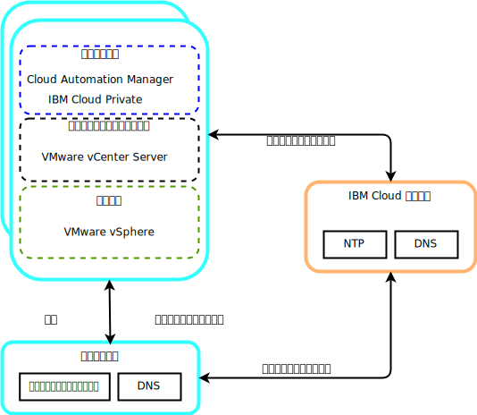
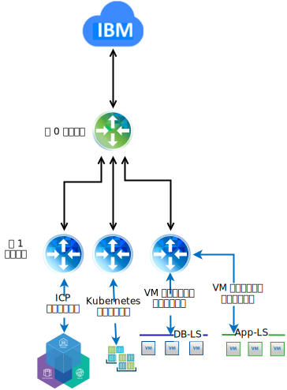

---

copyright:

  years:  2016, 2019

lastupdated: "2019-01-23"

---

# 詳細設計

## 共通サービス・コンポーネント

共通サービスは、クラウド管理プラットフォームの他のサービスによって使用されるサービスを提供します。 共通サービスには、ID およびアクセスのサービス、ドメイン・ネーム・サービス、NTP サービスなどがあります。

図 1. {{site.data.keyword.icpfull_notm}} の共通サービス

### ID およびアクセス・サービス
VMware vCenter Server on {{site.data.keyword.cloud}} 自動化機能の一部として、ID 管理に Microsoft Active Directory (AD) が使用されます。 単一の AD 仮想サーバー・インスタンス (VSI) がデプロイされます。 vCenter は AD 認証を使用するように構成されるので、{{site.data.keyword.icpfull_notm}} に LDAP 認証を構成できます。

###	ドメイン・ネーム・サービス
vCenter Server デプロイメントでは、デプロイ済みの AD VSI がインスタンスの DNS サーバーとして使用されます。 vCenter、PSC、NSX、ESXi ホストなどのデプロイ済みのコンポーネントはすべて、デフォルト DNS として AD を指すように構成されます。

###	NTP サービス
vCenter Server デプロイメントでは、{{site.data.keyword.cloud_notm}} インフラストラクチャーの NTP サーバーを使用します。 デプロイ済みのすべてのコンポーネントは、これらの NTP サーバーを使用するように構成されます。 証明書と AD 認証が正常に機能するためには、設計に含まれるすべてのコンポーネントで同じ NTP サーバーを使用することが必要不可欠です。

## ネットワーキング

### NSX-V ネットワーキング

NSX-V は、単一の NSX-V マネージャー・プラットフォームが単一の vCenter Server インスタンスに結び付けられるように設計されています。 vSphere 環境内で実行されるアプリケーションにネットワーク・サービスを提供します。

VCS デプロイメントに含まれる NSX-V ネットワーキングを使用して、{{site.data.keyword.icpfull_notm}} を VXLAN オーバーレイ・ネットワークにデプロイできます。

{{site.data.keyword.icpfull_notm}} は Kubernetes のデフォルトの Calico ネットワーキング・スタックと共にデプロイされ、このネットワーキング・スタックがクラスター内のネットワーク分離に使用されます。

図 2. NSX-V を使用する場合の {{site.data.keyword.icpfull_notm}} のネットワーキング

詳しくは、[vCenter Server ネットワーキング・ガイド](/docs/services/vmwaresolutions/archiref/vcsnsxt/vcsnsxt-intro.html)を参照してください。

### NSX-T ネットワーキング

NSX-T は、vSphere 環境の内部と外部のどちらで実行されていようと、仮想マシンとコンテナーのどちらをベースにしていようと関係なく、任意のタイプのアプリケーションを接続できる単一のネットワーキング・プラットフォームになるように設計されています。

{{site.data.keyword.icpfull_notm}} には Calico ネットワーキングを NSX-T インスタンスに置き換えるオプションがあるので、{{site.data.keyword.icpfull_notm}} はネットワーキングとセキュリティーを管理するための単一のロケーションになります。

図 3. NSX-T を使用する場合の {{site.data.keyword.icpfull_notm}} のネットワーキング

### 関連リンク

* [vCenter Server on {{site.data.keyword.cloud_notm}} with Hybridity Bundle の概要](/docs/services/vmwaresolutions/archiref/vcs/vcs-hybridity-intro.html)
