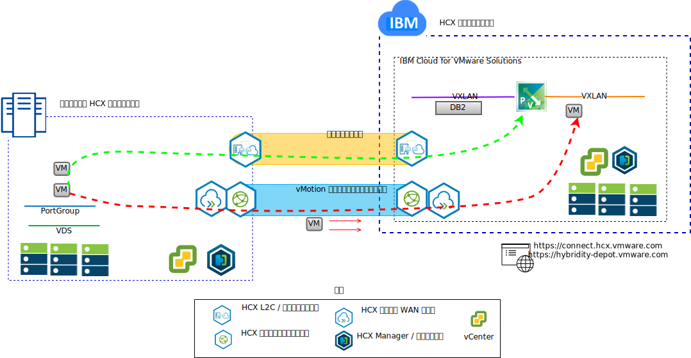
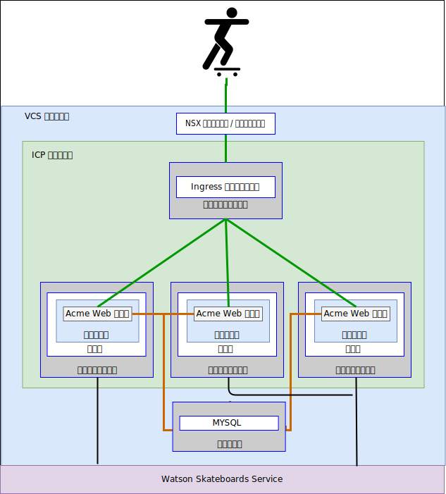

---

copyright:

  years:  2016, 2018

lastupdated: "2018-10-10"

---

# ユース・ケース

## IBM Cloud へのワークロードのマイグレーション
Acme Skateboards 社は、オンプレミスの VMware SDDC を IBM Cloud 上の VCS インスタンスにシームレスに拡張したいと考えています。その際には、ビジネスを継続して、ダウン時間を最小限に抑える必要があります。使用しているアプリケーションをクラウドで実行するように再構成することは、最適なソリューションではありません。

VMware Hybridity on IBM Cloud サービスを使用することにより、IBM Cloud とオンプレミスの VMware 仮想化データ・センターの間にシームレスな接続を作成することができます。

IBM Cloud の vCenter Server with Hybridity Bundle オファリングにより、ピアのオンプレミス・ソース・サイトと IBM Cloud ターゲット・サイトの間のセキュア接続が可能になります。

図 1. VMware Hybridity サービス

これにより、オンプレミスと IBM Cloud 間の疎結合された相互接続が作成され、以下のような機能を使用できるようになります。
- **単純な相互接続** - 論理ネットワーク接続が、公衆インターネット、プライベート VPN、IBM Cloud Direct Link などの物理接続を介して簡単に確立されます。
- **レイヤー 2 拡張** - オンプレミス・ネットワーク (オンプレミス・サブネットと IP アドレッシングを含む) がクラウドに拡張されます。
- **暗号化** - ピア・サイト間でネットワーク・トラフィックが安全に暗号化されます。
- **ネットワーク最適化** - 最適な接続を選択し、ネットワーク・トラフィックをできるだけ速く移動するように効率的に接続をフラッディングします。
- **データ重複排除** – 50% ものネットワーク・トラフィックの削減を達成できます。
- **インテリジェント・ルーティング** – ワークロードが移動されるときに、ネットワーク・トラフィックが発信元のサイトに「ヘアピン通信」で戻ることがないようにターゲット・サイトのゲートウェイを使用するようにするため、隣接性ルーティングによってネットワーク・パス (つまり、ゲートウェイ) を変更できます。
- **ゼロ・ダウン時間マイグレーション** - vMotion を使用して、実行中の仮想マシンをクラウドとの間で双方向に移動できます。
- **スケジュールされたマイグレーション** - 任意の数の仮想マシンを宛先サイトに複製してから、指定した時刻にそのサイトでアクティブ化して、元のサイトで実行されているシステムを置き換えることができます。
- **セキュリティー・ポリシーのマイグレーション** - NSX をオンプレミスで使用する場合、セキュリティー・ポリシーやファイアウォールなどはすべてワークロードとともに移動されます。

Acme Skateboards 社はこのソリューションを使用して、オンプレミスの VMware ワークロードを IBM Cloud に正常にマイグレーションし、ダウン時間がほとんどなく、アプリケーションの再構成も必要ないという要件を満たすことができました。

## ハイブリッド・アーキテクチャーのデプロイメント

Acme Skateboards 社は、アプリケーション・モダナイゼーションの過程として、VCS と ICP で構成されるハイブリッド・アーキテクチャーを IBM Cloud にデプロイしたいと考えています。この際の要件は、仮想マシン上でデータベースを実行し、コンテナー内でアプリケーションと Web サービスを実行するとともに、ネットワークとセキュリティーの管理に共通のツール・セットを使用することです。

図 2. Acme Skateboards 社のハイブリッド・アプリケーション

IBM Cloud for VMware Solutions は、世界中の IBM Cloud データ・センターに VMware テクノロジー・コンポーネントをデプロイするための自動化機能を提供します。アーキテクチャーは単一のクラウド領域で構成されます。このアーキテクチャーでは、同じデータ・センター内の別の地域や別の IBM Cloud ポッドにある追加のクラウド領域に拡張する機能がサポートされます。

IBM Cloud Private (ICP) 製品および Cloud Automation Manager (CAM) 製品は、オンプレミスの仮想化プラットフォームに手動でデプロイされるので、オンプレミス・ロケーションからクラウド管理を行うことができます。あるいは、ICP および CAM は、既存または新規の VCS デプロイメントのサービス拡張として自動化機能によって提供され、IBM Cloud からのクラウド管理を可能にします。

以下の図は、VCS インスタンスの上で実行されている ICP を表しています。ICP オーバーレイ・ネットワークにアクセスするために専用スイッチ/VXLAN、DLR、ESG を使用して NSX-V が構成されており、アンダーレイ・ネットワークにアクセスするために ESG を介してルーティングがセットアップされています。

Acme Skateboards 社は、IBM Cloud 自動化を使用して、データベース VM を実行するための VMware on IBM Cloud と、アプリとフロントエンド Web サービスをコンテナー内で実行するための VMware on IBM Cloud 上の ICP で構成されるハイブリッド・ソリューションをプロビジョンできます。NSX は、オーバーレイ・ネットワーク内のネットワークとセキュリティー用の共通の管理ツール・セットを提供します。

図 3. ICP を使用する VCS

### 関連リンク

* [VMware vCenter Server on IBM Cloud with Hybridity Bundle](../vcs/vcs-hybridity-intro.html)
