---

copyright:

  years:  2016, 2019

lastupdated: "2019-04-01"

subcollection: vmware-solutions

---

# アプリケーション・モダナイゼーションの概要
{: #vcsiks-appmod}

以下の図は、Acme Skateboards 社がデプロイするアプリケーション・モダナイゼーションのリファレンス・アーキテクチャーを示しており、この文書シリーズで詳しく説明されています。

図 1. アーキテクチャー概要図

　このハイブリッド・アーキテクチャーにより、Acme Skateboards 社は以下のことが可能になります。
- ダウン時間がほとんど、あるいはまったくなく、アプリケーションの再構成も必要とすることなく、VMware VM をオンプレミスから {{site.data.keyword.cloud}} にマイグレーションする。
- 比較的単純な Web インターフェースとミドルウェアのコンテナー化に集中できるようにする一方、比較的複雑なデータベースは VM として残すことができるようにすることで、Acme Skateboards 社はアプリケーション・モダナイゼーションの手順を開始できる。
- Cloud Automation Manager (CAM) を使用して Infrastructure as Code (IaC) をスクリプト化し、VM とコンテナーの両方から作成された各種サービスを構成および調整して、DevOps ツールチェーンおよび ITSM ソリューションと統合する。

このリファレンス・アーキテクチャーには以下のキー・コンポーネントがあります。
- **オンプレミス仮想化** – オンプレミス仮想化は、Acme Skateboards 社の VM を現在ホストしている VMware クラスターです。 これらの VM は、現在、モダナイズするアプリケーションをホストしています。 このクラスターは、HCX を実行できるように [VMware HCX on {{site.data.keyword.cloud_notm}} Solution Architecture](/docs/services/vmwaresolutions?topic=vmware-solutions-hcx-archi-intro#hcx-archi-intro) アーキテクチャーの前提条件を満たすために必要です。

HCX はオンプレミス・ネットワークを {{site.data.keyword.cloud_notm}} に拡張します。これにより、お客様は VM を、{{site.data.keyword.cloud_notm}} 上で稼働する VMware vCenter Server on {{site.data.keyword.cloud_notm}} インスタンスにマイグレーションしたり、必要に応じて元に戻したりすることができます。
- **{{site.data.keyword.cloud_notm}} for VMware Solutions** – vCenter Server インスタンスは、VMware Software Defined Data Center (SDDC) ソリューションを自動的にデプロイするために必要な、vSphere、vCenter Server、NSX-V、および vSAN や {{site.data.keyword.cloud_notm}} Endurance ストレージを始めとするストレージ・オプションなどの基本的な VMware ビルディング・ブロックを提供します。 VMware クラスターは、マイグレーションされる VM のターゲットです。さらに、{{site.data.keyword.icpfull_notm}} がホストするコンテナーの中で実行されるモダナイズ後の一部のアプリケーションのターゲットでもあります。 vCenter Server のキー・コンポーネントは以下のとおりです。
  - **NSX-V** - NSX-V は、Acme Skateboards 社の VM 用にネットワーク・オーバーレイを提供するネットワーク仮想化層を vCenter Server 内に実装します。 NSX-V は BYOIP を使用可能にして、ワークロード・ネットワークを {{site.data.keyword.cloud_notm}} ネットワークから分離します。 NSX-V は、Acme Skateboards 社がオンプレミスから拡張するネットワークを作成するために HCX によってプログラミングされます。
  - **NSX-T** - NSX-T は、コンテナーと VM の両方にわたるネットワーク管理とセキュリティー管理用の共通のツール・セットを提供します。 NSX-T は Kubernetes Container Networking Interface (CNI) と完全に互換性があり、CNI と統合してコンテナー・ネットワーキングを提供します。 NSX-T は、モダナイズされるアプリケーションが使用するオーバーレイ・ネットワークを提供し、{{site.data.keyword.icpfull_notm}} および {{site.data.keyword.containerlong_notm}} によってネイティブで使用される Calico を置き換えます。

- **{{site.data.keyword.icpfull_notm}}** - {{site.data.keyword.icpfull_notm}} は、コンテナー化された
アプリケーションを開発して管理するためのアプリケーション・プラットフォームです。 {{site.data.keyword.icpfull_notm}} は、コンテナー・オーケストレーター Kubernetes、プライベート・イメージ・リポジトリー、管理コンソール、モニター・フレームワーク、グラフィカル・ユーザー・インターフェースで構成される統合環境であり、Acme Skateboards 社がアプリケーションのデプロイ、管理、モニター、スケーリングを行うことができる一元的な場所を提供します。 vCenter Server インスタンスは {{site.data.keyword.icpfull_notm}} コンポーネント、マスター・ノード、ワーカー・ノードなどをホストし、それらを VM として実行します。 {{site.data.keyword.icpfull_notm}} は以下のコンポーネントをホストします。
  - **{{site.data.keyword.cloud_notm}} Automation Manager** – CAM は、エンタープライズ対応の Infrastructure as Code (IaC) プラットフォームであり、オンプレミスにも vCenter Server にも、テンプレートを使用して単一画面で VM ワークロードをプロビジョンできます。また、 {{site.data.keyword.icpfull_notm}} または {{site.data.keyword.containerlong_notm}} に Kubernetes ワークロードをプロビジョンすることもできます。 CAM は、{{site.data.keyword.icpfull_notm}} インストール環境で実行される Docker 対応アプリケーションであり、役割ベースのアクセス制御 (RBAC) や許可などの機能を実行するために緊密に統合されています。
  - お客様がこの環境にデプロイする **Acme Skateboards 社のコンテナー化アプリケーション**。

- **{{site.data.keyword.containerlong_notm}}** – {{site.data.keyword.containerlong_notm}} では、Acme Skateboards 社がモダナイズ対象アプリケーションを Docker コンテナー (Kubernetes クラスターで稼働) にデプロイできます。 マスター・モードは IBM が完全に管理しますが、ワーカー・プール内のワーカー・ノードは vCenter Server インスタンスと同じ {{site.data.keyword.cloud_notm}} アカウントにデプロイされます。 ワーカー・ノードは、ベアメタル・サーバー、パブリック・サーバー専用仮想サーバーのいずれかのインスタンスになります。 Calico は {{site.data.keyword.containerlong_notm}} に自動的にインストールされて構成されます。 Calico は、コンテナーにセキュアなネットワーク接続を提供します。また Calico は、サブネット間を流れるパケットには IP-in-IP カプセル化を使用し、コンテナーからの発信接続には NAT を使用するように {{site.data.keyword.containerlong_notm}} で構成されます。

- **Direct Link** – {{site.data.keyword.cloud_notm}} Direct Link は、Acme Skateboard 社の WAN プロバイダーを使用してデータ・センターを {{site.data.keyword.cloud_notm}} に接続し、信頼性が高く遅延時間の少ないセキュアなネットワーク接続を提供します。 この接続は以下のものを提供します。
  - エンタープライズ・ユーザーからクラウド・ホスト・アプリケーションへのアクセス。
  - オンプレミス VM とクラウド VM 間の VM 間トラフィック。
  - オンプレミス・データ・センター内のレガシー・システムとクラウド VM との間のトラフィック。

## Acme Skateboards 社にとっての主な利点
{: #vcsiks-appmod-benefits}

vCenter Server には、お客様のワークロードに最も合う VMware Software Defined Data Center (SDDC) ソリューションを柔軟に設計できるように、基本的なビルディング・ブロック (VMware vSphere、vCenter Server、NSX、および vSAN などの共有ストレージ・オプション) が用意されています。

{{site.data.keyword.cloud_notm}} for VMware オファリングの機能を要約すると、次のようになります。
* リソースの調達、設計、実装、デプロイメントに数週間から数カ月かかっていた時間を数時間に短縮し、IT プロジェクトを開発者および基幹業務に迅速に配信します。
* ホステッド・プライベート・クラウドの専用ベアメタル・サーバーでセキュリティーが強化されます。{{site.data.keyword.containerlong_notm}} や KMIP を含む {{site.data.keyword.cloud_notm}} サービスへのプライベート・ネットワーク・サービス・エンドポイントのデプロイメントを含みます。
* 仮想化管理への完全な管理アクセスを可能にして、デプロイされたハイブリッド・クラウドを一貫して管理およびガバナンスできるようにします。 こうした管理によって、既存の VMware ツール、スクリプト、研修への投資が無駄にならないように活用できます。
* 世界規模での VMware 専門知識の使用。世界 30 以上の {{site.data.keyword.CloudDataCents_notm}} にわたる IBM プロフェッショナル・サービスおよびマネージド・サービスで、世界規模の VMware 専門知識を利用できます。

{{site.data.keyword.containerlong_notm}} は、マネージド Kubernetes オファリングです。強力な管理ツール、直感的なユーザー・エクスペリエンス、組み込みのセキュリティーと分離を提供して、Watson のコグニティブ機能などのクラウド・サービスを利用しながらアプリケーションを迅速にデリバリーすることを可能にします。 IBM は Cloud Native Computing Foundation (CNCF) のプラチナ・メンバーであり、このオファリングは CNCF Kubernetes 規格準拠試験プログラムに準拠しています。

{{site.data.keyword.containerlong_notm}} は、以下のようなネイティブ Kubernetes 機能を備えています。
- インテリジェント・スケジューリングにより、CPU 集中型ポッドと RAM 集中型ポッドが一緒に配置されるようにアプリをデプロイすることで、基礎のクラスター・リソースを最大限に使用できます。
- コンテナー化アプリケーションとマイクロサービスの自己修復により、問題が発生した場合は、それらのコンポーネントを自動的に再デプロイできます。
- デプロイメント・ポリシーを構成できる水平スケーリング。オーケストレーターはこれを使用して、ワークロードが必要な容量を確保できるようにします。
- サービス・ディスカバリーおよびロード・バランシングでは、Kubernetes クラスター内に軽量の DNS が用意され、サービスが自分自身を登録できるので、マイクロサービスを静的にコーディングする必要はありません。 ロード・バランシングにより、アーキテクチャーで実行されるインスタンスの数に着信要求を分散させます。
- 自動化されたロールアウトおよびロールバックを利用して、チームは、制御された方法で新機能やフィックスをデプロイできます。 問題が発生した場合は、既知の正常バージョンのイメージに自動的にロールバックできます。
- シークレットと構成の管理。 シークレットは、パスワード、トークン、鍵などの機密データを保管する Kubernetes 内のオブジェクトです。 これらのシークレットはデフォルトで暗号化され、この機密データへのアクセスを確実に制御します。

{{site.data.keyword.icpfull_notm}} や {{site.data.keyword.containerlong_notm}} などのクラウド・ネイティブ・アプリケーション・プラットフォームに移行するお客様は、速度とイノベーションに注意を向けているので、セキュリティーやネットワーキングがおろそかになる傾向があります。 ロード・バランサー、ファイアウォール、スイッチ、ルーターなどのサービスをネットワーキング・チームやセキュリティー・チームが注文するまで待たなければならないとしたら、アプリケーションの時間対価値は下がってしまいます。

このリファレンス・アーキテクチャーでは、VCS、{{site.data.keyword.icpfull_notm}}、{{site.data.keyword.containerlong_notm}} を利用して Acme Skateboards 社のアプリケーション・モダナイゼーション・ジャーニーを安全に進めていく方法を示します。

## 関連リンク
{: #vcsiks-appmod-related}

* [vCenter Server on {{site.data.keyword.cloud_notm}} with Hybridity Bundle の概要](/docs/services/vmwaresolutions/archiref/vcs?topic=vmware-solutions-vcs-hybridity-intro)
