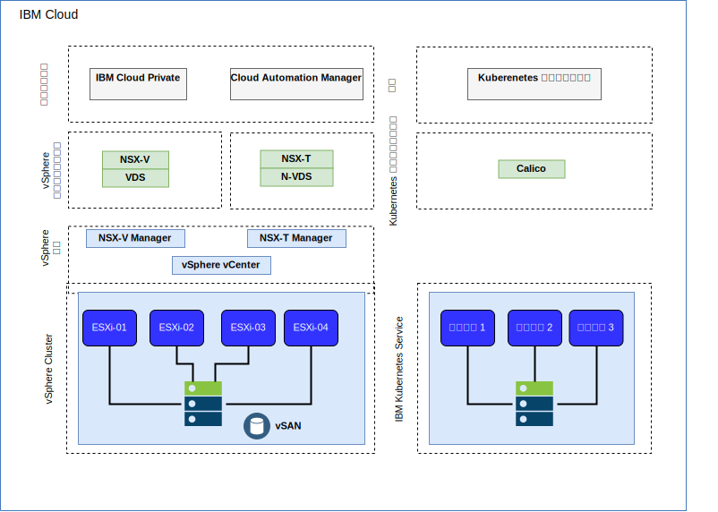
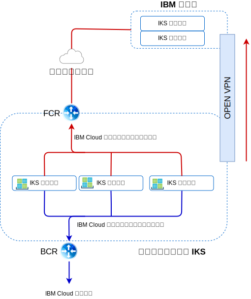

---

copyright:

  years:  2016, 2019

lastupdated: "2019-03-19"

subcollection: vmware-solutions

---

# IBM Cloud のネットワーキングとインフラストラクチャー
{: #vcsiks-arch-overview-infrastructure}

## Virtual Routing and Forwarding
{: #vcsiks-arch-overview-infrastructure-vrf}

{{site.data.keyword.cloud}} アカウントは、Virtual Routing and Forwarding (VRF) アカウントとして構成することができます。 VRF アカウントを使用すると、サブネット IP ブロック間の自動グローバル・ルーティングが可能になります。 Direct Link 接続を使用するアカウントはすべて、VRF アカウントに変換するか、VRF アカウントとして作成する必要があります。

## Direct Link
{: #vcsiks-arch-overview-infrastructure-direct-link}

{{site.data.keyword.cloud_notm}} Direct Link Connect を利用することで、ローカルの {{site.data.keyword.CloudDataCent_notm}}を経由した {{site.data.keyword.cloud_notm}} インフラストラクチャーへのプライベート・アクセスと、ネットワーク・サービス・プロバイダーにリンクされた他のクラウドへのプライベート・アクセスが実現します。 このオプションは、単一環境にマルチクラウド接続を作成する場合に最適です。
共有帯域幅トポロジーを使用して、お客様を {{site.data.keyword.cloud_notm}} Private ネットワークに接続します。 すべての Direct Link 製品と同様に、すべての {{site.data.keyword.cloud_notm}} ロケーションへのプライベート・ネットワーク・トラフィックを使用できるようにする、グローバル・ルーティングを追加できます。

## 仮想プライベート・ネットワーク
{: #vcsiks-arch-overview-infrastructure-virt-private-network}

### strongSwan VPN
{: #vcsiks-arch-overview-infrastructure-strongswan}

strongSwan IPSec VPN サービスは、業界標準の Internet Protocol Security (IPSec) プロトコル・スイートに基づき、インターネット上にセキュアなエンドツーエンドの通信チャネルを確立します。

### Hybridity (HCX)
{: #vcsiks-arch-overview-infrastructure-hcx}

VMware vCenter Server on {{site.data.keyword.cloud_notm}} with Hybridity Bundle はオンプレミス・データ・センターのネットワークを {{site.data.keyword.cloud_notm}} にシームレスに拡張するので、変換も変更も行わずに {{site.data.keyword.cloud_notm}} との間で仮想マシン (VM) をマイグレーションできるようになります。

## 物理構造
{: #vcsiks-arch-overview-infrastructure-physical-structure}

vCenter Server クラスターをデプロイするために必要な物理インフラストラクチャーの最小仕様を次に示します。

表 1. vCenter Server の仕様

  | NFS デプロイメント | VSAN デプロイメント
---|---|---
サーバー数 | 3 | 4
CPU | 28 コア 2.2GHZ | 28 コア 2.2GHZ
メモリー | 384 GB | 384 GB
ストレージ|管理: 2 TB 2 IOPS、ワークロード: 2 TB 4 IOPS|最小 SSD: 960 GB(x2)   

{{site.data.keyword.containerlong_notm}} デプロイメント・オプションは、ワーカー・ノードの要件によって異なります。

表 2. {{site.data.keyword.containerlong_notm}} の仕様

  | 仮想マシン | ベア・メタル
--|---|--
サーバー数 | 3 | 3
CPU | 2 – 56 コア | 4 – 28 コア
メモリー | 4 GB - 242 GB | 32 GB - 512 GB
ストレージ | 100 GB |  SATA: 2 TB / SSD: 960 GB

## 仮想構造
{: #vcsiks-arch-overview-infrastructure-virtual-structure}

図 1. {{site.data.keyword.containerlong_notm}} と {{site.data.keyword.icpfull_notm}} デプロイメントの物理構造

vCenter Server インスタンス内で、お客様の VMS は専用の NSX
Edge Services Gateway (ESG) と分散論理ルーター (DLR) にデプロイされます。

アウトバウンド・トラフィックを許可するためのソース NAT ルール (SNAT) が ESG に構成されます。これにより、インターネット接続で {{site.data.keyword.icpfull_notm}} 前提条件をダウンロードし、GitHub および Docker に接続できるようになります。 代わりに、Web プロキシーを使用してインターネットに接続することもできます。 ESG はプライベート・ネットワークを介して DNS および NTP サービスにアクセスするように構成されています。 {{site.data.keyword.containerlong_notm}} インスタンスへの統合は、vCenter Server インスタンスと {{site.data.keyword.containerlong_notm}} の間の
{{site.data.keyword.cloud_notm}} ネットワーキングを介して可能です。

## vCenter Server コンポーネント
{: #vcsiks-arch-overview-infrastructure-vcs-comp}

図 2. vCenter Server プラットフォーム・コンポーネント

### Platform Service Controller
{: #vcsiks-arch-overview-infrastructure-psc}

vCenter Server デプロイメントでは、管理 VM に関連付けられたプライベート VLAN 内のポータブル・サブネット上にインストールされた単一の外部プラットフォーム・サービス・コントローラー (PSC) を使用します。 このデフォルト・ゲートウェイは、バックエンド・カスタマー・ルーター (BCR) に設定されます。

### vCenter Server
{: #vcsiks-arch-overview-infrastructure-vcs}

PSC と同様に、vCenter Server はアプライアンスとしてデプロイされます。
また、vCenter は、管理 VM に関連付けられたプライベート VLAN 上のポータブル・サブネットにインストールされます。 このデフォルト・ゲートウェイは、BCR に設定されます。

### NSX Manager
{: #vcsiks-arch-overview-infrastructure-nsx-manager}

NSX Manager は初期 vCenter Server クラスター内にデプロイされます。 また、NSX Manager は、管理コンポーネント用に指定されたプライベート・ポータブル・アドレス・ブロックの IP アドレスを割り当てられます。

### NSX Controller
{: #vcsiks-arch-overview-infrastructure-nsx-controllers}

{{site.data.keyword.cloud_notm}} の自動化機能によって、初期クラスター内に 3 つの NSX Controller がデプロイされます。 管理コンポーネント用に指定されたプライベート・ポータブル・サブネットから IP アドレスがコントローラーに割り当てられます。

### NSX ESG / DLR
{: #vcsiks-arch-overview-infrastructure-nsx-esg}

NSX Edge Services Gateway (ESG) のペアがデプロイされます。 すべての場合において、プライベート・ネットワークに常駐する自動化コンポーネントからのアウトバウンド・トラフィックにゲートウェイ・ペアが 1 つ使用されます。 vCenter Server と {{site.data.keyword.icpfull_notm}} のための 2 つ目のゲートウェイ ({{site.data.keyword.icpfull_notm}} 管理エッジと呼ばれる) がデプロイされ、パブリック・ネットワークへのアップリンクとプライベート・ネットワークに割り当てられたインターフェースが構成されます。
分散論理ルーター (DLR)、論理スイッチ、ファイアウォールなどの必要な NSX コンポーネントは、管理者が構成できます。 ソリューションの一部としてデプロイされる NSX Edges について詳しくは、[vCenter Server ネットワーキング・ガイド](/docs/services/vmwaresolutions/archiref/vcsnsxt?topic=vmware-solutions-vcsnsxt-intro)を参照してください。

次の表は、{{site.data.keyword.icpfull_notm}} ESG/DLR の仕様を要約したものです。

表 3. {{site.data.keyword.icpfull_notm}} ESG の仕様

属性 |  仕様
--|--
Edge Service Gateway | 仮想アプライアンス
Edge サイズ「大」 | vCPU 数	2
メモリー	| 1 GB
ディスク	| ローカル・データストアに 1000 GB

表 4. {{site.data.keyword.icpfull_notm}} DLR の仕様

属性  |  仕様
--|--|
分散論理ルーター |	仮想アプライアンス
Edge サイズ「コンパクト」 | vCPU 数	1
メモリー	| 512 MB
ディスク	| ローカル・データストアに 1000 GB

## IBM Cloud Kubernetes Service コンポーネント
{: #vcsiks-arch-overview-infrastructure-iks-comp}

図 3. {{site.data.keyword.containerlong_notm}} コンポーネント
 

### Kubernetes マスター
{: #vcsiks-arch-overview-infrastructure-kube-master}

Kubernetes マスターは、クラスター内のすべてのコンピュート・リソース、ネットワーク・リソース、ストレージ・リソースを管理します。 Kubernetes マスターは、コンテナー化されたアプリとサービスがクラスター内のワーカー・ノードに均等にデプロイされるようにします。

###	ワーカー・ノード
{: #vcsiks-arch-overview-infrastructure-worker-node}

各ワーカー・ノードは、物理マシン (ベア・メタル) であるか、クラウド環境内の物理ハードウェアで実行される VM です。 ワーカー・ノードをプロビジョンする際に、そのワーカー・ノード上でホストされるコンテナーで使用できるリソースを決定します。 すぐに使用できるように、ワーカー・ノードには、IBM 管理の Docker エンジン、別個のコンピュート・リソース、ネットワーキング、ボリューム・サービスがセットアップされます。 標準装備のセキュリティー機能は、分離機能、リソース管理機能、そしてワーカー・ノードのセキュリティー・コンプライアンスを提供します。

## 関連リンク
{: #vcsiks-arch-overview-infrastructure-related}

* [vCenter Server on {{site.data.keyword.cloud_notm}} with Hybridity Bundle の概要](/docs/services/vmwaresolutions/archiref/vcs?topic=vmware-solutions-vcs-hybridity-intro)
