---

copyright:

  years:  2016, 2019

lastupdated: "2019-04-01"

subcollection: vmware-solutions

---

# アーキテクチャーの概要
{: #vcsiks-arch-overview}

{{site.data.keyword.vmwaresolutions_full}} オファリングは、世界中の {{site.data.keyword.CloudDataCents_notm}}に VMware テクノロジー・コンポーネントをデプロイできる自動化機能を備えています。 このアーキテクチャーは単一のクラウド領域で構成されます。また、別の地域にある追加のクラウド領域、または同じデータ・センター内の別の {{site.data.keyword.cloud_notm}} ポッドに拡張する機能をサポートします。

{{site.data.keyword.icpfull_notm}} および Cloud Automation Manager (CAM) 製品は、オンプレミスの仮想化プラットフォームに手動でデプロイできるので、
オンプレミス・ロケーションからクラウド管理を行うことができます。 また、{{site.data.keyword.icpfull_notm}} および CAM は、既存または新規の VMware vCenter Server on {{site.data.keyword.cloud_notm}} デプロイメントのサービス拡張として自動化機能によって提供され、{{site.data.keyword.cloud_notm}} からのクラウド管理を可能にします。

{{site.data.keyword.icpfull_notm}} は、オンプレミスのコンテナー化されたアプリケーションを開発および管理するためのアプリケーション・プラットフォームです。 {{site.data.keyword.icpfull_notm}} は、コンテナー・オーケストレーター Kubernetes、プライベート・イメージ・リポジトリー、管理コンソール、モニター・フレームワークを含む、コンテナーを管理するための統合環境です。

IBM Multi-Cluster Manager は、複数のクラウドおよびクラスターにおけるユーザー可視性、アプリケーション中心の管理 (ポリシー、デプロイメント、正常性、操作)、ポリシー・ベースのコンプライアンスを提供します。 IBM Multi-Cluster Manager を使用することで、Kubernetes クラスターを制御できます。 クラスターを安全かつ効率的に運用できるうえに、アプリケーションに必要なサービス・レベルの提供を保証できます。

{{site.data.keyword.cloud_notm}} Automation Manager は、{{site.data.keyword.cloud_notm}} Private 上で実行されるマルチクラウド・セルフサービス管理プラットフォームであり、開発者と管理者がビジネス要求に対応できるようにします。 Cloud Automation Manager Service Composer を使用すると、IBM Cloud Private カタログ内のハイブリッド・クラウド・サービスを公開できます。

## IBM Cloud サイドのクラウド管理プラットフォーム
{: #vcsiks-arch-overview-ibm-cloud-side}

以下の図は、{{site.data.keyword.cloud_notm}} インフラストラクチャーにデプロイされた {{site.data.keyword.icpfull_notm}} と CAM を表しています。
これらは、オンプレミスの vCenter と、{{site.data.keyword.cloud_notm}} にデプロイされた {{site.data.keyword.containerlong_notm}} サービスに接続されています。 ユーザーは仮想マシン (VM) をオンプレミスにも vCenter Server インスタンスにもデプロイできます。また、コンテナーを {{site.data.keyword.icpfull_notm}} クラスターと {{site.data.keyword.containerlong_notm}} クラスターにデプロイできます。

図 1. クラウド・サイドからのクラウド管理

この図では、CAM は、vCenter、クラウド・プロバイダー、{{site.data.keyword.icpfull_notm}}、{{site.data.keyword.containerlong_notm}} 環境へのクラウド接続を論理的に作成します。 {{site.data.keyword.icpfull_notm}} クラスターは各データ・センターまたはクラウド環境にデプロイし、MCM が {{site.data.keyword.icpfull_notm}} クラスターを単一の管理ビューに接続するメカニズムを提供するようにする必要があります。

{{site.data.keyword.icpfull_notm}} は、NSX-V または NSX-T コンポーネントとともにデプロイできます。 NSX-V とともに {{site.data.keyword.icpfull_notm}} をデプロイすると、VXLAN ネットワーク上で {{site.data.keyword.icpfull_notm}} VM を実行して Kubernetes Calico 内部ネットワーキングを使用できるようになります。

NSX-T とともに {{site.data.keyword.icpfull_notm}} をデプロイすると、ユーザーはネットワーキング、サブネット、ポリシーを中央 UI (NSX-T Manager) から制御および構成できるようになります。 NSX-V と NSX-T の違いについて詳しくは、[{{site.data.keyword.cloud_notm}} VCS ネットワーキング・リファレンス・アーキテクチャー](/docs/services/vmwaresolutions?topic=vmware-solutions-vcsnsxt-intro#vcsnsxt-intro)を参照してください。

## オンプレミスのクラウド管理プラットフォーム
{: #vcsiks-arch-overview-on-premises}

以下の図は、オンプレミス・インフラストラクチャーにデプロイされた {{site.data.keyword.icpfull_notm}} と CAM を表しています。これらは、{{site.data.keyword.cloud_notm}} にデプロイされた vCenter と {{site.data.keyword.containerlong_notm}} に接続されています。 ユーザーは VM とコンテナーをオンプレミスに、VM を vCenter Server インスタンスに、そしてコンテナーを {{site.data.keyword.containerlong_notm}} クラスターにデプロイできます。

図 2. オンプレミス・サイドからのクラウド管理

デプロイ済みの {{site.data.keyword.containerlong_notm}} コンテナーとの接続を確立するために strongSwan VPN が使用されています。 strongSwan は最終的に Direct Link 接続に置き換えられる場合があります。

この図では、CAM は、vCenter、クラウド・プロバイダー、{{site.data.keyword.icpfull_notm}}、{{site.data.keyword.containerlong_notm}} 環境へのクラウド接続を論理的に作成します。 {{site.data.keyword.icpfull_notm}} クラスターは各データ・センターまたはクラウド環境にデプロイし、MCM が {{site.data.keyword.icpfull_notm}} クラスターを単一の管理ビューに接続するメカニズムを提供するようにする必要があります。

## 関連リンク
{: #vcsiks-arch-overview-related}

* [vCenter Server on {{site.data.keyword.cloud_notm}} with Hybridity Bundle の概要](/docs/services/vmwaresolutions?topic=vmware-solutions-vcs-hybridity-intro#vcs-hybridity-intro)
