---

copyright:

  years:  2016, 2019

lastupdated: "2019-08-05"

subcollection: vmware-solutions

---

# システム・コンテキスト
{: #vcsiks-systemcontext}

コア・コンポーネントは次のとおりです。

- **オンプレミス仮想化** – このコンポーネントは、クライアントの構内またはサード・パーティーの場所でホストされる VMware 環境で、モダナイズするアプリケーションを実行している仮想マシン (VM) を現時点でホストしています。 オンプレミス仮想化は、VM マイグレーションのソース環境であり、VMware Hybridity (HCX) を介して {{site.data.keyword.cloud}} インスタンスに疎結合されています。
- **vCenter Server** – VMware vCenter Server on {{site.data.keyword.cloud_notm}} は、オンプレミス環境からマイグレーションされる VM のターゲットとなる {{site.data.keyword.cloud_notm}} for VMware Services インスタンスです。 オンプレミス仮想化環境とともに、VM をあるサイトから別のサイトに移動できるようにするハイブリッド環境を形成します。
- **{{site.data.keyword.containerlong_notm}}** - {{site.data.keyword.containerlong_notm}} は、コンテナー・オーケストレーション・ソリューションとして Kubernetes を使用します。 IBM が Kubernetes マスター・ノードを運用および管理する一方で、ワーカー・ノードがお客様管理のインフラストラクチャーにデプロイされます。 IBM は、オペレーティング・システムのパッチ・デプロイメント、Docker エンジンのアップグレード、および新しい Kubernetes バージョンを扱うための管理ツールを提供します。 {{site.data.keyword.containerlong_notm}} は、コンテナーを管理するための独立したセキュアなプラットフォームです。ポータブルで拡張性に優れ、フェイルオーバー時の自己修復機能も備えています。
- **{{site.data.keyword.icpfull_notm}}** - {{site.data.keyword.icpfull_notm}} は、コンテナー化された
アプリケーションを開発して管理するためのアプリケーション・プラットフォームです。 {{site.data.keyword.icpfull_notm}} は、コンテナー・オーケストレーター Kubernetes、プライベート・イメージ・リポジトリー、管理コンソール、モニター・フレームワーク、グラフィカル・ユーザー・インターフェースで構成される統合環境であり、ユーザーがアプリケーションのデプロイ、管理、モニター、スケーリングを行うことができる一元的な場所を提供します。
- **{{site.data.keyword.cloud_notm}} Automation Manager** – CAM は、エンタープライズ対応の Infrastructure as Code (IaC) プラットフォームであり、単一画面で VMware ベースのワークロードと Kubernetes ベースのワークロードをプロビジョンできます。 仮想マシン、コンテナー、およびそれらのインフラストラクチャー要件に対するワークロードのプロビジョニングの自動化は、CAM を介して有効になります。
- **IBM Multi Cloud Manager** – MCM は、複数のクラウドおよびクラスターにおけるユーザー可視性、アプリケーション中心の管理 (ポリシー、デプロイメント、正常性、操作)、ポリシー・ベースのコンプライアンスを提供します。 MCM を使用することで、Kubernetes クラスターを制御できます。
- **{{site.data.keyword.cloud_notm}} サービス** – {{site.data.keyword.cloud_notm}} サービスは、分析、AI、IoT などのオファリングを含む、利用可能な広範囲のサービスです。

## アクター
{: #vcsiks-systemcontext-actors}

表 1. アクター

アクター | 説明
--|--
システム管理者 | vCenter Server を使用してオンプレミス仮想化と vCenter Server インスタンスを管理する熟練した VMware vSphere 要員。
開発者 | {{site.data.keyword.containerlong_notm}} (CLI / Kubectl) コンソールを使用してコンテナーを作成および管理する熟練した人的コンテナー・リソース。 アプリケーション・モダナイゼーションの一環として新規サービスを作成します。
お客様 | 企業のサービスを利用する外部アクター。 Acme Skateboards 社の場合、お客様はスケートボード商品を購入するスケーターです。 お客様は、カタログへのセキュアなインターネット・アクセスが必要です。
{{site.data.keyword.containerlong_notm}} | サービスの {{site.data.keyword.containerlong_notm}} マスター・ノードを管理する IBM の要員。

## システム
{: #vcsiks-systemcontext-systems}

表 2. システム

アクター | 説明
--|--
vCenter Server | vCenter Server インスタンスに属するオンプレミス VM と {{site.data.keyword.cloud_notm}} VM の両方をシステム管理者が管理するために使用する 1 次インターフェース。
オンプレミス VM| {{site.data.keyword.cloud_notm}} へのマイグレーションの対象となるアプリケーションをホストする仮想化サーバー。 最初は VM としてマイグレーションされ、アプリケーション・モダナイゼーションのために VM からコンテナーにリファクタリングされます。
{{site.data.keyword.cloud_notm}} VM | オンプレミス・データ・センターからマイグレーションされたアプリケーションをホストする仮想化サーバー。 このリファレンス・アーキテクチャーの Acme Skateboards 社の例では、{{site.data.keyword.cloud_notm}} VM の 1 つは、オンライン・プレゼンス・ワークロードの一部であるデータベース・サーバーです。
エンタープライズ・コンテンツ・カタログ | クラスター内のパッケージを参照およびインストールできる、一元化された場所。 カタログには、コンテナーを作成して Helm チャートにアクセスするために使用できる多くの IBM パッケージが含まれています。 Helm は、Kubernetes チャートを管理するためのツールです。 チャートは、コンテナー・デプロイメントのバージョン管理、パッケージ化、リリース、デプロイ、削除、アップグレード、さらにはロールバックを容易にする、事前構成された Kubernetes リソースのパッケージです。 Helm は、Kubernetes のネイティブ・パッケージ管理システムであり、{{site.data.keyword.icpfull_notm}} クラスター内のアプリケーション管理に使用されます。
コア運用サービス | {{site.data.keyword.icpfull_notm}} には、ログとメトリックを収集、保管、照会するためのいくつかのツールが含まれています。 これらのツールは、すべてのログとメトリックの一元化されたストアを提供し、ログとメトリックにアクセスして照会する際のパフォーマンスと安定度を向上させます。
管理コンソール | {{site.data.keyword.icpfull_notm}} 管理コンソールを使用すると、単一の集中管理されたセキュアな管理コンソールからアプリケーションとクラスターを管理、モニター、およびトラブルシューティングできます。
Terraform | VMware vSphere、{{site.data.keyword.cloud_notm}}、Microsoft Azure、Amazon Web Services、Google Cloud Platform、OpenStack などのプロバイダーを使用したクラウド・リソースとインフラストラクチャー・リソースのプロビジョニングを処理します。
HELM | Kubernetes のパッケージ・マネージャー。 Helm チャートは、Kubernetes リソースを定義し、アプリケーションをデプロイするために使用します。
Chef | 構成管理とコンプライアンス自動化を行います。 Chef は Terraform が初期プロビジョニングを完了した後に、ミドルウェアとアプリケーションをデプロイして構成します。
サービス | Kubernetes リソースおよび 1 つ以上の VM で構築されるサービスを管理者が作成、構成、および設計する場所となる Service Composer を表します。
コンテナー化アプリケーション | アプリケーション・モダナイゼーションの手順を完了し、コンテナーとして現在稼働中のアプリケーション。 このリファレンス・アーキテクチャーの Acme Skateboards 社の例では、コンテナー化アプリケーションの 1 つは、オンライン・プレゼンス・ワークロードの一部である Web サーバーです。
Watson | このリファレンス・アーキテクチャーの Acme Skateboards 社の例では、Watson が「コンセプト・カー」アーキテクチャーで使用される AI サービスです。

アプリケーション・モダナイゼーションにおいて最も難しい側面は、多くの場合、アプリケーションのマイグレーション、ネットワーキング、およびセキュリティーです。 VMware vCenter Server on {{site.data.keyword.cloud_notm}}、VMware Hybridity、VMware NSX、{{site.data.keyword.cloud_notm}} Private、および {{site.data.keyword.containerlong_notm}} により、これらの課題に対処して、弾力性、堅牢性、および機密保護機能を備えた最新のアプリケーションを構築できます。
