---

copyright:

  years:  2016, 2018

lastupdated: "2018-11-01"

---

# アプリケーション・モダナイゼーションの概要

以下の図は、Acme Skateboards 社がデプロイするアプリケーション・モダナイゼーションのリファレンス・アーキテクチャーを示しており、この文書シリーズで詳しく説明されています。

図 1. アーキテクチャー概要

　このハイブリッド・アーキテクチャーにより、Acme Skateboards 社は以下のことが可能になります。
- ダウン時間がほとんど、あるいはまったくなく、アプリケーションの再構成も必要とすることなく、VMware VM をオンプレミスから {{site.data.keyword.cloud}} にマイグレーションする。
-	比較的単純な Web インターフェースとミドルウェアのコンテナー化に集中できるようにする一方、比較的複雑なデータベースは VM として残すことができるようにすることで、Acme Skateboards 社はアプリケーション・モダナイゼーションの手順を開始できる。
-	Cloud Automation Manager (CAM) を活用して Infrastructure as Code (IaC) をスクリプト化し、VM とコンテナーの両方から作成された各種サービスを構成および調整して、DevOps ツールチェーンおよび ITSM ソリューションと統合する。

ネットワーク・アーキテクチャーに注目すると、このリファレンス・アーキテクチャーには次の重要なコンポーネントがあります。
- **オンプレミス仮想化** – これは、Acme Skateboards 社の VM を現在ホストしている VMware クラスターです。 モダナイズ対象となるアプリケーションを現在ホストしているのは、これらの VM です。 HCX を実行できるように、このクラスターは、[VMware HCX on {{site.data.keyword.cloud_notm}} ソリューション・アーキテクチャー](https://www.ibm.com/cloud/garage/files/HCX_Architecture_Design.pdf)のドキュメントに記載している前提条件を満たしている必要があります。HCX はオンプレミス・ネットワークを {{site.data.keyword.cloud_notm}} に拡張して、お客様が {{site.data.keyword.cloud_notm}} で稼働する VCS インスタンスとの間で必要に応じて VM をマイグレーションできるようにします。
- **VMware vCenter Server on IBM Cloud** – VCS には、VMware Software Defined Data Center (SDDC) ソリューションを自動的にデプロイするために必要な基本的な VMware ビルディング・ブロック (vSphere、vCenter Server、NSX-V、および vSAN や {{site.data.keyword.cloud_notm}} エンデュランス・ストレージなどのストレージ・オプション) が用意されています。この VMware クラスターは、マイグレーションされる VM のターゲットです。さらに、ICP がホストするコンテナーの中で実行されるモダナイズ後の一部のアプリケーションのターゲットでもあります。

  このアーキテクチャーの重要なコンポーネントは以下のとおりです。
 - **NSX-V** - NSX-V は、Acme Skateboards 社の VM 用にネットワーク・オーバーレイを提供するネットワーク仮想化層を VCS に実装します。NSX-V は BYOIP を使用可能にして、ワークロード・ネットワークを {{site.data.keyword.cloud_notm}} ネットワークから分離します。 NSX-V は、Acme Skateboards 社がオンプレミスから拡張するネットワークを作成するために HCX によってプログラミングされます。
 - **IBM Cloud Private** - ICP は、コンテナー化されたアプリケーションを開発して管理するためのアプリケーション・プラットフォームです。 コンテナー・オーケストレーター Kubernetes、プライベート・イメージ・リポジトリー、管理コンソール、モニター・フレームワーク、グラフィカル・ユーザー・インターフェースで構成される統合環境であり、Acme Skateboards 社がアプリケーションのデプロイ、管理、モニター、スケーリングを行うことができる一元的な場所を提供します。VCS インスタンスは ICP コンポーネント、マスター・ノード、ワーカー・ノードなどをホストし、それらを VM として実行します。
  -	**IBM Cloud Automation Manager** – CAM は、エンタープライズ対応の Infrastructure as Code (IaC) プラットフォームであり、単一画面で仮想マシン・ベースのワークロードと Kubernetes ベースのワークロードをプロビジョンできます。CAM は、ICP の上で実行される Docker 対応アプリケーションで、RBAC や許可などの機能を実行するために緊密に統合されています。
  - **IBM Kubernetes Service** – IKS では、Acme Skateboards 社がモダナイズ対象アプリケーションを Docker コンテナー (Kubernetes クラスターで稼働) にデプロイできます。 マスター・モードは IBM が完全に管理しますが、ワーカー・プール内のワーカー・ノードは VCS インスタンスと同じ {{site.data.keyword.cloud_notm}} アカウントにデプロイされます。 ワーカー・ノードは、ベアメタル・サーバー、パブリックまたは専用の仮想サーバーのいずれかのインスタンスです。Calico は IKS に自動的にインストールされて構成されます。 Calico は、コンテナーにセキュアなネットワーク接続を提供します。これは IKS で構成され、サブネット間を流れるパケットをカプセル化するために IP-in-IP カプセル化を使用し、コンテナーからの発信接続に NAT を使用します。
  - **Direct Link** – {{site.data.keyword.cloud_notm}} Direct Link は Acme Skateboard 社の WAN プロバイダーを使用してデータ・センターを{{site.data.keyword.cloud_notm}} に接続し、信頼性が高く遅延時間の少ないセキュアなネットワーク接続を提供します。この接続は以下のものを提供します。
      - エンタープライズ・ユーザーからクラウド・ホスト・アプリケーションへのアクセス。
      - オンプレミス VM とクラウド VM 間の VM 間トラフィック。
      - オンプレミス・データ・センター内のレガシー・システムとクラウド VM との間のトラフィック。

## Acme Skateboards 社にとっての主な利点

-	リソースの調達、設計、実装、デプロイメントに数週間から数カ月もかかっていた時間を数時間に短縮し、IT プロジェクトが開発者および基幹業務に迅速にデリバリーされます。ネットワーキング・チームやセキュリティー・チームがロード・バランサー、ファイアウォール、スイッチ、ルーターなどのサービスをプロビジョンするのを待っていると、価値を生み出すまでに時間がかかってしまいます。 
-	ホステッド・プライベート・クラウドの専用ベアメタル・サーバーでセキュリティーが強化されます。IKS や KMIP などの {{site.data.keyword.cloud_notm}} サービスへのプライベート・エンドポイントのデプロイメントを含みます。
-	仮想化管理への完全な管理アクセスを可能にして、デプロイされたハイブリッド・クラウドを一貫して管理およびガバナンスできるようにします。そのため、既存の VMware ツール、スクリプト、研修への投資を活用できます。
-	世界中に配置された 30 以上の {{site.data.keyword.CloudDataCents_notm}}をまたぐ IBM プロフェッショナル・サービスおよびマネージド・サービスにより、世界規模で VMware 専門知識を利用できます。

ICP や IKS などのクラウド・ネイティブ・アプリケーション・プラットフォームに移行するお客様は、速度とイノベーションに注意を向けているので、セキュリティーやネットワーキングがおろそかになる傾向があります。 このリファレンス・アーキテクチャーでは、VCS、ICP、IKS を利用して Acme Skateboards 社のアプリケーション・モダナイゼーションの手順を安全に進めていく方法を示します。

## 関連リンク

* [VCS Hybridity Bundle の概要](../vcs/vcs-hybridity-intro.html)
