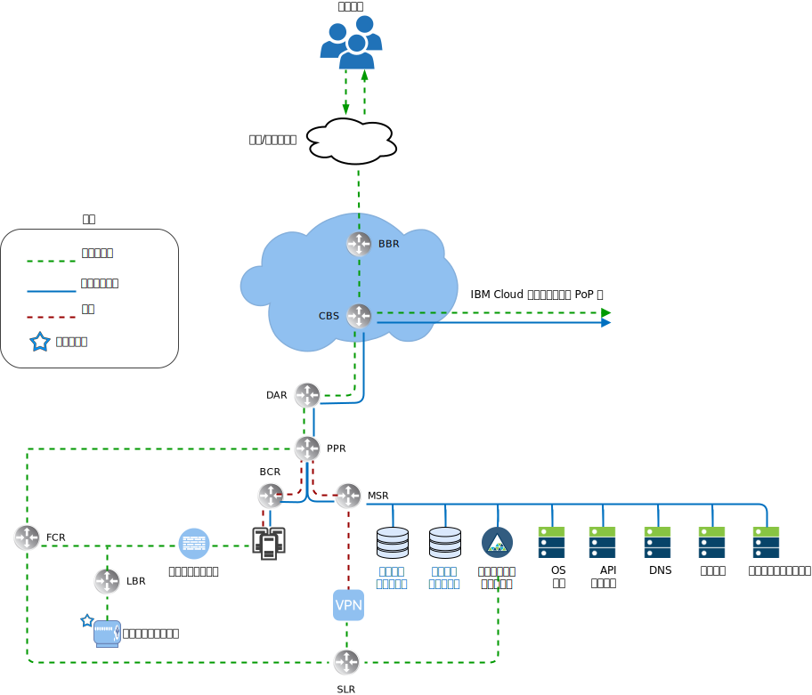
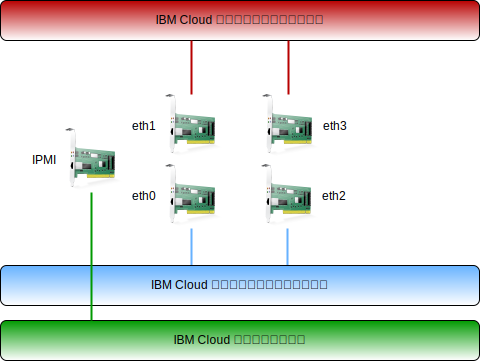

---

copyright:

  years:  2016, 2018

lastupdated: "2018-11-06"

---

# IBM Cloud ネットワーキングの概要

{{site.data.keyword.cloud}} は物理ネットワーキングを処理します。このセクションでは、{{site.data.keyword.cloud_notm}} によって提供される物理ネットワークと、前述の物理ホストに関連付けられる物理ホスト接続 (VLAN、MTU) について説明します。

{{site.data.keyword.cloud_notm}} の物理ネットワークは、パブリック、プライベート、管理の 3 つの異なるネットワークに分類されます。

図 1. {{site.data.keyword.cloud_notm}} ネットワークの概略

## パブリック・ネットワーク

{{site.data.keyword.CloudDataCents_notm}}とネットワーク Point of Presence (PoP) には、上位層のトランジット/ピアリング・ネットワーク・キャリアへの 1 Gbps または 10 Gbps 接続が複数存在します。 世界中のどこからのものであろうと、ネットワーク・トラフィックは最も近いネットワーク PoP に接続され、ネットワークを経由してデータ・センターに直接送られるので、ネットワークのホップ数とプロバイダー間のハンドオフ数は最小になります。データ・センター内では、1 対のピア集約フロントエンド・カスタマー・スイッチ (FCS) を介して、個々のサーバーに 1 Gbps または 10 Gbps のネットワーク帯域幅が与えられます。これらの集約スイッチは L3 ネットワーキング用の独立したルーター (つまり、フロントエンド・カスタマー・ルーター FCR) のペアに接続されます。この多層設計により、ネットワークを {{site.data.keyword.CloudDataCent_notm}}内のラック、列、ポッドにわたって拡張したり縮小したりできます。

## プライベート・ネットワーク

{{site.data.keyword.CloudDataCents_notm}}と PoP はすべて、プライベート・ネットワーク・バックボーンによって接続されます。 このプライベート・ネットワークはパブリック・ネットワークとは別であり、世界中の {{site.data.keyword.CloudDataCents_notm}}内のサービスへの接続を可能にします。 データ・センター間のデータの移動は、プライベート・ネットワークへの複数の 10 Gbps 接続または 40 Gbps 接続を介して行われます。 パブリック・ネットワークと同様に、プライベート・ネットワークも、サーバーや他のインフラストラクチャーが集約バックエンド・カスタマー・スイッチ (BCS) に接続される多層構造になっています。これらの集約スイッチは L3 ネットワーキング用の独立したルーター (つまり、バックエンド・カスタマー・ルーター BCR) のペアに接続されます。プライベート・ネットワークは、物理ホスト接続にジャンボ・フレーム (MTU 9000) を使用する機能もサポートします。

## 管理ネットワーク

パブリック・ネットワークとプライベート・ネットワークに加えて、{{site.data.keyword.cloud_notm}} サーバーのそれぞれがアウト・オブ・バンド管理ネットワークに接続されます。 この管理ネットワークは VPN を介してアクセスでき、CPU、ファームウェア、オペレーティング・システムに関係なく、保守と管理の目的で Intelligent Platform Management Interface (IPMI) でサーバーにアクセスすることを可能にします。

## プライマリー IP ブロックとポータブル IP ブロック

{{site.data.keyword.cloud_notm}} は、{{site.data.keyword.cloud_notm}} インフラストラクチャー内で使用される 2 つのタイプの IP アドレスを割り振ります。
-	プライマリー IP アドレスは、{{site.data.keyword.cloud_notm}} によってプロビジョンされるデバイス、ベア・メタル・サーバー、仮想サーバーに割り当てられます。 これらのブロックの IP アドレスをユーザーが割り当ててはいけません。
-	ポータブル IP アドレスは、ユーザーが必要に応じて割り当て、管理できるように用意されています。

アカウント内で VLAN スパンニングを有効にするか、アカウントを Virtual Routing and Forwarding (VRF) アカウントとして構成すると、お客様のアカウントの VLAN にプライマリー IP アドレスまたはポータブル IP アドレスをルーティングできるようになります。

## VLAN スパンニング

VLAN スパンニングとは、アカウント内のすべての VLAN のプライマリー/ポータブルの各サブネット IP ブロックを相互にルーティングできるようにする、{{site.data.keyword.cloud_notm}} のグローバルなアカウント設定です。この設定を無効にしても IP ブロックは {{site.data.keyword.cloud_notm}} サービスにルーティングされますが、相互にはルーティングされません。このアーキテクチャーでは、ソリューション・コンポーネントが存在するさまざまなサブネット間で接続が透過的に行われるように、VCS がデプロイされているアカウント内で VLAN スパンニングが有効になっている必要があります。

## Virtual Routing and Forwarding (VRF)

{{site.data.keyword.cloud_notm}} アカウントは、VRF アカウントとして構成することもできます。 これにより、VLAN スパンニングと同様の機能を使用できるようになり、サブネット IP ブロック間の自動ルーティングが可能になります。 Direct Link 接続を使用するアカウントはすべて、VRF アカウントに変換するか、VRF アカウントとして作成する必要があります。

## 物理ホスト接続

設計に含まれる各物理ホストは、各 {{site.data.keyword.cloud_notm}} 最上位ラック (ToR) スイッチ (パブリックとプライベート) への 10 Gbps イーサネット接続の冗長ペアを 2 つ備えています。 合計 4 つの 10 Gbps 接続のためのアダプターが個々の接続 (非結合) としてセットアップされます。 これにより、各ネットワーキング・インターフェース・カード (NIC) 接続が他の NIC から独立して機能できるようになります。

図 2. 物理ホスト接続

## VLAN

VMware on {{site.data.keyword.cloud_notm}} オファリングは、デプロイメント時に 3 つの VLAN (パブリック が 1 つ、プライベートが 2 つ) が割り当てられるように設計されています。パブリック VLAN は eth1 と eth3 に割り当てられ、プライベート接続は eth0 と eth2 に割り当てられます。この設計で作成されて割り当てられたパブリック VLAN と最初のプライベート VLAN はデフォルトでタグが外されることに注意してください。その後、追加のプライベート VLAN は物理スイッチ・ポートでトランキングされ、これらのサブネットを使用している VMware ポート・グループ内でタグ付けされます。

前述のように、この設計ではプライベート・ネットワークは 2 つの VLAN で構成されます。これらの VLAN のうち最初の VLAN (ここではプライベート VLAN A として示す) に、3 つのサブネットが割り振られます。 最初のサブネットは、{{site.data.keyword.cloud_notm}} が物理ホストに割り当てるプライマリー・プライベート IP サブネット範囲です。2 つ目のサブネットは、管理仮想マシン (例えば vCenter Server Appliance や Platform Services Controller など) に使用されます。3 つ目のサブネットは、NSX Manager を使用して各ホストに割り当てられる VXLAN トンネル・エンドポイント (VTEP) に使用されます。

プライベート VLAN A に加えて、2 つ目の VLAN (ここではプライベート VLAN B として示す) が存在します。この VLAN は、vSAN や vMotion などの VMware の機能をサポートし、Network Attached Storage (NAS) への接続に使用されます。 したがって、VLAN は 2 つまたは 3 つのポータブル・サブネットに分割されます。 最初のサブネットは、vMotion トラフィック用のカーネル・ポート・グループに割り当てられます。 残りのサブネットはストレージ・トラフィックに使用され、vSAN を使用する場合は vSAN トラフィックに使用されるカーネル・ポート・グループに 1 つ割り当てられます。NAS を使用する場合は、NFS トラフィック専用のポート・グループに 1 つ割り当てられます。VCS 自動デプロイメントの一環として構成されたすべてのサブネットで {{site.data.keyword.cloud_notm}} 管理範囲が使用されることに注意してください。これは、現在または将来必要になった場合に、使用されている {{site.data.keyword.cloud_notm}} アカウント内の任意のデータ・センターに IP アドレスをルーティングできるようにするためです。

表 1. VLAN とサブネットの要約

VLAN 	|サブネット・タイプ 	|説明
---|---|---
パブリック 	|プライマリー 	|パブリック・ネットワーク・アクセス用に物理ホストに割り当てられます。 初期デプロイメント時は使用されません。
パブリック	|ポータブル 	|customer-nsx-esg のアップリンクおよび NAT 用に割り当てられます。
パブリック	|ポータブル 	|mgmt-nsx-esg のアップリンク NAT 用に割り当てられます。
パブリック	|ポータブル 	|hcx-mgmt-esg のアップリンク NAT 用に割り当てられます (Hybridity Bundle を選択した場合)。
プライベート A 	|プライマリー 	  |{{site.data.keyword.cloud_notm}} によって割り当てられた物理ホストに割り当てられます。管理インターフェースで vSphere 管理トラフィック用に使用されます。
プライベート A 	|ポータブル 	|管理コンポーネントとして動作する仮想マシンに割り当てられます。
プライベート A 	|ポータブル 	|NSX VTEP に割り当てられます。
プライベート A 	|ポータブル 	|内部使用のために HCX に割り当てられます (Hybridity Bundle を選択した場合)。
プライベート A 	|ポータブル 	|customer-nsx-esg のアップリンク用に割り当てられます。
プライベート A 	|ポータブル 	|HCX に割り当てられます (Hybridity Bundle を選択した場合)。
プライベート B	  |プライマリー	  |初期デプロイメント時は使用されません。
プライベート B 	|ポータブル 	|vSAN 用に割り当てられます (使用する場合)。
プライベート B 	|ポータブル 	|NAS 用に割り当てられます (使用する場合)。
プライベート B 	|ポータブル 	|vMotion 用に割り当てられます。

この設計は、VLAN 上の物理ホストと仮想システム・インスタンス (VSI) を使用して実装され、デフォルト・ルートとして {{site.data.keyword.cloud_notm}} BCR (「プライベート・ネットワーク」のバックエンド・カスタマー・ルーター) を指すように構成されます。一方、VCS インスタンスは、ソフトウェア定義ネットワーキングの使用を可能にします。NSX によって作成されて VLAN サブネットへのルーティングを含むネットワーク・オーバーレイは、{{site.data.keyword.cloud_notm}} 管理ルーターから認識されないので、場合によっては、静的ルート、ファイアウォール・ルール、NAT ルールを作成して、ネットワーク・フローを適切に処理できるようにする必要があります。

プライベート・ネットワーク接続は、MTU サイズが 9000 のジャンボ・フレームを使用するように構成されます。これにより、ストレージや vMotion などの大規模データ転送のパフォーマンスが向上します。これは、VMware 内で、および {{site.data.keyword.cloud_notm}} によって許可される最大の MTU です。 パブリック・ネットワーク接続には標準的なイーサネット MTU の 1500 が使用されます。 これは維持する必要があります。変更すると、インターネット上でパケットのフラグメント化が発生する可能性があります。

### 関連リンク

* [VCS Hybridity Bundle の概要](../vcs/vcs-hybridity-intro.html)
