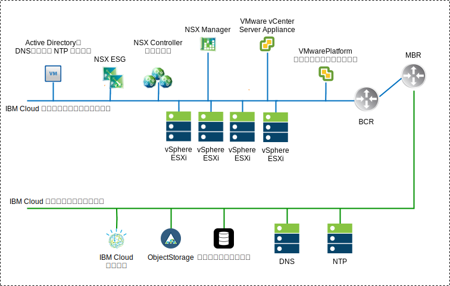
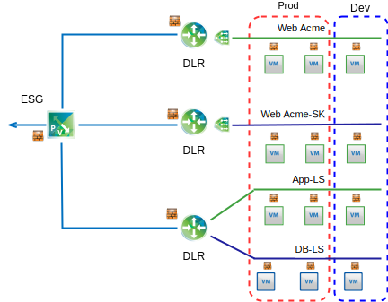

---

copyright:

  years:  2016, 2019

lastupdated: "2019-02-15"

---

# NSX-V の概要
{: #vcsnsxt-overview-ic4vnsxv}

ネットワーク仮想化により、仮想レイヤー内にネットワーク・オーバーレイが存在するようになります。 NSX-V により、オンデマンド仮想ネットワークの迅速なプロビジョニング、デプロイメント、再構成、消滅などの機能を備えたアーキテクチャーになります。 この設計では、vSphere 分散スイッチ (vDS) と VMware NSX for vSphere を使用して、仮想ネットワーキングが実装されます。

この設計では、NSX Manager は初期クラスター上にデプロイされます。 NSX Manager には、管理コンポーネント用に指定されたプライベート・ポータブル・アドレス・ブロック内の VLAN-backed IP アドレスが割り当てられ、前述の DNS サーバーと NTP サーバーが構成されます

表 1. NSX-V Manager 仮想アプライアンスの仕様

属性 | 仕様
---|---
NSX Manager | 仮想アプライアンス
vCPU の数 | 4
メモリー | 16 GB
ディスク | 管理 NFS 共有上に 60 GB
ディスク・タイプ | シン (プロビジョン済み)
ネットワーク | 管理コンポーネント用に指定された**プライベート A** ポータブル

次の NSX-V Manager ネットワーク概要は、このアーキテクチャーの NSX Manager と他のコンポーネントの位置関係を表しています。

図 1. NSX-V Manager ネットワークの概要

初期デプロイメント後、{{site.data.keyword.cloud}} の自動化機能によって、初期クラスター内に 3 つの NSX コントローラーがデプロイされます。 管理コンポーネント用に指定された**プライベート A** のポータブル・サブネット内の IP アドレスがコントローラーに割り当てられます。 クラスター内のホスト間でコントローラーが分離されるように、VM-VM アンチアフィニティー・ルールが作成されます。 コントローラーの高可用性を確保するために、初期クラスターは最低 3 ノード構成でデプロイする必要があります。

コントローラーに加えて、VXLAN トンネル・エンドポイント (VTEP) を介して仮想化ネットワーク (VXLAN) を使用できるように、NSX VIBS を備えたデプロイ済み vSphere ホストが {{site.data.keyword.cloud_notm}} 自動化機能によって準備されます。 VTEP 用に指定された**プライベート A** のポータブル・サブネットの IP アドレス範囲内の IP アドレスが VTEP に割り当てられます。 VXLAN トラフィックはタグの外された VLAN 上に存在し、プライベート仮想分散スイッチ (vDS) に割り当てられます。 その後、セグメント ID プールが割り当てられ、クラスター内のホストがトランスポート・ゾーンに追加されます。 {{site.data.keyword.cloud_notm}} 内に IGMP スヌープが構成されないため、トランスポート・ゾーンではユニキャストのみが使用されます。

次に、NSX Edge Services Gateway (ESG) のペアがデプロイされます。 すべてのデプロイメントにおいて、プライベート・ネットワークに常駐する自動化コンポーネントからのアウトバウンド・トラフィックにゲートウェイ・ペアが 1 つ使用されます。 VMware vCenter Server on {{site.data.keyword.cloud_notm}} インスタンスには 2 つ目のゲートウェイ (カスタマー管理エッジと呼ばれる) が含まれています。このゲートウェイがデプロイされ、パブリック・ネットワークへのアップリンクとプライベート・ネットワークに割り当てられたインターフェースが構成されます。 分散論理ルーター (DLR)、論理スイッチ、ファイアウォールなどの必要な NSX コンポーネントは、管理者が構成できます。

## 分散スイッチ設計
{: #vcsnsxt-overview-ic4vnsxv-distributed-switch}

この設計では、最低限の数の仮想分散スイッチ (vDS) が使用されます。 クラスター内のホストはパブリック・ネットワークとプライベート・ネットワークに接続されます。 これらに 2 つの仮想分散スイッチが構成されます。 2 つのスイッチが使用されるのは、{{site.data.keyword.cloud_notm}} 内に実装されているパブリック・ネットワークとプライベート・ネットワークが物理的に分離されているからです。

合計 2 つの分散スイッチが構成されます。 1 つ目はパブリック・ネットワーク接続 (SDDC - 分散スイッチ - パブリック) 用、2 つ目はプライベート・ネットワーク接続 (SDDC - 分散スイッチ - プライベート) 用です。
コンテンションと待ち時間を軽減するためには、さまざまなタイプのトラフィックを分離することが必要です。 アクセス・セキュリティーのためにも別々のネットワークにすることが必要です。 物理ネットワークの機能をセグメント化するために VLAN が使用されます。 この設計では、3 つの VLAN が使用されます。 2 つはプライベート・ネットワーク・トラフィック用、1 つはパブリック・ネットワーク・トラフィック用です。

表 2. VLAN トラフィック・マッピング

VLAN |指定 |トラフィック・タイプ
---|---|---
VLAN1 | パブリック | インターネット・アクセスに使用できます
VLAN2 | プライベート A | ESXi 管理、管理、VXLAN (VTEP)
VLAN3 | プライベート B | vSAN、NFS、vMotion

ワークロードからのトラフィックは NSX 論理スイッチを経由します。 vSphere クラスターは、コンバージド・クラスター用に 2 つの vSphere 分散スイッチ (vDS) を使用します。

表 3. コンバージド・クラスター分散スイッチ

vSphere 分散スイッチ名 |機能 |ネットワーク I/O 制御 |ロード・バランシング・モード |物理 NIC ポート |MTU
---|---|---|---|---|---
SDDC - 分散スイッチ - プライベート | ESXi 管理 仮想 SAN vSphere vMotion VXLAN トンネル・エンドポイント (VTEP) NFS | 有効 | 明示的フェイルオーバー (vSAN、vMotion) に基づくルート。 起点仮想ポート (その他すべて) | 2 | 9,000 (ジャンボ・フレーム)
SDDC - 分散スイッチ - パブリック | 外部管理トラフィック (南北) | 有効 |起点仮想ポートに基づく転送 | 2 | 1,500 (デフォルト)

表 4. 分散スイッチ・ポート・グループのチーミングとフェイルオーバーの設定

パラメーター | 設定
---|---
ロード・バランシング | 起点仮想ポートに基づくルート \*
フェイルオーバー検出 | リンク状況のみ
スイッチに通知 | 有効
フェイルバック | 有効
フェイルオーバー順序 | アクティブ・アップリンク: Uplink1、Uplink2 \*

\* vSAN ポート・グループは、vSAN ストレージ・トラフィックのロード・バランシングをサポートしていないため、アクティブまたはスタンバイによる明示的フェイルオーバーを使用します。
{:note}

図 2. クラスター VM カーネル・インターフェース・ポート・グループ・マッピング

表 5. クラスター仮想スイッチ・ポート・グループ、VLAN、およびチーミング・ポリシー

vSphere 分散スイッチ	|ポート・グループ名	|チーミング	|アップリンク	|VLAN ID
---|---|---|---|---
SDDC-Dswitch-Private	|SDDC-DPortGroup-Mgmt	|起点仮想ポート	|アクティブ: 0、1	|VLAN1
SDDC-Dswitch-Private	|SDDC-DPortGroup-vMotion	|起点仮想ポート	|アクティブ: 0、1	|VLAN2
SDDC-Dswitch-Private	|SDDC-DPortGroup-VSAN	|明示的フェイルオーバー	|アクティブ: 0 スタンバイ: 1	|VLAN2
SDDC-Dswitch-Private	|SDDC-DPortGroup-NFS	|起点仮想ポート	|アクティブ: 0、1	|VLAN2
SDDC-Dswitch-Private	|NSX が自動生成	|起点仮想ポート	|アクティブ: 0、1	|VLAN1
SDDC-Dswitch-Public	  |SDDC-DPortGroup-External	|起点仮想ポート	|アクティブ: 0、1	|VLAN3

## NSX-V
{: #vcsnsxt-overview-ic4vnsxv-nsx-v}

この設計では、NSX コンポーネントの構成を指定しますが、ネットワーク・オーバーレイ・コンポーネント構成は適用しません。 ネットワーク・オーバーレイは、お客様がニーズに応じて設計できるようになっています。

以下のコンポーネントが構成されます。
-	管理サーバーとコントローラーがインストールされ、vCenter Web ユーザー・インターフェースに組み込まれます。
-	ESXi ホストごとに ESXi エージェントがインストールされ、VTEP IP アドレスが構成されます。
-	VTEP 構成、コントローラー構成、VXLAN 構成 (トランスポート・ゾーン)。
-	管理コンポーネント用 NSX Edge Services Gateway (ESG) アプライアンス。
-	vCenter Server の場合のみ、お客様用の NSX Edge Services Gateway (ESG) アプライアンス。

以下は構成されません。
-	仮想分散ルーター。
-	マイクロ・セグメンテーション。
-	VXLAN。
-	他の VMware インスタンスに対するリンク NSX 管理。

### NSX-V のセキュリティー
{: #vcsnsxt-overview-ic4vnsxv-nsx-v-security}

NSX for vSphere を使用すると、組織は、実行場所とは無関係の個々のワークロードのレベルまで、データ・センターをセキュリティー・セグメントに細分化できます。 IT チームは、アプリケーションやユーザー・コンテキストに基づいてワークロードごとにポリシーを定義できるので、データ・センター内の脅威への即時対応と、アプリケーションへの適用が可能になります。

主要な NSX コンポーネントは、以下のとおりです。
-	ハイパーバイザー・カーネルに NSX 分散ステートフル・ファイアウォールが組み込まれています。ファイアウォール性能はハイパーバイザー・ホスト 1 台あたり最大 20 Gbps です。 NSX Edge を介して南北ファイアウォール機能を提供します。
-	NSX では、IP アドレスおよび MAC 以外についても、動的なセキュリティー・グループと関連ポリシーを作成できます。 これらのポリシーには、アプリケーションのコンテキストに基づいたマイクロ・セグメンテーションを可能にするための vCenter オブジェクトおよびタグ、オペレーティング・システムのタイプ、レイヤー 7アプリケーション情報が含まれます。
-	VM、Active Directory、および Mobile Device Management 統合環境のログイン情報を使用する ID ベースのポリシーにより、リモート・デスクトップ環境および仮想デスクトップ環境のセッション・レベルのセキュリティーを含め、ユーザーに基づくセキュリティーが可能になります。
- アプリケーション・ルール・マネージャーとエンドポイント・モニターにより、レイヤー 7 までエンドツーエンドのネットワーク・トラフィック・フローを視覚化できます。これにより、アプリケーション・チームは、データ・センター内のエンドポイントとデータ・センター間のエンドポイントの両方を識別でき、適切なセキュリティー・ルールを作成することによって対応できます。
- 管理プレーン、コントロール・プレーン、データ・プレーンとサード・パーティー・ベンダー (次世代ファイアウォール、IDS/IPS、エージェントレス・アンチウィルス、スイッチング、高度なセキュリティーなど) の統合のサポート。

次の図は、セキュリティー・グループを作成して NSX-V のマイクロ・セグメンテーション機能の一部を実装する方法を大まかに示しています。 この例では、実動と開発がセキュリティー・グループであり、それらのグループに基づいてセキュリティー・ルールが割り当てられています。

図 3. NSX-V のセキュリティー

## 関連リンク
{: #vcsnsxt-overview-ic4vnsxv-related}

* [vCenter Server on {{site.data.keyword.cloud_notm}} with Hybridity Bundle の概要](/docs/services/vmwaresolutions/archiref/vcs?topic=vmware-solutions-vcs-hybridity-intro)
