---

copyright:

  years:  2016, 2019

lastupdated: "2019-02-15"

subcollection: vmware-solutions

---

# IBM Cloud
Kubernetes
Service
{: #vcsnsxt-overview-iks}

## IBM Cloud Kubernetes Service の概要
{: #vcsnsxt-overview-iks-ovw}

{{site.data.keyword.containerlong_notm}} は、コンテナーを管理するための独立したセキュアなプラットフォームです。 このプラットフォームは、ポータブルで拡張性に優れ、フェイルオーバー時の自己修復機能も備えています。

このアーキテクチャーを構成する主要なコンポーネントは次のとおりです。
-	**{{site.data.keyword.cloud}} アカウント** – ワーカー・ノードは {{site.data.keyword.cloud_notm}} アカウントにデプロイされます。 マスター・ノードは、IBM が管理する中央のクラウド・アカウントにデプロイされます。
-	**クラスター** - Kubernetes クラスターは、1 つ以上のワーカー・ノードで構成されます。
-	**ワーカー・ノード** – ワーカー・ノードは、IBM アカウントでホストされるベアメタル・サーバー・インスタンスまたは仮想サーバー・インスタンスです。 ワーカー・ノードをプロビジョンする際に、そのワーカー・ノード上でホストされるコンテナーで使用できるリソースを決定します。 ワーカー・ノードには、IBM 管理の Docker エンジン、独立したコンピュート・リソース、ネットワーキング、ストレージ・ボリューム・サービスが含まれます。
-	**マスター・ノード** - ワーカー・ノードは、クラスター内のすべての Kubernetes リソースを一元的に制御してモニターする Kubernetes マスター・ノードによって管理されます。 このマスター・ノードは IBM によって管理されます。

{{site.data.keyword.containerlong_notm}} には、以下の概念があります。
-	**サービス** - サービスとは、一連のポッドをグループ化し、各ポッドの実際のプライベート IP アドレスを見せないようにしてポッドへのネットワーク接続を提供する Kubernetes リソースのことです。 サービスを使用することにより、アプリをクラスター内または公開インターネットで使用可能にできます。
-	**デプロイメント** - デプロイメントとは、アプリの実行に必要なその他のリソースや機能 (サービス、永続ストレージ、アノテーションなど) に関する情報を指定できる Kubernetes リソースです。 構成 YAML ファイルでデプロイメントを文書化し、それをクラスターに適用します。 Kubernetes マスターがリソースを構成し、使用可能な容量を持つワーカー・ノード上のポッドにコンテナーをデプロイします。 ローリング更新中に追加するポッドの数や、一度に無効にできるポッドの数など、アプリの更新戦略を定義します。 ローリング更新の実行時には、デプロイメントによって、更新が動作しているかどうかが確認され、障害が検出されるとロールアウトが停止されます。
-	**ポッド** - クラスター内のすべてのアプリは、ポッドと呼ばれる Kubernetes リソースによってデプロイ、実行、管理されます。 ポッドは Kubernetes クラスター内のデプロイ可能な小さいユニットを表し、単一のユニットとして処理される必要があるコンテナーをグループ化するために使用します。 ほとんどの場合、各コンテナーはその独自のポッドにデプロイされます。 アプリケーションでは、コンテナーと他のヘルパー・コンテナーを同じプライベート IP アドレスでアドレス指定できるように、1 つのポッドにデプロイしなければならない場合があります。
-	**アプリケーション** - アプリは、完結したアプリを意味することもあれば、アプリのコンポーネントを意味することもあります。 アプリのコンポーネントは、別々のポッドまたは別々のワーカー・ノードにデプロイできます。

Kubernetes では特定の 1 つのネットワーキング・ソリューションを使用しなければならないわけではありません。

Kubernetes ネットワーク・モデルでは、以下の 3 つの基本要件が規定されています。
* コンテナーは NAT なしで他のすべてのコンテナーと通信できる
* ノードは NAT なしですべてのコンテナーと通信できる (その逆も同様)
* コンテナーが認識する自己 IP は、他のコンテナーに認識される IP と同じである

### 名前空間
{: #vcsnsxt-overview-iks-namespaces}

名前空間は、コンテナー・ネットワーキングの基礎的な側面です。 名前空間は、プロセス・セットごとに別のリソース・セットが見えるようにカーネル・リソースを区分化する Linux カーネルの機能です。 リソースとしては、マウント・ポイント、プロセス ID、ネットワーク・スタック、IPC、ユーザー ID があります。 名前空間ごとに、独自の IP アドレス・セット、独自のルーティング・テーブル、ソケット・リスト、接続トラッキング・テーブル、ファイアウォールなどのネットワーク関連リソースを持ちます。

### コンテナー・ネットワーク・インターフェース
{: #vcsnsxt-overview-iks-container-network-interfaces}

Kubernetes は、プラグイン指向のネットワーキング・ソリューションとして、コンテナー・ネットワーク・インターフェース (CNI) を使用します。 これは、Linux コンテナーのネットワーク・インターフェースを構成するためのプラグインの作成に関する仕様とライブラリーで構成されています。 CNI 仕様は、コンテナーのネットワーク接続と、コンテナーが削除された後のリソースのガーベッジ・コレクションだけを扱うので、軽量です。

CNI の観点では、Kubernetes には次の 2 つの中心的な定義があります。
- **ポッド** - Linux ネットワーク名前空間と同義。 Kubernetes のスケジューリング単位はポッドです。これは、常に一緒に配置される (1 つの単位としてノードにスケジュールされる) 1 つ以上のコンテナーが密結合されたセットです。 1 つのポッドを複数のワーカー・ノードに分散させることはできません。
- **ネットワーク** - 一意的にアドレス指定でき、相互に通信できるエンティティーのグループ。 このようなエンティティーには、個々のコンテナー、マシン、ルーターなどの他のネットワーク・デバイスがあります。

CNI でコンテナーをネットワークに追加するためには、コンテナー・ランタイムが、まずそのコンテナー用のネットワーク名前空間を新規作成してから、定義された 1 つ以上のプラグインを開始する必要があります。 ネットワーク構成は JSON 形式であり、名前フィールド、タイプ・フィールド、プラグイン・タイプ固有フィールドなどの必須フィールドが含まれます。 CNI プラグインが、インターフェースに IP アドレスを割り当て、有効なネットワーク・ルートをセットアップします。 {{site.data.keyword.containerlong_notm}} は、CNI のネットワーク・プラグインとして Calico を使用します。 Calico は、各ワークロードに IP アドレスを割り当てます。 {{site.data.keyword.containerlong_notm}} では、Calico は IP-in-IP トンネリングを使用することで、コンテナー・ネットワークの IP アドレスを {{site.data.keyword.cloud_notm}} ネットワークから隠蔽します。

ネットワーク・トラフィックの観点から、{{site.data.keyword.containerlong_notm}} では、次の図に示す 4 つのタイプを区別しています。

図 1. コンテナー・ネットワーク・トラフィックのタイプ

- **ポッド内ネットワーキング** - コンテナー間通信とも呼ばれます。 ポッド内のすべてのコンテナーは、1 つのネットワーク名前空間、同じ IP アドレスを共有し、ローカル・ホスト上で互いを認識します。 各アプリのトラフィックは、ポート番号の違いで区別されます。 開発者は、ポッド内のコンテナーの使用ポートが競合しないようにする必要があります。 ポッド内には、いわゆるインフラストラクチャー・コンテナーがあります。 これは、kubelet が最初に起動するコンテナーであり、ポッドの IP を取得してネットワーク名前空間をセットアップするものです。 その後、ポッド内の他のすべてのコンテナーが、インフラストラクチャー・コンテナーのネットワークと IPC 名前空間に参加します。 このコンテナーではネットワーク・ブリッジ・モードが有効にされているため、ポッド内の他のすべてのコンテナーがコンテナー・モードを介してこの名前空間に参加します。 インフラストラクチャー・コンテナーが停止した場合、kubelet はポッド内のすべてのコンテナーを強制終了し、通常は新しい IP アドレスを使用して、再プロビジョンします。 このトラフィック・フローについては、ここではこれ以上詳しく説明しません。

- **ポッド間ネットワーキング** - 「ポッド間」通信とも呼ばれます。 以下は、東西トラフィックの 3 つのタイプです。
  - ポッドは、同じサブネット上の他のポッドと直接通信できます。 {{site.data.keyword.containerlong_notm}} では、各ポッドには {{site.data.keyword.containerlong_notm}} 提供の範囲から割り当てられた IP アドレスがあります。 プロビジョニング時に各ワーカー・ノードにサブネットが割り当てられます。 同じサブネットおよびホストのポッドとは、プロキシー、トンネリング、NAT のいずれも使用しないポッド間通信が行われます。
  - ポッドは、異なるサブネット上の他のポッドと直接通信できます。 {{site.data.keyword.containerlong_notm}} では、サブネット間を移動するパケットだけをカプセル化するように、IP-in-IP カプセル化が自動的に構成されます。 このカプセル化により、ポッドのネットワーク・アドレス・スペースは {{site.data.keyword.cloud_notm}} ネットワークから隠蔽されます。 カプセル化では、{{site.data.keyword.cloud_notm}} プライマリー・プライベート・サブネット内の IP アドレスが使用されます。
  - ポッドは、サービスを使用して他のポッドと通信できます。これはポッド対サービス通信と呼ばれます。 ただし、前の 2 つのポイントのポッドによって他のポッドと直接通信できるポッドは、いずれ破棄される運命にあります。 ポッドは生成された後、停止すると復活しません。 例えば、スケールアップやスケールダウンのときには、レプリカ・セットが動的にポッドを作成したり破棄したりします。 各ポッドは独自の IP アドレスを取得しますが、それらの IP アドレスも長時間安定した状態であると頼りにすることはできません。 開発者は、DNS で検出できる安定した仮想 IP アドレスを使用する通信のためのサービス構成体を使用するようにしてください。

- **Ingress** - 外部のユーザーまたはアプリからのトラフィックをポッドにルーティングすることを意味します。 安定した仮想 IP (vIP) アドレスが、サービスによってポッドのセットに提供されます。 ポッドは短命ですが、サービスによりクライアントは、vIP を使用してポッド内の実行コンテナーを確実に検出し、接続できます。 この vIP は、ネットワーク・インターフェースに結び付けられた実際の IP アドレスではありません。 これは、単に、安定したエンドポイントとして 1 つ以上のポッドにトラフィックを転送するためのものです。 クラスター外からポッドへのアクセスは、これより若干難しくなります。 Kubernetes は、可用性が高く高性能なロード・バランシングをサービスのために提供することを目的としています。
{{site.data.keyword.containerlong_notm}} の南北トラフィックには、以下の 3 つのオプションがあります。

  - **NodePort** - NodePort サービスが適していると思われるのは、テストの場合や、パブリック・アクセスまたはプライベート・アクセスが短時間だけ必要な場合です。 NodePort サービスは、ワーカー・ノードのプライベート IP アドレスとパブリック IP アドレスの両方に対して、ワーカー・ノード上のポートを開きます。 パブリックまたはプライベートのいずれかをブロックする場合は、Calico preDNAT ネットワーク・ポリシーを使用する必要があります。 ワーカー・ノードのパブリックおよびプライベート IP アドレスは永続的ではありません。
  - **LoadBalancer** - ロード・バランサーに割り当てられるポータブル・パブリック IP アドレスおよびプライベート IP アドレスは永続的なアドレスであり、クラスターでワーカー・ノードが再作成されても変更されません。 アプリで必要なすべてのポートを公開することによってロード・バランサーをカスタマイズすることも可能です。 ポータブル・プライベート IP アドレスを使用するロード・バランサー・サービスでは、すべてのワーカー・ノードでパブリック・ノード・ポートも開いています。 Calico preDNAT ネットワーク・ポリシー を使用して、そのパブリック・ノード・ポートをブロックする必要があります。
  - **Ingress サービス** - ALB は、保護された固有のパブリック・エントリー・ポイントまたはプライベート・エントリー・ポイントを使用して、着信要求をアプリにルーティングします。 ALB は、着信 HTTP または HTTPS、TCP、または UDP サービス要求を listen します。 ingress リソースで定義したルールに基づいて、アプリケーション・ポッド間で要求が転送されます。 クラスターを作成すると、ingress アプリケーション・ロード・バランサー (ALB) がパブリック用とプライベート用に 1 つずつ自動的に作成されます。 デフォルトでは、パブリック ALB が有効に、プライベート ALB が使用不可になっているため、パブリック ALB を無効にし、プライベート ALB を有効にする必要があります。

- **Egress** - ポッド外の外部リソース (API など) を呼び出したり、VM のリソースを利用したりすることを意味します。 Egress には次のオプションがあります。
    - クラスターの外部で実行されているシステムのサービス・リソースを定義します。 外部システムの詳細 (IP アドレスとポート番号) を示すエンドポイント・リソースを作成します。 エンドポイント・リソースには複数のアドレスをリストできます。その場合は、Kubernetes が、クラスター内で実行されているポッド間のラウンドロビンと同様に、それらのアドレス間でラウンドロビンを行います。 次に、サービス・リソースを使用して、該当サービスのクラスター IP と DNS 名を kube-dns 内に作成します。
    - strongSwan IPSec VPN を使用して、クラスターの外部にあるアプリケーションに接続できます。 Helm チャートを使用することで、Kubernetes ポッド内に strongSwan IPSec VPN サービスをデプロイして構成します。 VPN 接続が確立されると、クラスター内のすべてのワーカー・ノードにルートが自動的に構成されます。 これらのルートにより、任意のワーカー・ノード上のポッドとリモート・システムの間で、VPN トンネルを介した両方向の接続が可能になります。 ポッドが停止した場合はクラスターがポッドを再始動しますが、新しいポッドが始動して VPN 接続が再確立されている間、短いダウン時間が発生する可能性があります。 strongSwan VPN サービスでは、ポータブルなパブリックまたはプライベートの IP アドレスが使用されます。 local.subnet 設定では、クラスター・ポッド・サブネット、クラスター・サービス・サブネット、あるいはパブリック・ポータブル・サブネットまたはプライベート・ポータブル・サブネットを使用できます。 localSubnetNAT 設定を使用して、クラスター・サブネットの再マップを実行できます。 また、enableSingleSourceIPを true に設定することで、クラスターの IP アドレスを単一の IP アドレスの内側に隠蔽することもできます。 リモート・ネットワーク・サブネットを再マップするには、remoteSubnetNAT 設定を使用します。
    - {{site.data.keyword.cloud_notm}} 仮想ルーター・アプライアンスを VPN ゲートウェイとしてデプロイすることにより、外部ネットワークに安全に接続できます。 VRA を介してパブリックまたはプライベートのネットワーク・トラフィックをルーティングできます。 VRA は、リモート VPN ゲートウェイへの暗号化 IPSec トンネルを作成します。

## IBM Cloud Kubernetes Service コンポーネント
{: #vcsnsxt-overview-iks-components}

ワーカー・ノードは、クラスター内のすべての Kubernetes リソースを一元的に制御してモニターする Kubernetes マスター・ノードによって管理されます。 開発者がコンテナーのリソースをデプロイすると、マスター・ノードが、デプロイメント要件とクラスターの空き容量を考慮して、それらのリソースをデプロイするワーカー・ノードを決定します。 マスター・ノードとワーカー・ノードは、安全な TLS 証明書と、{{site.data.keyword.cloud_notm}} ネットワークを介した openVPN 接続を使用して相互に通信します。 開発者は、マスター・ノードでホストされる kube-apiserver にインターネットを介してアクセスします。

ワーカー・ノードの kubelet は、マスター・ノードの kube-apiserver に更新がないか監視し、状況を報告します。 kubelet はワーカー・ノードごとに実行されるポッドであり、ワーカー・ノードで実行される各ポッドの正常性のモニタリングと、Kubernetes API サーバーから送信されるイベントの監視を行います。 イベントに基づいて、kubelet はポッドを作成または削除し、Liveness Probe と Readiness Probe を実行し、Kubernetes API サーバーにポッドの状況を報告します。

ネットワークの観点では、以下のコンポーネントがワーカー・ノードにデプロイされます。

-	**openvpn-client** - OpenVPN クライアントは、マスターをワーカー・ノードに安全に接続するために OpenVPN サーバーと連携します。 このコンポーネントは kube-system 名前空間で動作します。
-	**Calico ノード** - Calico ノードは、Calico が含まれたネットワーキング・コンテナーに必要な各種コンポーネントをバンドルしてまとめるコンテナーです。 このコンポーネントは kube-system 名前空間で動作します。
-	**Calico ポリシー・コントローラー** - Calico ポリシー・コントローラーは、インバウンドとアウトバウンドのネットワーク・トラフィックが設定されたネットワーク・ポリシーに準拠しているか監視します。 トラフィックがクラスター内で許可されていない場合は、クラスターへのアクセスはブロックされます。 Calico ポリシー・コントローラーは、クラスターのネットワーク・ポリシーを作成および設定するためにも使用されます。 このコンポーネントは kube-system 名前空間で動作します。
-	**Calico CNI** - Calico コンテナー・ネットワーク・インターフェース (CNI) では、コンテナーのネットワーク接続を管理し、コンテナーが削除される際に割り振られているリソースを削除します。
-	**Calico IPAM** - Calico IPAM は、コンテナーの IP アドレス割り当てを管理します。
-	**kube プロキシー** - Kubernetes ネットワーク・プロキシーは、ワーカー・ノードごとに実行されるデーモンであり、クラスター内で実行される各サービスの TCP および UDP ネットワーク・トラフィックを転送したりロード・バランシングしたりします。 このコンポーネントは kube-system 名前空間で動作します。
-	**kube DNS**  - Kubernetes DNS は、クラスター上の DNS のポッドとサービスをスケジュールします。 コンテナーは、DNS サービスの IP を自動的に使用して、そのコンテナーによる他のポッドとサービスの検索で DNS 名を解決します。 このコンポーネントは kube-system 名前空間で動作します。
-	**Ingress ALB** - Ingress は、パブリック要求またはプライベート要求をクラスター内の複数のアプリに転送することで、クラスター内のネットワーク・トラフィックのワークロードのバランスを取るために使用できる Kubernetes サービスです。 パブリック・ネットワークまたはプライベート・ネットワークを介してアプリを公開するには、Ingress リソースを作成して、Ingress アプリケーション・ロード・バランサー (ALB) にアプリを登録する必要があります。 これにより、単一の URL または IP アドレスを使用して、複数のアプリケーションへのアクセスが可能になります。 このコンポーネントは ibm-system 名前空間で機能します。
-	**ロード・バランサー** - ロード・バランサーは、パブリック要求またはプライベート要求をアプリに転送してクラスター内のネットワーク・トラフィックを負荷分散するために使用できる Kubernetes サービスです。 このコンポーネントは ibm-system 名前空間で機能します。

### Calico
{: #vcsnsxt-overview-iks-calico}

{{site.data.keyword.containerlong_notm}} はネットワーク・プロバイダーとして Calico を使用します。 Calico は、オーバーレイ・ネットワークではなくレイヤー 3 アプローチを使用します。 Calico は、CNI プラグインを介して Kubernetes と統合されて、純粋な IP ネットワークと、ルート配布のための Border Gateway Protocol とを組み合わせて使用するアプローチでネットワーキングを提供します。

Calico は L3 ファブリック・ソリューションを提供し、各コンピュート・ノードで vSwitch の代わりに vRouter 機能を使用します。 vRouter は Linux カーネルの既存の L3 転送機能を利用します。 Calico は、vRouter を介して各ワークロードをインフラストラクチャー・ネットワークに直接接続します。 vRouter 機能は BGPを使用して、各ワーカー・ノードでホストされるポッドにルートを通知します。 各 vRouter は BGP を使用して、接続先のすべてのエンドポイントを他のすべての vRouter に通知します。

Calico では、ポッドと送受信される IP パケットのルーティングおよびファイアウォール処理には、ワーカー・ノードの Linux のルーティング・テーブルおよび iptables インフラストラクチャーが使用されます。

-	ワークロードがパケットを送信する場合、Calico は、そのワークロード自体がどのようなルーティングを構成しようと、必ずネクスト・ホップ MAC アドレスとしてそのワーカー・ノードが返されるようにします。
-	ワークロード宛てのパケットの場合、宛先ワークロードのワーカー・ノードからワークロード自体へのホップが、最後の IP ホップになります。

図 2. Calico CNI

上の図は、以下の Calico コンポーネントを示しています。
-	**calicoctl** - コマンド・ライン・インターフェース。
-	**CNI プラグイン**
-	**キー/値ストア** - Calico のポリシーとネットワーク構成状態を保持します。 Calico は、コンポーネント間の通信を提供するために etcd を使用し、また整合性の取れたデータ・ストアとして etcd を使用します。これにより、Calico は常に正確なネットワークを構築できます。 etcd コンポーネントはデプロイメント全体に配布されます。 これは、コア・クラスターとプロキシーという 2 つのマシン・グループに分けられます。
-	**calico/node** - ネットワーキングに必要な以下の各種コンポーネントをまとめた「ヘルパー」コンテナー。
 -	**Felix** - エンドポイントをホストする各マシンで実行される主要な Calico エージェント。 ホスト上のエンドポイントに必要な接続を提供するために、ルートと ACL、およびその他のホストに必要なものをプログラミングします。
 - **BIRD** - BIRD は、ホスト間でルーティング情報を交換するために使用されるオープン・ソースの BGP クライアントです。 Felix が Linux カーネルの FIB にルートを挿入すると、BGP クライアントがそれらを取得し、デプロイメント内の他のノードに配布します。 これにより、トラフィックがデプロイメント内で効率的にルーティングされます。
 - **Confd** - confd テンプレート作成エンジンは、etcd データ・ストアをモニターして、BGP 構成、および AS 番号、ロギング・レベル、IPAM 情報などの最上位のグローバル・デフォルト構成に変更がないか調べます。 そして、etcd 内のデータに基づいて BIRD 構成ファイルを動的に生成します。この処理は、データ更新によって自動的にトリガーされます。 構成ファイルが変更されると、confd が BIRD をトリガーして新規ファイルをロードします。

{{site.data.keyword.cloud_notm}} Private ネットワークは {{site.data.keyword.cloud_notm}} IP アドレッシング・スキーマだけを転送するので、Calico は、{{site.data.keyword.containerlong_notm}} 内のワークロード間トラフィックに IP-in-IP カプセル化を使用してポッド・ネットワークの IP アドレスを隠蔽する必要があります。 {{site.data.keyword.containerlong_notm}} は IP-in-IP クロスサブネット・モードを使用します。

### IBM Cloud Kubernetes Service における Calico
{: #vcsnsxt-overview-iks-calico-iks}

Calico は {{site.data.keyword.containerlong_notm}} に自動的にインストールされて構成されます。 Kubernetes クラスターを保護するためのデフォルト・ポリシーが作成されますが、特定のサービスを保護するための独自のポリシーを必要に応じて作成することもできます。 サブネット間を移動するパケットだけをカプセル化し、コンテナーからの発信接続には NAT を使用するように IP-in-IP カプセル化が自動的に構成されます。 ワークロードから WAN へのトラフィックも {{site.data.keyword.containerlong_notm}} で自動的に有効になるので、Calico の追加構成は必要ありません。

#### Calico のネットワーク・スケーラビリティー
{: #vcsnsxt-overview-iks-net-scalability-calico}

Calico は分散スケールアウト・アーキテクチャーを基にしているので、開発者の 1 台のノートブックから大規模なエンタープライズ・デプロイメントにスムーズにスケーリングできます。また、標準の Linux データ・プレーンを使用して仮想ワークロードでベアメタルのパフォーマンスを実現できます。

#### Calico のセキュリティー
{: #vcsnsxt-overview-iks-sec-calico}

Calico では、システムのあらゆるコンポーネントを制御するポリシーのセットを使用できます。サービスやコンテナー・インスタンスの相互通信が必要最低限になるようにそれらのポリシーを構成できます。 Calico は、IP アドレスを使用してコンテナー・インスタンスを識別し、それらのアドレスに基づいてポリシーを作成します。 Calico と統合された Kubernetes は、インフラストラクチャーを認識し、インフラストラクチャーの変更に応じてセキュリティー・ポリシーをスケーリングできます。

#### Calico との統合
{: #vcsnsxt-overview-iks-integration-calico}

Calico は、インターネットと同じ IP ネットワーキング原則に基づいて Kubernetes ポッドを接続するための、高度にスケーラブルなネットワーキングおよびネットワーク・ポリシー・ソリューションを提供します。 カプセル化またはオーバーレイなしでデプロイして大規模で高性能なデータ・センター・ネットワーキングを実現できます。 Calico では、分散ファイアウォールを介して、目的別の細かいネットワーク・セキュリティー・ポリシーを Kubernetes ポッドに使用できます。 Calico は、Flannel (別名 canal) やネイティブ GCE ネットワーキングなどの他のネットワーキング・ソリューションと一緒にポリシー適用モードで実行することもできます。

## IBM Cloud Kubernetes Service ネットワーキング
{: #vcsnsxt-overview-iks-networking}

デフォルトでは、{{site.data.keyword.containerlong_notm}} は、パブリック VLAN およびプライベート VLAN にアクセスできるクラスターに以下をセットアップします。
- ワーカー・ノードにパブリック・ネットワーク・インターフェースを与える、各ワーカー・ノードのパブリック IP アドレス。 デフォルトでは次のようになります。
  -	すべてのワーカー・ノードに対して、すべてのアウトバウンド・ネットワーク・トラフィックが許可されます。
  -	数個のポートを除いて、インバウンド・ネットワーク・トラフィックがブロックされます。 これらのポートは、IBM がネットワーク・トラフィックをモニターし、Kubernetes マスターのセキュリティー更新を自動的にインストールできるように開かれています。
-	ワーカー・ノードにプライベート・ネットワーク・インターフェースを付与する、各ワーカー・ノードのプライベート IP アドレス。
-	すべてのワーカー・ノードとマスター・ノードの間の自動的で安全な OpenVPN 接続

ゾーンに初めてクラスターが作成されると、パブリック VLAN、およびそのゾーン内のプライベート VLAN が {{site.data.keyword.cloud_notm}} インフラストラクチャー・アカウントに自動的にプロビジョンされます。 これより後にそのゾーンに作成されたすべてのクラスターで、同じパブリック VLAN とプライベート VLAN を再利用できます。複数のクラスターで VLAN を共有できるからです。

ワーカー・ノードは、パブリック VLAN とプライベート VLAN の両方、またはプライベート VLAN にのみ接続できます。 ワーカー・ノードをプライベート VLAN にのみ接続する場合は、既存のプライベート VLAN の ID を使用することもできますし、プライベート VLAN を作成し、クラスター作成時にその ID を使用することもできます。

ワーカー・ノードおよびポッドの IP サブネットも、VLAN に自動的にプロビジョンされます。 サブネットは、クラスター・コンポーネントに IP アドレスを割り当てることによって、クラスター・コンポーネントにネットワーク接続を提供します。 次の各サブネットが、デフォルトのパブリック VLAN とプライベート VLAN に自動的にプロビジョンされます。
-	**パブリック VLAN サブネット:**
    - 1 次パブリック・サブネットでは、クラスター作成時にワーカー・ノードに割り当てられるパブリック IP アドレスを決定します。 同じ VLAN に参加している複数のクラスターでは、1 つの 1 次パブリック・サブネットを共有することができます。
    - ポータブル・パブリック・サブネットは 1 つのクラスターだけにバインドされ、そのクラスターに 8 つのパブリック IP アドレスを提供します。 ネットワーク機能用に 3 つの IP が予約されています。 1 つの IP がデフォルトのパブリック Ingress ALB によって使用され、4 つの IP をパブリック・ロード・バランサー・ネットワーク・サービスを作成するために使用できます。 ポータブル・パブリック IP は固定された永続的な IP アドレスであり、このアドレスを使用して、インターネットを介してロード・バランサー・サービスにアクセスできます。
-	**プライベート VLAN サブネット:**
    - 1 次プライベート・サブネットでは、クラスター作成時にワーカー・ノードに割り当てられるプライベート IP アドレスを決定します。 同じ VLAN に参加している複数のクラスターでは、1 つの 1 次プライベート・サブネットを共有することができます。
    - ポータブル・プライベート・サブネットは 1 つのクラスターだけにバインドされ、そのクラスターに 8 つのプライベート IP アドレスを提供します。 ネットワーク機能用に 3 つの IP が予約されています。 1 つの IP がデフォルトのプライベート Ingress ALB によって使用され、4 つの IP をプライベート・ロード・バランサー・ネットワーク・サービスを作成するために使用できます。 ポータブル・プライベート IP は固定された永続的な IP アドレスであり、このアドレスを使用して、インターネットを介してロード・バランサー・サービスにアクセスできます。

## 関連リンク
{: #vcsnsxt-overview-iks-links}

* [vCenter Server on {{site.data.keyword.cloud_notm}} with Hybridity Bundle の概要](/docs/services/vmwaresolutions/archiref/vcs?topic=vmware-solutions-vcs-hybridity-intro)
