---

copyright:

  years:  2016, 2018

lastupdated: "2018-11-01"

---

# システム・コンテキスト
このシステム・コンテキスト図は、システムの主要な要素、システムの境界、システムと対話するエンティティー、およびその対話を表しています。これは、システムの初期構想を読み手に伝えるための概要図です。

図 1. システム・コンテキスト

ネットワークの観点から見ると、次の 4 つのコア・コンポーネントがあります。
- **オンプレミス仮想化環境** - クライアントの構内またはサード・パーティーでホストされている VMware 環境であり、モダナイズするアプリケーションを実行する仮想マシン (VM) を現時点でホストしているもの。これが VM マイグレーションの移行元環境であり、VMware HCX を介して {{site.data.keyword.cloud}} に疎結合されています。
- **vCenter Server** – オンプレミス環境からマイグレーションされる VM のターゲットとなる {{site.data.keyword.vmwaresolutions_short}} インスタンス。 オンプレミス仮想化環境と合わせて、VM を環境間でシームレスに移動できるハイブリッド環境を形成します。
- **IBM Cloud Kubernetes Service** - コンテナー・オーケストレーション・ソリューションとして Kubernetes を使用します。IBM が Kubernetes マスター・ノードを運用および管理する一方で、ワーカー・ノードがお客様管理のインフラストラクチャーにデプロイされます。 IBM は、オペレーティング・システムのパッチ・デプロイメント、Docker エンジンのアップグレード、および新しい Kubernetes バージョンを扱うための管理ツールを提供します。 IBM Kubernetes Service は、コンテナーを管理するための独立したセキュアなプラットフォームです。ポータブルで拡張性に優れ、フェイルオーバー時の自己修復機能も備えています。
- **IBM Cloud Private** - コンテナー化されたアプリケーションを開発して管理するためのアプリケーション・プラットフォームです。 これは、コンテナー・オーケストレーター Kubernetes、プライベート・イメージ・リポジトリー、管理コンソール、モニター・フレームワーク、グラフィカル・ユーザー・インターフェースで構成される統合環境であり、ユーザーがアプリケーションのデプロイ、管理、モニター、スケーリングを行うことができる一元的な場所を提供します。
-	**IBM Cloud Services** - {{site.data.keyword.cloud_notm}} で提供されている幅広いサービスです。サービスには、例えば、分析、AI、IoT などの選択肢があります。

## アクター

システム・コンテキスト図には、以下のアクターが表されています。

表 1. アクター

アクター  |  説明
---|---
システム管理者 |システム管理者は、vCenter および HCX プラグインを使用する企業の人的 VMware リソースです。マイグレーション候補の決定、ネットワークの拡張、VM のマイグレーション、および NSX-V の管理を行います。{{site.data.keyword.cloud_notm}} コンソールを使用して VCS インスタンスをプロビジョンし、容量を拡張できます。
開発者	| 開発者は、IKS/ICP/CAM コンソールおよび API を使用してコンテナーを作成および管理する、企業の熟練した人的コンテナー・リソースです。アプリケーション・モダナイゼーションの一環として新規サービスを作成します。
企業ユーザー | この企業リソースは、コンテンツの更新などのビジネス・プロセスを遂行するために、アプリケーションへのネットワーク・アクセスを必要とします。
お客様 | お客様は、企業のサービスを利用する外部のアクターです。Acme Skateboards 社の場合は、スケート製品を購入するスケーターです。お客様は、カタログへのセキュアなインターネット・アクセスが必要です。
IBM IKS | サービスの IKS マスター・ノードを管理する IBM の人的リソースです。

## システム

システム・コンテキスト図には、以下のシステムが表されています。

表 2. システム

アクター | 説明
---|---
vCenter | vCenter は、システム管理者がオンプレミス VM を管理したり、HCX プラグインにアクセスしてネットワークを拡張したり、VM をマイグレーションしたりできる主要なインターフェースです。vCenter Server with Hybridity Bundle を使用すると、システム管理者は、オンプレミス vSphere ネットワークを {{site.data.keyword.cloud_notm}} で稼働する VCS インスタンスにシームレスに統合できます。Hybrid ネットワーキングにより、オンプレミス・ネットワークが {{site.data.keyword.cloud_notm}} に拡張されるので、お客様のアプリケーションを {{site.data.keyword.cloud_notm}} 上で稼働する VCS インスタンスにマイグレーションしたり、必要に応じてオンプレミスに戻したりすることができます。vCenter Server with Hybridity Bundle について詳しくは、[VMware HCX on {{site.data.keyword.cloud_notm}} ソリューション・アーキテクチャー](https://www.ibm.com/cloud/garage/files/HCX_Architecture_Design.pdf)のドキュメントを参照してください。
オンプレミス VM | オンプレミス VM は、クラウドにマイグレーションするアプリケーションをホストします。最初は VM としてマイグレーションされますが、その後、アプリケーション・モダナイゼーション・ジャーニーを経て VM からコンテナーにマイグレーションされます。
クラウド VM 上 | クラウド VM は、オンプレミスからマイグレーションされたアプリケーションをホストします。拡張された L2 ネットワークを介して、オンプレミス・アプリケーションと通信します。このリファレンス・アーキテクチャーの Acme Skateboards 社の例では、クラウド VM の 1 つは、オンライン・プレゼンス・ワークロードの一部であるデータベース・サーバーです。
NSX-V | VCS の NSX-V は、システム管理者が管理するソフトウェア定義オーバーレイ・ネットワークを提供します。オーバーレイ・ネットワークは、ICP で VM からのトラフィックを処理する、HCX で拡張されたネットワークのターゲットです。NSX-V には、vSphere 分散スイッチ (vDS) を使用した、VMware 内のオンデマンド仮想ネットワークおよびマイクロ・セグメンテーション・サービスのデプロイ、再構成、破棄などの機能を備えたリファレンス・アーキテクチャーが用意されています。詳しくは、[NSX–V の概要](vcsnsxt-overview-ic4vnsxv.html)を参照してください。
CAM |{{site.data.keyword.cloud_notm}} Automation Manager (CAM) は、ICP 上で実行され、単一画面でテンプレートを使用するだけで、Kubernetes ベースのワークロードと一緒に VM ベースのワークロードをプロビジョンできます。開発者は、CAM を使用して以下を行うことができます。  - VCS、ICP、または IKS にワークロードをプロビジョンする。  - VM とコンテナーの両方から構成されるサービスを作成およびオーケストレーションする。  - DevOps ツールチェーンと Day 2 の ITSM ソリューションを統合する。
コンテナー化アプリケーション | アプリケーション・モダナイゼーション・ジャーニーを経て、コンテナーとして稼働するようになったアプリケーションです。このリファレンス・アーキテクチャーの Acme Skateboards 社の例では、コンテナー化アプリケーションの 1 つは、オンライン・プレゼンス・ワークロードの一部である Web サーバーです。
Watson | このリファレンス・アーキテクチャーの Acme Skateboards 社の例では、Watson が「コンセプト・カー」アーキテクチャーで使用される AI サービスです。

### 関連リンク

* [VCS Hybridity Bundle の概要](../vcs/vcs-hybridity-intro.html)
