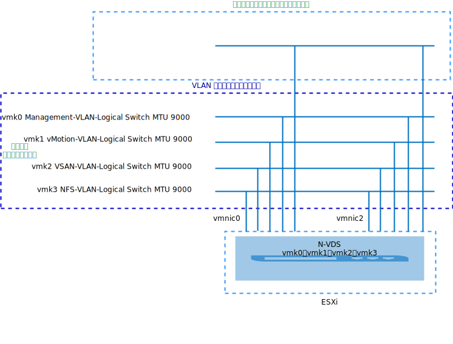
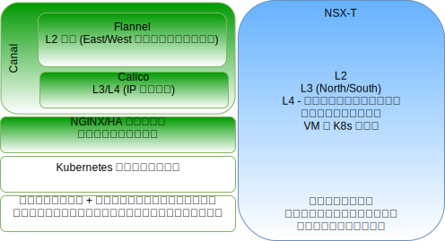
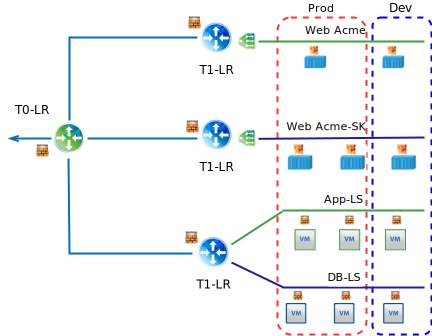
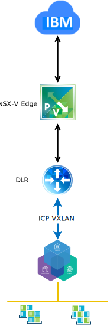
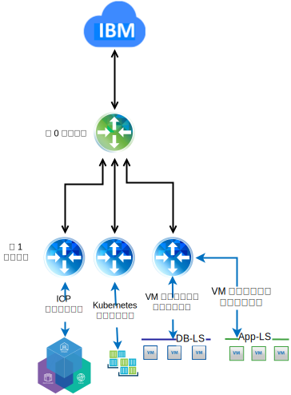

---

copyright:

  years:  2016, 2019

lastupdated: "2019-01-23"

---

# VMware vCenter Server on IBM Cloud の VMware NSX-T のテクノロジー・プレビュー

## NSX-T の概要

VMware NSX-T は、異種のエンドポイントや技術スタックが混在したアプリケーション・フレームワークおよびアーキテクチャー向けに設計されています。 このような環境には、vSphere とともに、他のハイパーバイザー、KVM、コンテナー、ベアメタルを含めることができます。 NSX-T を使用すると、IT チームも開発チームも自分たちのアプリケーションに最適なテクノロジーを選択できます。 また、NSX-T は、開発組織も IT 組織も、管理、運用、利用できるように設計されています。

この設計では、NSX-T 管理インフラストラクチャーが初期 vCenter Server クラスターまたは既存のクラスターにデプロイされます。

NSX-T マネージャーは、管理コンポーネント用に指定されたプライベート・ポータブル・アドレス・ブロックの IP アドレスを割り当てられ、共通 DNS サーバーおよび NTP サーバーを使用するように構成されます。

追加のクラスターがデプロイされ、ハイパーバイザー・トランスポート・ノードとして使用されます。これと同時に、ワークロード・データ・ストアとして使用される vSAN または NFS ストレージもデプロイされます。 表 1 に、中規模サイズの環境の要件をまとめます。

表 1.NSX-T コンポーネントの仕様

リソース	|NSX-T Manager	|コントローラー x 3	|エッジ x 2	|ベアメタル・エッジ*
---|---|---|---|---
中サイズ	|仮想アプライアンス	|仮想アプライアンス	|仮想アプライアンス	|物理サーバー*
vCPU の数	|4	|4	|4	|8
メモリー	|16 GB	|16 GB	|8 GB	|32 GB
ディスク	|140 GB vSAN または管理 NFS 共有。	|120 GB vSAN または管理 NFS 共有。	|120 GB vSAN または管理 NFS 共有。	|200 GB
ディスク・タイプ	|シン (プロビジョン済み)	|シン (プロビジョン済み)	|シン (プロビジョン済み)	|物理
ネットワーク	|管理コンポーネント用に指定されたプライベート A ポータブル。	|管理コンポーネント用に指定されたプライベート A ポータブル。	|管理コンポーネント用に指定されたプライベート A ポータブル。	|管理コンポーネント用に指定されたプライベート A ポータブル。

\* **注**: 具体的な要件については、ハードウェア互換性リストを確認してください。

図 1. NSX-V および T 管理コンポーネントのレイアウト

### 初期構成

初期 vCenter Server クラスター内に、NSX-T Manager、コントローラー・クラスター (コントローラー 3 台で構成)、エッジ・クラスターをデプロイします。 すべてのコンポーネントに**プライベート A** ポータブル・サブネットの IP アドレスを割り当てます。

クラスター内のホスト間でコントローラーが分離されるように、VM-VM アンチアフィニティー・ルールを作成します。 コントローラーの高可用性を確保するために、初期クラスターは最低 3 ノード構成でデプロイします。

NSX-T Manager 用にさらに vSphere ホストを 2 台デプロイし、それらに NSX-T ソフトウェア (VIB) をインストールします。 ホストおよびエッジのアップリンク・プロファイルと NIOC プロファイルを作成し、トンネル・エンドポイント通信に使用する IP プールを定義します。 詳しくは、アップリンク・プロファイル定義の表および NIOC プロファイル定義の表を参照してください。

プールに定義する IP アドレスは、**プライベート A** ポータブル IP アドレス範囲のものです。 VLAN およびオーバーレイのトランスポート・ゾーンが作成され、2 つの追加 ESXi ホストが両方のゾーンのトランスポート・ノードとして構成されます。 現在は、同じアップリンク・プロファイルが割り当てられます。 これらの ESXi ホスト上に N-VDS 転換点を作成し、uplink1 および uplink2 に割り当てます。

この時点で、vDS ポート・グループから NSX-T 論理 VLAN スイッチへの vmkernel ポート・マイグレーションのためのチーミング、フェイルオーバー、およびアップリンク・ポリシーに対応するために、2 つの追加 VLAN が必要です。 論理 VLAN スイッチが適切な VLAN ID で作成され、vmkernel ポートがマイグレーションされます。

NSX-T は、カプセル化インターフェース用の vmk10 と、ESXi ホスト上の Tier0 内部中継および Tier0-Tier1 内部中継サブネット用の vmk50 を作成します。 デフォルトでは、169.254.0.0/28 サブネットが Tier0 内部中継に使用され、100.64.0.0/16 サブネットが Tier0-Tier1 中継に使用されます。

表 2. アップリンク・プロファイル定義

アップリンク・プロファイル	|仕様
---|---
LAG	|現在何も定義されていません。
チーミング	|フェイルオーバー: アクティブ = Uplink1 = vmnic0、スタンバイ = Uplink2 = vmnic2
トランスポート VLAN	|0
MTU	|9000

表 3. NIOC プロファイル定義

トラフィック・タイプ/トラフィック名	|制限 (%)	|共有	|予約 (%)
---|---|---|---
管理トラフィック	|無制限	|20	|0
仮想マシン・トラフィック	|無制限	|30	|0
フォールト・トレラント・トラフィック	|無制限	|50	|0
vSphere 複製トラフィック	|無制限	|50	|0
iSCSI トラフィック	|無制限	|50	|0
vSphere Data Protection バックアップ・トラフィック	|無制限	|50	|0
vMotion トラフィック	|無制限	|50	|0
NFS トラフィック	|無制限	|100	|0
vSAN トラフィック	|無制限	|100	|0

図 2. vmkernel インターフェースへの論理 VLANスイッチ

## NSX-T

この設計では、NSX-T コンポーネント、VLAN、およびオーバーレイ・トランスポート・ゾーンの構成を指定しますが、ネットワーク・オーバーレイ・コンポーネント構成は適用しません。 ネットワーク・オーバーレイの設計は、お客様がお客様のニーズに基づいて行います。

以下が構成されます。
-	管理サーバーとコントローラーがインストールされます。
-	ESXi エージェントがインストールされ、トンネル・エンドポイント IP アドレス・プールがトランスポート・ノード用に構成されます。
-	VLAN とオーバーレイの両方のトランスポート・ゾーン用にトランスポート・ノードが構成されます。
-	N-VDS が ESXi トランスポート・ノード上に作成されます。
-	VMkernel ポートが VSS/VDS から N-VDS にマイグレーションされます。
-	管理コンポーネントが使用する Tier 0 ルーター。

以下は構成されません。
-	オーバーレイ論理スイッチ。
-	マイクロ・セグメンテーション。
-	他の VMware インスタンスに対するリンク NSX 管理。

### NSX-V および NSX-T を含む vCenter Server

元の vCenter Server クラスターには、vCenter Server アプライアンスとともに NSX-V および NSX-T のすべての管理コンポーネントが含まれています。 [NSX-V の概要](/docs/services/vmwaresolutions/archiref/vcsnsxt/vcsnsxt-overview-ic4vnsxv.html)で説明しているように、このクラスター内のホストには NSX-V 用の準備が施されています。 2 番目のクラスター内のホストは NSX-T 用に準備され、トランスポート・ノードとして構成されます。 この構成により、お客様が選択すれば NSX-V から NSX-T にマイグレーションできるようになっています。

### NSX-T と NSX-V

ここでは、VMware SDN 製品である NSX-V と NSX-T の主な違いに焦点を当てます。 どちらのソリューションも VMware 環境のマイクロ・セグメンテーションを可能にしますが、以下のセクションで概説するように、NSX-T のほうが少し進んでいます。

アーキテクチャーの相違点の詳細については、[VMware NSX-T Reference Design Guide](https://communities.vmware.com/servlet/JiveServlet/download/37591-3-195840/VMware%20NSX-T%20Reference%20Design%20Guide.pdf) (PDF のダウンロード) を参照してください。

#### NSX for vSphere

NSX-V は vSphere デプロイメント専用であり、単一の NSX-V Manager が単一の VMware vCenter Server インスタンスに結び付けられるように設計されています。 基本的に、VMware 環境内のネットワーク仮想化が必要な場合は、NSX-V が適切なソリューションです。

NSX-V の特長は、以下のとおりです。
-	VMware 中心。
-	vSphere 内の SDN 用に設計されています (vSphere ユーザー・インターフェースの単一画面で表示できるネットワーク仮想化)。
-	VXLAN カプセル化プロトコル (ほとんどのサード・パーティー・ベンダーがサポートしています) を使用します。
-	物理 NIC は NSX-V が所有するのではなく、仮想分散スイッチ (vDS) の SDDC-Dswitch-Private および SDDC-Dswitch-Public に割り当てられます。
-	東西トラフィックには分散論理ルーター (DLR)、南北トラフィックには Edge Service Gateway (ESG) という用語の違い。

#### NSX Transformers

NSX-T は vCenter 環境と vSphere 環境用のスタンドアロン・ソリューションですが、KVM、パブリック・クラウド、コンテナーもサポートし、{{site.data.keyword.containerlong_notm}} および {{site.data.keyword.icpfull_notm}}、Redhat OpenShift、Pivotal などのフレームワークに統合できます。 NSX-T を使用すると、複数のハイパーバイザー、コンテナー、およびクラウドをまたぐ SDN を管理できます。

NSX-T の特長
-	スタンドアロン製品。 vCenter は不要です。
-	マルチハイパーバイザー・サポート
    - コントローラーは KVM または ESXi にデプロイできます。
    - エッジは、仮想またはベアメタルとしてデプロイできます。
-	コンテナー統合 (NSX-T CNI プラグイン)。
-	OpenSwitch (OvS) サポート。
- 最適化された多層ルーティング
    - Tier 1 ルーターでのルート通知。
    - Tier 0 ルーターでのルート再配布。
-	Geneve カプセル化プロトコルを使用します。
-	物理 NIC は NSX-T トランスポート・ノードが所有するのではなく、N-VDS に割り当てられます。
-	東西トラフィックには Tier-1 論理ルーター、南北トラフィックには Tier-0 論理ルーターという用語の違い。

## Calico

Calico は分散スケールアウト・アーキテクチャーを基にしているので、開発者の 1 台のノートブックから大規模なエンタープライズ・デプロイメントにスムーズにスケーリングできます。また、標準の Linux データ・プレーンを使用して仮想ワークロードでベアメタルのパフォーマンスを実現できます。 Calico は、以下の複数の相互依存型コンポーネントで構成されています。
-	Felix。エンドポイント、コンテナー、または VM をホストするすべてのノードで実行されるデーモンです。 Felix は、インターフェース管理、ルートおよび acl プログラミング、エンドポイントへのルーティング、エンドポイント間のトラフィック検証、および管理対象ホストのネットワークの正常性を基本とする状態報告を行います。
- オーケストレーター・プラグイン。オーケストレーター・プラグインを Calico (この場合は Kubernetes プラグイン) にバインドし、Kubernetes から Calico への API 変換を実行して、エンドポイントのネットワーク・セットアップが失敗したときに Calico から Kubernetes にフィードバックを戻します。
-	etcd。コンポーネント間の通信を提供し、一貫性のあるデータ・ストアに保管します。これにより、Calico は常に正確なネットワークを構築できます。
-	BIRD。Felix もホストするすべてのノードで BGP クライアント機能を提供します。 Felix が Linux カーネルにルートを挿入すると、BGP クライアントがルートを取得してデプロイメント内の他のノードに配布します。 大規模環境では、BGP ルート・リフレクターもデプロイされ、BGP クライアントが接続するための中心点として機能します。 これにより、各クライアントが他のすべてのクライアントと対話してデプロイメント内の他のノードにルートを配布する必要がなくなります。

図 3. Calico の概要

### NSX-T および Calico

#### NSX-T コンポーネントの詳細

NSX-T アーキテクチャーには、データ・プレーン、コントロール・プレーン、および管理プレーンの分離が組み込まれています。 この分離により、スケーラビリティー、パフォーマンス、回復力、異種混合性など、複数の利点が得られます。 主なアーキテクチャーの特長は、以下のとおりです。
-	管理プレーン: NSX-T 管理プレーンは、高度なクラスタリング・テクノロジーを使用して細部まで設計されているので、大量の API 要求を同時に処理できるプラットフォームになっています。
-	コントロール・プレーン: NSX-T コントロール・プレーンは、システムの仮想ネットワーキングとセキュリティーの状態をリアルタイムで追跡します。 NSX-T コントロール・プレーンは、コントロール・プレーンを中央のクラスター・コントロール・プレーン (CCP) とローカル・コントロール・プレーン (LCP) に分離しています。 そのため、CCP のジョブが大幅に簡略化され、異種のエンドポイントまでプラットフォームを拡張および拡大できるようになります。
-	データ・プレーン: NSX-T データ・プレーンでは、ホスト・スイッチ (vSwitch には依存しません) が導入されます。このホスト・スイッチはコンピュート・マネージャーから分離され、ネットワーク接続が正常化されます。 作成、読み取り、更新、および削除 (CRUD) の各操作は、すべて NSX-T Manager を介して実行されます。

#### Calico と NSX の違い

Calico は Tigera のオープン・ソース・プロジェクトであり、主に Tigera チームによって保守されています。 これは、{{site.data.keyword.icpfull_notm}} と {{site.data.keyword.containerlong_notm}} の両方が使用する Kubernetes などのオーケストレーション・システムのネットワーキングとセキュリティーを可能にする CNI として提供されます。

Calico は、フラットなレイヤー 3 ネットワークを作成および管理し、各ワークロードに完全にルーティング可能な IP アドレスを割り当てます。 ワークロードは、ベアメタルの性能、トラブルシューティングの簡易化、および相互運用性の向上のために、IP カプセル化やネットワーク・アドレス変換を行わずに通信できるようになっています。 オーバーレイが必要な環境では、Calicoは IP-in-IP トンネリングを使用したり、Flannel などの他のオーバーレイ・ネットワーキングと連携したりすることもできます。 Canel というオープン・ソース・プロジェクトがあります。これは、Calico と Flannel を同時にインストールして、すぐに使用可能な VXLAN ネットワーキングを提供しつつ、Calico ポリシーによるポリシー分離も利用できるようにするための取り組みです。

Calico は、エンドポイントの通信、セキュリティー、ルーティング、およびプラグインによる Kubernetes との統合を提供する、複数の相互依存型コンポーネントで構成されています。 これは、すべてコマンド・ラインおよび構成ファイルを使用して行われるので、ハイブリッド環境全体でネットワーキング・ポリシーおよびセキュリティー・ポリシーを統一することは困難です。 Calico コンポーネントについて詳しくは、[Project Calico](https://www.projectcalico.org/) の資料を参照してください。

NSX-T は vCenter 環境と vSphere 環境用のスタンドアロン・ソリューションですが、KVM、パブリック・クラウド、コンテナーもサポートし、{{site.data.keyword.containerlong_notm}} および {{site.data.keyword.icpfull_notm}}、Redhat OpenShift、Pivotal などのフレームワークに統合できます。 そのため、複数のハイパーバイザー、コンテナー、およびクラウドをまたぐ SDN を管理できます。 NSX-T はレイヤー 2、3、および 4 で動作し、各層の機能を提供します。

NSX-T では、わかりやすい Web インターフェースで VM およびコンテナーの環境のネットワークおよびセキュリティー・ポリシーを管理できます。

図 4. NSX-T コンポーネントと Calico コンポーネントの大まかな比較

## NSX-T および Kubernetes

Kubernetes と NSX Manager の統合を実現するコア・コンポーネントは、NSX コンテナー・プラグイン (NCP) です。 NCP は Kubernetes ポッド内でコンテナーとして実行され、名前空間やポッドなどの Kubernetes API サーバー上の関連オブジェクトの変更をモニターし、監視します。 開発者が Kubernetes 側で作業を実行すると、NCP がその変更を認識し、NSX マネージャーに対する API 呼び出しのコレクションを使用して、論理スイッチ、論理ルーター、ファイアウォール・オブジェクトなどの対応する NSX オブジェクトを作成します。

以下の例では、Acme と Skateboards という 2 つの Kubernetes 名前空間が使用されています。それぞれの名前空間に、専用の論理スイッチおよび Tier-1 ルーターと、T0 論理ルーターに接続するための IP セグメントがあります。

図 5. Kubernetes NCP

### NSX Security Policy Manager

ネットワーク仮想化を提供することに加えて、NSX-T は高度なセキュリティー・プラットフォームとしても機能し、セキュリティー・ソリューションのデプロイメントを合理化する豊富な機能セットを備えています。 以下の情報は、複数のプラットフォームに適用できるマイクロ・セグメンテーション機能の概要です。

「検査」の主要概念には、以下のものがあります。
-	NSX-T 分散ファイアウォール。ワークロードのステートフルな保護を vNIC レベルで提供します。 ハイパーバイザー・カーネルで DFW を適用し、マイクロ・セグメンテーションの実現を支援します。
-	オンプレミスおよびクラウド・デプロイメント用の統一セキュリティー・ポリシー・モデル。VM 属性およびコンテナー属性という細かいレベルまでマルチハイパーバイザー (つまり ESXi および KVM) およびマルチワークロードをサポートします。
-	非依存型の計算管理。さまざまな計算マネージャーで管理されるハイパーバイザーをサポートし、複数の vCenter 環境にまたがるハイパーバイザー間に定義済みのマイクロ・セグメンテーション・ポリシーを適用できるようにします。
-	NSX-T エッジ・ファイアウォールが、N-S トラフィック用の集中型ステートフル・ファイアウォール・サービスとして機能します。 エッジ・ファイアウォールは論理ルーターごとに実装され、Tier-0 と Tier-1 の両方でサポートされます。 ポリシーの構成と適用の観点では、エッジ・ファイアウォールと NSX-T DFW は無関係です。
-	タグ、仮想マシン名、サブネット、論理スイッチなどのさまざまな基準に基づいた、NSGroups と呼ばれる論理構造へのオブジェクトの動的グループ化。
-	ポリシーの適用範囲は、アプリケーション・レベルまたはワークロード・レベルの細分度で選択できます。
-	分散ネットワーク暗号化 (DNE) によって、ネットワークを流れるデータの機密性と保全性が保たれます。
-	IP ディスカバリー・メカニズムで、ワークロードのアドレッシングを動的に識別します。
-	SpoofGuard は、vNIC レベルでの IP スプーフィングをブロックします。
-	スイッチ・セキュリティーは、無許可トラフィックに対するストーム制御およびセキュリティーを提供します。

図 6. NSX-T マイクロ・セグメンテーション

### NSX-T と NSX-V の違い

NSX for vSphere (NSX-V) は vSphere デプロイメント専用であり、単一の NSX-V マネージャー・プラットフォームが単一の VMware vCenter Server インスタンスに結び付けられるように設計されています。 基本的に、VMware 環境内のネットワーク仮想化が必要な場合は、おそらく NSX-V が適切なソリューションです。

NSX Transformers (NSX-T) は、複数の vCenter 環境と vSphere 環境をサポートできるスタンドアロン・ソリューションですが、KVM、パブリック・クラウド、コンテナーもサポートし、{{site.data.keyword.containerlong_notm}} および {{site.data.keyword.icpfull_notm}}、Redhat OpenShift、Pivotal などのフレームワークに統合できます。 これを使用すれば、共通のツール・セットを使用して、複数のハイパーバイザー、コンテナー、およびクラウドをまたぐ SDN を管理できます。

#### NSX-V のネットワーク・スケーラビリティー

VMware NSX-V は、何千ものエンドポイントや技術スタックが混在するアプリケーション・フレームワークおよびアーキテクチャー向けに設計されています。そのため、ホスト 3 台構成の単一の vSphere クラスターを、千台以上のホストと数千もの仮想マシンで構成された、vCenter をまたぐデプロイメントにまで拡大できます。

#### NSX-T のネットワーク・スケーラビリティー

VMware NSX-T は、異種のエンドポイントや技術スタックが混在したアプリケーション・フレームワークおよびアーキテクチャー向けに設計されているので、あらゆるサイト、クラウド、エンドポイント・デバイスを対象に含めることができます。 これにより、小規模データ・センターからマルチクラウド環境に拡大できます。

#### NSX-V のセキュリティー

VMware NSX-V では、アプリケーションのタイプやデプロイされた VMware インフラストラクチャー内の場所に関係なく、環境全体で一貫したセキュリティー・ポリシーを定義できます。 新規ワークロードがデプロイされると、それらは自動的にセキュリティー・ポリシーを継承し、プロビジョンされた場所や移動された場所に関係なく、ライフサイクルを通じてその状態を維持します。 NSX は、IP アドレス、ポート、プロトコルなどの静的なネットワーク属性からセキュリティー・ポリシーを分離するので、アプリケーションとインフラストラクチャーのコンテキストについての理解に基づいてポリシーを定義できます。 NSX では、物理デバイスまたは仮想アプライアンスを介してすべてのネットワーク・トラフィックをルーティングするのではなく、特定のマイクロ・セグメントに高度なサード・パーティー・セキュリティー・サービスを挿入することもできます。 そうすることによって、高度なセキュリティー・サービスを適切なタイミングで適切な場所に挿入して、ネットワーク・トラフィックの効率を最大化しつつ、セキュリティー・サービス自体の有効性を高めることができます。

#### NSX-T のセキュリティー

VMware vSphere 環境では、VMware NSX-T は NSX-V と同じ機能を提供します。 NSX-T は、{{site.data.keyword.cloud}} Private や {{site.data.keyword.containerlong_notm}} のようなプライベート・クラウド環境およびパブリック・クラウド環境で他のクラウド・オファリングと一緒に実行されるアプリケーションのために、スケーラブルで安定したマイクロ・セグメンテーション・セキュリティーを提供します。

#### NSX-V との統合

Kubernetes と NSX-V の統合では、{{site.data.keyword.cloud_notm}} 自動化機能により、vCenter Server インスタンス上に {{site.data.keyword.icpfull_notm}} がインストールされます。 専用のスイッチ/VXLAN、DLR、および ESG が Kubernetes ネットワークのためだけに作成されます。 Day 1 の {{site.data.keyword.icpfull_notm}} のオーバーレイ・ネットワークは、アンダーレイ・ネットワークにアクセスするために ESG を介してルーティングがセットアップされた 192.168.20.0/ 24 サブネットです。

図 7. NSX-V および Kubernetes

#### NSX-T との統合

Kubernetes と NSX-T の統合は、NSX-T コンテナー・プラグイン (NCP) を介して行われます。 NCP が各 Kubernetes ノードで実行され、NSX マネージャーおよび Kubernetes コントロール・プレーンと通信します。 NSX-T プラグインは、Kubernetes クラスターの論理トポロジーを自動的に作成し、名前空間ごとに別個の論理ネットワークを作成し、Kubernetes ポッドを論理ネットワークに接続し、IP アドレスと MAC アドレスを割り振ります。

NSX-T 分散ファイアウォールでは、Kubernetes クラスターのために実装されるネットワーク・ポリシーを作成できます。 入口および出口ポリシー、ラベル、および式マッチング・ポリシーをサポートし、ロード・バランサー機能を備えており、これらはすべて Kubernetes インフラストラクチャーに適用できます。

図 8. NSX-T および Kubernetes

### その他のリソース
* [VMware NSX-T reference design guide](https://communities.vmware.com/servlet/JiveServlet/download/37591-3-195840/VMware%20NSX-T%20Reference%20Design%20Guide.pdf) (PDF ダウンロード)
* [Route to Cloud NSX-T](https://www.routetocloud.com/category/nsx-t/)
* [VMware containers and container networking for network engineers](https://www.vmware.com/content/dam/digitalmarketing/vmware/en/pdf/products/nsx/vmware-containers-and-container-networking-whitepaper.pdf)
