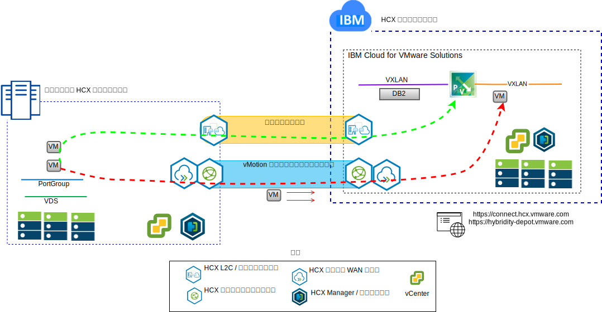

---

copyright:

  years:  2016, 2018

lastupdated: "2018-11-01"

---

# ユース・ケース

## IBM Cloud への VMware ワークロードのマイグレーション

Acme Skateboards 社は、オンプレミスの VMware SDDC インスタンスを {{site.data.keyword.cloud}} 上の VCS インスタンスにシームレスに拡張したいと考えています。 ビジネスを継続させ、ダウン時間を最小限に抑える必要があります。使用しているアプリケーションをクラウドで実行するように再構成することは、最適なソリューションではありません。

{{site.data.keyword.cloud_notm}} vCenter Server with Hybridity Bundle は、VCS インスタンスとオンプレミスの VMware 仮想化データ・センターのシームレスな接続を可能にします。

VCS ターゲット・サイトに仮想マシン (VM) としてデプロイされた VMware HCX コンポーネントにより、ピアのオンプレミスのソース・サイトにインストールされた VMware HCX コンポーネントと接続を確立できます。

図 1. VMware Hybrid Cloud Extension サービス

オンプレミスと {{site.data.keyword.cloud_notm}} の間の疎結合相互接続により、以下のような機能を使用できるようになります。
-	**単純な相互接続** – 論理ネットワーク接続が、公衆インターネット、プライベート VPN、Direct Link などの物理接続を介して簡単に確立されます。
-	**レイヤー 2 拡張** - オンプレミス・ネットワーク (オンプレミス・サブネットと IP アドレッシングを含む) がクラウドに拡張されます。
-	**暗号化** – 2 者間のネットワーク・トラフィックが安全に暗号化されます。
-	**最適化されたネットワーク** – ネットワーク・トラフィックをできる限り速く転送するために、最適な接続を選択し、接続上に大量の情報を効率的に流します。

-	**データ重複排除** – 50% ものネットワーク・トラフィックの削減を達成できます。
-	**インテリジェント・ルーティング** – ワークロードが移動されるときに、ネットワーク・トラフィックが発信元のサイトに「ヘアピン通信」で戻ることがないようにターゲット・サイトのゲートウェイを使用するようにするため、隣接性ルーティングによってネットワーク・パス (つまり、ゲートウェイ) を変更できます。
-	**ゼロ・ダウン時間マイグレーション** - vMotion を使用して、実行中のシステムをクラウドとの間で双方向に移動できます。
-	**スケジュールされたマイグレーション** – 任意の数の仮想マシンを宛先サイトに複製してから、指定した時刻にそのサイトでアクティブ化して、元のサイトで実行されているシステムを置き換えることができます。
-	**セキュリティー・ポリシーのマイグレーション** - NSX をオンプレミスで使用する場合、セキュリティー・ポリシーやファイアウォールなどはすべてワークロードとともに移動されます。

## ハイブリッド・アーキテクチャーのデプロイメント

Acme Skateboards 社は、アプリケーション・モダナイゼーションのジャーニーのために、vCenter Server with Hybridity Bundle (VCS) と {{site.data.keyword.cloud_notm}} Private (ICP) で構成されるハイブリッド・アーキテクチャーを {{site.data.keyword.cloud_notm}} にデプロイしたいと考えています。同社の要件は、VM でデータベースを実行し、コンテナーでアプリケーションと Web インターフェースを実行すること、そしてネットワークとセキュリティーの管理に共通のツール・セットを使用することです。

{{site.data.keyword.vmwaresolutions_short}} は、世界中の {{site.data.keyword.CloudDataCents_notm}}に VMware テクノロジー・コンポーネントをデプロイするための自動化機能を提供します。 このアーキテクチャーは単一のクラウド領域で構成されます。また、別の地域にある追加のクラウド領域、または同じデータ・センター内の別の {{site.data.keyword.cloud_notm}} ポッド (あるいはその両方) に拡張する機能をサポートします。

ICP および Cloud Automation Manager (CAM) 製品をオンプレミスの仮想化プラットフォームに手動でデプロイして、オンプレミスの場所からクラウド管理を行うことができます。また、ICP および CAM は、既存または新規の VCS デプロイメントのサービス拡張として提供されているので、{{site.data.keyword.cloud_notm}} からのクラウド管理も可能です。

次の図は、VCS インスタンスで実行される ICP を表しています。ICP オーバーレイ・ネットワークのためだけに、NSX-V に専用のスイッチ/VXLAN、分散論理ルーター (DLR)、およびエッジ・サービス・ゲートウェイ (ESG) が構成されています。アンダーレイ・ネットワークにアクセスするために、ルーティングが ESG を介してセットアップされます。

{{site.data.keyword.cloud_notm}} 自動化機能を使用して、Acme Skateboards 社は VCS を含むハイブリッド・ソリューションをプロビジョンし、VCS 上のデータベース VM および ICP を実行して、アプリケーションおよびフロントエンド Web サービスをコンテナーで実行することができます。NSX は、オーバーレイ・ネットワーク内のネットワーキングとセキュリティー用の共通の管理ツール・セットを提供します。

NSX-V について詳しくは、[NSX-V の概要](vcsnsxt-overview-ic4vnsxv.html)を参照してください。VCS および ICP オファリングについて詳しくは、[vCenter Server および {{site.data.keyword.cloud_notm}} Private](../vcsicp/vcsicp-intro.html) を参照してください。

図 2. ICP を使用する VCS

これにより、オンプレミスと {{site.data.keyword.cloud_notm}} 間の疎結合された相互接続が作成され、以下のような機能を使用できるようになります。
-	**単純な相互接続** – 論理ネットワーク接続が、公衆インターネット、プライベート VPN、Direct Link などの物理接続を介して簡単に確立されます。
-	**レイヤー 2 拡張** - オンプレミス・ネットワーク (オンプレミス・サブネットと IP アドレッシングを含む) がクラウドに拡張されます。
-	**暗号化** – 2 者間のネットワーク・トラフィックが安全に暗号化されます。
-	**最適化されたネットワーク** – ネットワーク・トラフィックをできる限り速く転送するために、最適な接続を選択し、接続上に大量の情報を効率的に流します。

-	**データ重複排除** – 50% ものネットワーク・トラフィックの削減を達成できます。
-	**インテリジェント・ルーティング** – ワークロードが移動されるときに、ネットワーク・トラフィックが発信元のサイトに「ヘアピン通信」で戻ることがないようにターゲット・サイトのゲートウェイを使用するようにするため、隣接性ルーティングによってネットワーク・パス (つまり、ゲートウェイ) を変更できます。
-	**ゼロ・ダウン時間マイグレーション** - vMotion を使用して、実行中のシステムをクラウドとの間で双方向に移動できます。
-	**スケジュールされたマイグレーション** – 任意の数の仮想マシンを宛先サイトに複製してから、指定した時刻にそのサイトでアクティブ化して、元のサイトで実行されているシステムを置き換えることができます。
-	**セキュリティー・ポリシーのマイグレーション** - NSX をオンプレミスで使用する場合、セキュリティー・ポリシーやファイアウォールなどはすべてワークロードとともに移動されます。

Acme Skateboards 社は、このソリューションを使用してオンプレミスの VMware ワークロードを {{site.data.keyword.cloud_notm}} に正常にマイグレーションし、ダウン時間をゼロまたはほぼゼロにしてアプリケーションは再構成しないという要件に応えることができました。vCenter Server with Hybridity Bundle について詳しくは、[VMware HCX on {{site.data.keyword.cloud_notm}} ソリューション・アーキテクチャー](https://www.ibm.com/cloud/garage/files/HCX_Architecture_Design.pdf)を参照してください。

### 関連リンク

* [VCS Hybridity Bundle の概要](../vcs/vcs-hybridity-intro.html)
