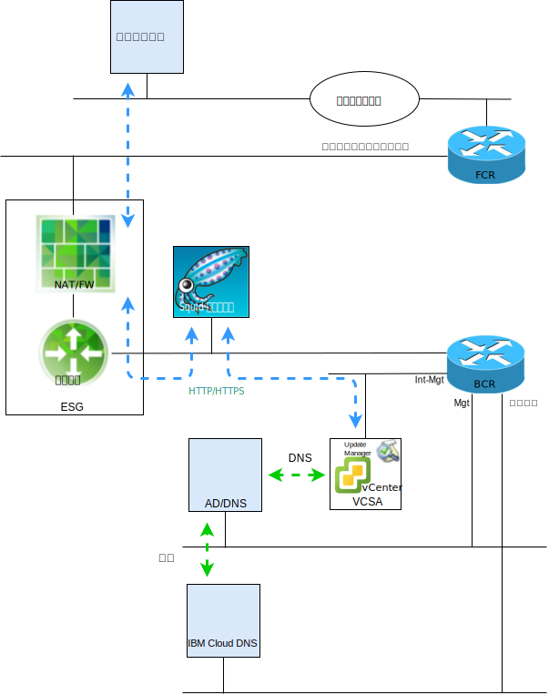

---

copyright:

  years:  2016, 2018

lastupdated: "2018-10-29"

---

# VMware Update Manager の概要

この資料の目的は、IBM Cloud for VMware Solutions vCenter Server インスタンスのシステム管理者に、現行の vCenter Server 環境を維持するように VMware Update Manager (VUM) を構成する方法を説明することです。

VUM により、VMware vSphere の集中型の自動化されたパッチおよびバージョン管理が可能になり、VCS 環境で以下のタスクを実行できるようになります。
* vSphere ESXi ホストをアップグレードしてパッチを適用します。
* サード・パーティー・ソフトウェアをホストにインストールして更新します。
* 仮想マシン・ハードウェア、VMware Tools、および仮想アプライアンスをアップグレードします。

この資料では、VCS インスタンスの以下のコンポーネントを保守するプロセスについても説明します。
* vCenter Server Appliance
* NSX
* vSAN

この資料では、VUM が VMware リポジトリーにアクセスできるようにするための、CentOS および Squid に基づくプロキシー・サーバー実装の使用について説明します。 VUM が VMware の更新サーバーからリソースを要求すると、まず要求がプロキシー・サーバーに送信され、プロキシー・サーバーからその要求が外部サービス・ゲートウェイ (ESG) を介して更新サーバーに送信されます。 プロキシー・サーバーによってリソースが取得されると、そのリソースは VUM に送信されます。

図 1. 概要図

現在、VCS は vSphere 6.5 をデプロイします。これは VUM が vCenter Server Appliance (VCSA) 内に統合されることを意味します。また、VUM クライアント・コンポーネントは vSphere Web Client で実行されるプラグインであるため、VCSA のデプロイメント後に自動的に有効になります。 ただし、VUM は、インターネットにアクセスして VMware リポジトリーにアクセスすることはできません。

この資料に記載された構成では、IBM Cloud パブリック・ネットワークを使用してアップグレードおよびパッチをダウンロードするためのインターネット・アクセスを提供する「オールインワン」インターネット接続 VUM デプロイメント・モデルを使用します。

代替インターネット接続の使用を必要とするお客様は、VMware vSphere Update Manager Download Service (UMDS) について調べる必要があります。これは、この資料には記載されていません。

VUM は、共有リポジトリーから更新をインポートしたり、パッチや拡張を .zip ファイルから手動でインポートしたりするように構成できますが、これらのトピックについてはこの資料には記載されていません。

したがって、vSphere 6.5 では、VCS 環境内の VM に VUM をデプロイできない個別の Windows マシンに VUM サーバーをインストールする際に、VUM を VCSA に登録することはサポートされなくなりました。

この資料は以下のセクションで構成されています。
* [VMware Update Manager の概要](vum-overview.html) - このセクションでは VUM プロセスについて説明し、ツールの操作および UI を理解するために必要な重要な用語を紹介します
* **インストール、構成、および使用法** - このセクションでは、VCS インスタンスで VUM を作動させるために必要なステップについて説明します。
  - [初期構成](vum-init-config.html) - 以下を行う一回限りのタスク。
      - プロキシー・サーバーがインターネットにアクセスできるようにするための NSX ネットワーキングの構成
      - VUM へのインターネット・アクセスを提供するためのプロキシー・サーバーのインストールと構成
      - プロキシー・サーバーを使用するための VUM の初期セットアップ
  - [メタデータの収集](vum-metadata.html)- VUM は、変更可能な事前定義の自動プロセスを介して、アップグレード、パッチ、または拡張に関するメタデータをダウンロードします。VUM は、構成可能な一定の間隔で、VMware またはサード・パーティーのソースにアクセスして、使用可能なアップグレード、パッチ、または拡張に関する最新のメタデータを収集します。
  - [ベースラインの作成](vum-baselines.html) - 事前定義のベースラインおよびベースライン・グループを使用するか、カスタム・ベースラインを作成します。その後、ベースラインおよびベースライン・グループがインベントリー・オブジェクトに接続されます。
  - [スキャンおよびレビュー](vum-scanning.html) - インベントリー・オブジェクトがスキャンされ、結果がレビューされて、ベースラインおよびベースライン・グループにどのように準拠しているかが判別されます。 スキャン結果は、テキスト検索、グループ選択、ベースライン選択、およびコンプライアンス状況の選択によってフィルタリングできます。
  - [ステージングおよび修復](vum-staging.html) - 修復の前にオプションでパッチおよび拡張をステージングして、確実にホストにダウンロードされるようにすることができます。 修復中に、VUM によってパッチ、拡張、およびアップグレードがインベントリー・オブジェクトに適用されます。

この資料では、1 つの 1 次 VCS インスタンス、または複数の個別の 1 次 VCS インスタンスがデプロイされていることを前提としています。 1 次および 2 次 VCS インスタンスがデプロイされているため、シングル・サインオン (SSO) を使用している場合は、[SSO がリンクされた vCenters](vum-updating-vcsa.html) を参照してください。

vSAN を使用して VCS をデプロイした場合は、まず [vSAN クラスターの更新](vum-updating-vsan.html)を参照してください。

IBM Cloud インフラストラクチャー管理の自動化を更新する場合は、IBM Cloud for VMware Solutions コンソールを使用します。

[IBM Cloud for VMware Solutions コンソール](https://console.bluemix.net/infrastructure/vmware-solutions/console)を使用すると、以下のアクションを実行できます。
*	ライセンスのアップグレード (例えば、NSX Base の別のバージョンへのアップグレード)
*	VCS プラットフォームの更新の開始 (例えば、バージョン 2.5 への移行)
*	更新の状況の表示
*	インストール済みの更新の表示

この機能により、VCS インスタンスの管理コンポーネントのみの自動更新が可能になります。 VMware 製品の更新は、この資料で詳述されている手順を使用して適用する必要があります。

### 関連リンク

* [VMware HCX on IBM Cloud Solution Architecture](https://www.ibm.com/cloud/garage/files/HCX_Architecture_Design.pdf)
* [VMware Solutions on IBM Cloud Digital Technical Engagement](https://ibm-dte.mybluemix.net/ibm-vmware) (デモ)
