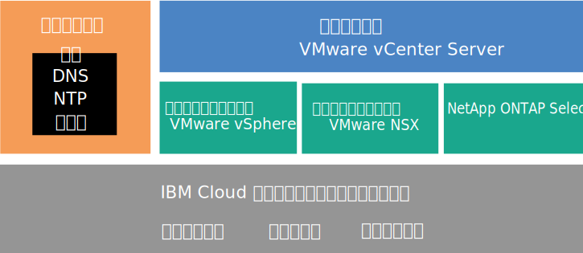
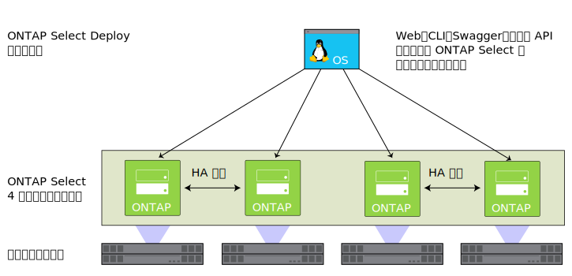

---

copyright:

  years:  2016, 2018

lastupdated: "2018-06-15"

---

# NetApp ONTAP Select の概要

{{site.data.keyword.cloud}} デプロイメント上の NetApp ONTAP Select のアーキテクチャーとコンポーネントについて説明します。

## NetApp ONTAP Select のアーキテクチャー

{{site.data.keyword.cloud_notm}} オファリング上の NetApp ONTAP Select は、vCenter Server デプロイメントを補完するためのストレージ仮想化サービスを提供します。

以下の図は、vCenter Server デプロイメントにおける NetApp ONTAP Select のアーキテクチャー全体を示しています。

図 1. {{site.data.keyword.cloud_notm}} 上の NetApp ONTAP Select のアーキテクチャーの全体像

### 物理インフラストラクチャー

この層は、仮想インフラストラクチャーで使用される物理インフラストラクチャー (コンピュート、ネットワーク、ストレージの各リソース) を提供します。

### 仮想化インフラストラクチャー (コンピュート、ネットワーク、NetApp ONTAP Select)

この層は、複数の異なる VMware 製品と NetApp ONTAP Select 製品により、物理インフラストラクチャーを仮想化します。
* VMware vSphere は、物理コンピュート・リソースを仮想化します。
* VMware NSX は、論理ネットワーキング・コンポーネントと仮想ネットワークを提供するネットワーク仮想化プラットフォームです。
* {{site.data.keyword.cloud_notm}} 上の NetApp ONTAP Select は、4 つのホスト用の 4 つの VM からなる ONTAP Select クラスターをデプロイします。

以下の図は、NetApp ONTAP Select デプロイメントのコンポーネントを示しています。

図 2. NetApp ONTAP Select のコンポーネント

### 仮想化管理

この層は、vCenter Server 仮想アプライアンス、NSX Manager、2 つの NSX ESG、3 つの NSX Controller、Platform Services Controller (PSC) 仮想アプライアンス、vCenter Server Appliance (vCSA)、IBM CloudDriver 仮想マシンからなります。

NetApp ONTAP Select は、VMware クラスター内で実行され、ホスト上のローカル・ストレージを仮想化します。 NetApp ONTAP Select は専用モデルでデプロイされます。つまり、他のワークロードと同じクラスターを共有するという想定にはなっていません。 そのため、{{site.data.keyword.cloud_notm}} オファリング上の NetApp ONTAP Select のハードウェア構成のサイズは、NetApp ONTAP Select の要件のみに基づいて決まります。

<!--For details about the architecture, see the _Reference architecture_ document in the [Architecture Center](https://www.ibm.com/devops/method/content/architecture/virtVCenterServerPlatform){:new_window}.-->

## NetApp ONTAP Select インスタンスのコンポーネント

NetApp ONTAP Select インスタンスには以下のコンポーネントが含まれます。

**注**: 標準化された構成の選択肢と料金は、デプロイメントの対象として選択された {{site.data.keyword.CloudDataCent_notm}}に基づいて異なる場合があります。

### ストレージ

* 3 つのオプション: **ハイパフォーマンス (ミディアム)**、**ハイパフォーマンス (ラージ)**、**大容量**
* RAID 5 とホット・スペア
* 2 台の 1 TB SATA ドライブ ESXi OS – RAID 1
* 管理データ・ストア – 管理 VM 用に 500 GB

### 事前設定構成

以下の構成オプションがある 4 つの {{site.data.keyword.cloud_notm}} {{site.data.keyword.baremetal_short}}
* **ハイパフォーマンス (ミディアム)** –プレミアム・ライセンス / Dual Intel Xeon E5-2650 v4 (合計 24 コア、2.2 GHz) / 128 GB RAM / ノードあたり 22 個の 1.9 TB SSD ドライブ容量 / 4 ノード・クラスターの実効容量– 59 TB
* **ハイパフォーマンス (ラージ)** –プレミアム・ライセンス / Dual Intel Xeon E5-2650 v4 (合計 24 コア、2.2 GHz) / 128 GB RAM / ノードあたり 22 個の 3.8 TB SSD ドライブ容量 / 4 ノード・クラスターの実効容量– 118 TB
* **大容量** – 標準ライセンス / Dual Intel Xeon E5-2650 v4 (合計 24 コア、2.2 GHz) / 64 GB RAM / ノード当たり 34 個の 4 TB SATA ドライブ容量 / 4 ノード・クラスターの有効容量 – 190 TB

**注:** 3.8 TB SSD (ソリッド・ステート・ディスク) ドライブは、データ・センターで一般提供が開始されたらサポートされる予定です。

### ハードウェア

* 3 つの RAM とディスクのオプション: **ハイパフォーマンス (ミディアム)**、**ハイパフォーマンス (ラージ)**、**大容量**
* 2 台の 1 TB SATA ドライブ ESXi OS
* RAID ディスク・コントローラー 1 つ
* VMware Server Virtualization 6.5

### ネットワーキング

* 10 Gbps デュアル・ネットワーク・アップリンク (パブリックとプライベート)
* VLAN (仮想 LAN) 3 つ: パブリック VLAN 1 つとプライベート VLAN 2 つ
* セキュア VMware NSX Edge Services Gateway 1 つ

### 仮想サーバー・インスタンス

2 つの VSI (仮想サーバー・インスタンス):
* Microsoft Active Directory (AD) とドメイン・ネーム・システム (DNS) サービス用に 1 つの VSI。
* IBM CloudBuilder の VSI。これは、インスタンスのデプロイメントが完了した後にシャットダウンされます。

### ライセンスと料金

*  NetApp ONTAP Select の 4 つの Premium/Standard エディションのライセンス (ユーザー提供)
*  VMware vSphere 6.5 Enterprise Plus エディション
*  VMware vCenter Server 6.5
*  VMware NSX Base for Service Providers エディション
*  サポートとサービスの料金 (ノード当たり 1 つのライセンス)

<!--For details about the components, see the _Bill of Materials_ document on the [Reference Architecture](https://www.ibm.com/cloud/garage/content/architecture/virtualizationArchitecture/reference-architecture) page.-->

**重要**: {{site.data.keyword.cloud_notm}} アカウントで作成した {{site.data.keyword.vmwaresolutions_short}} コンポーネントは、{{site.data.keyword.vmwaresolutions_short}} コンソールから管理する必要があります。{{site.data.keyword.slportal}}やその他の手段でコンソール以外から管理することはできません。 {{site.data.keyword.vmwaresolutions_short}} コンソール以外で変更した場合、変更がコンソールと同期されません。

**注意**: インスタンスを注文したときに {{site.data.keyword.cloud_notm}} アカウントにインストールされた {{site.data.keyword.vmwaresolutions_short}} コンポーネントを、{{site.data.keyword.vmwaresolutions_short}} コンソール以外で管理すると、環境が不安定になる可能性があります。 これには以下の管理アクティビティーが該当します。
*  コンポーネントの追加、変更、返却、削除、電源オフ
*  ESXi サーバーの追加または削除によるインスタンス容量の拡張または縮小
*  サービスの再始動

   {{site.data.keyword.slportal}}での共有ストレージのファイル共有の管理は、上記アクティビティーに該当しません。 これには、共有ストレージのファイル共有の注文、削除 (マウントされている場合はデータ・ストアに影響する可能性があります)、承認、マウントなどのアクティビティーが含まれます。

## 関連リンク

* [NetApp ONTAP Select インスタンスの計画](np_planning.html)
* [NetApp ONTAP Select インスタンスの注文](np_orderinginstances.html)
* [vCenter Server の概要](../vcenter/vc_vcenterserveroverview.html)
* [NetApp ONTAP 9 ドキュメント・センター](http://docs.netapp.com/ontap-9/index.jsp?topic=%2Fcom.netapp.doc.exp-clus-peer%2Fhome.html){:new_window}
