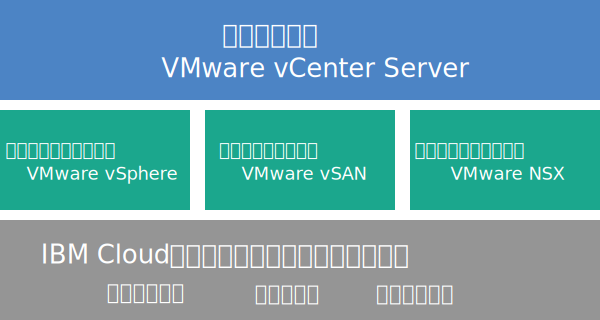

---

copyright:

  years:  2016, 2018

lastupdated: "2018-09-27"

---

# Cloud Foundation の概要

{{site.data.keyword.cloud}} の VMware Cloud Foundation を注文すると、VMware 環境全体が自動的にデプロイされます。 基本デプロイメントは、VMware Cloud Foundation スタックの事前インストールと構成が整った 4 つの {{site.data.keyword.cloud_notm}} {{site.data.keyword.baremetal_short}}で構成され、ソフトウェア定義による統合データ・センター (SDDC) プラットフォームが提供されます。 Cloud Foundation は、VMware Validated Design に基づくアーキテクチャーを使って、ネイティブ構成として VMware vSphere、VMware NSX、VMware Virtual SAN が統合されています。

## Cloud Foundation のアーキテクチャー

以下の図は、Cloud Foundation デプロイメントのアーキテクチャー全体とコンポーネントを示しています。

図 1. Cloud Foundation のアーキテクチャー

### 物理インフラストラクチャー

この層は、仮想インフラストラクチャーで使用する物理インフラストラクチャー (コンピュート、ストレージ、ネットワークのリソース) を提供します。

### 仮想化インフラストラクチャー (コンピュート、ストレージ、ネットワーク)

この層は、さまざまな VMware 製品を通して物理インフラストラクチャーを仮想化します。
* VMware vSphere は、物理コンピュート・リソースを仮想化します。
* VMware Virtual SAN (vSAN) は、物理サーバー内のストレージに基づいて、ソフトウェア定義による共有ストレージを提供します。
* VMware NSX は、論理ネットワーキング・コンポーネントと仮想ネットワークを提供するネットワーク仮想化プラットフォームです。

### 仮想化管理

この層は vCenter Server で構成されます。これは仮想化環境の管理層を表します。 使い慣れた同様の vSphere API 互換ツールとスクリプトを使用して、IBM がホストする VMware 環境を管理できます。

{{site.data.keyword.vmwaresolutions_short}} コンソール上で、ESXi サーバーの追加と削除の機能を使用して、インスタンスの容量を拡張したり縮小したりできます。 さらに、ホスト環境での更新の適用や VMware コンポーネントのアップグレードなどの、ライフサイクル管理機能も使用できます。

アーキテクチャーについて詳しくは、[ソリューションの概要](../archiref/solution/solution_overview.html)を参照してください。

## Cloud Foundation インスタンスの技術仕様

Cloud Foundation インスタンスには以下のコンポーネントが含まれます。

**注:** ハードウェア、ネットワーキング、仮想マシン、ストレージに課金される料金は、デプロイメントの対象として選択された {{site.data.keyword.CloudDataCent_notm}}に基づいて異なる場合があります。

### ベア・メタル・サーバー

以下のいずれかの構成の {{site.data.keyword.cloud_notm}} {{site.data.keyword.baremetal_short}}を注文できます。
*  **カスタマイズ型**: 選択した CPU モデルと RAM サイズの{{site.data.keyword.baremetal_short}}。   
   * 2-CPU Intel Broadwell 世代 (Intel Xeon E5-2600 v4 シリーズ)
   * 2-CPU Intel Skylake 世代 (Intel Xeon 4100/5100/6100 シリーズ)
**注:** vSAN ストレージを使用する場合は、{{site.data.keyword.baremetal_short}} 4 台の構成が必要です。
* **事前構成型**: 2-CPU Intel Broadwell 世代 (Intel Xeon E5-2600 v4 シリーズ)
  * **スモール** (Dual Intel Xeon E5-2650 v4 / 合計 24 コア、2.2 GHz / 128 GB RAM / 12 ディスク)
  * **ラージ** (Dual Intel Xeon E5-2690 v4 / 合計 28 コア、2.6 GHz / 512 GB RAM / 12 ディスク)

### ネットワーキング

以下のネットワーキング・コンポーネントが注文されます。
* 10 Gbps デュアル・ネットワーク・アップリンク (パブリックとプライベート)
* VLAN (仮想 LAN) 3 つ: パブリック VLAN 1 つとプライベート VLAN 2 つ
* アウトバウンド HTTPS 管理トラフィック用のセキュアな管理サービス VMware NSX Edge Services Gateway (ESG)。これは、管理ネットワーキング類型の一部として IBM によってデプロイされます。 この ESG は、IBM 管理仮想マシンが、自動化に関連する特定の外部 IBM 管理コンポーネントと通信するために使用します。 詳しくは、[管理サービス NSX Edge でセキュリティー・リスクが生じますか?](../vmonic/faq.html#does-the-management-services-nsx-edge-pose-a-security-risk-) を参照してください。

  **重要:** ユーザーは、この ESG にアクセスすることはできず、使用できません。 これに変更を加えると、{{site.data.keyword.vmwaresolutions_short}} コンソールから Cloud Foundation インスタンスを管理できなくなる可能性があります。 また、ファイアウォールを使用したり、外部 IBM 管理コンポーネントへの ESG 通信を無効にしたりすると、{{site.data.keyword.vmwaresolutions_short}} が使用できなくなります。

* 現行バージョンの VMware vSphere でサポートされる ESXi サーバーの既存クラスターがある場合は、EVC (Enhanced vMotion Compatibility) 機能が自動的に有効になります。 EVC は、クラスター内のすべての ESXi サーバーが同じ CPU 機能セットを仮想マシンに公開するようにして、クラスター内のすべての ESXi サーバーを vMotion 可能にします。 EVC を使用すると、ESXi サーバー上の実際の CPU が異なっていても、クラスター内の任意の ESXi サーバー間で仮想マシンを移行できます。

### 仮想サーバー・インスタンス

以下の VSI (仮想サーバー・インスタンス) が注文されます。
* Microsoft Active Directory (AD) とドメイン・ネーム・システム (DNS) サービス用に 1 つの VSI。 VSI はマルチサイト構成のサポートに必要です。 この VSI 仕様は、Windows 2012 R2 (8 GB RAM / 2 CPU コア/ 100 GB ディスク / デュアル 1 Gbps プライベート・アップリンク) です。
* IBM CloudBuilder の VSI。これは、インスタンスのデプロイメントが完了した後にシャットダウンされます。
* (Veeam on {{site.data.keyword.cloud_notm}} を注文する場合) Veeam バックアップ・サービス用に 1 つの VSI を注文します。

### ストレージ

選択した{{site.data.keyword.baremetal_short}}構成に応じて、以下のストレージを注文します。
* 2 台の 1 TB SATA ブート・ディスク
* 2 台の 960 GB SSD (ソリッド・ステート・ディスク) キャッシュ・ディスク
* RAID ディスク・コントローラー 1 つ
* **カスタマイズ型** 構成の場合のみ、要件に従って、ディスク・ドライブの数、ディスク・タイプ、ディスク容量を設定できます。 また、High-Performance Intel Optane オプションもあります。このオプションは、合計 10 個の容量ディスクに 2 つの追加の容量ディスク・ベイを提供します。 High-Performance Intel Optane オプションは、CPU モデルに応じて異なります。
* **事前構成型**、**スモール** 構成の場合のみ: 2 台の 1.9 TB SSD キャパシティー・ディスク
* **事前構成型**、**ラージ** 構成の場合のみ: 4 台の 3.8 TB SSD キャパシティー・ディスク

### ライセンス (IBM 提供または BYOL) と料金

* 4 つの VMware vSphere Enterprise Plus 6.5u1
* 4 つの VMware vCenter Server 6.5
* 4 つの VMware NSX Enterprise 6.3
* 4 つの VMware vSAN Advanced または Enterprise 6.6
* 4 つの SDDC Manager ライセンス (IBM 提供のみ)
* 4 つのサポートとサービスの料金

## Cloud Foundation 拡張ノードの技術仕様

Cloud Foundation 拡張ノードごとに、{{site.data.keyword.cloud_notm}} アカウントに以下のコンポーネントがデプロイされ、料金が発生します。

### 拡張ノード用のハードウェア

[Cloud Foundation インスタンスの技術仕様](../sddc/sd_cloudfoundationoverview.html#technical-specifications-for-cloud-foundation-instances)に示されている構成になっている、1 台の {{site.data.keyword.cloud_notm}} ベア・メタル・サーバー。

### 拡張ノード用のライセンスと料金

* VMware vSphere Enterprise Plus 6.5u1 1 つ
* 1 つの VMware vCenter Server 6.5
* 1 つの VMware NSX Enterprise 6.3
* 1 つの VMware vSAN Advanced または Enterprise 6.6
* 1 つの SDDC Manager ライセンス
* 1 つのサポートとサービスの料金

**重要:** {{site.data.keyword.cloud_notm}} アカウントで作成した {{site.data.keyword.vmwaresolutions_short}} コンポーネントは、{{site.data.keyword.vmwaresolutions_short}} コンソールから管理する必要があります。{{site.data.keyword.slportal}}やその他の手段でコンソール以外から管理することはできません。 {{site.data.keyword.vmwaresolutions_short}} コンソール以外で変更した場合、変更がコンソールと同期されません。

**注意:** インスタンスを注文したときに {{site.data.keyword.cloud_notm}} アカウントにインストールされた {{site.data.keyword.vmwaresolutions_short}} コンポーネントを、{{site.data.keyword.vmwaresolutions_short}} コンソール以外で管理すると、環境が不安定になる可能性があります。 これには以下の管理アクティビティーが該当します。
*  コンポーネントの追加、変更、返却、または削除
*  ESXi サーバーの追加または削除によるインスタンス容量の拡張または縮小
*  コンポーネントのパワーオフ
*  サービスの再始動

   {{site.data.keyword.slportal}}での共有ストレージのファイル共有の管理は、上記アクティビティーに該当しません。 これには、共有ストレージのファイル共有の注文、削除 (マウントされている場合はデータ・ストアに影響する可能性があります)、承認、マウントなどのアクティビティーが含まれます。

### 関連リンク

* [Cloud Foundation ソフトウェアの部品構成表](sd_bom.html)
* [Cloud Foundation インスタンスの計画](sd_planning.html)
* [Cloud Foundation インスタンスの注文](sd_orderinginstance.html)
* [VMware vSphere ドキュメント・センター](https://pubs.vmware.com/vsphere-60/index.jsp){:new_window}
* [VMware NSX 6 Documentation Center](https://pubs.vmware.com/NSX-6/index.jsp){:new_window}
* [EVC and CPU Compatibility FAQ](https://kb.vmware.com/s/article/1005764)
