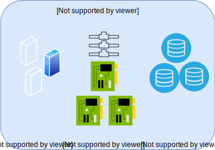

---

copyright:

  years:  2019

lastupdated: "2019-08-06"

keywords: vmware solutions shared, get started shared, tech specs shared

subcollection: vmware-solutions

---

{:external: target="_blank" .external}
{:tip: .tip}
{:note: .note}
{:important: .important}

# IBM Cloud for VMware Solutions Shared の概要
{: #shared_overview}

{{site.data.keyword.vmwaresolutions_full}} Shared は試験的オファリングとして提供されます。
{:note}

VMware 仮想データ・センターによって、VMware ワークロードを、プロフェッショナルに管理される VMware インフラストラクチャー上のクラウドに素早くそしてシームレスにマイグレーションまたはデプロイすることができます。IBM は、vCloud Director が {{site.data.keyword.cloud_notm}} 上で稼働している、セルフサービスでオンデマンドの VMware クラウド・コンピューティング・プラットフォームを提供します。この Infrastructure as a Service (IaaS) 従量制課金 (PAYG) オファリングにより、ユーザーは必要に応じて特定の vCPU、ストレージ、vRAM、ネットワーク、および IP を取り込むことができます。

{{site.data.keyword.vmwaresolutions_short}} には、以下の 3 つの「Infrastructure as a Service」(IaaS) サブスクリプション・サービス・タイプがあります。
- マルチテナント予約済み仮想データ・センター
- マルチテナント従量制課金 (PAYG) 仮想データ・センター
- シングル・テナント専用仮想データ・センター

お客様は、{{site.data.keyword.vmwaresolutions_short}} オファリングを使用して、仮想データ・センターのライフサイクルを管理します。以下の機能は、Web UI またはパブリック API のいずれかによりサポートされます。
- 仮想データ・センターの作成
- 仮想データ・センターの柔軟性
- 仮想データ・センターの削除
- VMware サービスの追加と削除
- オンデマンド Windows ライセンス交付
- オンデマンド Red Hat ライセンス交付

3 つの {{site.data.keyword.cloud_notm}} 仮想データ・センターのオファリングはすべて、5 つのパブリック IP アドレスが NSX Edge Service Gateway 上に標準で設定され、パブリック・ネットワークでの無制限の受信が可能です。

仮想データ・センターでは、以下のコンポーネントの料金が発生します。
- ストレージのパフォーマンスに基づく階層化価格設定でのストレージ割り振り
- 仮想 CPU 使用率
- 仮想メモリー使用量
- パブリック・ネットワーキングの出口
- 使用する商用オペレーティング・システム・ライセンス
- オプションの VMware サービス

## IBM Cloud for VMware Solutions Shared のアーキテクチャー
{: #shared_overview-archi}

次の図は、{{site.data.keyword.vmwaresolutions_short}} Shared デプロイメントのアーキテクチャーとコンポーネントの全体像を示しています。

### VMware vCloud Director
{: #shared_overview-vcloud-dir}

この層は、管理インターフェースを表します。VMware® vCloud Director は、Web ベースのテナント・ポータルに対する役割ベースのアクセス権限を提供します。これにより、組織のメンバーは組織のリソースと対話して、vApps および仮想マシン (VM) を作成および処理することができます。

### 組織
{: #shared_overview-org}

組織は、ユーザー、グループ、およびコンピューティング・リソースのための管理単位です。ユーザーは、そのユーザーの作成時またはインポート時に組織管理者によって確立された資格情報を提供して、組織レベルで認証を行います。組織管理者は、組織のユーザー、グループ、およびカタログを管理します。

### ユーザーおよびポリシー
{: #shared_overview-users-policies}

組織には任意の数のユーザーおよびグループを含めることができます。ユーザーは、組織管理者がローカルに作成することも、LDAP などのディレクトリー・サービスからインポートすることもできます。組織内での許可は、ユーザーとグループに対する権限と役割の割り当てによって制御されます。

### カタログ
{: #shared_overview-cat}

組織はカタログを使用して vApp テンプレートとメディア・ファイルを保管します。カタログへのアクセス権限を持つ組織のメンバーは、カタログの vApp テンプレートとメディア・ファイルを使用して独自の vApp を作成できます。組織管理者は、パブリック・カタログから組織カタログに項目をコピーすることができます。

### 仮想データ・センター
{: #shared_overview-vc}

組織の仮想データ・センターは、組織にリソースを提供します。仮想データ・センターは、仮想システムを保管、デプロイ、および操作するための環境を提供します。また、仮想 CD および DVD メディアのためのストレージも提供します。1 つの組織が複数の仮想データ・センターを持つこともできます。

## IBM Cloud for VMware Solutions Shared の技術仕様
{: #shared_overview-specs}

以下のコンポーネントが {{site.data.keyword.cloud_notm}} に含まれています。

### コンピュート
{: #shared_overview-specs-comp}

コンピュート処理は、仮想 CPU (vCPU) の増分ごとに仮想データ・センターに割り振られます。各 vCPU の増分は、単一の 2.0 GHz コアを表します。コンピュート・メモリーは GB の増分ごとに割り振られます。

### ネットワーキング
{: #shared_overview-specs-net}

デフォルトで、すべての仮想データ・センターには、5 つのパブリック IP アドレスのある 1 つのエッジ・ゲートウェイおよび 1 つのプライベート・サービス IP アドレスが構成されています。お客様はエッジ・ゲートウェイを構成してカスタマイズすることができます。

パブリック・アドレスは、インバウンドまたはアウトバウンドのインターネット・トラフィック用に、パブリック対応の vApp で使用できます。

サービス・アドレスは、IBM Cloud 内部プライベート・ネットワーク上の IBM Cloud インフラストラクチャー・サービスにアクセスするために使用できます。これには以下のサービスが含まれます。
- NTP
- Windows OS のライセンス交付および更新
- Red Hat OS のライセンス交付および更新
- Cloud Object Storage

### ストレージ
{: #shared_overview-specs-storage}

vApp または VM を作成またはデプロイするとき、ストレージ・ポリシーが選択されます。必要なストレージ・パフォーマンスに応じて、4 つの異なるストレージの層が使用可能です。

- NFS Platinum: 最大スループットが 10 IOPS/GB のストレージ層 (最高パフォーマンス)
- NFS Gold: 最大スループットが 4 IOPS/GB のストレージ層
- NFS Silver: 最大スループットが 2 IOPS/GB のストレージ層
- NFS Bronze: 最大スループットが 0.25 IOPS/GB のストレージ層

## 関連リンク
{: #shared_overview-related}

* [Shared On-demand の注文](/docs/services/vmwaresolutions/services?topic=vmware-solutions-shared_ordering_ondemand)
* [Shared Reserved の注文](/docs/services/vmwaresolutions/services?topic=vmware-solutions-shared_ordering_reserved)
* [{{site.data.keyword.cloud_notm}} for VMware Solutions Shared の管理](/docs/services/vmwaresolutions/services?topic=vmware-solutions-shared_managing)
* [VMware vCloud Director](https://docs.vmware.com/en/vCloud-Director/9.7/com.vmware.vcloud.tenantportal.doc/GUID-74C9E10D-9197-43B0-B469-126FFBCB5121.html){:external}
