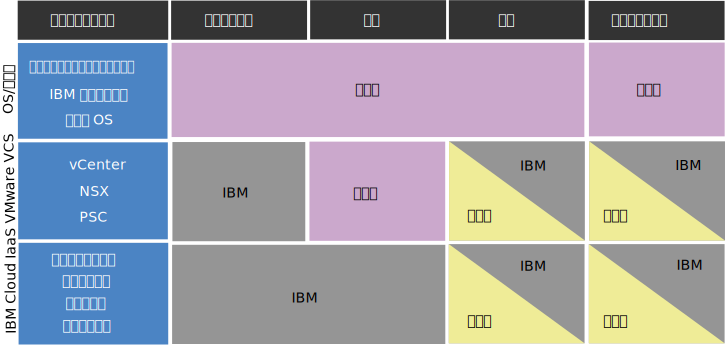

---

copyright:

  years:  2016, 2019

lastupdated: "2019-03-12"

---

{:tip: .tip}
{:note: .note}
{:important: .important}

# vCenter Server インスタンスのコンプライアンス情報
{: #vc_compl_info}

VMware vCenter Server インスタンスのコンプライアンスに関する詳細情報を以下に示します。

HIPAA のお客様には、VMware vCenter Server on {{site.data.keyword.cloud_notm}} with NSX-T オファリングはサポート対象外です。
{:important}

## vCenter Server on IBM Cloud に関するお客様の責任と IBM の責任
{: #vc_compl_info-responsibility}

以下の図は、コンプライアンス・アクティビティーに関するお客様と IBM の責任に関する詳細を示しています。

図 1. vCenter Server on IBM Cloud に関するお客様の責任と IBM の責任を示す図

## 医療データの制約事項
{: #vc_compl_info-health-data-restrictions}

このセクションの用語は、{{site.data.keyword.vmwaresolutions_full}} ポートフォリオ全体に適用されます。

### HIPAA
{: #vc_compl_info-hipaa}

1996 年制定の「医療保険の相互運用性と説明責任に関する法令」(HIPAA) や、このクラウド・サービスで医療情報および医療データを「個人データの一種」および「特殊な分類の個人データ」(総称して「医療データ」) として使用するための条件についてこのクラウド・サービスのデータ・シートに記載している情報にかかわらず、このクラウド・サービスで医療データを使用する場合は、以下の制限事項および条件が適用されます。

{{site.data.keyword.vmwaresolutions_short}}

上記のオファリングは、お客様がクラウド・サービスで医療データを使用することを IBM に事前に通知し、IBM がクラウド・サービスを医療データ用にプロビジョニングすることを書面で表明した場合に限り、医療データに使用する HIPAA のプライバシーおよびセキュリティーの規則の制御を実装するためにプロビジョニングされます。 したがって、次の条件を満たさない限り、HIPAA で保護される医療データの伝送、保管、またはその他の用途にクラウド・サービスを使用することはできません。その条件とは、 (i) お客様が IBM に用途を通知し、(ii) IBM とお客様が適用される事業提携契約 (BAA) を締結し、(iii) IBM がお客様にクラウド・サービスを医療データに使用できることを書面で明確に表明することです。 いかなる場合も、HIPAA が意味する範囲内の医療情報センターとして PHI を処理するためにクラウド・サービスを使用してはいけません。

システム障害が発生した場合に、サード・パーティーのサービス・プロバイダーがお客様にデバッグ成果物 (ログやコア・メモリー・ダンプなど) を要求することがあります。 そのような成果物を収集してサード・パーティー・プロバイダーに送信することについては、お客様が単独で責任を負います。 IBM サポート・チームが資料へのリンクを提供したり、画面共有セッションで指示を与えたりして支援することがあります。 しかし、送信前に PHI データをクレンジングして適切に暗号化することは、お客様の責任です。 また、データを送信する前にサード・パーティー・プロバイダーと BAA (提携事業者契約）を締結する必要があるかどうかを評価するのもお客様の責任です。

## 個人情報および規制対象データ
{: #vc_compl_info-personal-info-and-regulated-data}

このクラウド・サービスは、個人情報や個人の機密情報などの規制対象コンテンツのための特定のセキュリティー要件に即して設計されているものではありません。 お客様は、お客様がクラウド・サービスに関連して使用するコンテンツのタイプについて、本クラウド・サービスがお客様のニーズを満たすものかどうか判断する責任を負います。

## お客様のインスタンスへのアクセスに関するポリシー
{: #vc_compl_info-policy-for-access-client-inst}

VMware vCenter Server の環境が、{{site.data.keyword.vmwaresolutions_short}} として提供され、お客様が仮想化機能を管理するための VMware 管理プラットフォーム層になります。 お客様の確実な成功を支援するためには、IBM Cloud for VMware の製品とサービスのライフサイクル全体を通じて IBM サポートが必要になる可能性があります。 ほとんどの場合、IBM サポートが介入するのは、お客様の要求 (つまりサポート・チケット) に対する結果としてです。 しかし、まれに、お客様がサポート・チケットを作成していないのに、将来の問題を防ぐために IBM サポートが事前対応的な支援を行うことがあります。 このアクセスは、IBM Cloud の内部サポート・ネットワークによって行われ、IBM サポートによって開かれたサポート・チケットに記録され、IBM Cloud SOC によって継続的にモニターされます。 事前にお客様の同意を得ることなく IBM サポートがインスタンス構成を変更することはありません。 アクセスは VMware 管理コンポーネントや IBM Cloud 管理コンポーネントに対するものであり、お客様の仮想マシンやアプリケーションにアクセスすることは決してありません。

## 事前対応サポート
{: #vc_compl_info-proactive-support}

### 初期プロビジョニングのための事前対応サポート
{: #vc_compl_info-proactive-support-for-initial-provision}

* インスタンスまたはサービスを最初に注文してプロビジョニングするときに、IBM サポートが、注文を適切に履行するために、事前に通知せずにお客様のインスタンスと情報にアクセスすることがあります。
* IBM サポートは、注文、プロビジョニング、インストールのプロセスのほかにも、新規ホストの追加などのインスタンスのライフサイクル操作を積極的にモニターします。
* 発生した問題や今後発生する可能性がある問題を解決するために、IBM サポートは、提供されたお客様の IBM Cloud ユーザー名と API 鍵を使用して、お客様の注文の詳細の確認、自動化ジョブの再始動、オペレーティング・システムの再ロード操作の実行、IBM Cloud チケットのオープンを含む (ただしこれらに限定されない) いくつかの操作を実行することがあります。

### 通常時の操作のための事前対応サポート
{: #vc_compl_info-proactive-support-for-steady-state-operations}

* まれではありますが、通常時の操作の中でインスタンスの問題を事前対応的にトラブルシューティングしたり、プロビジョンしたサービスまたはコンポーネントの機能を検証したりするために、IBM サポートがお客様のインスタンスにアクセスする必要がある場合があります。
* このアクセスは、IBM Cloud の内部サポート・ネットワークによって行われます。 事前にお客様の同意を得ることなく IBM サポートがインスタンス構成を変更することはありません。
* アクセスは VMware 管理コンポーネントや IBM Cloud 管理コンポーネントに対するものであり、お客様の仮想マシンやアプリケーションにアクセスすることは決してありません。

### サポート・チケット
{: #vc_compl_info-support-tickets}

* vCenter Server の環境を、IBM は積極的にはモニターしないので、お客様がサポート・チケットを作成しなければ、IBM サポートが通常操作で VMware 管理層に入ることはありません。
* お客様がインスタンス、サービス、またはプロビジョニングの問題に関するサポート・チケットを開いた場合は、ただちに適切な IBM サポート・チームにチケットが割り当てられ、そのチームが第一関係者として問題を解決する責任を負います。
* チーム・レベルで高度な技術的専門知識を維持するためには、専門性のレベルにもよりますが、特定のソフトウェアの問題を解決するのに複数のサポート・チームの関与が必要になる場合があります。 IBM のサポート・チームの間には完全なネットワークが作られているのでこれは簡単です。どのような問題が発生しても 1 つのチームとして解決に取り組むことができます。
* 問題を調査するために、IBM がお客様のシステム上にある障害関連の情報にアクセスしたり、詳しい情報を得るために障害を再現したりする必要がある場合があります。
* お客様がサポート・チケットを作成すれば、調査、デバッグ、優先順位付けのために IBM サポートが VMware 管理層にアクセスすることをお客様が承認することになります。 保守のための停止や環境の変更が必要になった場合、IBM サポートは、変更管理プロセスの一環として、新たにチケットを介してお客様に書面による確認を要求します。
* サポート・チケットについて詳しくは、[Software Support Handbook](https://www-304.ibm.com/support/customercare/sas/f/handbook/getsupport.html) と [IBM サポートへのお問い合わせ](/docs/services/vmwaresolutions/vmonic?topic=vmware-solutions-trbl_support)を参照してください。

## お客様の責任
{: #vc_compl_info-client-responsibilities}

* IBM はお客様に環境のセキュリティーを強化する対策を取るようにお勧めしていますが、対策によっては IBM Cloud for VMware の機能に悪影響を与えるものもあることに注意する必要があります。
* お客様が作成したファイアウォールと、その結果として IBM Cloud for VMware コンポーネント間の通信に生じる制約については、お客様が責任を負います。 このようなファイアウォールにより、IBM サポートがお客様のインスタンスにアクセスして問題を解決することができなくなる場合もあります。
* お客様のシステム内のデータの暗号化については、お客様が全責任を負います。
* 最初のデプロイメントのときに、オファリングの自動化とお客様のアカウントは分離されます。 お客様は、ポータルで IBM から提供されたすべてのパスワードを変更できます。また、変更することをお勧めします。
* vCenter のアクセス権と資格情報は、最初のデプロイメントのときに作成され、お客様に提供されます。 IBM サポートは、ライフサイクル管理やお客様へのサポートを提供するために、オファリングの要件の一部として、管理層へのフルアクセス権限を保持する必要があります。
* いつでもパスワードなどの資格情報が変更された場合は、IBM サポートが、喪失した資格情報を復旧するためにお客様を支援することも、お客様の環境をトラブルシューティングすることもできなくなる可能性があります。
* この問題の重要性や関連する懸案事項について詳しくは、[NSX コンポーネントのパスワードを変更する際の考慮事項](/docs/services/vmwaresolutions/vcenter?topic=vmware-solutions-vc_networkingonvcenterserver#considerations-when-changing-passwords-for-nsx-components)と [vCenter Server 成果物の変更に関する考慮事項](/docs/services/vmwaresolutions/vcenter?topic=vmware-solutions-vcenter_chg_impact)を参照してください。

### 通信とトラブルシューティング
{: #vc_compl_info-communication-troubleshooting}

* IBM は自社の製品に欠陥がないことを保証はしませんが、設計どおり機能するように製品を修正する努力をします。 この修正において、お客様は大きな役割を果たします。
* IBM サポートは製品のライフサイクル全体を通じて支援を提供できますが、お客様から提供される情報やアクセス権によってサポートが制限される場合があります。
* お客様には、障害発生時に詳細な文書を提供し、さらなる情報が必要な場合は IBM サポートに適時に対応する責任があります。
* お客様には、本資料に記載されているガイドラインに従って、事前対応サポートに同意する責任もあります。
* お客様が同意を拒否したり、提供されたガイドラインに従わなかったりして、お客様とサポート・チームの連絡が遅れたために問題解決が遅れた場合は、お客様がその責任を負います。
* お客様は IBM サポートがそれ以外に行う追加の技術的なトラブルシューティングを実行できるように準備する必要があります。 IBM は、必要に応じて適切な資料と支援を提供します。

### セキュリティー指標
{: #vc_compl_info-security-measures}

* クラウド・サービスの管理: 基礎のミドルウェアを含め、アプリケーションの管理、運用、保守およびセキュリティーの操作については、お客様が責任を負います。
* サービスの完全性および可用性: IBM は、このクラウド・サービスについて検出されたすべてのネットワーク侵入通知をお客様に転送します。 報告された各通知の影響を確認することについては、お客様が責任を負います。 ハードウェア障害もお客様に通知されます。 OS またはソフトウェアの障害を監視し、(必要に応じて IBM サポートを利用して) 対応することについては、お客様が責任を負います。
* アクティビティーの記録: 必要な場合に OS、システムおよびデータベース、アプリケーションのアクティビティーを記録することについては、お客様が責任を負います。
* 暗号化: 必要に応じて (保存データと転送中のデータの両方について) すべての暗号化を構成して管理することについては、お客様が責任を負います。
* 事業継続性および災害復旧: 必要に応じて、すべての事業継続性と災害復旧のプロセスを構成して管理することについては、お客様が責任を負います。

### サード・パーティー・サービス
{: #vc_compl_info-third-party-services}

* IBM オファリングには、サード・パーティーのソフトウェアやコードが付属しているものがあります。 そのようなコードは、お客様の利便性のために含まれていますが、IBM プログラムの一部とは見なされません。
* そのような IBM 以外のプログラムのライセンスは、それぞれのプロバイダーから直接交付されます。 お客様は、プロバイダーの契約条件に従って IBM 以外のプログラムの使用に同意します。 そのような条件は、購入時に IBM オファリングに付属する IBM の使用条件に含まれた形で提供されます。
* IBM は、サード・パーティー製品が IBM プログラムと連携して適切に機能することを確認するためにテストを行います。
* IBM ソフトウェア・サポートは、IBM オファリングがサード・パーティー・ソフトウェアと連携する方法に関する情報を活用して、お客様の問題に関する問題診断を行います。 IBM プログラムが正しく機能するという結論が出ているにもかかわらず、引き続き問題が存在している場合は、IBM はさらに診断するためにお客様をサード・パーティー・ベンダーに照会する必要があります。
* サード・パーティーのソフトウェアやコードに関するお客様の責任について詳しくは、[Software Support Handbook](https://www-304.ibm.com/support/customercare/sas/f/handbook/policies.html) を参照してください。

## お客様の環境へのアクセスの同意
{: #vc_compl_info-consent-to-access-client-environment}

* IBM サポートは、適切なプロビジョニングと維持を確実に行うために、お客様のインスタンスにアクセスする必要があります。 必要なアクセス権を管理および提供することについては、お客様が責任を負います。
* お客様がサポート・チケットを作成すれば、そのサポート・チケットに記載された問題に対処するために IBM サポートがお客様のインスタンスにアクセスすることについて、お客様が承認し、同意したことになります。
* お客様には、この資料に記載したガイドラインに従って、事前対応サポートに同意する責任があります。 お客様が同意を拒否したり、提供されたガイドラインに従わなかったりして、お客様とサポート・チームの連絡が遅れたために問題の診断と解決が遅れたり、追加の技術的トラブルシューティングが必要になったりした場合は、お客様がその責任を負います。

## 初期プロビジョニング
{: #vc_compl_info-initial-provision}

* 最初のプロビジョニングと注文の際に、お客様に本資料が提示されます。
* 注文を送信することで、お客様はこれらの条件に同意することになります。つまり、環境に関する問題を迅速に解決したり将来の障害を防止したりするために IBM サポートが事前通知なしでいつでもお客様のインスタンスにアクセスすることに同意します。
* この同意は、現在注文中のすべてのインスタンスに対してライフサイクル全体を通して適用されます。 将来、インスタンスやインスタンス・コンポーネントをプロビジョンするときには、新たに同意が必要になる可能性があります。

## 通常時の操作
{: #vc_compl_info-steady-state-operations}

最初のプロビジョニングと注文の際に、インスタンスの事前対応サポートにお客様が同意しなかった場合、それ以降にサービス・チケットが必要になったときには、同意することを明示的に記載する必要があります。 同意の記述は、規定のガイドラインに従っている必要があります。従っていないと、無効と見なされます。

## 関連リンク
{: #vc_compl_info-related}

* [vCenter Server の概要](/docs/services/vmwaresolutions/vcenter?topic=vmware-solutions-vc_vcenterserveroverview)
* [IBM サポートへのお問い合わせ](/docs/services/vmwaresolutions/vmonic?topic=vmware-solutions-trbl_support)
