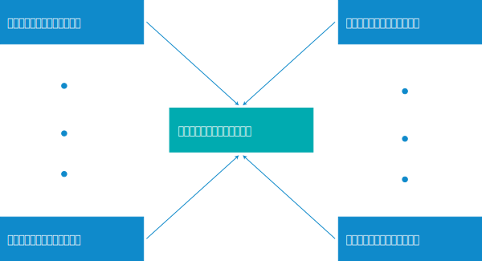

---

copyright:

  years:  2016, 2018

lastupdated: "2018-05-23"

---

# vCenter Server with Hybridity Bundle インスタンスのマルチサイト構成

{{site.data.keyword.vmwaresolutions_full}} を使用すると、短時間でインスタンスをさまざまな場所にデプロイして稼働させることができます。

<!--* You cannot link between VMware Cloud Foundation and VMware vCenter Server instances in a multi-site configuration.-->

## マルチサイト・デプロイメントのコンポーネント

マルチサイト・デプロイメントは、以下のコンポーネントで構成されます。

* **プライマリー・インスタンス**: vCenter Server with Hybridity Bundle プライマリー・インスタンスの構成は次のとおりです。
  *  Microsoft Active Directory (AD) および DNS (ドメイン・ネーム・システム) ルート・ドメイン
  *  vCenter Server サブドメイン
  *  SSO (シングル・サインオン) ドメイン
  *  SSO サイト名
* **セカンダリー・インスタンス**: プライマリー・インスタンスにリンクされた 1 つ以上の vCenter Server with Hybridity Bundle セカンダリー・インスタンス。構成は次のとおりです。
   *  SSO サイト名
   *  プライマリー・インスタンスのルート・ドメインにリンクされた DNS サブドメイン
   *  プライマリー・インスタンスとセカンダリー・インスタンスの AD 仮想マシン間にセットアップされた DNS および AD のレプリケーション。
   *  プライマリー・インスタンスの PSC (Platform Services Controller) と複製するためにデプロイされ、構成された PSC
   *  セカンダリー・インスタンスの VMware vCenter には、プライマリー・インスタンスの vCenter との拡張リンク・モードがセットアップされます

## vCenter Server with Hybridity Bundle のマルチサイト・デプロイメント

マルチサイト構成機能では、1 つのプライマリー・サイトおよび最大 7 つのセカンダリー・サイトから成る、ハブ・アンド・スポーク・トポロジーを使用します。 サポートされるのは単一層のサイトであるため、他のセカンダリー・サイトにリンクされた後続のサイトは構成できません。 マルチサイト構成では、すべてのインスタンスにわたって、ESXi サーバーを合計 128 台使用できます。

**注**: 128 台を超える ESXi サーバーのマルチサイト・デプロイメントが必要な構成を使用する場合は、IBM サポートにお問い合わせください。 詳しくは、[IBM サポートへのお問い合わせ](../vmonic/trbl_support.html)を参照してください。

次の図は、vCenter Server with Hybridity Bundle のマルチサイト・デプロイメントの全体像を示しています。

図 1. vCenter Server with Hybridity Bundle のマルチサイト・デプロイメント

このモデルには以下の層が含まれています。

* **プライマリー・インスタンス**: マルチサイト構成では、最初のインスタンスをデプロイするために、インスタンスの注文プロセス時にそのインスタンスをプライマリーとして定義します。
* **セカンダリー・インスタンス**: マルチサイト構成では、注文プロセス時に、プライマリー・インスタンスに接続するインスタンスをセカンダリー・インスタンスとして定義します。

プライマリー・インスタンスには、セカンダリー・インスタンスを一度に 1 つのみ割り当てることができます。 プライマリー・インスタンスに複数のセカンダリー・インスタンスを同時に割り当てることはできません。 複数割り当てるには、注文プロセスを再度実行して、前に定義したプライマリー・インスタンスをセカンダリー・インスタンスのプライマリー・インスタンスとして選択する必要があります。 作成するすべてのセカンダリー・インスタンスについて、この処理を繰り返す必要があります。

マルチサイト構成では、最大 8 つのインスタンス (プライマリー・インスタンス 1 つとセカンダリー・インスタンス 7 つ) をデプロイできます。

**注**: マルチサイト構成に含まれている vCenter Server with Hybridity Bundle インスタンスを削除するには、特別な計画が必要です。 詳しくは、[マルチサイト構成の vCenter Server with Hybridity Bundle インスタンスの削除](vc_hybrid_deletinginstance_multi.html)を参照してください。

## 関連リンク

* [NSX Manager へのプライマリ ロールの割り当て](https://pubs.vmware.com/NSX-62/topic/com.vmware.nsx-cross-vcenter-install.doc/GUID-44E8AE16-BA3F-4DD9-B582-FC1E137E6CFC.html){:new_window}
* [セカンダリ NSX Manager の設定](https://pubs.vmware.com/NSX-62/topic/com.vmware.nsx-cross-vcenter-install.doc/GUID-9E48BC57-15E3-49C7-8BC5-F94ED8918BBE.html){:new_window}
* [AD trusts supported with vCenter Single Sign-On](https://kb.vmware.com/kb/2064250){:new_window}
* [Securely connect your private VMware workloads in the IBM Cloud](https://www.ibm.com/developerworks/library/se-securely-connect-private-vmware-workloads-ibm-cloud/index.html){:new_window}
