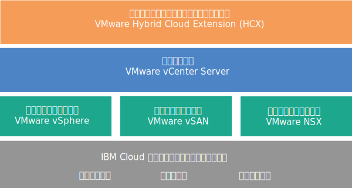

---

copyright:

  years:  2016, 2019

lastupdated: "2019-05-02"

subcollection: vmware-solutions

---

{:tip: .tip}
{:note: .note}
{:important: .important}

# vCenter Server with Hybridity Bundle の概要
{: #vc_hybrid_overview}

VMware vCenter Server on {{site.data.keyword.cloud}} with Hybridity Bundle は、V2.3 以降のリリースで使用可能なインスタンスです。 V2.6 以降では、ビジネス・パートナーが vCenter Server with Hybridity Bundle インスタンスを使用できます。

vCenter Server with Hybridity Bundle は、VMware vSphere スタックをサービスとして提供するホステッド・プライベート・クラウドです。 この VMware 環境は、最少 4 台の {{site.data.keyword.cloud_notm}} {{site.data.keyword.baremetal_short}}上に構築され、専用ストレージとして VMware vSAN を使用し、VMware NSX で実装された管理しやすい論理エッジ・ファイアウォールのデプロイメントと構成が自動で実行されます。また、VMware HCX on {{site.data.keyword.cloud_notm}} サービスが含まれています。

多くの場合、環境全体を 1 日以内でプロビジョンできます。また、このベア・メタル・インフラストラクチャーのコンピュート能力は、必要に応じて迅速かつ伸縮自在に拡張や縮小ができます。

vSAN クラスターの vSAN ベース・ストレージの容量を増やすには、デプロイメント後に ESXi サーバーをさらに追加します。

VMware NSX Advanced エディションを Enterprise エディションにアップグレードできます。VMware vRealize Operations などの追加の VMware コンポーネントも購入できます。

仮想化、ゲスト OS、アプリケーション層の日常業務と保守業務から解放されたい場合は、IBM Managed Services を追加できます。 クラウドの利用をすぐに開始できるように移行、実装、計画、オンボーディングのサービスを提供してお客様を支援する、{{site.data.keyword.cloud_notm}} プロフェッショナル・サービス・チームも用意されています。

## vCenter Server with Hybridity Bundle アーキテクチャー
{: #vc_hybrid_overview-archi}

次の図は、3 ノードの vCenter Server with Hybridity Bundle デプロイメントのアーキテクチャーとコンポーネントの全体像を示しています。

### 物理インフラストラクチャー
{: #vc_hybrid_overview-physical-infras}

この層は、仮想インフラストラクチャーで使用する物理インフラストラクチャー (コンピュート、ストレージ、ネットワークのリソース) を提供します。

### 仮想化インフラストラクチャー (コンピュート、ストレージ、ネットワーク)
{: #vc_hybrid_overview-virtualization-infras}

この層は、さまざまな VMware 製品を通して物理インフラストラクチャーを仮想化します。
* VMware vSphere は、物理コンピュート・リソースを仮想化します。
* VMware Virtual SAN (vSAN) は、物理サーバー内のストレージに基づいて、ソフトウェア定義による共有ストレージを提供します。
* VMware NSX は、論理ネットワーキング・コンポーネントと仮想ネットワークを提供するネットワーク仮想化プラットフォームです。

### 仮想化管理
{: #vc_hybrid_overview-virtualization-mgmt}

この層は、Platform Services Controller (PSC) が組み込まれた vCenter Server Appliance (vCSA)、NSX Manager、NSX ESG 2 つ、NSX Controller 3 つ、IBM CloudDriver 仮想サーバー・インスタンス (VSI) で構成されます。 CloudDriver VSI は、環境へのホストの追加などの特定の操作のために必要に応じてオンデマンドでデプロイします。

基本オファリングでは、最大 400 台のホストと最大 4000 個の VM が存在する環境をサポートできる規模の vCenter Server アプライアンスがデプロイされます。 vSphere API と互換性のある同じツールとスクリプトを使用して、IBM がホストする VMware 環境を管理できます。

合計で、基本オファリングには、仮想化管理層用に予約される 38 個の vCPU と 67 GB の vRAM が必要です。 VM 用の残りのホスト容量は、オーバーサブスクリプション率、VM サイジング、ワークロードのパフォーマンス要件などのいくつかの要因によって決まります。

HCX on {{site.data.keyword.cloud_notm}} サービスのデプロイ時の追加の管理リソース要件については、[VMware HCX on {{site.data.keyword.cloud_notm}} の概要](/docs/services/vmwaresolutions?topic=vmware-solutions-hcx_considerations#hcx_considerations)を参照してください。

### インフラストラクチャーのハイブリッド化
{: #vc_hybrid_overview-infras-hybrid}

この層は、オンプレミス・サイトと {{site.data.keyword.cloud_notm}} サイトの間でリソースを抽象化する役割を果たします。その結果、VM の特性 (IP アドレスなど) を変更しなくても両サイト間でワークロードを安全かつ簡単に移動できるようになります。

VMware Hybrid Cloud Extension (HCX) に基づいてオンプレミス・サイトと {{site.data.keyword.cloud_notm}} サイトの間に疎結合の相互接続を作成すれば、ダウン時間なしでの VM の一括マイグレーションや VM のライブ vMotion が可能になります。

## vCenter Server with Hybridity Bundle インスタンスの技術仕様
{: #vc_hybrid_overview-specs}

vCenter Server with Hybridity Bundle インスタンスには、以下のコンポーネントが含まれています。

標準化されたハードウェア構成の使用可否と価格は、デプロイメントに選択した {{site.data.keyword.CloudDataCent_notm}}によって異なる場合があります。
{:note}

### ベア・メタル・サーバー
{: #vc_hybrid_overview-bare-metal}

以下のいずれかの構成で{{site.data.keyword.baremetal_short}}を 4 つ以上注文できます。
  * **Skylake**: 選択した CPU モデルおよび RAM サイズの 2 CPU Intel Skylake 世代サーバー (Intel Xeon 4100/5100/6100 シリーズ)。
  * **Broadwell**: 選択した CPU モデルおよび RAM サイズの 4 CPU Intel Broadwell 世代サーバー (Intel Xeon E7-4800 シリーズ)。

### ネットワーキング
{: #vc_hybrid_overview-networking}

以下のネットワーキング・コンポーネントが注文されます。
*  10 Gbps デュアル・ネットワーク・アップリンク (パブリックとプライベート)
*  VLAN (仮想 LAN) 3 つ: パブリック VLAN 1 つとプライベート VLAN 2 つ
*  レイヤー 2 (L2) ネットワークに接続されたローカル・ワークロード間で実行される可能性のある東西通信用の DLR (分散論理ルーター) を備えた VXLAN (仮想拡張可能 LAN) 1 つ。 この VXLAN は、サンプルのルーティング・トポロジーとしてデプロイされるので、変更したり、作成の基礎として使用したり、削除したりできます。 また、DLR の新しい論理インターフェースに追加の VXLAN を接続してセキュリティー・ゾーンを追加することもできます。
*  以下の 2 つの VMware NSX Edge Services Gateway
  * アウトバウンド HTTPS 管理トラフィック用のセキュアな管理サービス VMware NSX Edge Services Gateway (ESG)。これは、管理ネットワーキング・トポロジーの一部として IBM がデプロイします。 この ESG は、IBM 管理 VM が、自動化に関連する特定の外部 IBM 管理コンポーネントと通信するために使用します。 詳しくは、[ユーザー管理の ESG を使用するためのネットワークの構成](/docs/services/vmwaresolutions/vcenter?topic=vmware-solutions-vc_esg_config#configuring-your-network-to-use-the-customer-managed-nsx-esg-with-your-vms)を参照してください。

    ユーザーは、この ESG にアクセスすることはできず、使用できません。 これを変更すると、{{site.data.keyword.vmwaresolutions_short}} コンソールから vCenter Server with Hybridity Bundle インスタンスを管理できなくなる可能性があります。 また、ファイアウォールを使用したり、外部 IBM 管理コンポーネントへの ESG 通信を無効にしたりすると、{{site.data.keyword.vmwaresolutions_short}} が使用不可になります。
    {:important}
  * アウトバウンドとインバウンドの HTTPS ワークロード・トラフィック用のユーザー管理のセキュアな VMware NSX Edge Services Gateway。これは、VPN アクセスまたはパブリック・アクセスを提供するためにユーザーが変更可能なテンプレートとして IBM がデプロイします。 詳しくは、[ユーザー管理の NSX Edge にはセキュリティーのリスクがありますか?](/docs/services/vmwaresolutions/vmonic?topic=vmware-solutions-faq#faq-customer-nsx) を参照してください。

HCX on {{site.data.keyword.cloud_notm}} サービスのデプロイ時に注文するネットワーキング・コンポーネントについて詳しくは、[HCX on {{site.data.keyword.cloud_notm}} の概要](/docs/services/vmwaresolutions?topic=vmware-solutions-hcx_considerations#hcx_considerations)を参照してください。

### 仮想サーバー・インスタンス
{: #vc_hybrid_overview-vsi}

以下の仮想サーバー・インスタンス (VSI) が注文されます。
* IBM CloudBuilder の VSI。これは、インスタンスのデプロイメントが完了した後にキャンセルされます。
* Microsoft Active Directory (AD) 用に 1 つの Microsoft Windows Server VSI をデプロイするか、管理クラスターに 2 つの高可用性 Microsoft Windows VM をデプロイしてセキュリティーと堅牢性を強化するかを選択できます。

### vSAN ストレージ
{: #vc_hybrid_overview-vsan-storage}

vSAN ストレージでは構成をカスタマイズできます。ディスクのタイプと数にも多様なオプションがあります。
* ディスクの数: 2、4、6、8。
* ストレージ・ディスク: 960 GB SSD SED、1.9 TB SSD SED、3.8 TB SSD SED。

  さらに、ホストごとに 960 GB のキャッシュ・ディスクが 2 つ注文されます。
* High-Performance Intel Optane オプション。合計 12 個の容量ディスクに 2 つの追加の容量ディスク・ベイが提供されます。 このオプションは CPU モデルに応じて異なります。

### IBM 提供のライセンスおよび料金
{: #vc_hybrid_overview-license-and-fee}

vCenter Server with Hybridity Bundle インスタンスの注文には、以下のライセンスが含められます。

* VMware vSphere Enterprise Plus 6.5u2 または 6.7u1
* VMware vCenter Server 6.5
* VMware NSX Service Providers Edition (Advanced または Enterprise) 6.4
* VMware vSAN (Advanced または Enterprise) 6.6

追加のサポートとサービスの料金が適用される可能性があります。

## vCenter Server with Hybridity Bundle 拡張ノードの技術仕様
{: #vc_hybrid_overview-expansion-node-specs}

vCenter Server with Hybridity Bundle 拡張ノードごとに、{{site.data.keyword.cloud_notm}} アカウントに以下のコンポーネントがデプロイされ、料金が発生します。

### 拡張ノード用のハードウェア
{: #vc_hybrid_overview-expansion-node-hardware}

[vCenter Server with Hybridity Bundle インスタンスの技術仕様](/docs/services/vmwaresolutions/vcenter?topic=vmware-solutions-vc_hybrid_overview#vc_hybrid_overview-specs)に示されている構成になっている、1 台のベアメタル・サーバー。

### 拡張ノード用のライセンスと料金
{: #vc_hybrid_overview-expansion-node-license-and-fee}

* VMware vSphere Enterprise Plus 6.5u2 または 6.7u1 1 つ
* VMware NSX Service Providers Edition (Advanced または Enterprise) 6.4 1 つ
* 1 つのサポートとサービスの料金
* VMware vSAN (Advanced または Enterprise) 6.6

{{site.data.keyword.cloud_notm}} アカウントで作成した {{site.data.keyword.vmwaresolutions_short}} コンポーネントは、{{site.data.keyword.vmwaresolutions_short}} コンソールから管理する必要があります。{{site.data.keyword.slportal}}やその他の手段でコンソール以外から管理することはできません。 {{site.data.keyword.vmwaresolutions_short}} コンソール以外で変更した場合、変更がコンソールと同期されません。
{:important}

**注意:** インスタンスを注文したときに {{site.data.keyword.cloud_notm}} アカウントにインストールされた {{site.data.keyword.vmwaresolutions_short}} コンポーネントを、{{site.data.keyword.vmwaresolutions_short}} コンソール以外で管理すると、環境が不安定になる可能性があります。 これには以下の管理アクティビティーが該当します。
*  コンポーネントの追加、変更、返却、または削除
*  ESXi サーバーの追加または削除によるインスタンス容量の拡張または縮小
*  コンポーネントのパワーオフ
*  サービスの再始動

   {{site.data.keyword.slportal}}での共有ストレージのファイル共有の管理は、上記アクティビティーに該当しません。 これには、共有ストレージのファイル共有の注文、削除 (マウントされている場合はデータ・ストアに影響する可能性があります)、承認、マウントなどのアクティビティーが含まれます。

## 関連リンク
{: #vc_hybrid_overview-related}

* [vCenter Server ソフトウェアの部品構成表](/docs/services/vmwaresolutions/vcenter?topic=vmware-solutions-vc_bom)
* [vCenter Server with Hybridity Bundle インスタンスの要件と計画](/docs/services/vmwaresolutions/vcenter?topic=vmware-solutions-vc_hybrid_planning)
* [vCenter Server with Hybridity Bundle インスタンスの注文](/docs/services/vmwaresolutions/vcenter?topic=vmware-solutions-vc_hybrid_orderinginstance)
* [HCX on {{site.data.keyword.cloud_notm}} の概要](/docs/services/vmwaresolutions?topic=vmware-solutions-hcx_considerations#hcx_considerations)
* [IBM サポートへのお問い合わせ](/docs/services/vmwaresolutions/vmonic?topic=vmware-solutions-trbl_support)
