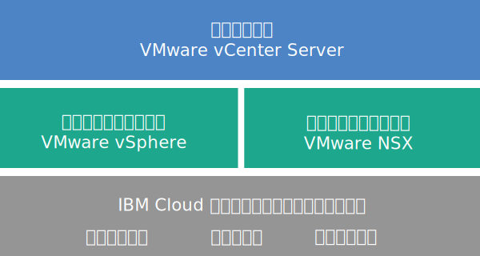

---

copyright:

  years:  2016, 2019

lastupdated: "2019-05-02"

subcollection: vmware-solutions

---

{:tip: .tip}
{:note: .note}
{:important: .important}

# vCenter Server の概要
{: #vc_vcenterserveroverview}

VMware vCenter Server on {{site.data.keyword.cloud}} は、VMware vSphere スタックをサービスとして提供するホステッド・プライベート・クラウドです。 VMware 環境は {{site.data.keyword.cloud_notm}} {{site.data.keyword.baremetal_short}}上に構築され、ネットワークに接続された共有ストレージと専用のソフトウェア定義ストレージのどちらかを選択して使用できます。また、VMware NSX で実装される、管理しやすい論理エッジ・ファイアウォールのデプロイメントと構成の自動化機能も含まれています。

多くの場合、環境全体を 1 日以内でプロビジョンできます。また、このベア・メタル・インフラストラクチャーのコンピュート能力は、必要に応じて迅速かつ伸縮自在に拡張や縮小ができます。

デプロイメント後に、{{site.data.keyword.slportal}}からネットワーク・ファイル・システム (NFS) ファイル共有をさらに注文してからクラスター内のすべての ESXi サーバーにそれらを手動で接続することによって、共有ストレージを増やすことができます。 専用ストレージが必要な場合は、[NetApp ONTAP Select on {{site.data.keyword.cloud_notm}}](/docs/services/vmwaresolutions/netapp?topic=vmware-solutions-np_netappoverview) を、高性能 (オール SSD) 構成と大容量 (オール SATA) 構成の両方で利用できます。

VMware vSAN は専用ストレージのオプションとしても利用できます。 vSAN クラスターの vSAN ベース・ストレージの容量を増やすには、デプロイメント後に ESXi サーバーをさらに追加します。

IBM 提供の VMware ライセンスを購入した場合は、VMware NSX Base エディションを Advanced エディションまたは Enterprise エディションにアップグレードできます。VMware vRealize Operations などの追加の VMware コンポーネントも購入できます。

仮想化、ゲスト OS、アプリケーション層の日常業務と保守業務から解放されたい場合は、IBM Managed Services を追加できます。 クラウドの利用をすぐに開始できるように移行、実装、計画、オンボーディングのサービスを提供してお客様を支援する、{{site.data.keyword.cloud_notm}} プロフェッショナル・サービス・チームも用意されています。

## vCenter Server アーキテクチャー
{: #vc_vcenterserveroverview-archi}

次の図は、3 ノードの vCenter Server デプロイメントのアーキテクチャーとコンポーネントの全体像を示しています。

### 物理インフラストラクチャー
{: #vc_vcenterserveroverview-physical-infras}

この層は、仮想インフラストラクチャーで使用する物理インフラストラクチャー (コンピュート、ストレージ、ネットワークのリソース) を提供します。

### 仮想化インフラストラクチャー (コンピュートとネットワーク)
{: #vc_vcenterserveroverview-virtualization-infras}

この層は、さまざまな VMware 製品を通して物理インフラストラクチャーを仮想化します。
* VMware vSphere は、物理コンピュート・リソースを仮想化します。
* VMware NSX は、論理ネットワーキング・コンポーネントと仮想ネットワークを提供するネットワーク仮想化プラットフォームです。

### 仮想化管理
{: #vc_vcenterserveroverview-virtualization-mgmt}

この層は、Platform Services Controller (PSC) が組み込まれた vCenter Server Appliance (vCSA)、NSX Manager、NSX ESG 2 つ、NSX Controller 3 つ、IBM CloudDriver 仮想サーバー・インスタンス (VSI) で構成されます。 CloudDriver VSI は、環境へのホストの追加などの特定の操作のために必要に応じてオンデマンドでデプロイします。

基本オファリングでは、最大 400 台のホストと最大 4000 個の VM が存在する環境をサポートできる規模の vCenter Server アプライアンスがデプロイされます。 vSphere API と互換性のある同じツールとスクリプトを使用して、IBM がホストする VMware 環境を管理できます。

合計で、基本オファリングには、仮想化管理層用に予約される 38 個の vCPU と 67 GB の vRAM が必要です。 VM 用の残りのホスト容量は、オーバーサブスクリプション率、VM サイジング、ワークロードのパフォーマンス要件などのいくつかの要因によって決まります。

アーキテクチャーについて詳しくは、[{{site.data.keyword.vmwaresolutions_short}} アーキテクチャーの参照情報](/docs/services/vmwaresolutions/archiref/solution?topic=vmware-solutions-solution_overview)を参照してください。

## vCenter Server インスタンスの技術仕様
{: #vc_vcenterserveroverview-specs}

vCenter Server インスタンスには、以下のコンポーネントが含まれています。

標準化されたハードウェア構成の使用可否と価格は、デプロイメントに選択した {{site.data.keyword.CloudDataCent_notm}}によって異なる場合があります。
{:note}

### ベア・メタル・サーバー
{: #vc_vcenterserveroverview-bare-metal}

以下のいずれかの構成で{{site.data.keyword.baremetal_short}}を 3 つ以上注文できます。
* **Skylake**: 選択した CPU モデルおよび RAM サイズの 2 CPU Intel Skylake 世代サーバー (Intel Xeon 4100/5100/6100 シリーズ)。
* **SAP 認定**: 選択した CPU モデルの Intel Skylake または Intel Broadwell 世代サーバー (Intel Xeon 6140/E5-2690/E7-8890 シリーズ)。
* **Broadwell**: 選択した CPU モデルおよび RAM サイズの 4 CPU Intel Broadwell 世代サーバー (Intel Xeon E7-4800 シリーズ)。

vSAN ストレージを使用する予定である場合は、構成に最低 4 つの{{site.data.keyword.baremetal_short}}が必要です。
{:note}

### ネットワーキング
{: #vc_vcenterserveroverview-networking}

以下のネットワーキング・コンポーネントが注文されます。
*  10 Gbps デュアル・ネットワーク・アップリンク (パブリックとプライベート)
*  VLAN (仮想 LAN) 3 つ: パブリック VLAN 1 つとプライベート VLAN 2 つ
*  レイヤー 2 (L2) ネットワークに接続されたローカル・ワークロード間で実行される可能性のある東西通信用の DLR (分散論理ルーター) を備えた VXLAN (仮想拡張可能 LAN) 1 つ。 この VXLAN は、サンプルのルーティング・トポロジーとしてデプロイされるので、変更したり、作成の基礎として使用したり、削除したりできます。 また、DLR の新しい論理インターフェースにさらに VXLAN を接続してセキュリティー・ゾーンを追加することもできます。
*  以下の 2 つの VMware NSX Edge Services Gateway
  * アウトバウンド HTTPS 管理トラフィック用のセキュアな管理サービス VMware NSX Edge Services Gateway (ESG)。これは、管理ネットワーキング・トポロジーの一部として IBM がデプロイします。 この ESG は、IBM 管理仮想マシンが、自動化に関連する特定の外部 IBM 管理コンポーネントと通信するために使用します。 詳しくは、[ユーザー管理の ESG を使用するためのネットワークの構成](/docs/services/vmwaresolutions/vcenter?topic=vmware-solutions-vc_esg_config#configuring-your-network-to-use-the-customer-managed-nsx-esg-with-your-vms)を参照してください。

    この ESG は **mgmt-nsx-edge** という名前で、ユーザーはこの ESG にアクセスできず、使用できません。 これを変更すると、{{site.data.keyword.vmwaresolutions_short}} コンソールから vCenter Server インスタンスを管理できなくなる可能性があります。 また、ファイアウォールを使用したり、外部 IBM 管理コンポーネントへの ESG 通信を無効にしたりすると、{{site.data.keyword.vmwaresolutions_short}} が使用できなくなる可能性があります。
    {:important}
  * アウトバウンドとインバウンドの HTTPS ワークロード・トラフィック用のユーザー管理のセキュアな VMware NSX Edge Services Gateway。 このゲートウェイは、VPN アクセスまたはパブリック・アクセスを提供するためにユーザーが変更可能なテンプレートとして IBM がデプロイします。 詳しくは、[ユーザー管理の NSX Edge にはセキュリティーのリスクがありますか?](/docs/services/vmwaresolutions/vmonic?topic=vmware-solutions-faq#faq-customer-nsx) を参照してください。

### 仮想サーバー・インスタンス
{: #vc_vcenterserveroverview-vsi}

以下の仮想サーバー・インスタンス (VSI) が注文されます。
* IBM CloudBuilder の VSI。これは、インスタンスのデプロイメントが完了した後にシャットダウンされます。
* (V2.2 以降のインスタンス) Microsoft Active Directory (AD) 用に 1 つの Microsoft Windows Server VSI をデプロイするか、管理クラスターに 2 つの高可用性 Microsoft Windows VM をデプロイしてセキュリティーと堅牢性を強化するかを選択できます。
* (V1.9 から V2.1 のインスタンス) Microsoft Active Directory (AD) 用の Microsoft Windows Server VSI がデプロイされて参照可能になります。 この VSI がインスタンスの DNS として機能し、ここにホストと仮想マシンが登録されます。
* (インスタンス V1.8 以前の場合) 管理コンポーネントのスナップショット・ベース・バックアップ用の VSI。これは、インスタンスのデプロイメントが完了した後も継続して実行されます。

### ストレージ
{: #vc_vcenterserveroverview-storage}

最初のデプロイメントのときに、vSAN と NFS のどちらかのストレージ・オプションを選択できます。

インスタンス V2.8 以降の場合、NFS ストレージ共有を既存の NFS または vSAN クラスターに追加できます。 詳しくは、[vCenter Server インスタンスの容量の拡張と縮小](/docs/services/vmwaresolutions/vcenter?topic=vmware-solutions-vc_addingremovingservers#adding-nfs-storage-to-vcenter-server-instances)の *vCenter Server インスタンスへの NFS ストレージの追加* のセクションを参照してください。
{:note}

#### vSAN ストレージ
{: #vc_vcenterserveroverview-vsan-storage}

vSAN オプションでは、構成をカスタマイズできます。ディスクのタイプ、サイズ、数にも次のように多様なオプションがあります。
* ディスクの数: 2、4、6、8
* ストレージ・ディスク: 960 GB SSD SED、1.9 TB SSD SED、3.8 TB SSD SED。

  さらに、ホストごとに 960 GB のキャッシュ・ディスクが 2 つ注文されます。

  3.8 TB SSD (ソリッド・ステート・ディスク) ドライブは、データ・センターで一般提供が開始されたらサポートされる予定です。
  {:note}
* High-Performance Intel Optane オプション。合計 12 個の容量ディスクに 2 つの追加の容量ディスク・ベイが提供されます。 このオプションは CPU モデルに応じて異なります。

#### NFS ストレージ
{: #vc_vcenterserveroverview-nfs-storage}

NFS オプションでは、ワークロード用のファイル・レベルの共有ストレージをカスタマイズできます。サイズとパフォーマンスをさまざまなオプションから選択できます。
* サイズ: 20 GB から 24 TB
* パフォーマンス: 0.25、2、4、または 10 IOPS/GB。
* ファイル共有の個々の構成。

  10 IOPS/GB パフォーマンス・レベルは、ファイル共有あたり最大 4 TB の容量に制限されています。
  {:note}

NFS オプションを選択すると、管理コンポーネント用の 2 TB および 4 IOPS/GB ファイル共有が 1 つ注文されます。

#### ローカル・ディスク・ストレージ
{: #vc_vcenterserveroverview-local-disk-storage}

ローカル・ディスク・オプションは、**SAP 認定**のクワッド Intel Xeon E7-8890 v4 プロセッサーのベアメタル構成でのみ使用できます。ディスク数とディスク・タイプをさまざまなオプションから選択して、構成をカスタマイズできます。

### ライセンス (IBM 提供または BYOL) および料金
{: #vc_vcenterserveroverview-license-and-fee}

* VMware vSphere Enterprise Plus 6.5u2 または 6.7u1
* VMware vCenter Server 6.5
* VMware NSX Service Providers Edition (Base、Advanced、または Enterprise) 6.4
* (vSAN クラスターの場合) VMware vSAN Advanced または Enterprise 6.6
* サポートとサービスの料金 (ノード当たり 1 つのライセンス)

## vCenter Server 拡張ノードの技術仕様
{: #vc_vcenterserveroverview-expansion-node-specs}

vCenter Server 拡張ノードごとに、{{site.data.keyword.cloud_notm}} アカウントに以下のコンポーネントがデプロイされ、料金が発生します。

### 拡張ノード用のハードウェア
{: #vc_vcenterserveroverview-expansion-node-hardware}

[vCenter Server インスタンスの技術仕様](/docs/services/vmwaresolutions/vcenter?topic=vmware-solutions-vc_vcenterserveroverview#vc_vcenterserveroverview-specs)に示されている構成になっている、1 台のベア・メタル・サーバー。

### 拡張ノード用のライセンスと料金
{: #vc_vcenterserveroverview-expansion-node-license-and-fee}

* VMware vSphere Enterprise Plus 6.5u2 または 6.7u1 1 つ
* VMware NSX Service Providers Edition (Base、Advanced、Enterprise) 6.4 1 つ
* 1 つのサポートとサービスの料金
* (vSAN クラスターの場合) VMware vSAN Advanced または Enterprise 6.6

{{site.data.keyword.cloud_notm}} アカウントで作成した {{site.data.keyword.vmwaresolutions_short}} コンポーネントは、{{site.data.keyword.vmwaresolutions_short}} コンソールから管理する必要があります。{{site.data.keyword.slportal}}やその他の手段でコンソール以外から管理することはできません。 {{site.data.keyword.vmwaresolutions_short}} コンソール以外で変更した場合、変更がコンソールと同期されません。
インスタンスを注文したときに {{site.data.keyword.cloud_notm}} アカウントにインストールされた {{site.data.keyword.vmwaresolutions_short}} コンポーネントを、{{site.data.keyword.vmwaresolutions_short}} コンソール以外で管理すると、環境が不安定になる可能性があります。 これには以下の管理アクティビティーが該当します。
*  コンポーネントの追加、変更、返却、または削除
*  ESXi サーバーの追加または削除によるインスタンス容量の拡張または縮小
*  コンポーネントのパワーオフ
*  サービスの再始動
   {{site.data.keyword.slportal}}での共有ストレージのファイル共有の管理は、上記アクティビティーに該当しません。 これには、共有ストレージのファイル共有の注文、削除 (マウントされている場合はデータ・ストアに影響する可能性があります)、承認、マウントなどのアクティビティーが含まれます。
   {:important}

## 関連リンク
{: #vc_vcenterserveroverview-related}

* [vCenter Server ソフトウェアの部品構成表](/docs/services/vmwaresolutions/vcenter?topic=vmware-solutions-vc_bom)
* [vCenter Server インスタンスの計画](/docs/services/vmwaresolutions/vcenter?topic=vmware-solutions-vc_planning)
* [vCenter Server インスタンスの注文](/docs/services/vmwaresolutions/vcenter?topic=vmware-solutions-vc_orderinginstance)
* [vCenter Server の接続ストレージ](/docs/services/vmwaresolutions/services?topic=vmware-solutions-storage-benefits#storage-benefits)
* [ファイル共有容量の拡張](/docs/infrastructure/FileStorage?topic=FileStorage-expandCapacity#expandCapacity)
