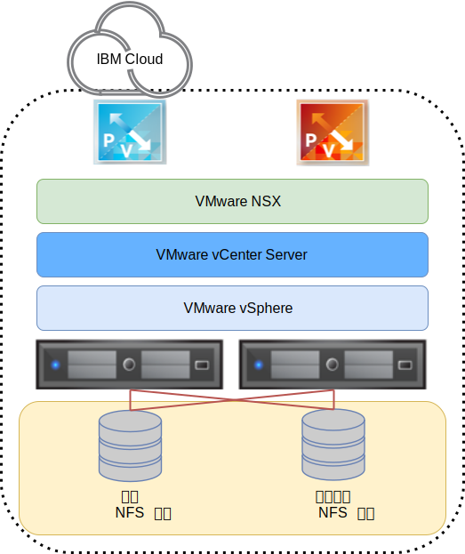

---

copyright:

  years:  2016, 2019

lastupdated: "2019-05-06"

subcollection: vmware-solutions

---

{:tip: .tip}
{:note: .note}
{:important: .important}

# 연결된 스토리지 인프라 디자인
{: #storage-infra-design}

{{site.data.keyword.vmwaresolutions_full}}는 전세계 {{site.data.keyword.CloudDataCents_notm}} 내에 자동화된 방식으로 배치된 VMware 기술을 제공합니다. {{site.data.keyword.cloud_notm}} 솔루션 포트폴리오에서 기본 VMware vCenter Server on {{site.data.keyword.cloud_notm}} 오퍼링은 최대 59개의 vSphere 호스트, 단일 PSC(Platform Services Controller) 및 최대 400개의 호스트와 4,000개의 가상 머신을 관리할 수 있는 vCenter Server Appliance로 구성됩니다.

여기에 제공된 아키텍처는 연결된 스토리지를 환경에 맞는 공유 스토리지 디바이스로 추가하여 vCenter Server 솔루션을 보완합니다. 연결된 스토리지 디바이스는 vCenter Server 배치와 동일한 {{site.data.keyword.CloudDataCent_notm}} 내에 있으며 단일 NFS(Network File System) 공유 또는 {{site.data.keyword.cloud_notm}}의 다중 NFS 내보내기로 구성됩니다.

다음 그림은 vCenter Server 배치의 전체 아키텍처를 제공합니다.

## 실제 인프라 디자인
{: #storage-infra-design-phys-infra-design}

실제 인프라는 실제 컴퓨팅, 실제 스토리지 및 실제 네트워크라는 세 가지 기본 컴포넌트로 구성됩니다. 실제 인프라는 인프라에서 사용되는 {{site.data.keyword.cloud_notm}} 서비스 네트워크와 실제 스토리지를 포함합니다.

## 실제 네트워크 디자인
{: #storage-infra-design-phys-net-design}

실제 네트워크는 {{site.data.keyword.cloud_notm}}에서 처리됩니다. 다음 섹션에서는 {{site.data.keyword.cloud_notm}}에서 제공하는 실제 네트워크(연결된 스토리지와 관련된)에 대해 설명합니다.

### IBM Cloud 네트워크 개요
{: #storage-infra-design-ibm-cloud-net-ovw}

{{site.data.keyword.cloud_notm}}의 실제 네트워크는 3개의 개별 네트워크(공용, 사설 및 관리)로 분류됩니다. 공용, 사설 및 관리 네트워크에 대한 자세한 정보는 [솔루션 개요](/docs/services/vmwaresolutions/archiref/solution?topic=vmware-solutions-solution_overview)를 참조하십시오.

{{site.data.keyword.cloud_notm}} 네트워크에 대한 자세한 정보는 [{{site.data.keyword.cloud_notm}} 글로벌 데이터 센터](https://www.ibm.com/cloud/data-centers/){:new_window}를 참조하십시오.

사설 네트워크의 일부인 서비스 네트워크에 대한 설명을 보려면 다음 정보를 검토하십시오.

### 개인 서비스 네트워크
{: #storage-infra-design-private-net}

{{site.data.keyword.cloud_notm}}에는 Block Storage, Files Storage, Object Storage, DNS 분석기 및 NTP 서버와 같은 공통 서비스를 제공하는 개인 서비스 네트워크가 있습니다. 이 사설 네트워크는 고객의 사설 네트워크와 구분되며, 이를 통해 환경은 {{site.data.keyword.cloud_notm}}에 있는 서비스에 원활하게 연결될 수 있습니다. 사설 네트워크는 해당 서버에서 다중 티어이며, 기타 인프라는 집계된 백엔드 고객 스위치(BCS)에 연결됩니다. 이 집계된 스위치는 L3 네트워킹을 위해 개별 라우터(예: 백엔드 고객 라우터(BCR)) 쌍에 연결됩니다. 사설 네트워크는 실제 호스트 연결을 위한 점보 프레임(예: MTU 9000)을 사용하는 기능도 지원합니다.

### VLAN
{: #storage-infra-design-vlans}

VLAN에 대한 자세한 정보는 [실제 인프라 디자인](/docs/services/vmwaresolutions/archiref/solution?topic=vmware-solutions-design_physicalinfrastructure)의 _실제 네트워크 디자인_ 섹션을 참조하십시오.

## 실제 스토리지 디자인
{: #storage-infra-design-phys-storage-design}

다음 섹션은 {{site.data.keyword.cloud_notm}}에 있는 연결된 스토리지 디바이스의 구성에 대해 설명합니다. 연결된 스토리지 디바이스는 기존 vCenter Server 솔루션을 보완합니다. 따라서 실제 호스트의 내부에 있는 로컬로 연결된 디스크는 표시되지 않습니다.

## 연결된 스토리지 성능
{: #storage-infra-design-perf}

Performance 및 Endurance 스토리지는 예측 가능한 레벨의 성능을 요구하는 높은 I/O 애플리케이션을 지원하도록 디자인된 {{site.data.keyword.cloud_notm}} 스토리지 솔루션입니다. 이 예측 가능한 성능은 프로토콜 레벨의 초당 입출력(I/O) 오퍼레이션(IOPS)을 개별 볼륨으로 할당하여 달성됩니다.

100 - 96,000 범위의 IOPS는 20GB - 24TB 저장 크기로 주문할 수 있습니다. Performance 및 Endurance 스토리지 볼륨은 블록 스토리지 및 파일 스토리지에 사용 가능합니다.

이 디자인에서 vCenter Server 솔루션은 연결된 스토리지에 대해 Endurance 스토리지를 제공합니다. 따라서 20GB - 24TB 크기의 Endurance NFS 내보내기를 선택하여 연결할 수 있습니다(자동화를 통해). {{site.data.keyword.cloud_notm}}는 단일 Endurance NFS 내보내기에 연결할 vSphere ESXi 호스트를 64개까지 허용합니다.

Endurance는 다양한 애플리케이션 욕구를 지원하기 위해 세 가지 IOPS 성능 티어에서 사용 가능합니다.

NFS 공유를 주문한 후에 IOPS를 많이 또는 적게 허용하도록 크기를 조정하거나 재구성할 수 있습니다.
{:note}

자세한 IOPS 옵션은 [vCenter Server 인스턴스 주문](/docs/services/vmwaresolutions/vcenter?topic=vmware-solutions-vc_orderinginstance)의 _스토리지 설정_ 섹션을 참조하십시오.

스토리지 티어 외에 {{site.data.keyword.cloud_notm}} Endurance 스토리지는 스냅샷과 복제, {{site.data.keyword.CloudDataCent_notm}} 위치의 유휴 시 암호화를 포함해 넓은 범위의 애플리케이션 요구 선택을 지원합니다.

## 관련 링크
{: #storage-infra-design-related}

* [솔루션 개요](/docs/services/vmwaresolutions/archiref/solution?topic=vmware-solutions-solution_overview)
