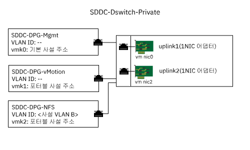

---

copyright:

  years:  2016, 2019

lastupdated: "2019-02-13"

---

{:tip: .tip}
{:note: .note}
{:important: .important}

# 연결된 스토리지 인프라 관리
{: #storage-infra-mgmt}

인프라 관리는 vSphere ESXi 인프라를 관리하는 VMware 컴포넌트를 의미합니다.

컴포넌트에 대한 자세한 정보는 [가상 인프라 디자인](/docs/services/vmwaresolutions/archiref/solution?topic=vmware-solutions-design_virtualinfrastructure)의 그림 2. NSX Manager 네트워크 개요를 참조하십시오.

## 가상 네트워킹 디자인
{: #storage-infra-mgmt-visual-net-design}

이 디자인에서 사용되는 네트워크 가상화는 사설 네트워크와 연관되어 있고 [{{site.data.keyword.vmwaresolutions_full}} 아키텍처](/docs/services/vmwaresolutions/archiref/solution?topic=vmware-solutions-solution_overview)에 지정된 기존 vDS(vSphere Distributed Switch)를 사용합니다.

## vSphere 분배 스위치
{: #storage-infra-mgmt-vsphere-ds}

다른 VLAN이 vCenter Server 솔루션 내에 작성되며 기존 클러스터의 ESXi 호스트에 NFS 마운트 지점을 연결하는 데 사용됩니다. vCenter Server 솔루션에는 사설 네트워크와 연관된 vDS(vSphere Distributed Switch)가 있으므로, 다른 포트 그룹이 작성되고 이 그룹에 추가 VLAN 번호로 태그가 지정됩니다. 이 추가 VLAN은 고유 VLAN이 아니기 때문입니다.

다음 표에서는 새 포트 그룹의 기본 설정에 대해 설명합니다.

이러한 기본 설정은 변경하지 마십시오.
{:important}

표 1. NFS 포트 그룹 요약

| 포트 그룹 이름 | SDDC-DPG-NFS |
|:--------------- |:------------ |
| 포트 바인딩 | 정적 |
| VLAN 유형 | 사설 VLAN B |
|로드 밸런싱 | 원래 가상 포트 기반 라우트 |
| 활성 업링크 | Uplink1 및 uplink2 |

NFS 스토리지 트래픽에 대한 vDS 포트 그룹 작성 외에 VMkernel 포트는 배치 중에 각 vSphere ESXi 호스트에 작성되고 SDDC-DPG-NFS 포트 그룹에 지정됩니다. 또한 VMkernel 포트에는 연결된 스토리지 VLAN, 즉 사설 VLAN B와 연관된 사설 포터블 서브넷의 IP 주소가 지정되며 해당 MTU는 점보 프레임 지원을 위해 9000으로 설정됩니다.

그림 1. 사설 vDS 포트 그룹 및 업링크

### vSphere 호스트 정적 라우팅
{: #storage-infra-mgmt-vsphere-routing}

vDS가 새 포트 그룹으로 구성되고 VMkernel 포트가 포트 그룹에 지정되지만, 모든 NFS 트래픽이 NFS의 VLAN 및 서브넷을 순회하도록 솔루션이 배치의 각 vSphere ESXi 호스트에서 정적 라우트를 작성합니다. 정적 라우트는 호스트 다시 시작 내내 지속되도록 `/etc/rc.local.d/local.sh`에서 작성됩니다.

## 관련 링크
{: #storage-infra-mgmt-related}

* [솔루션 개요](/docs/services/vmwaresolutions/archiref/solution?topic=vmware-solutions-solution_overview)
