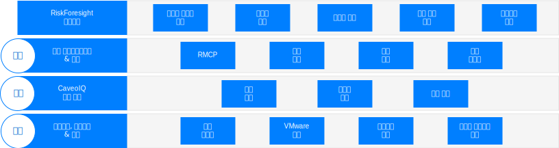

---

copyright:

  years:  2016, 2019

lastupdated: "2019-05-06"

subcollection: vmware-solutions

---

# Caveonix RiskForesight의 아키텍처 개요
{: #caveonix-arch}

Caveonix RiskForesight 아키텍처는 다음 다이어그램에 표시되어 있습니다.

Caveonix RiskForesight 아키텍처에는 다음과 같은 네 개의 계층이 있습니다.
-	발견 - 발견 모듈은 VMware 스택 및 여러 퍼블릭 클라우드에 완전히 통합됩니다. 플러그인을 사용하면 RiskForesight에서 vCenter와 NSX Manager를 자산 저장소로 사용하여 가상 머신(VM), 네트워크 및 네트워크 플로우에 관한 세부사항을 수집합니다. 원격 콜렉터에서는 규제 준수 및 취약성의 "전체 스택" 보기가 가능하도록 워크로드, 운영 체제 및 애플리케이션을 스캔합니다.
-	예측 - 예측 모듈에서는 분석을 사용하여 위험 자산 및 위험 감소 모델의 완화 단계를 식별하므로 위험 관리 태세를 향상시킵니다.
-	조치 - 조치 모듈에서는 우선순위 지정 및 자동화된 보호 조치를 기반으로 완화 단계를 구현하므로 사이버 위협으로 인한 위험으로부터 사전 예방식으로 워크로드를 보호할 수 있습니다.
    - RMCP – RMCP(Risk Management Control Plane)에서는 프라이빗, 퍼블릭 및 관리 클라우드 데이터 센터에서 전체 스택을 모니터링하여 사전 예방식으로 계속 워크로드를 보호합니다.
    - 정책 관리자 - 현재 조직당 세 가지 유형(Caveo 로그, Caveo 네트워크, Caveo 스캔)의 기계 학습 작업을 지원합니다. 데이터에서 찾은 이상 항목을 기반으로 사용자가 사용자 정의 조건에 따라 조치를 수행하도록 정책을 구성할 수 있습니다. 즉, 작업 유형을 선택하고 이상 항목 점수에 맞는 부울 조건을 구성하며 조건이 참인 경우 수행할 조치를 정의합니다. 예를 들어 다음과 같습니다.
        - 작업: "Caveo 로그" 이상 항목 점수가 > 90이면 격리하도록 자산에 표시히고 슬랙 채널에 알림을 보냅니다.
        - 작업: "Caveo 네트워크" 이상 항목 점수가 > 95이면 자산을 격리하고 이메일 알림을 보내며 UI 알림도 보냅니다.
- 대시보드 - 역할 기반 액세스 권한을 통한 대시보드에서는 IT 부서와 같은 서비스 제공자가 테넌트나 비즈니스 단위에 IT 자산을 할당하는 기능을 제공합니다. 그러면 비즈니스 단위에서 해당 IT 자산을 애플리케이션에 지정합니다. 이 애플리케이션은 비즈니스 및 IT 서비스와 일치하고, 비즈니스 영향 평가가 적용되며, 규제 준수 제도(예: NIST, NESA, PCI, ISO 및 HIPAA)가 적용됩니다. 해당 애플리케이션에서는 취약성, NSX 플로우, 소프트웨어 및 로그 데이터와 같은 여러 스캔이 수행되어 현재 실행 중인 작업, 애플리케이션과 연관된 사이버 및 규제 준수 위험을 표시합니다. 해당 대시보드를 드릴다운하면 규제준수와 보안 사용자가 우선순위가 지정된 완화 조치 목록을 볼 수 있으므로 예측 및 조치 모듈에서 자동화할 수 있는 시행 조치를 사용으로 설정할 수 있습니다. RiskForesight에서는 하이브리드 클라우드에서 자산을 식별하는 통합 대시보드와 사이버 위험, 규제 준수 구성 위험, 주요 상태동향 및 보안 조작의 메트릭을 표시하는 히트 맵 분석을 모두 제공합니다. 또한 사용자가 위험의 특성과 위치 및 직관적이고 강력한 시각화 도구를 사용하여 수행할 작업을 신속하게 판별할 수 있습니다. 이 대시보드에서는 다음을 제공합니다.
  - 하이브리드 클라우드 전체의 사이버 위험과 규제 준수 위험을 우선순위를 지정하여 표시하고 발견, 예측, 조치 대시보드 보기가 포함된 보기.
  - 데이터와 시각적으로 상호작용하여 위험 우선순위에 따라 위험한 자산을 신속하게 식별하는 기능.
  - 식별된 위험에 관한 인사이트를 개발하는 사용하기 쉬운 그래프, 메트릭 및 필터.
  - 위치, 조직, 애플리케이션 및 자산 전체의 구성 문제, 취약성 및 애플리케이션 데이터 플로우에 관한 자세한 정보를 얻을 수 있는 대화식 드릴 다운.
  - 사용자가 인프라, 플랫폼, 애플리케이션 및 데이터를 포함하는 운영 스택에 관한 지식을 완벽하게 쌓을 수 있는 기회.
  - 하이브리드 클라우드에서 네트워크, 가상 머신 또는 애플리케이션을 분류하는 정책을 적용하고 시각화하는 기능.

## 구역
{: #caveonix-arch-zones}

Caveonix RiskForesight에는 다음과 같은 구역의 개념이 있습니다.

-	관리 또는 서비스 제공자 구역 - 관리 또는 서비스 제공자 구역에는 다음 컴포넌트가 포함되어 있습니다.
    - RiskForesight 애플리케이션 - 여기에는 다중 컴포넌트가 포함되며 애플리케이션 컴포넌트 섹션에서 자세히 설명합니다.
    - 중앙 콜렉터 - 클라우드 제공자와 테넌트 구역에서 정보를 수집합니다.
- 클라우드 제공자 - 이 구역에서는 애플리케이션을 호스팅하는 인프라를 제공합니다.
    - 프라이빗 – VMware on {{site.data.keyword.cloud}}, 온프레미스, VMware 인프라 플랫폼. 해당 플랫폼은 vCenter, NSX Manager, vCD(VMware Cloud Director) 또는 vRA(vRealize Automation)를 통해 RiskForesight에 통합됩니다.
    - 퍼블릭 - 현재 지원되는 퍼블릭 클라우드 제공자는 AWS뿐입니다. {{site.data.keyword.cloud_notm}}는 곧 사용 가능합니다.
    - 컨테이너 - 현재 AWS EKS(Elastic Kubernetes Service)만 지원됩니다. {{site.data.keyword.cloud_notm}} Private 및 {{site.data.keyword.cloud_notm}} Kubernetes Services는 곧 사용 가능합니다.
-	테넌트 또는 고객 환경 구역 - 해당 구역은 테넌트, 고객 또는 비즈니스 단위를 구분하는 데 사용합니다. 워크로드는 해당 구역에 있으므로 원격 콜렉터가 필요합니다. 최소 배치의 경우 하나의 원격 콜렉터가 필요하지만, 일반 배치의 경우 테넌트/고객/비즈니스 단위당 하나의 원격 콜렉터가 필요합니다.

## 관련 링크
{: #caveonix-arch-related}

*   [VMware vCenter Server on {{site.data.keyword.cloud_notm}} with Hybridity Bundle](/docs/services/vmwaresolutions/archiref/vcs?topic=vmware-solutions-vcs-hybridity-intro)
*   [Caveonix 자세한 디자인](/docs/services/vmwaresolutions/archiref/caveonix?topic=vmware-solutions-caveonix-detailed)
