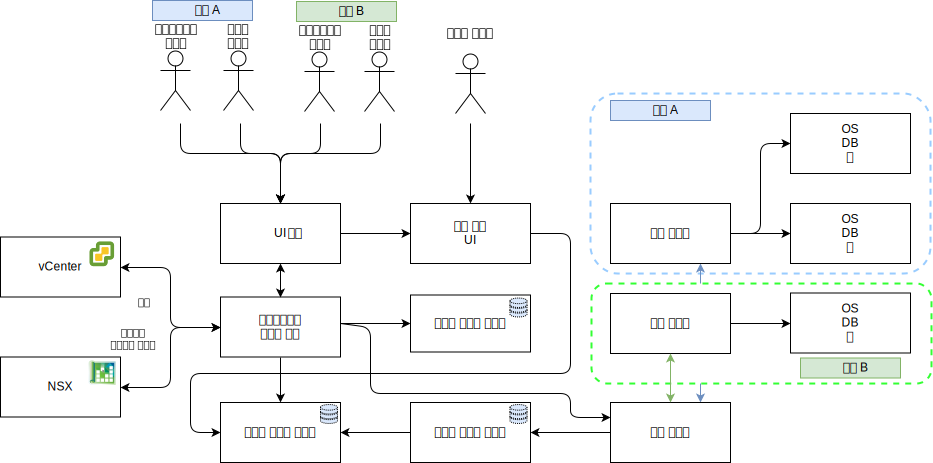

---

copyright:

  years:  2016, 2019

lastupdated: "2019-05-06"

subcollection: vmware-solutions

---

# 자세한 디자인
{: #caveonix-detailed}

다음 다이어그램과 설명에서는 RiskForesight 애플리케이션 컴포넌트에 관한 정보를 제공합니다.

-	그래픽 사용자 인터페이스 - RiskForesight 애플리케이션에 액세스하는 데 사용할 수 있는 웹 인터페이스입니다.
-	중앙 콜렉터 - 플러그인에서 가져오는 여러 다른 유형의 데이터 페이로드를 수집하고 메시징 저장소에서 사용 가능하게 합니다. RiskForesight에서는 다음 유형의 페이로드를 지원합니다.
    - 스캔
    - 로그
    - 넷플로우
    - 소프트웨어
    - 워크로드 메타데이터
- 중앙 라우터 - VMware Orchestration 계층을 사용하여 모든 통합 접점을 관리합니다. RiskForesight 에코시스템과 통신할 권한을 부여받으려면 모든 RiskForesight 플러그인에서 중앙 라우터와 통신해야 합니다.
-	API 서버 - GUI와 백엔드 데이터 저장소를 연결하는 REST 엔드포인트 미들웨어입니다. 또한 사용자 액세스 요청의 유효성을 검증하고 RBAC를 관리합니다.
-	vCenter 데이터 콜렉터 - 플러그인을 통해 vCenter에서 가상 머신(VM) 세부사항을 추출합니다. 일반 플러그인에서는 VMware API를 사용하여 vCenter에 연결하고 워크로드 관련 정보를 추출합니다. 정보가 사용 가능하게 되면 플러그인에서 페이로드를 패키징하고 중앙 콜렉터에 보냅니다.
-	vCD 데이터 콜렉터 - 플러그인을 통해 VMware vCloud Director에서 VM 세부사항을 추출합니다. 일반 플러그인에서는 VMware API를 사용하여 VMware vCloud Director에 연결하고 워크로드 관련 정보를 추출합니다. 정보가 사용 가능하게 되면 플러그인에서 페이로드를 패키징하고 중앙 콜렉터에 보냅니다.
-	vCD 네트워크 데이터 콜렉터 - 플러그인을 통해 VMware vCD에서 넷플로우 세부사항을 추출합니다. 일반 플러그인에서는 VMware API를 사용하여 VMware NSX에 연결하고 네트워크, FW, 보안 규칙 및 보안 그룹을 추출합니다. 정보가 사용 가능하게 되면 플러그인에서 페이로드를 패키징하고 중앙 콜렉터에 보냅니다.
-	네트워크 데이터 콜렉터 - 플러그인을 통해 VMware vCenter에서 넷플로우 세부사항을 추출합니다. 일반 플러그인에서는 VMware API를 사용하여 VMware NSX에 연결하고 네트워크, 방화벽, 보안 규칙 및 보안 그룹 정보를 추출합니다. 정보가 사용 가능하게 되면 플러그인에서 페이로드를 패키징하고 중앙 콜렉터에 보냅니다.
-	원격 콜렉터 - 테넌트 환경 또는 테넌트 VM에 관한 네트워크 액세스 권한이 있는 다른 위치에 있습니다. 모든 규제 준수 및 사이버 위험 스캔을 처리합니다.
-	관계형 데이터 저장소 - 다음 유형의 메타데이터를 유지보수합니다.
    - 클라우드 서비스 제공자
    - 테넌트
    - 자산
    - 스캔 결과
    - 소프트웨어
    - 매일 또는 매주 집계된 데이터 세트
- 메시징 데이터 저장소 - RiskForesight에서는 지속적 메시징 큐를 사용하여 제로 데이터 손실을 제공하고 컴포넌트의 배압을 제거합니다.
- 인덱스 데이터 저장소 - 멀티 테넌트 기능을 지원하기 위해 자세히 분석하도록 각 테넌트의 수신되는 원시 데이터를 저장하고 인덱싱합니다.
- 플러그인 - 애플리케이션 라우팅 서버에 있으며 테넌트 정보와 함께 모든 VM을 동기화하기 위한 VMware 컴포넌트와의 통합 및 설정을 포함합니다.

다음 표에서는 각 컴포넌트에 필요한 포트와 프로토콜을 보여줍니다.

표 1. 포트 및 프로토콜

|컴포넌트	|프로토콜 / 포트|
|---|---|
|UI| 443|
|API|443, 1337|
|RiskForesight|8082, 8083, 8084|
|중앙 콜렉터(클러스터)|8080|
|원격 콜렉터|8081|
|관계형 데이터 저장소 기본 또는 보조|5432|
|메시징 데이터 저장소 클러스터|9092|
|인덱스 데이터 저장소 마스터 노드|9200, 9300, 5601, 443|

다음 다이어그램에서는 사설 VLAN A와 연관된 Caveonix 휴대용 사설 서브넷과 네트워크 토폴로지를 보여줍니다. 병렬 분산 모델을 통해 필요한 대로 "일체형"에서 완전히 배포된 배치 모델로 수동으로 스케일을 확장할 수 있도록 이 서브넷의 IP 주소 공간을 관리할 책임이 있습니다.

IP 서브넷, VLAN 할당은 다음 표에 설명되어 있습니다.

표 2. VLAN과 서브넷

|VLAN 	|서브넷 유형 	|설명|
|---|---|---|
|공용 	|기본 	|공용 네트워크 액세스를 위해 실제 호스트에 지정됩니다. 초기 배치 시에는 사용되지 않습니다.|
|공용	|포터블 	|customer-nsx-esg에서 업링크와 NAT 사용을 위해 지정됩니다.|
|공용	|포터블 	|mgmt-nsx-esg에서 업링크 NAT 사용을 위해 지정됩니다.|
|공용	|포터블 	|Hybridity bundle을 선택한 경우, hcx-mgmt-esg에서 업링크 NAT 사용을 위해 지정됩니다.|
|사설 A 	|기본 	|{{site.data.keyword.cloud}}에 의해 지정된 실제 호스트에 지정됩니다. vSphere 관리 트래픽에 대한 관리 인터페이스에 의해 사용됩니다.|
|사설 A 	|포터블 	|관리 컴포넌트로 작동하는 VM에 지정됩니다.|
|사설 A 	|포터블 	|NSX VTEP에 지정됩니다.|
|사설 A 	|포터블 	|Hybridity bundle을 선택한 경우, 내부 사용을 위해 HCX에 지정됩니다.|
|사설 A 	|포터블 	|customer-nsx-esg에서 업링크 사용을 위해 지정됩니다.|
|사설 A 	|포터블 	|Hybridity bundle을 선택한 경우, HCX에 지정됩니다.|
|사설 A 	|포터블 	|Zerto 옵션을 선택한 경우, Zerto VRA에 지정됩니다.|
|사설 A 	|포터블 	|Caveonix 옵션을 선택한 경우, Caveonix RiskForesight용으로 지정됩니다.|
|사설 B	|기본	|초기 배치 시에는 사용되지 않습니다.|
|사설 B 	|포터블 	|사용 중인 경우 vSAN용으로 지정됩니다.|
|사설 B 	|포터블 	|사용 중인 경우 NAS용으로 지정됩니다.|
|사설 B 	|포터블 	|vMotion을 위해 지정됩니다.|

## 관련 링크
{: #caveonix-detailed-related}

* [VMware vCenter Server on {{site.data.keyword.cloud_notm}} with Hybridity Bundle](/docs/services/vmwaresolutions/archiref/vcs?topic=vmware-solutions-vcs-hybridity-intro)
