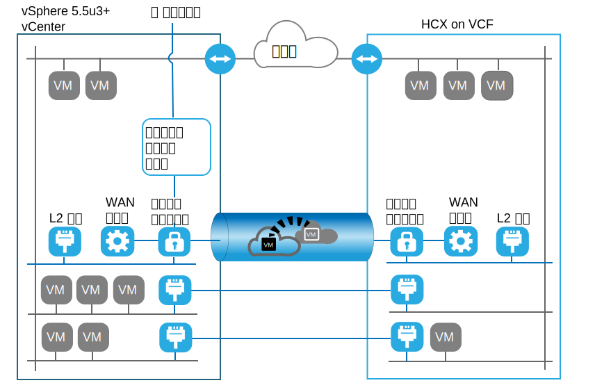
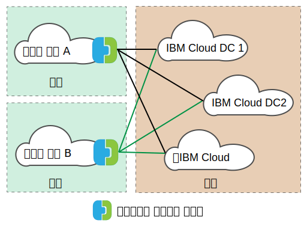

---

copyright:

  years:  2016, 2019

lastupdated: "2019-05-06"

subcollection: vmware-solutions

---
# VMware HCX on IBM Cloud 개요
{: #hcx-archi-overview}

VMware HCX on IBM Cloud는 온프레미스 vSphere® vCenter™ 네트워크를 IBM Cloud for VMware Solutions 배치로 원활하게 통합합니다. 하이브리드 네트워킹은 온프레미스 vSphere vCenter 네트워크를 IBM Cloud로 확장하며, 양방향 가상 머신(VM) 이동성을 지원합니다.

HCX는 소스 및 대상 암호화와 복호화 프로세스를 소유하며, 일관성 있는 보안을 보장하고 가상 머신 마이그레이션 및 네트워크 확장과 같은 하이브리드 워크플로우에 대한 참여를 제공합니다.

이 오퍼링은 확장된 네트워크 성능을 향상시키도록 최적화된 소프트웨어 정의 WAN을 작성하며, LAN 속도에 도달하는 성능을 사용할 수 있습니다. HCX는 양방향 워크로드와 IBM Cloud로의 VMware NSX® 보안 정책 마이그레이션을 사용으로 설정합니다. HCX는 vSphere vCenter와 통합하고 vSphere Web Client에서 관리됩니다.

## 계층 2 네트워크 확장
{: #hcx-archi-overview-layer-2-net}

HCX는 기존 온프레미스 vCenter에서 VMware vCenter Server를 실행하는 IBM Cloud 데이터 센터까지 네트워크를 안전하게 확장하도록 기존의 온프레미스 vSphere 자산을 허용합니다. 이 기능은 다음 항목으로 사용 가능합니다.
* HCX는 Layer 2 Concentrator(L2C)라고 하는 어플라이언스를 제공합니다.
* 확장된 네트워크는 VMware vCenter Server에 배치된 IBM Cloud NSX Edge 어플라이언스에 연결합니다.
* 확장성을 확보하고 온프레미스 vCenter에서 처리량을 늘리기 위해 다중 표준 Layer 2 Concentrator를 배치할 수 있습니다.
* 클라우드 게이트웨이와 확장된 계층 2를 통해 마이그레이션된 가상 머신은 IP와 MAC 주소를 보유할 수 있습니다.

## 가상 머신 마이그레이션
{: #hcx-archi-overview-vm-mig}

HCX는 세 가지 가상 머신 이동 방법 즉, 짧은 작동 중단 마이그레이션, vSphere vMotion 마이그레이션 및 콜드 마이그레이션을 제공합니다.

### 짧은 작동 중단 마이그레이션
{: #hcx-archi-overview-low-downtime-mig}

짧은 작동 중단 마이그레이션은 VMware ESX®/ESXi® 하이퍼바이저에서 구현되는 분산 기술인 vSphere 복제에 의존합니다. 온프레미스 HCX 배치는 IBM Cloud에서 라이브 가상 머신의 복제본을 작성하고 소스 가상 머신의 전원을 끄고 마이그레이션된 가상 머신의 전원을 켜도록 전환을 수행합니다.

마이그레이션 경로는 항상 클라우드 게이트웨이를 통과합니다. 전송은 인터넷, 계층 2 확장 네트워크 또는 직접 연결 회선이 될 수 있습니다.

가상 머신은 모든 방향에서 여러 번 마이그레이션될 수 있습니다.

### vMotion 마이그레이션
{: #hcx-archi-overview-vmotion-mig}

라이브 가상 머신은 IBM Cloud로 확장된 네트워크에서 vSphere vMotion 마이그레이션을 사용하여 전송될 수 있습니다. vMotion 마이그레이션은 무중단 마이그레이션 또는 교차 클라우드 vMotion이라고도 합니다.

### 콜드 마이그레이션
{: #hcx-archi-overview-cold-mig}

콜드 마이그레이션을 사용하면 Layer 2 Concentrator로 작성되는 확장된 네트워크를 통해 전원이 꺼진 VM을 IBM Cloud로 전송할 수 있습니다.

### 공통 마이그레이션 기능
{: #hcx-archi-overview-cold-mig-features}

모든 세 가지 유형의 마이그레이션에 사용 가능한 기타 기능에는 마이그레이션 처리량 및 속도를 향상시키는 소프트웨어 정의 WAN 최적화가 포함됩니다. 또한 마이그레이션은 지정된 시간에 발생하도록 스케줄될 수 있고 호스트 이름, 가상 머신 이름(또는 둘 다)을 유지할 수 있습니다.

## 네트워킹 기능
{: #hcx-archi-overview-net-features}

다음 네트워킹 기능은 클라우드 게이트웨이 및 Layer 2 Concentrator로 빌드됩니다.

### 인텔리전트 플로우 라우팅
{: #hcx-archi-overview-intel-flow-routing}

이 기능은 워크로드가 가능한 빨리 이동되도록 인터넷 경로를 기반으로 최적의 연결을 자동으로 선택하고, 전체 연결을 효율적으로 분산시킵니다. 백업 또는 복제와 같이 대형 플로우로 인해 CPU 경합이 발생하는 경우 소형 플로우가 사용량이 적은 CPU로 라우트되어 대화식 트래픽의 성능이 향상됩니다.

### 근접 라우팅
{: #hcx-archi-overview-prox-routing}

근접 라우팅은 온프레미스와 클라우드 모두에서 확장되고 라우트되는 네트워크에 연결된 가상 머신 간의 전달이 대칭적인지 확인합니다. 이 기능에는 고객 프레미스와 클라우드 간에 구성되어 있는 동적 라우팅이 포함된 고급 네트워크 서비스가 필요합니다.

사용자가 네트워크를 클라우드에 확장하는 경우 계층 2 연결이 IBM Cloud 네트워크로 확장됩니다. 그러나 라우트 최적화가 없으면 계층 3 통신 요청은 라우트되도록 온프레미스 네트워크 원점으로 돌아가야 합니다. 이 돌아가기는 _트럼본_ 또는 _헤어핀_이라고 합니다.

트럼본은 소스 및 대상 가상 머신이 모두 클라우드에 상주하는 경우에도 패킷이 네트워크 원점과 클라우드 사이를 이동해야 하므로 비효율적입니다.

비효율성 외에도, 전달 경로에 상태 저장 방화벽 또는 연결의 양방향이 모두 표시되어야 하는 기타 인라인 장비가 포함되어야 하는 경우 통신에 실패할 수 있습니다. 클라우드를 종료하는 유출 경로가 확장된 계층 2 네트워크 또는 조직의 라우트된 네트워크가 될 수 있는 경우 가상 머신 통신(라우트 최적화 없이) 장애가 발생합니다. 온프레미스 네트워크는 확장된 네트워크 "바로 가기"에 대해 알지 못합니다. 이 문제점을 비대칭 라우팅이라고 합니다. 솔루션은 온프레미스 네트워크가 IBM Cloud를 통해 라우트에 대해 알아볼 수 있도록 근접 라우팅을 사용으로 설정하는 것입니다.

클라우드 게이트웨이는 클라우드에서 가상 머신의 인벤토리를 유지보수합니다. 다음 상태 중 하나일 수 있는 VM 상태도 이해하고 있습니다.
* vMotion을 사용하여 IBM Cloud로 전송됨(무중단 마이그레이션)
* 호스트 기반 복제를 사용하여 클라우드로 마이그레이션됨(짧은 중단 마이그레이션)
* 클라우드에 작성됨(확장된 네트워크에서)

### 보안
{: #hcx-archi-overview-sec}

클라우드 게이트웨이는 스위트 B 호환 AES-GCM(IKEv2 사용), AES-NI 오프로드 및 플로우 기반 허가 제어를 제공합니다. HCX는 소스 및 대상 암호화와 복호화 프로세스를 소유하며, 일관성 있는 보안과 가상 머신 마이그레이션 및 네트워크 확장과 같은 하이브리드 워크플로우에 대한 참여를 보장합니다. 정의되고 가상 머신 온프레미스에 지정된 보안 정책은 가상 머신을 사용하여 IBM Cloud에 마이그레이션될 수 있습니다.

정책 마이그레이션은 다음 조건에서만 사용 가능합니다.
* 온프레미스 데이터 센터에는 NSX 6.2.2 이상이 실행되어야 합니다.
* vSphere에서 보안 정책은 많은 규칙을 포함할 수 있는 단일 NSX 섹션입니다.
* 정책에 참여하기 위해 IP 주소 또는 MAC 주소 세트의 이름을 지정할 수 있습니다. MAC 세트 또는 IP 세트 이름은 218자를 초과할 수 없습니다.
* 지원되는 규칙은 소스 또는 대상으로 계층 3 IP 주소 또는 IP 세트를 지정하거나 계층 2 MAC 주소 또는 MAC 세트를 지정합니다.

## HCX의 컴포넌트
{: #hcx-archi-overview-comp-hcx}

VMware HCX on IBM Cloud 서비스는 온프레미스 데이터 센터와 IBM Cloud 대상 모두에 설치되고 구성된 네 가지 가상 어플라이언스를 배치합니다. 이 절에서는 네 가지 필수 가상 어플라이언스에 대해 각각 설명합니다. 선택적으로 구현 디자인에 따라 에지 디바이스가 필요할 수 있습니다.

### HCX Manager
{: #hcx-archi-overview-hcx-man}

HCX Manager 가상 어플라이언스는 온프레미스 vCenter에 대한 확장입니다. 이는 가상 머신으로 배치되고 파일 구조에는 다른 하이브리드 서비스 가상 어플라이언스가 포함됩니다. HCX Manager는 온프레미스 및 IBM Cloud 내에서 클라우드 게이트웨이, Layer 2 Concentrator 및 WAN 최적화 가상 어플라이언스의 배치 및 구성을 관리합니다.

### 하이브리드 클라우드 게이트웨이
{: #hcx-archi-overview-hcg}

하이브리드 클라우드 게이트웨이(CGW)는 온프레미스 vSphere 자산과 IBM Cloud 간에 보안 채널을 유지보수합니다. HCX는 IBM Cloud에 대한 사이트 대 사이트 연결을 부트스트랩하도록 강력한 암호화를 사용합니다.

vSphere와 IBM Cloud 간의 보안 채널은 "중간 구간" 보안 문제점을 방지합니다. 클라우드 게이트웨이는 양방향 마이그레이션을 수행하도록 vSphere 복제 기술을 통합합니다.

### WAN 최적화
{: #hcx-archi-overview-wan-opt}

WAN 최적화 어플라이언스는 대기 시간의 영향을 줄이기 위해 WAN 조건 지정을 수행하는 컴포넌트입니다. 패킷 유실 시나리오 및 중복되는 트래픽 패턴의 중복 제거를 무효화하도록 순방향 오류 정정도 통합합니다. 이를 통해 대역폭 사용이 줄어들고 IBM Cloud로(에서) 데이터 전송을 가속화할 수 있는 사용 가능한 네트워크 기능을 최대한 활용할 수 있습니다.

가상 머신 마이그레이션은 vSphere 온프레미스와 IBM Cloud 간의 뛰어난 이동성을 구현하도록 클라우드 게이트웨이 및 WAN 최적화 어플라이언스의 결합에 의존한다는 점에 유의해야 합니다. 또한 계층 2 확장은 데이터 경로가 클라우드 게이트웨이를 통해 라우트될 때 WAN 최적화로부터 이점을 얻습니다.

### Layer 2 Concentrator
{: #hcx-archi-overview-layer-2-conc}

Layer 2 Concentrator(L2C) 어플라이언스는 온프레미스 vSphere 데이터 센터에서 IBM Cloud까지 계층 2 네트워크의 확장을 허용합니다. Layer 2 Concentrator에는 다음 두 가지 인터페이스가 있습니다.
* 내부 트렁크 인터페이스 - IBM Cloud에서 확장된 해당 네트워크에 맵핑하는 트랜잭션 브릿지를 사용하여 확장된 네트워크를 위한 가상 머신 트래픽 온프레미스를 처리합니다.
* 업링크 인터페이스 - HCX는 IBM Cloud로(에서) 캡슐화된 오버레이 트래픽을 전송하도록 이 인터페이스를 사용합니다. 애플리케이션 데이터는 이 인터페이스를 통해 이동됩니다.

## 배치 아키텍처 - 공용 인터넷을 사용하여 IBM Cloud에 연결
{: #hcx-archi-overview-connect-pub-internet}

이 절에서는 IBM Cloud 내에서 클라이언트 온프레미스를 통한 HCX 컴포넌트의 레이아웃에 대해 설명합니다. 이 디자인에서 아키텍처는 소스 환경과 IBM Cloud 간에 존재하는 허브 및 스포크 모델을 지정합니다. 그러므로 소스 자산은 다음 그림에서 설명된 대로 다른 IBM Cloud 환경에 연결하여 허브의 역할을 합니다.

소스는 IBM Cloud 환경 내에도 배치될 수 있습니다. 스포크는 다음 그림에 표시된 대로 항상 이 디자인 내의 클라우드 배치입니다.

### 사용법 개요
{: #hcx-archi-overview-usage-ovw}

다음 태스크는 vSphere Web Client에서 완료됩니다.
* HCX 가상 어플라이언스를 배치하고 소프트웨어 정의 WAN 컴포넌트를 구성합니다.
* 온프레미스 vCenter에서 클라우드(IBM Cloud)까지 온프레미스 VLAN 및 VXLAN 네트워크를 확장합니다.
* 워크로드를 클라우드에 마이그레이션하고 다시 마이그레이션합니다.

### 기본 디자인 종속성
{: #hcx-archi-overview-base-design}

컴포넌트가 좀 더 자세하게 설명되기 전에 이 디자인의 일부로 필요한 기본 배치를 이해하고 있어야 합니다.
* 소스 환경에는 vCenter Server로 관리되는 vSphere 구현이 포함되어야 합니다. 지원되는 vCenter 5.5U3 또는 vCenter 6.0U2 이상(ESXi 5.5 이상 포함)이 하이브리드 클라우드 서비스에 필요합니다.
* NSX가 사용된 경우 버전 6.2.2 이상이 필요합니다. 정책 마이그레이션에 NSX가 필요합니다.
* 교차 클라우드 vMotion을 사용하는 경우 동일한 유사성 제한사항이 온프레미스에서와 같이 클라우드에 적용됩니다.
* 소스 환경에는 클라우드 환경에 연결하기 위한 방법이 필요합니다. 이 방법에는 IBM Cloud Direct 링크를 사용한 공용 인터넷 액세스 또는 사설 연결이 포함됩니다. 공용 인터넷을 제외한 기타 클라우드 공급업체에 대한 연결은 논의되지 않습니다.
* 소스 환경 VM 및 마이그레이션되거나 확장될 네트워크는 Virtual Distributed Switch 또는 Cisco Nexus 1000v Virtual Distributed Switch 내의 포트 그룹에 있어야 합니다.
* IBM Cloud에는 VMware vCenter Server의 최소 하나의 인스턴스가 포함되어야 합니다.
* 가상 어플라이언스에 적합한 충분한 리소스
* 네트워크는 로컬 및 원격 가상 어플라이언스, 기타 가상 머신과 통신하도록 어플라이언스를 허용해야 합니다.
* 포트 액세스 요구사항(부록 A)에는 하이브리드 클라우드 서비스 가상 어플라이언스가 설치될 수 있도록 열려 있어야 하는 포트가 나열되어 있습니다.
* 관리자 vCenter Server 시스템 역할이 지정된 vSphere 서비스 계정
* 하이브리드 클라우드 서비스와 연관된 서비스 어플라이언스를 설치할 수 있는 충분한 디스크 공간
* 설치 중에 온프레미스 VM을 프로비저닝할 수 있는 충분한 IP 주소
* SSO 서버가 원격인 경우 vCenter의 URL, 외부 SSO Server 또는 외부 검색 서비스를 실행하는 PSC(Platform Services Controller)가 식별되어야 합니다. HCX 서비스가 vCenter에 등록되어 있으면 이 URL을 제공해야 합니다.

## 관련 링크
{: #hcx-archi-overview-related}

* [VMware HCX on IBM Cloud 소개](/docs/services/vmwaresolutions/archiref/hcx-archi?topic=vmware-solutions-hcx-archi-intro)
