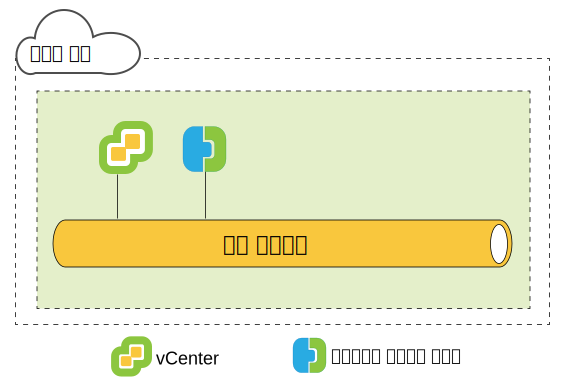
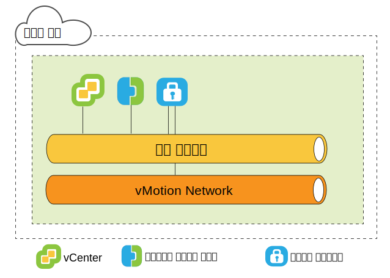
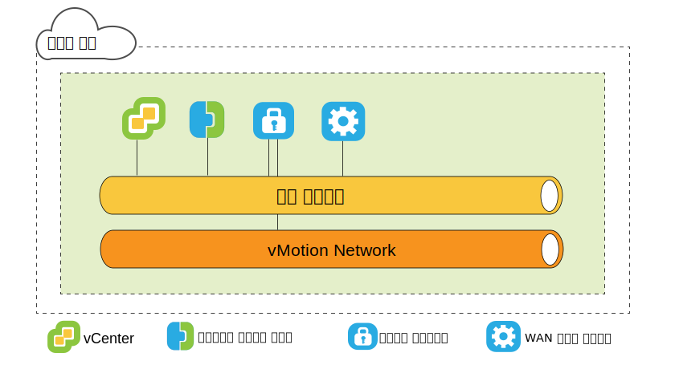
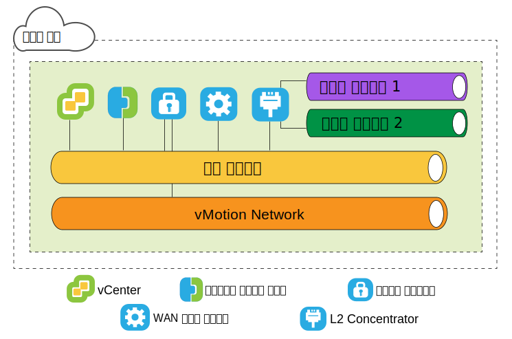
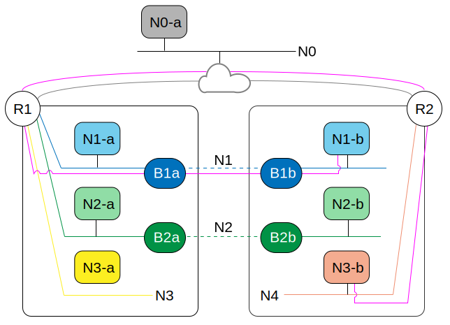

---

copyright:

  years:  2016, 2019

lastupdated: "2019-05-06"

subcollection: vmware-solutions

---

{:tip: .tip}
{:note: .note}
{:important: .important}

# VMware HCX on IBM Cloud 소스 측 아키텍처
{: #hcx-archi-source}

이 절에서는 소스 환경에 배치된 각 HCX 컴포넌트의 아키텍처에 대해 설명합니다.

## HCX 소개
{: #hcx-archi-source-intro-hcx}

HCX 기술을 통해 vSphere vCenter 네트워크가 IBM Cloud VCS 플랫폼으로 원활하게 통합됩니다. 하이브리드 네트워킹은 온프레미스 vSphere vCenter 네트워크를 IBM Cloud로 확장하며, 양방향 가상 머신(VM) 이동성을 지원합니다.

이 소개에는 수행할 수 있는 태스크와 마이그레이션 및 네트워크 확장을 지원하고 향상시키는 기능이 요약되어 있습니다.

* HCX는 소스 및 대상 암호화와 복호화 프로세스를 소유하며, 일관성 있는 보안을 보장하고 가상 머신 마이그레이션 및 네트워크 확장과 같은 하이브리드 워크플로우에 대한 참여를 제공합니다.
* HCX는 확장된 네트워크 성능을 향상시키도록 최적화된 소프트웨어 정의 WAN을 작성하며, 이를 통해 LAN 속도에 도달하는 성능을 사용할 수 있습니다.
* HCX는 양방향 워크로드와 IBM Cloud 네트워킹 서비스로의 VMware NSX 보안 정책 마이그레이션을 사용으로 설정합니다.
* HCX는 vSphere vCenter와 통합하고 vSphere Web Client에서 관리됩니다.

## 계층 2 네트워크 확장
{: #hcx-archi-source-layer-2-ext}

* vCenter에서 IBM Cloud까지 네트워크를 안전하게 확장합니다.
* HCX는 HT L2C(High Throughput Layer 2 Concentrator)를 제공합니다.
* 확장된 네트워크는 IBM Cloud NSX Edge 어플라이언스에 연결합니다.
* 다중 표준 Layer 2 Concentrator를 배치하여 확장성을 확보하고 처리량을 증가시킬 수 있습니다.
* 클라우드 게이트웨이와 확장된 계층 2를 통해 마이그레이션된 가상 머신은 IP와 MAC 주소를 보유할 수 있습니다.

## 가상 머신 마이그레이션 방법
{: #hcx-archi-source-vm-mig-methods}

### 짧은 작동 중단 마이그레이션
{: #hcx-archi-source-low-downtime-mig}

짧은 작동 중단 마이그레이션은 VMware ESX/ESXi 하이퍼바이저에서 구현되는 분배된 기술인 vSphere 복제에 의존합니다. HCX는 라이브 가상 머신의 복제본을 작성하고 IBM Cloud로 이동하며 소스 가상 머신의 전원을 끄고 마이그레이션된 가상 머신의 전원을 켜도록 전환을 수행합니다.
* 마이그레이션 경로는 항상 클라우드 게이트웨이를 통과합니다. 전송은 인터넷, 계층 2 확장 네트워크 또는 직접 연결 회선이 될 수 있습니다.
* 가상 머신은 모든 방향에서 여러 번 마이그레이션될 수 있습니다.

### vMotion 마이그레이션
{: #hcx-archi-source-vmotion-mig}

vMotion 마이그레이션은 vMotion이 IBM Cloud로 확장된 네트워크에서 라이브 가상 머신을 전송하는지 확인합니다. vMotion 마이그레이션은 무중단 마이그레이션 또는 교차 클라우드 vMotion이라고도 합니다.

### 콜드 마이그레이션
{: #hcx-archi-source-cold-mig}

확장된 네트워크를 통해 전원이 꺼진 가상 머신을 IBM Cloud로 전송하십시오.

### 공통 기능
{: #hcx-archi-source-common-feat}

* 설치된 경우 선택적인 소프트웨어 정의 WAN 최적화가 마이그레이션, 처리량 및 속도를 증가시킵니다.
* 마이그레이션은 지정된 시간에 발생하도록 스케줄될 수 있습니다.
* 마이그레이션된 가상 머신은 호스트 이름, 가상 머신 이름(또는 둘 다)을 유지할 수 있습니다.

## 네트워킹 기능
{: #hcx-archi-source-net-feat}

다음 네트워킹 기능은 클라우드 게이트웨이 및 Layer 2 Concentrator로 빌드됩니다.

* 인텔리전트 플로우 라우팅 - 워크로드가 가능한 빨리 이동되도록 인터넷 경로를 기반으로 최적의 연결을 자동으로 선택하고, 전체 연결을 효율적으로 분산시킵니다. 백업 또는 복제와 같이 대형 플로우로 인해 CPU 경합이 발생하는 경우 소형 플로우가 사용량이 적은 CPU로 라우트되어 대화식 트래픽의 성능이 향상됩니다.
* 근접 라우팅 - 온프레미스와 클라우드 모두에서 확장되고 라우팅되는 네트워크에 연결된 가상 머신 간의 전달이 대칭적인지 확인합니다.
* 보안 - 클라우드 게이트웨이는 스위트 B 호환 AES-GCM(IKEv2 사용), AES-NI 오프로드 및 플로우 기반 허가 제어를 제공합니다. HCX는 소스 및 대상 암호화와 복호화 프로세스를 소유하며, 일관성 있는 보안을 보장하고 가상 머신 마이그레이션 및 네트워크 확장과 같은 하이브리드 워크플로우에 대한 참여를 제공합니다.
  온프레미스 vCenter에 정의되고 가상 머신에 지정된 보안 정책은 가상 머신을 사용하여 마이그레이션될 수 있습니다.

## HCX 이해
{: #hcx-archi-source-understand-hcx}

HCX는 온프레미스 vCenter와 IBM Cloud 간의 다대다 관계를 지원합니다. 연결 모드에 있는 vCenter Server가 지원됩니다. 이 주제에서는 설치 프로그램이 온프레미스 데이터 센터 및 IBM Cloud 모두와 상호 작용하는 방법의 상위 레벨 개요를 제공합니다.

설치 중에 HCX Manager 가상 어플라이언스가 가져오기 되고 온프레미스 vCenter를 위한 플러그인으로 구성됩니다. 그런 다음 이 플러그인은 소프트웨어 정의 WAN 서비스 배치를 구성하는 데 사용됩니다. 자동화된 구성은 온프레미스 vCenter에서 가상 머신으로 각 하이브리드 서비스 어플라이언스를 프로비저닝하고 IBM Cloud에서 해당 가상 머신을 배치합니다.

배치에 성공하려면 다음이 필요합니다.
* 가상 어플라이언스에 적합한 충분한 리소스
* 네트워크는 로컬 및 원격 가상 어플라이언스, 기타 VM과 통신하도록 어플라이언스를 허용해야 합니다.

## 배치 개요
{: #hcx-archi-source-deployment-ovw}

HCX Manager 가상 머신이 먼저 설치되고, 그런 다음 온프레미스 및 클라우드에서 기타 서비스 가상 머신 어플라이언스의 설치를 관리합니다.

다음은 기본 설치 태스크의 요약입니다.
1. 하이브리드 클라우드 엔터프라이즈 가상 어플라이언스 OVA 파일을 얻으십시오.
2. vSphere Web Client에서 IBM Cloud에 연결되는 온프레미스 vCenter에 HCX Manager 서비스 가상 어플라이언스를 설치하십시오.
3. vSphere Web Client에서 HCX 플러그인에 IBM Cloud 엔드포인트를 등록하십시오. 등록으로 온프레미스 HCX와 IBM Cloud의 HCX 인스턴스 간에 일대일 관계가 설정됩니다.
4. 서비스 가상 어플라이언스를 설치하고 구성하십시오.
5. 온프레미스로 설치된 각 어플라이언스의 경우 설치 프로그램이 대상 IBM Cloud에서 해당 서비스 가상 어플라이언스를 프로비저닝합니다.
6. 설치 후 HCX Manager는 로컬 및 원격 서비스 가상 어플라이언스를 모두 제어합니다. IBM Cloud에서 HCX는 서비스로서 프로비저닝된 소프트웨어 정의 WAN 컴포넌트를 관리합니다.

### 배치 컴포넌트 성능 고려사항
{: #hcx-archi-source-perf-consid}

아키텍처 계획에는 마이그레이션될 VM, 가상 머신 트래픽에 사용되는 네트워크 및 확장될 네트워크가 포함됩니다. 이 주제에서는 배치 컴포넌트의 일부 최대값 및 최소값을 요약합니다.
* vSphere vCenter. HCX Manager 어플라이언스는 하이브리드 서비스가 필요한 vCenter에 설치되어야 합니다. vCenter당 하나의 HCX 배치만 있을 수 있습니다. 이 제한사항은 연결 모드에 적용됩니다. HCX 관리 어플라이언스는 기본 vCenter에만 설치됩니다. HCX는 연결 모드에서 최대 다섯 개의 등록된 vCenter를 지원합니다.
* 클라우드 등록. 클라우드 엔드포인트의 최대 수는 10개입니다. 엔드포인트 수를 찾기 위해 하이브리드 클라우드 서비스는 클라우드에 대한 vCenter 연결을 추적합니다.

### 마이그레이션 및 네트워크 확장의 최대 수
{: #hcx-archi-source-max-mig-net-extension}

* 최대 동시 짧은 작동 중단 마이그레이션 태스크 수 - 15
* 최대 동시 L2C 확장 태스크 수 - 1
* 최대 동시 vMotion 마이그레이션 태스크 수 - 1

### HCX 관리 엔터프라이즈
{: #hcx-archi-source-hcxme}

HCX 관리 엔터프라이즈 OVA는 소스 환경에 배치되고, 소스 vSphere 인프라를 관리하는 vCenter Server를 위한 플러그인으로 등록됩니다. 그런 다음 이 플러그인은 교차 클라우드 마이그레이션과 L2 네트워크 확장을 사용으로 설정하는 데 필요한 마이그레이션 및 네트워크 서비스를 구성하기 위해 사용됩니다.

vCenter당 하나의 HCX 배치만 있을 수 있습니다. 이 제한사항은 연결 모드에 적용됩니다. HCX 관리 어플라이언스는 기본 vCenter에만 설치됩니다. HCX Manager는 연결 모드에서
최대 다섯 개의 등록된 vCenter를 지원합니다.
{:note}

### HCX 가상 애플리케이션
{: #hcx-archi-source-hcxva}

설치 패키지는 하이브리드 클라우드 서비스 플러그인가 포함된 OVA 파일입니다. 이 하이브리드 클라우드
서비스 관리 어플라이언스는 설치 및 구성된 후 서비스 어플라이언스 가상 머신을 구성하는 데 사용됩니다.
* HCX Manager
* 하이브리드 클라우드 게이트웨이
* Layer 2 Concentrator
* WAN 최적화 프로그램

### HCX Manager
{: #hcx-archi-source-hcxm}

HCX Manager 플러그인은 온프레미스에만 배치됩니다. SD-WAN을 위한 서비스 가상 어플라이언스를 관리합니다. HCX Manager 가상 어플라이언스는 소스 vCenter에 대한 확장이며 가상 머신으로 배치됩니다. 어플라이언스의 파일 구조에는 모든 하이브리드 서비스 가상 어플라이언스가 포함됩니다. HCX Manager는 온프레미스 및 클라우드에서 클라우드 게이트웨이, Layer 2 Concentrator 및 WAN 최적화 가상 어플라이언스의 배치 및 구성을 관리합니다.

가상 어플라이언스는 하드 드라이브에 씬 또는 thick 프로비저닝으로 설치될 수 있습니다. 기본적으로 서비스 가상 어플라이언스의 하드 드라이브는 씬으로 프로비저닝됩니다.

서비스, 가상 어플라이언스 구성 및 배치가 완료되면 이 가상 머신에 로그인하여 하이브리드 클라우드 서비스 관리 포털을 사용하십시오.

### HCX 클라우드 게이트웨이
{: #hcx-archi-source-hcg}

HCX 클라우드 게이트웨이는 vSphere와 IBM Cloud 간에 보안 채널을 설정하고 유지보수합니다.

HCX는 IBM Cloud에 대한 사이트 대 사이트 연결을 부트스트랩하도록 강력한 암호화를 사용합니다. vSphere와 IBM Cloud 간의 보안 채널은 네트워킹 "중간 구간" 보안 문제점을 방지하며 테넌트 감지가 아닌 vSphere 프로토콜을 위해 다중 테넌시를 수행합니다.

클라우드 게이트웨이는 양방향 마이그레이션을 수행하도록 vSphere 복제 기술을 통합합니다.

### WAN 최적화 프로그램
{: #hcx-archi-source-wan-opt}

HCX는 소프트웨어 정의 WAN 최적화도 제공합니다. WAN 최적화 어플라이언스는 권장되는 컴포넌트로, 대기 시간의 영향을 줄이기 위해 WAN 조건 지정을 수행합니다. 패킷 유실 시나리오 및 중복되는 트래픽 패턴의 중복 제거를 무효화하도록 순방향 오류 정정도 통합합니다. 이를 통해 대역폭 사용이 줄어들고 IBM Cloud로(에서) 데이터 전송을 가속화할 수 있는 사용 가능한 네트워크 기능을 최대한 활용할 수 있습니다.

가상 머신 마이그레이션은 vSphere 온프레미스와 IBM Cloud 간의 뛰어난 이동성을 구현하도록 클라우드 게이트웨이 및 WAN 최적화 어플라이언스의 결합에 의존합니다.

### Layer 2 Concentrator
{: #hcx-archi-source-layer-2-conc}

네트워크 확장 서비스는 Layer 2 Concentrator(L2C)에서 제공됩니다. 이를 통해 온프레미스 vSphere 데이터 센터에서 IBM Cloud까지 계층 2 네트워크가 확장되고 데이터 센터와 클라우드 간의 원활한 마이그레이션이 사용으로 설정됩니다. Layer 2 Concentrator는 온프레미스 네트워크를 IBM으로 확장하는 데 필요합니다.

Layer 2 Concentrator 어플라이언스에는 다음과 같은 두 가지 인터페이스가 있습니다.
* 내부 트렁크 인터페이스: IBM Cloud에서 확장된 해당 네트워크에 맵핑하는 트랜잭션 브릿지를 사용하여 확장된 네트워크를 위한 가상 머신 트래픽 온프레미스를 처리합니다.
* 업링크 인터페이스: HCX는 IBM Cloud로(에서) 캡슐화된 오버레이 트래픽을 전송하도록 이 인터페이스를 사용합니다. 애플리케이션 데이터는 이 인터페이스를 통해 이동됩니다.

### 마이그레이션에만 해당
{: #hcx-archi-source-mig-only}

마이그레이션만 수행하기 위한 최소한의 구성에는 HCX Manager 및 클라우드 게이트웨이 어플라이언스가 필요합니다. 네트워크 확장 없이 가상 머신을 마이그레이션할 수 있습니다. 이 경우 가상 머신은 마이그레이션된 후 게스트 사용자 정의 서비스를 사용하여 새 IP 주소를 얻습니다.

네트워크를 확장하고 원래 IP 주소를 유지하려면 분배된 가상 스위치가 온프레미스 vSphere vCenter에서 구성되어야 합니다.

WAN 최적화를 통해 속도가 빨라질 수 있습니다. 즉, 고속 라인(예: 직접 연결)을 사용하도록 클라우드 게이트웨이를 구성하면 WAN 최적화된 트래픽에 맞는 상위 대역폭 링크를 제공하여 속도가 빨라집니다.

확장된 네트워크의 가상 머신을 IBM Cloud로 마이그레이션하는 것이 좋습니다. 작동 중단이 줄어들고 가상 머신에서 구성이 변경되지 않기 때문입니다. 가상 머신에는 IP 주소, MAC 주소, 컴퓨터 이름 및 가상 머신 이름을 보유할 수 있습니다. 이 특성을 보유하면 IBM Cloud에 대한 마이그레이션이 크게 간소화되고 온프레미스 데이터 센터로 쉽게 돌아갈 수 있습니다. 네트워크 확장 기능에는 vSphere Enterprise Plus Edition에서 사용 가능한 vSphere 분배 스위치가 필요합니다.

### IP 주소 요구사항
{: #hcx-archi-source-ip-req}

HCX를 배치하려면 온프레미스와 대상 IBM Cloud 모두에서 적절한 수의 IP 주소를 사용할 수 있어야
합니다.

* vMotion 주소
  vMotion에 개별 네트워크를 유지하는 것은 온프레미스 데이터 센터의 공통 사례입니다. 클라우드 게이트웨이에는 vMotion 네트워크에 대한 액세스 권한이 있어야 합니다. 그렇지 않으면, vMotion 네트워크와 통신하기 위한 추가 IP 주소가 필요합니다.

* 온프레미스
  * HCX Manager 어플라이언스에 하나의 IP 주소
  * 각 클라우드 게이트웨이에 하나의 IP 주소. 개별 vMotio 네트워크가 있는 경우 하나를 추가합니다.
  * 각 표준 Layer 2 Concentrator에 하나의 IP 주소

* IBM Cloud
  * IBM Cloud에 연결되는 HCX Manager 어플라이언스당 두 개의 IP 주소. 주소는 인터넷 또는 하나 이상의 직접 연결 회선에 연결하는 데 사용될 수 있습니다.
  * 개별 vMotion 네트워크 연결이 있는 경우 하나를 추가합니다.

### 근접 라우팅 기능
{: #hcx-archi-source-prox-routing-feat}

근접 라우팅은 클라우드 게이트웨이가 구성될 때 사용으로 설정할 수 있는 네트워킹 기능입니다.

근접 라우팅은 온프레미스와 클라우드 모두에서 확장되고 라우팅되는 네트워크에 연결된 가상 머신 간의 전달이 대칭적인지 확인합니다. 이 기능에는 고객 프레미스와
클라우드 간에 구성되어 있는 동적 라우팅이 필요합니다.

사용자가 네트워크를 클라우드에 확장하는 경우 계층 2 연결이 IBM Cloud로 확장됩니다. 그러나 라우트 최적화가 없으면 계층 3 통신 요청은 라우트되도록 온프레미스 네트워크 원점으로 돌아가야 합니다. 이 돌아가기는 "트럼본" 또는 "헤어핀"이라고 합니다.

트럼본은 소스 및 대상 가상 머신이 모두 클라우드에 상주하는 경우에도 패킷이 네트워크 원점과 클라우드 사이를 이동해야 하므로 비효율적입니다. 비효율성 외에도, 전달 경로에 상태 저장 방화벽 또는 연결의 양방향이 모두 표시되어야 하는 기타 인라인 장비가 포함되어야 하는 경우 통신에 실패할 수 있습니다. 클라우드를 종료하는 유출 경로가 확장된 계층 2 네트워크가 될 수 있거나 VCS NSX Edge Gateway를 통할 수 있는 경우 가상 머신 통신(라우트 최적화 없이) 장애가 발생합니다. 온프레미스 네트워크는 확장된 네트워크 "바로 가기"에 대해 알지 못합니다. 이 문제점을 비대칭 라우팅이라고 합니다. 솔루션은 온프레미스 네트워크가 IBM Cloud를 통해 라우트에 대해 알아볼 수 있도록 근접 라우팅을 사용으로 설정하는 것입니다.

트럼본을 방지하기 위해 HCX는 지능형 라우트 관리를 사용하여 가상 머신 상태에 적합한 라우트를 선택합니다. 클라우드 게이트웨이는 클라우드에서 가상 머신의 인벤토리를 유지보수합니다. 또한 다음과 같은 가상 머신 상태를 이해하고 있습니다.
* vMotion을 사용하여 클라우드로 전송됨(무중단 마이그레이션)
* 호스트 기반 복제를 사용하여 클라우드로 마이그레이션됨(짧은 중단 마이그레이션)
* 클라우드에 작성됨(확장된 네트워크에서)

### 근접 라우팅 솔루션이 사용된 비대칭 라우팅
{: #hcx-archi-source-asymm-routing}

다이어그램에서 왼쪽에 있는 `N*a` 컴포넌트는 온프레미스 데이터 센터에 있고 오른쪽에 있는 `N*b`
컴포넌트는 클라우드에 있습니다.

R1은 N1-b의 기본 게이트웨이이므로 N1-b는 R2를 통해 트래픽을 라우트하도록 R1로 돌아가야 합니다. 비대칭 라우팅을 방지하기 위해 HCX는 호스트 라우트를 IBM Cloud VCS 배치의 NSX 오버레이 내에 삽입합니다. 가상 머신이 클라우드에 새로 작성되었거나 짧은 작동 중단 마이그레이션으로 이동된 경우 호스트 라우트가 즉시 삽입됩니다.

가상 머신이 vMotion을 사용하여 전송된 경우 라우트는 가상 머신이 다시 부팅될 때까지 삽입되지 않습니다. 다시 부팅될 때까지 기다리면 온프레미스 상태 저장 디바이스는 가상 머신이 다시 부팅될 때까지 계속해서 기존 세션에 대한 서비스를 제공하는 것이 확인됩니다. 다시 부팅 후 라우팅 정보는 온프레미스와 클라우드 모두에서 일치합니다.

즉, R1은 로컬로 연결되어 있는 확장된 네트워크를 사용하지 않고 라우팅을 사용하여 R2를 통해 특정 가상 머신에 도달할 수 있습니다. R2는 근접 라우팅이 사용 가능한 상태에서 가상 머신에 도달하도록 다른 네트워크의 경로를
완전히 소유하고 있습니다.

### MAC 주소 보유
{: #hcx-archi-source-mac-addr-ret}

* MAC 주소를 보유할 수 있는 옵션은 마이그레이션 마법사의 선택란에 해당됩니다. 복제 기반의 마이그레이션에 대해서만 표시됩니다.
* 기본적으로 **MAC 보유**는 소스 가상 머신이 확장된 네트워크에 있는 경우 사용으로 설정되고 네트워크가 확장되지 않은 경우 사용 안함으로 설정됩니다. MAC 주소를 보유하지 않은 경우 마이그레이션이 완료되면 가상 머신은 새 주소를 얻습니다. MAC 주소를 보유하거나 새 주소를 얻는 결정은 마이그레이션 프로세스 및 사후 마이그레이션 네트워크 트래픽 플로우에 영향을 줄 수 있습니다.
* MAC 주소를 보유해야 하는 이유는 다음과 같습니다.
  * MAC 주소를 기반으로 한 라이센스: 일부 소프트웨어는 라이센스와 VM의 MAC 주소를 쌍으로 설정합니다. 가상 머신의 MAC 주소를 변경하면 라이센스가 무효화됩니다.
  * Linux NIC 순서: Linux에서 가상 머신에서 MAC 주소가 변경되면 다시 부팅 후 NIC 이더넷 디바이스 번호가 변경될 수 있습니다. 디바이스 번호 변경으로 운영 체제 내에서 NIC 표시 순서가 변경될 수 있으며, NIC 순서에 따라 달라지는 애플리케이션 또는 스크립트가 중단됩니다.
  * 네트워크가 확장되면 작동 중단이 줄어듬: 가상 머신이 확장된 네트워크를 통해 마이그레이션되는 경우 네트워크에 새 MAC 주소 정보가 필요하지 않으므로 **MAC 보유**를 사용으로 설정하면 작동 중단이 최소화됩니다.
  * 선택란은 마이그레이션 오퍼레이션 중에 대상 네트워크 선택 페이지에 표시됩니다.

### 보안 정책 마이그레이션
{: #hcx-archi-source-sec-policy-mig}

정책 마이그레이션 기능을 사용하면 NSX 분산 방화벽 규칙이 온프레미스 vCenter 센터에서 VCS HCX 사용 클라우드로 이동될 수 있습니다. High Throughput Layer 2 Concentrator를 사용하여 확장된 네트워크를 통해 가상 머신으로 이동하기 위해 짧은 작동 중단 마이그레이션 또는 vMotion을 사용하는 경우 정책 마이그레이션이 가능합니다.
* 온프레미스 데이터 센터에는 NSX 6.2.2 이상이 실행되어야 합니다.
* vSphere에서 보안 정책은 많은 규칙을 포함할 수 있는 단일 NSX 섹션입니다. 조직 vDC당 하나의 섹션(정책)만 있을 수 있습니다.
* 정책에 참여하기 위해 IP 주소 또는 MAC 주소 세트가 식별될 수 있습니다. MAC 세트 또는 IP 세트 이름은 218자를 초과할 수 없습니다.
* 섹션의 모든 규칙에는 고유한 이름이 있어야 합니다. 규칙 이름을 공백으로 두지 마십시오.
지원되는 규칙은 소스 또는 대상으로 계층 3 IP 주소 또는 IP 세트를 지정하거나 계층 2 MAC 주소 또는 MAC 세트를 지정합니다.

소스 또는 대상에 대해 보안 그룹 또는 애플리케이션 그룹을 지정하는 규칙은 마이그레이션되지 않습니다.
{:note}

마이그레이션된 정책에 대한 변경사항은 정책을 사용하는 모든 VM에 전파됩니다.

## 관련 링크
{: #hcx-archi-source-related}

* [소스에 설치 및 구성](/docs/services/vmwaresolutions/archiref/hcx-archi?topic=vmware-solutions-hcx-archi-install-cfg-src)
