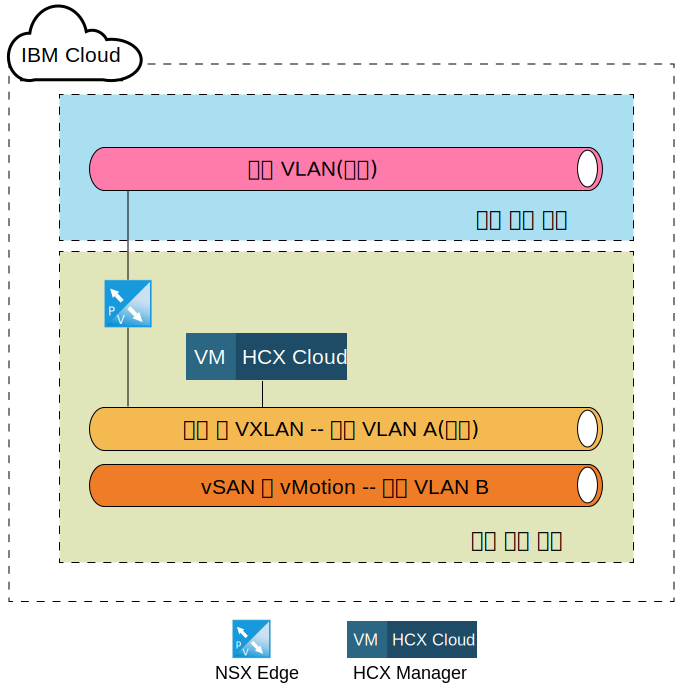
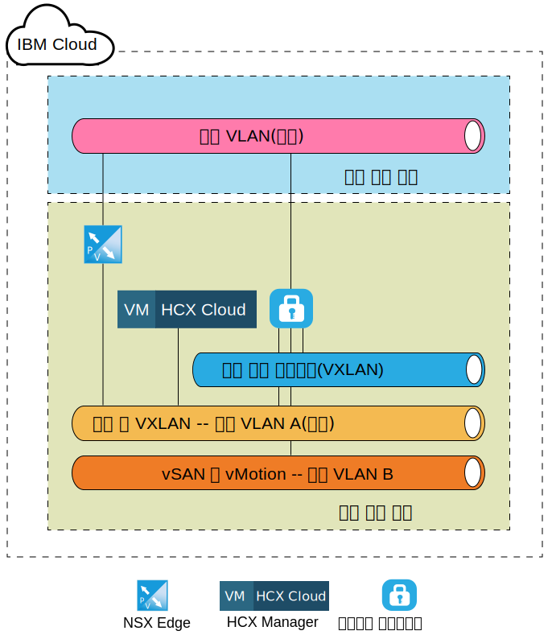
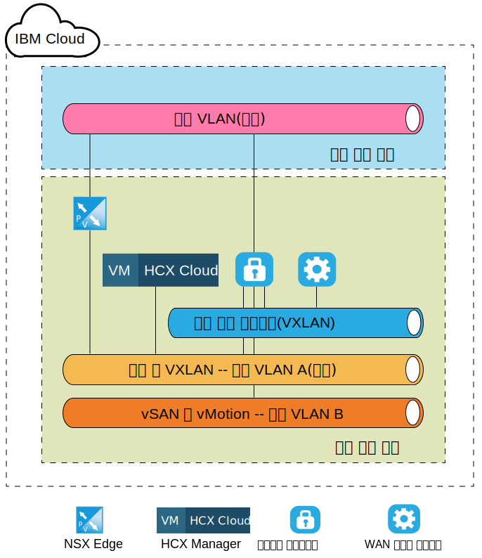
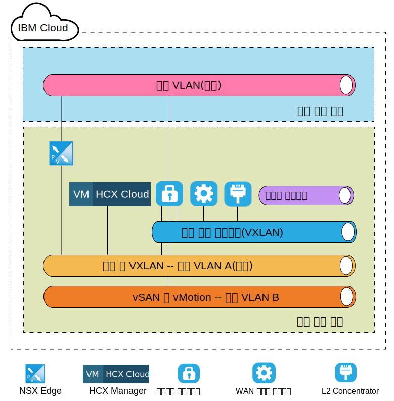

---

copyright:

  years:  2016, 2019

lastupdated: "2019-01-23"

---
# VMware HCX on IBM Cloud 컴포넌트 레벨 대상 아키텍처

 이 절에서는 IBM Cloud 내에 배치된 각 HCX 컴포넌트의 아키텍처에 대해 설명합니다. IBM Cloud 내의 스포크(대상) 배치 모델이 논의됩니다.

## NSX Edge

IBM Cloud 내에 구성된 첫 번째 컴포넌트는 NSX Edge 가상 머신의 쌍입니다. 모든 IBM Cloud for VMware Solutions 배치가 IBM CloudDriver 아웃바운드 통신을 위해 에지 디바이스를 설치하고 구성한다는 점에 유의해야 합니다. 이 ESG가 하이브리드 클라우드 서비스 통신에 재사용될 수 있으나 새 쌍이 배치되는 것이 좋습니다.

NSX Edge 가상 머신은 초대형 NSX Edge 디바이스의 활성/수동 쌍으로 구성됩니다. 이 디바이스는 공용 인터넷 연결을 통해 IBM Cloud VMware 환경에 연결하는 데 사용됩니다. 초대형 NSX Edge는 높은 처리량이 반드시 필요하지 않은 수 백만 개의 동시 세션이 포함된 로드 밸런서가 있는 환경에 적합하지 않으므로 내부 환경에 맞게 선택됩니다. 구성 프로세스의 일부로 NSX Edge는 관리 인프라로 지정된 IBM Cloud 공용 VLAN 및 IBM Cloud 사설 VLAN에 연결됩니다.

표 1. NSX Edge 배치

|컴포넌트 | 구성 |
|-----------|---------------|
|CPU       | 6개의 vCPU        |
| RAM       | 8GB          |
| 디스크      | 4GB 스왑이 사용된 공유 스토리지에 상주하는 4.5GB VMDK |

NSX Edge가 내부 또는 전용 배치에서 활성/수동으로 구성되어 있으므로 NSX Edge가 각 피어 어플라이언스와 동일한 호스트에 실행되지 않도록 사용자가 vSphere DRS(Distributed Resource Scheduler) 비유사성 규칙을 작성해야 합니다.

표 2. NSX Edge 비유사성 규칙

| 필드     |값         |
|-----------|---------------|
|이름      | NSX Edge External Gateway |
|유형      | 개별 가상 머신 |
|멤버   | NSX Edge 1 |
|           | NSX Edge 2 |

IBM Cloud 내에 배치된 NSX Edge 어플라이언스 외에도 VMware HCX on IBM Cloud 서비스가 주문된 경우 HCX Manager 가상 어플라이언스가 배치됩니다. 이 어플라이언스 배치 후 NSX Edge는 로드 밸런싱 사용을 위해 사용으로 설정되고 소스에서 인바운드 연결을 위해 인증서를 사용하는 애플리케이션 프로파일로 구성됩니다. NSX Edge는 HCX Manager, vCenter 및 PSC 어플라이언스를 가리키도록 로드 밸런싱 풀로도 구성됩니다. 또한 가상 서버는 가상 IP 주소(VIP)로 풀을 연결하는 규칙을 사용하여 공용 인터페이스에서 VIP로 작성됩니다. 다음 표에는 NSX Edge의 가상 서버 구성 및 풀 구성에 대한 샘플이 표시되어 있습니다.

표 3. NSX Edge를 위한 VIP 구성 - 가상 서버

| 필드     |값         |
|-----------|---------------|
|가상 서버 ID | virtualServer-1 |
|이름 | HCX-VIP |
|설명 | LB-VIP |
| 기본 풀 | pool-1 |
| IP 주소 | 254 |
| 프로토콜 | https |
| 포트 | 443 |

표 4. NSX Edge를 위한 VIP 구성 - 가상 서버 세부사항

| 필드     |값         |
|-----------|---------------|
|설명 | LB-VIP |
| 연결 제한 | 0 |
| 서비스 삽입 상태 | 사용 안함 |
| 애플리케이션 프로파일 | applicationProfile-1 |
| 연결 비율 제한 | 0 |
| 가속화 상태 | 사용 안함 |
| 서비스 프로파일 상태 |  |

표 5. NSX Edge를 위한 VIP 구성 - 규칙

| 필드     |값         |
|-----------|---------------|
| 규칙 ID | applicationRule-1 |
|이름 | appRule1 |
| 스크립트 | acl isHibridity url_beg /hibridity     acl isWebSso url_beg /websso     acl isVCenter url_beg /vsphere-client     use_backend nspPool001 if isHybridity     use_backend vcPool001 if isVCenter     use_backend ssoPool001 if isWebSso |

표 6. NSX Edge를 위한 풀 구성 - 풀 요약

| 풀 ID |이름       | 알고리즘   | 모니터 ID |
|---------|------------|-------------|------------|
| pool-1  | nspPool001 | ROUND-ROBIN |            |
| pool-3  | ssoPool001 | ROUND-ROBIN |            |
| pool-2  | vcPool001  | ROUND-ROBIN |            |

표 7. NSX Edge를 위한 풀 구성 - 풀 세부사항

| 필드           |값     |
|-----------------|-----------|
|설명     |           |
| 투명     | 사용 안함  |
|이름            | HCX-CLOUD |
| 중량          |1         |
| 모니터 포트    | 8443      |
| 최대 연결 수 | 0         |
| 최소 연결 수 | 0         |

## HCX Manager

HCX Manager 컴포넌트는 NSX Edge 어플라이언스가 대상에 구성된 후 배치되는 첫 번째 어플라이언스입니다. 이 어플라이언스는 소스 컴포넌트에 맞는 클라우드 환경에 대한 기본 인터페이스로 사용되며, NSX를 직접 사용하지 않고 라우팅을 설계하고 구성하는 것 외에도 네트워크를 추가, 편집 및 삭제하는 데 사용될 수 있는 추상화된 네트워킹 사용자 인터페이스를 제공합니다. vCenter 및 NSX 통합의 결과로 HCX Manager 어플라이언스는 관리 VLAN의 사설 포터블 IP 주소가 지정됩니다.

또한 특정 사용자가 vCenter 및 NSX에 액세스하도록 구성됩니다. HCX Manager의 IP 주소가 로드 밸런싱을 위해 NSX Edge에서 사용되는 IP 주소와 동일하다는 점에 유의해야 합니다.

HCX Manager 클라우드 컴포넌트가 배치되고 구성된 후 소스 컴포넌트는 NSX ESG에 구성된 VIP 주소를 통해 HCX Manager에 대한 연결을 작성합니다. 연결되면 클라우드 게이트웨이와 WAN 최적화 프로그램이 IBM Cloud 내에 배치됩니다.

그림 1. 대상 - 하이브리드 클라우드 서비스 어플라이언스

## 클라우드 게이트웨이

가상 어플라이언스는 연결이 소스에서 대상 클라우드로 설정된 후 배치됩니다. 이 어플라이언스는 클라우드 게이트웨이(CGW)이며 소스로 지정된 vSphere 환경과 IBM Cloud 간에 보안 채널을 유지보수하는 데 사용됩니다. IBM Cloud 내에 배치된 CGW 어플라이언스의 크기 지정 스펙은 표 3 클라우드 게이트웨이 배치에 나열되어 있습니다.

표 8. 클라우드 게이트웨이 배치

|컴포넌트 | 구성 |
|-----------|---------------|
|CPU       |8개의 vCPU        |
| RAM       | 3GB          |
| 디스크      | 공유 스토리지에 상주하는 2.0GB VMDK |

이 클라우드 게이트웨이는 IBM Cloud for VMware Solutions 배치의 vMotion VLAN(사설 포터블 서브넷)을 비롯하여 관리 VLAN(사설 포터블 서브넷)에 상주하도록 구성되고 배치됩니다. 또한 다른 인터페이스가 공용 인터넷을 통해 작성되는 연결을 위해 공용 VLAN(공용 포터블)에 구성됩니다. 공용 액세스는 직접 연결(사설 연결 배치)이 있는 경우 필요하지 않습니다. 클라우드 게이트웨이와 연관된 마지막 연결은 사이트 쌍에 작성되고 구성되는 논리 스위치입니다.

이 논리 스위치는 클라우드 게이트웨이와 WAN 최적화 프로그램(4.1.4 WAN(TBD)에서 논의됨) 간의 통신 채널로 사용되는 라우트 불가능 사설 네트워크입니다.

다음 그림은 클라우드 게이트웨이 어플라이언스와 지정된 연결의 상위 레벨 컴포넌트 다이어그램에 대해 설명합니다.

그림 2. 클라우드 게이트웨이 배치

## WAN 최적화 프로그램

배치되는 두 번째 컴포넌트는 WAN Optimization 어플라이언스입니다. WAN 최적화 어플라이언스는 선택적이지만 대기 시간의 영향을 줄이기 위해 WAN 조건 지정을 수행합니다. 패킷 유실 시나리오 및 중복되는 트래픽 패턴의 중복 제거를 무효화하도록 순방향 오류 정정도 통합합니다.

이를 통해 대역폭 사용이 줄어들고 IBM Cloud로(에서) 데이터 전송을 가속화할 수 있는 사용 가능한 네트워크 기능을 최대한 활용할 수 있습니다. WAN 최적화 프로그램은 디스크 집약적이며 올바르게 작동하도록 충분한 양의 IOPS가 필요합니다. 따라서 WAN 최적화 프로그램은 VCF 환경 및 Endurance 스토리지 내의 vSAN 스토리지에 상주하고 vCenter Server 배치 내에 2,000가 넘는 IOPS를 지원합니다. 다음 표에는 WAN 최적화 어플라이언스의 크기 지정 스펙이 표시되어 있습니다.

표 9. WAN 최적화 프로그램 어플라이언스 크기 지정

|컴포넌트 | 구성 |
|-----------|---------------|
|CPU       |8개의 vCPU        |
| RAM       | 14GB          |
| 디스크      | 공유 스토리지에 상주하는 30GB VMDK + 70GB VMDK |

클라우드 게이트웨이와는 달리 WAN 최적화 어플라이언스는 WAN 최적화 어플라이언스와 클라우드 게이트웨 간의 통신을 사용으로 설정하도록 논리 스위치에만 연결됩니다. WAN 최적화가 소스 환경 내에서 사용 중인 경우 이 어플라이언스가 필요합니다. 네트워크 레이아웃을 보려면 다음 그림을 참조하십시오.

그림 3. WAN 최적화 프로그램 배치

## Layer 2 Concentrator

세 번째 컴포넌트는 L2C(Layer 2 Concentrator)로 알려져 있으며 네트워크 확장 서비스의 일부입니다. L2C는 IBM Cloud에 대한 온프레미스 데이터 센터 네트워크의 확장을 허용하는 가상 머신입니다. L2C는 온프레미스 VLAN 및/또는 VXLAN을 확장합니다. 각 L2C는 최대 4096개의 VLAN까지 확장할 수 있습니다. 온프레미스 파트너와 페어링될 때 각 L2C는 "플로우"당 최대 1Gbps를 제공하고 VLAN(또는 VXLAN)당 최대 4Gbps의 집계를 제공할 수 있습니다. 추가 네트워크 처리량이 필요한 경우 추가 L2C 어플라이언스의 배치가 지원됩니다.

이 디자인의 일부로 L2C 어플라이언스는 고객이 공용 인터넷 또는 사설 네트워크 또는 직접 링크를 통해 다중 VLAN 및 VLXAN을 IBM Cloud로 확장할 수 있도록 배치됩니다. 다음 표에는 IBM Cloud의 L2C 어플라이언스에 대한 크기 지정 스펙이 나열되어 있습니다.

표 10. HT L2C 어플라이언스 크기 지정

|컴포넌트 | 구성 |
|-----------|---------------|
|CPU       |8개의 vCPU        |
| RAM       | 38GB          |
| 디스크      |공유 스토리지의 2GB VMDK |

L2C 어플라이언스는 공용 VLAN을 비롯하여 관리 VLAN에 배치됩니다. 공용 인터페이스는 확장된 네트워크의 소스에 바인드된 애플리케이션 트래픽에 사용됩니다. 확장된 네트워크와 같은 추가 연결은 소스 관리자가 IBM Cloud에 대한 네트워크 확장을 시작한 후 작성되고 L2C 어플라이언스에 접속됩니다. 다음 그림에서는 이러한 네트워크 및 연결의 예제를 보여줍니다.

그림 4. L2 Concentrator 배치

### 관련 링크

* [소스에 설치 및 구성](/docs/services/vmwaresolutions/archiref/hcx-archi/hcx-archi-source.html)
