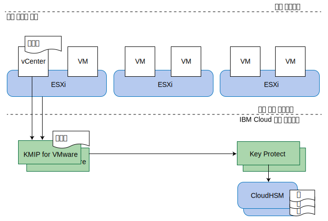

---

copyright:

  years:  2016, 2019

lastupdated: "2019-02-15"

---

{:tip: .tip}
{:note: .note}
{:important: .important}

# KMIP for VMware 디자인
{: #kmip-design}

KMIP for VMware on {{site.data.keyword.cloud}}는 루트 키 및 데이터 키 스토리지를 제공하기 위해 [IBM Key Protect](/docs/services/key-protect?topic=key-protect-getting-started-tutorial)를 사용하여 VMware vSAN 암호화 및 VMware vSphere 암호화와 호환 가능한 키 관리 서비스를 제공합니다.

## 스토리지 암호화 옵션
{: #kmip-design-storage-options}

KMIP for VMware는 VMware vSAN 암호화 및 vSphere 암호화 모두와 호환 가능합니다. 이 두 개의 솔루션은 하이퍼바이저 계층에서 구현되지만 약간 다른 기능을 제공합니다. 사용자 요구사항에 따라 해당 기능을 평가하십시오.

### VMware vSAN 암호화
{: #kmip-design-vsan-encrypt}

VMware vSAN 암호화는 vSAN 데이터 저장소에만 적용할 수 있습니다. 이 솔루션에서 VMware vCenter 및 VMware ESXi 호스트는 키 관리 서버(예: KMIP for VMware)에 연결하여 암호화 키를 가져옵니다. 이 키는 캐시 및 용량 디스크를 모두 포함하여 vSAN 데이터 저장소에 사용된 개별 디스크 드라이브를 보호하는 데 사용됩니다. vSAN 암호화는 vSAN 압축 및 중복 제거의 이점을 유지하는 방식으로 구현됩니다.

vSAN 암호화가 데이터 저장소 레벨에서 작동하므로 기본 목표는 실제 디스크 드라이브의 손상이 발생하는 경우 데이터 노출을 방지하는 것입니다. 또한 vSAN 암호화는 모든 가상 머신 백업 및 복제 기술(예: vSphere 복제, 교차 vCenter vMotion, VMware HCX, Zerto, Veeam 및 IBM Spectrum Protect Plus)과 완전히 호환 가능합니다.

**참고**:
* vSAN 암호화는 클러스터 내에서 호스트 대 호스트 vSAN 복제 통신을 암호화하지 않습니다.
* vSAN 암호화는 기타 스토리지 솔루션(예: {{site.data.keyword.cloud_notm}} Endurance 파일 및 블록 스토리지)에 적용되지 않습니다.
* vSAN 암호화에는 vSAN Enterprise 라이센스가 필요합니다.
* vSAN 상태 검사 시 하나 이상의 vSphere 호스트에서 KMS 클러스터에 연결할 수 없다는 경고가 주기적으로 나타날 수 있습니다. 이러한 경고는 vSAN 상태 검사 연결 제한시간이 너무 빨리 초과하기 때문에 발생합니다. 이 경고는 무시해도 됩니다.

### vSphere 암호화
{: #kmip-design-vsphere-encrypt}

VMware vSphere 암호화는 vSAN 스토리지와 {{site.data.keyword.cloud_notm}} Endurance 파일 및 블록 스토리지를 포함한 모든 유형의 VMware 스토리지에 적용됩니다.

이 솔루션에서 vCenter Server 및 ESXi 호스트는 키 관리 서버(예: KMIP for VMware)에 연결하여 암호화 키를 가져옵니다. 이 키는 VM 스토리지 정책에 따라 개별 가상 머신(VM) 디스크를 보호하는 데 사용됩니다.

vSphere 암호화가 가상 머신 디스크 레벨에서 작동하므로, 이는 실제 디스크 드라이브의 유실이나 VM 디스크의 유실이 발생한 경우 데이터 유출을 방지할 수 있습니다. 제공된 데이터가 암호화되어 있으므로 다수의 백업 및 복제 기술은 효과적으로 백업하거나 복제할 수 없습니다.

따라서 vSphere 암호화는 vSphere 복제, Cross-vCenter vMotion, VMware HCX, Zerto 또는 IBM Spectrum Protect Plus와 호환되지 않습니다. 그러나 적절히 구성된 경우 Veeam 백업 및 복제는 vSphere 암호화와 호환 가능합니다.

### 추가 고려사항
{: #kmip-design-considerations}

이 덤프에 민감한 데이터(예: 키 관리 인증 정보, 암호화 키 또는 복호화된 데이터) 포함될 수 있기 때문에 하나의 암호화 유형이 vSphere 클러스터에 사용으로 설정된 경우 VMware는 추가 키를 작성하여 ESXi 코어 덤프를 암호화합니다. 사용자는 [vSphere Virtual Machine Encryption and Core Dumps](https://docs.vmware.com/en/VMware-vSphere/6.5/com.vmware.vsphere.security.doc/GUID-63728E8B-810D-418B-B1AA-6A0A2F92AABE.html)에 익숙해야 합니다.

KMIP for VMware가 vSAN 암호화 또는 vSphere 암호화와 함께 사용되는 경우 여러 계층의 키 보호가 존재합니다.

키를 회전할 경우 키를 회전할 수 있는 레벨에 대한 다음 정보를 검토하십시오.
* 고객 루트 키(CRK)는 모든 VMware 키를 보호합니다. KMIP for VMware 인스턴스와 연관된 IBM Key Protect 인스턴스에서 키를 회전할 수 있습니다.
* KMIP for VMware는 CRK를 사용하여 생성하고 VMware에 분배하는 키를 보호합니다. VMware는 이를 "키를 암호화하는 키"(KEK)로 간주합니다.
  * vSphere 암호화를 사용하는 경우 **Set-VMEncryptionKey** PowerShell 명령을 사용하여 키를 회전할 수 있습니다.
  * vSAN 암호화를 사용하는 경우 vSAN 사용자 인터페이스에서 키를 회전할 수 있습니다.
* VMwar는 디스크 드라이브와 VM 디스크를 암호화하는 데 사용하는 실제 키를 보호합니다. VMware에서 "중요" 키 다시 입력이라고 것을 사용하여 이 키를 회전할 수 있습니다. 이 오퍼레이션은 암호화된 모든 데이터를 다시 암호화하므로 시간이 오래 걸릴 수 있습니다.
  * vSphere 암호화를 사용하는 경우 **Set-VMEncryptionKey** PowerShell 명령을 사용하여 중요 키 다시 입력을 수행할 수 있습니다.
  * vSAN 암호화를 사용하는 경우 vSAN 사용자 인터페이스를 사용하여 중요 키 다시 입력을 수행할 수 있습니다.

## KMIP for VMware
{: #kmip-design-kmip-for-vmware}

VMware vSAN 암호화 및 vSphere 암호화는 많은 키 관리 서버와 호환 가능합니다. KMIP for VMware는 IBM Key Protect를 사용하여 키에 대한 전체 제어를 제공하는 IBM 관리 키 관리 서비스를 제공합니다. 기타 {{site.data.keyword.cloud_notm}} 서비스(예: Cloud Object Storage)도 키 Key Protect와 통합하며 {{site.data.keyword.cloud_notm}}에서 키 관리에 대한 중앙 제어 지점으로 설정합니다.

### 키 내부의 키
{: #kmip-design-keys}

키 관리 시스템은 일반적으로 다른 키로 키를 랩핑하거나 보호하기 위해 *엔벨로프 암호화*라고 알려져 있는 기술을 사용합니다. 이 키는 *루트 키* 또는 *키를 암호화하는 키*(KEK)라고 합니다. 키에 액세스하려면 해당 루트 키를 사용하여 키를 복호화하거나 랩핑 해제해야 합니다. 루트 키를 영구 삭제하는 것은 보호된 모든 키를 무효화할 수 있는 효과적인 방법입니다. 루트 키와 가까운 위치에 이 키를 저장하지 않아도 됩니다. 루트 키에 대한 액세스 제어가 중요합니다.

{{site.data.keyword.cloud_notm}} Key Protect는 *고객 루트 키*(CRK)를 사용하여 이 서비스를 제공합니다. Key Protect는 CRK를 추출할 수 없는 {{site.data.keyword.cloud_notm}} CloudHSM 하드웨어에서 배타적으로 CRK를 저장합니다. 그런 다음 이 CRK는 더 많은 암호화 키(예: VMware 인스턴스를 위해 KMIP for VMware에서 생성한 암호화 키)를 랩핑하는 데 사용됩니다.

VMware는 키에 대해 동일한 개념을 구현합니다. KMIP for VMware는 요청 시 키를 VMware에 제공하고, VMware는 다시 KEK로 이 키를 사용하여 vSAN 디스크 드라이브 또는 가상 머신 디스크를 암호화하는 데 사용되는 최종 키를 랩핑하거나 암호화합니다. 이 최종 키는 키를 암호화하는 데이터(DEK)라고 합니다.

최종적으로 다음 암호화 체인을 사용하게 됩니다.
* IBM Key Protect에 영구적으로 저장된 고객 루트 키(CRK)
* KMIP for VMware에 의해 생성되고 인스턴스의 ESXi 호스트 및 vCenter Server에 제공되는 키를 암호화하는 키(KEK)
* VMware에서 생성되고 vSAN 디스크 또는 가상 머신 디스크와 함께 저장되는 데이터를 암호화하는 키(DEK)

KMIP for VMware는 IBM Key Protect에 KEK의 랩핑된 양식을 저장합니다. KEK가 CRK를 통해 암호로 보호되며 HSM에 KEK를 저장할 필요는 없으나, IBM Key Protect에 KEK를 저장하는 경우 존재가 사용자에게 표시되고 개별 키를 취소해야 하는 경우 삭제할 수 있습니다.

### 인증 및 권한
{: #kmip-design-authentication}

세 개의 컴포넌트 즉, VMware 클러스터, KMIP for VMware 인스턴스 및 Key Protect 인스턴스가 스토리지 암호화 솔루션을 구성합니다.

VMware vCenter 및 ESXi는 키 관리 서버(KMS) 연결을 작성할 때 VMware vCenter에서 설치하거나 생성하는 인증서를 사용하여 KMIP for VMware를 인증합니다. 공용 인증서를 KMIP for VMware에 설치하여 연결할 수 있는 vCenter 클라이언트를 식별할 수 있습니다. 각 클라이언트는 해당 KMIP for VMware 인스턴스에 저장된 모든 키에 대한 권한이 부여됩니다.

KMIP for VMware 인스턴스는 Key Protect 인스턴스에 대한 액세스 권한이 부여된 IAM({{site.data.keyword.cloud_notm}} Identity and Access Management) 서비스 ID를 사용하여 Key Protect 인스턴스에 대한 권한이 부여됩니다. 서비스 ID에는 Key Protect 인스턴스에 대한 최소한의 플랫폼 뷰어 액세스 권한과 서비스 관리자 액세스 권한이 필요합니다. KMIP for VMware는 Key Protect 인스턴스에서 원하는 고객 루트 키(CRK)를 사용하고, VMware 대신 랩핑된 양식으로 Key Protect 인스턴스에 생성된 모든 KEK를 저장합니다.

### 토폴로지
{: #kmip-design-topology}

그림 1. KMIP for VMware on {{site.data.keyword.cloud_notm}} 컴포넌트

KMIP for VMware는 많은 IBM Cloud 다중 구역 지역(MZR)에서 사용 가능합니다. 전체 목록은 [KMIP for VMware 주문](/docs/services/vmwaresolutions/services?topic=vmware-solutions-kmip_standalone_ordering)을 참조하십시오.

각 MZR 내에서 KMIP for VMware는 고가용성을 위해 IBM Cloud Private 네트워크에서 두 가지 서비스 엔드포인트를 제공합니다. KMS 클러스터로 vCenter 키 관리 서버(KMS) 구성의 두 가지 엔드포인트를 구성하십시오. 각 MZR의 엔드포인트와 KMIP 서버 인증서 서명의 목록은 [KMIP for VMware 서비스 문서](/docs/services/vmwaresolutions/services?topic=vmware-solutions-kmip_standalone_ordering)를 참조하십시오.

KMIP for VMware는 사설 인터넷이 아닌 IBM Cloud Private 네트워크를 사용하여 IBM Cloud Key Protect에도 연결합니다.

사설 네트워크를 통해 KMIP for VMware에 액세스하려면 IBM Cloud 인프라 계정은 VRF(Virtual Routing and Forwarding)에 사용으로 설정되어야 하고 IBM Cloud 서비스 엔드포인트 라우트는 사용자 계정의 VRF 라우트에 추가되어야 합니다. 자세한 정보는 [서비스 엔드포인트에 대한 계정 사용](/docs/services/service-endpoint?topic=services/service-endpoint-getting-started#cs_cli_install_steps)을 참조하십시오.

## 관련 링크
{: #kmip-design-related}

* [솔루션 개요](/docs/services/vmwaresolutions/archiref/kmip?topic=vmware-solutions-kmip-overview)
* [구현 및 관리](/docs/services/vmwaresolutions/archiref/kmip?topic=vmware-solutions-kmip-implementation)
* [IBM Key Protect](/docs/services/key-protect?topic=key-protect-getting-started-tutorial)
