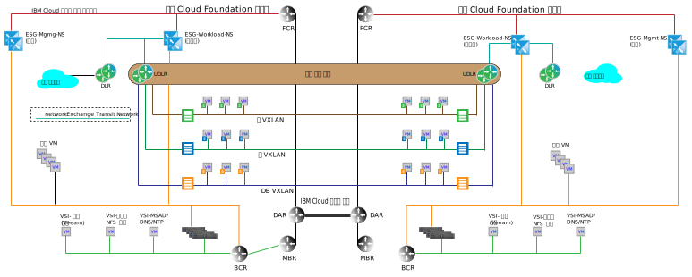

---

copyright:

  years:  2016, 2018

lastupdated: "2018-10-05"

---

# 다중 사이트 아키텍처

{{site.data.keyword.cloud}} 및 기타 클라우드 오퍼링 간의 한 가지 주요 차별화 요소는 전세계에 걸쳐 전용 컴퓨팅 기능을 프로비저닝하고 사설 {{site.data.keyword.cloud_notm}} 계정 내의 네트워크와 On-Demand 인프라를 자동으로 연결하는 것입니다. VMware vCenter Server 및 VMware Cloud Foundation의 소프트웨어 정의 네트워크 기능은 {{site.data.keyword.cloud_notm}}와 함께 며칠 내에 빌드할 수 있는 세부 단위의 글로벌 인프라를 제공합니다. 다음 섹션에서는 vCenter Server 또는 Cloud Foundation의 즉시 사용 가능한 기능을 사용하여 달성할 수 있는 작업의 다중 사이트 아키텍처 예를 설명합니다.

## 교차 vCenter NSX 환경

교차 vCenter NSX 기능을 사용하면 최대 9개의 NSX Manager를 기본, 보조 관계로 링크할 수 있습니다(기본 1개 및 보조 8개). 교차 vCenter NSX가 작동하기 위해 vCenter Server가 ELM(Enhanced Linked Mode) 관계로 설정될 필요는 없지만 다음과 같은 이점을 제공합니다.

* 싱글 사인온(SSO) 인증 정보를 사용하여 간소화된 기본, 보조 관계 작성
* vCenter Server 및 Cloud Foundation 자동화를 통해 함께 링크된 모든 사이트에 대한 DNS 이름 해석 구성
* 모든 사이트에서 NSX 및 일반 vCenter 기능 모두에 대한 단일 분할창 방식(Single Pane of Glass)의 관리

## 다중 사이트 예

다음 예에서는 다음 특성 이외에 이전 섹션에서 논의된 기본 관리 및 워크로드 토폴로지에 NSX 범용 전송 구역을 추가합니다.

* 범용 전송 구역은 두 개의 {{site.data.keyword.CloudDataCents_notm}} 또는 {{site.data.keyword.CloudDataCent_notm}} 내의 POD에 걸쳐 있습니다.
* 전송 구역이 추가된 후 새 VXLAN에 걸쳐 있는 범용 분산 라우터와 함께 여러 VXLAN이 추가됩니다.
* 두 사이트 모두에서 워크로드 ESG에 대한 업링크를 구성해야 합니다. 이 구성을 사용하면 로컬 사이트의 가상 머신(VM)이 해당 로컬 ESG로 순회할 수 있습니다.
* 인바운드 트래픽의 경우 글로벌 로드 밸런서가 필요합니다. 이 요구사항을 충족하려면 {{site.data.keyword.cloud_notm}} 글로벌 로드 밸런스 오퍼링을 참조하십시오.
* 이 예에는 VMware NSX Enterprise 에디션이 필요합니다.

그림 1. 다중 사이트 토폴로지

### 관련 링크

* [{{site.data.keyword.cloud_notm}}의 네트워킹 서비스](networking_services.html)
