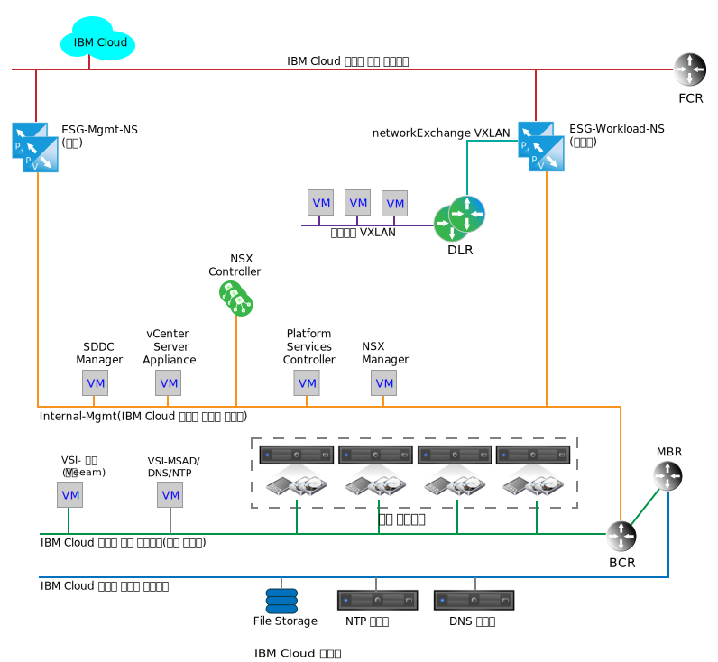
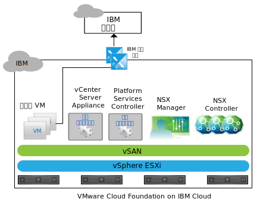
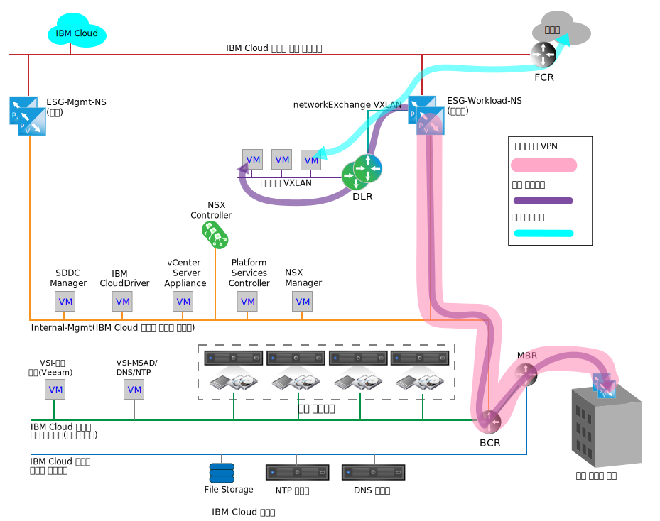

---

copyright:

  years:  2016, 2019

lastupdated: "2019-04-02"

subcollection: vmware-solutions

---

{:tip: .tip}
{:note: .note}
{:important: .important}

# IBM Cloud의 네트워킹 서비스
{: #nsx-networking_services}

{{site.data.keyword.cloud}}의 네트워킹 서비스는 가상 사설망(VPN)을 통해 {{site.data.keyword.cloud_notm}}와 공용 인터넷 또는 고객 온프레미스 네트워크 간에 통신하기 위한 두 개의 VMware NSX ESG(Edge Services Gateway) 쌍으로 구성됩니다. 이러한 ESG는 내부 {{site.data.keyword.cloud_notm}} 관리 기능 및 유출 트래픽, 고객 관련 네트워크 트래픽의 유입을 지원하도록 분리됩니다.

다음 그래픽은 관리 쌍 및 워크로드 ESG 쌍을 나타내는 단순화된 네트워크 다이어그램입니다. 또한 NSX DLR(Distributed Logical Router) 및 워크로드 VXLAN을 보여줍니다. 이러한 컴포넌트는 NSX 내에서 설정하기 위한 특정 지식 없이도 고객 워크로드에 대한 초기 랜딩 지점으로 사용됩니다. 일반적으로 DLR은 VMware vCenter Server 간의 트래픽 및 인스턴스 내의 개별 계층 2 네트워크 간의 동쪽-서쪽 트래픽을 라우팅하는 데 사용됩니다. 이 동작은 vCenter Server 인스턴스 내부 및 외부에서 순회하는 북쪽-남쪽 네트워크 트래픽을 용이하게 하도록 작동하는 ESG와 대조됩니다.

그림 1. vCenter Server의 클라우드 네트워킹 서비스

단일 ESG가 관리 및 고객 워크로드 트래픽 모두에 충분할 수 있지만 관리 및 고객 트래픽을 분리하는 것은 실수로 관리 ESG를 잘못 구성하지 못하도록 하기 위한 디자인 의사결정입니다.

관리 ESG를 잘못 구성하거나 사용 안함으로 설정해도 vCenter Server 인스턴스가 계속 작동하지만 모든 포털 관리 기능이 사용 안함으로 설정됩니다.
{:note}

## IBM 관리 서비스 NSX Edge
{: #nsx-networking_services-mgmt-serv-nsx-edge}

IBM 관리 ESG는 {{site.data.keyword.cloud_notm}} 관리 네트워크 트래픽 전용 NSX Edge 클러스터입니다. vCenter Server 자동화를 통해 배치 및 관리되지 않는 컴포넌트의 트래픽 순회에는 사용되지 않습니다.

다음 그래픽에서 vCenter Server에 대해 표시된 대로 관리 ESG는 vCenter Server 인스턴스 내에 있는 추가 기능 서비스 가상 머신(VM) 간의 통신 경로와 {{site.data.keyword.cloud_notm}}의 IBM 자동화 인프라를 제공합니다.

그림 2. vCenter Server의 관리 에지 통신

특정 추가 기능 서비스 VM과 해당 라이센싱 및 측정 시스템 간의 경량 통신의 결과로 NSX ESG는 활성-수동 고가용성(HA) 쌍의 대규모 구성에서 크기가 조정되고 vCenter Server 클러스터의 관리 리소스 풀에 배치됩니다. 다음 표는 IBM 관리 NSX ESG 배치의 요약을 제공합니다.

표 1. IBM 관리 NSX ESG 스펙

|IBM 관리 NSX Edge |vCPU | 메모리 |디스크 크기 |스토리지 위치 |
|:----------------------- |:---- |:------ |:--------- |:---------------- |
|IBM 관리 NSX ESG 1 |2 |1GB |1GB | vSAN 데이터 저장소 또는 관리용 공유 연결 스토리지 |
|IBM 관리 NSX ESG 2 |2 |1GB |1GB | vSAN 데이터 저장소 또는 관리용 공유 연결 스토리지 |

### 관리 서비스
{: #nsx-networking_services-mgmt-services}

다음 서비스에 대한 아웃바운드 액세스가 필요합니다.

* Zerto Virtual Manager. 설치된 경우 Zerto on {{site.data.keyword.cloud_notm}}에서는 라이센싱 활성화 및 사용 보고를 위해 인터넷에 대한 아웃바운드 액세스가 필요합니다.
* Veeam 백업 및 복제. 설치된 경우 Veeam on {{site.data.keyword.cloud_notm}}에서는 제품 및 라이센스 업데이트를 다운로드하기 위해 인터넷에 대한 아웃바운드 액세스가 필요합니다.
* FortiGate Virtual Appliance on {{site.data.keyword.cloud_notm}}에서는 라이센싱 활성화 및 라이센싱 모니터링을 위해 인터넷에 대한 아웃바운드 액세스가 필요합니다.
* F5 on {{site.data.keyword.cloud_notm}}에서는 라이센싱 활성화를 위해 인터넷에 대한 아웃바운드 액세스가 필요합니다.

### 에지 인터페이스
{: #nsx-networking_services-edge-interfaces}

ESG 인터페이스의 구성은 ESG에서 액세스할 수 있는 L2 네트워크를 정의합니다. vCenter Server 라이프사이클 관리에서는 관리 VLAN에 배치된 특정 VM이 공용 VLAN으로 순회할 수 있어야 합니다. 배치 시 다음 인터페이스가 정의됩니다.

표 2. NSX ESG 인터페이스 구성

|인터페이스 |인터페이스 유형 |연결 대상 |설명 |
|:--------- |:-------------- |:------------ |:----------- |
|공용 업링크 |업링크 | **SDDC-DportGroup-External** | 공용 인터넷 연결 인터페이스 |
|사설 업링크 |업링크 | **SDDC-DportGroup-Mgmt** |인터넷 사설 네트워크 연결 인터페이스 |
|내부 |내부 |워크로드 HA VXLAN | ESG HA 이중화 하트비트에 사용되는 내부 인터페이스, **SDDC-Dswitch-Private**의 포트 그룹 |

### 서브넷
{: #nsx-networking_services-subnets}

다음 서브넷은 관리 ESG의 목적으로 사용됩니다.

표 3. NSX ESX IP 구성

|인터페이스 |인터페이스 유형 |IPv4 서브넷 유형 |범위 |설명 |
|:--------- |:-------------- |:----------------- |:----- |:----------- |
|공용 업링크 |업링크 |{{site.data.keyword.cloud_notm}} 포터블 공인 |/30 – 하나의 지정 가능한 IP 주소를 렌더링함 |공용 인터넷 연결 인터페이스 |
|사설 업링크 |업링크 |{{site.data.keyword.cloud_notm}} 포터블 사설(기존 관리) |/26 - 61개의 지정 가능한 IP 주소를 렌더링함 |인터넷 사설 네트워크 연결 인터페이스 |
|내부 |내부 |링크 로컬 |169.254.0.0/16 |ESG HA 이중화 통신에 사용되는 내부 인터페이스 |

### NAT(Network Address Translation) 정의
{: #nsx-networking_services-nat-definitions}

NAT(Network Address Translation)는 관리 ESG에서 네트워크 트래픽이 하나의 IP 주소 공간과 다른 IP 주소 공간 사이를 순회할 수 있도록 하는 방법으로 사용됩니다. 일반적으로 인터넷에서 라우트 가능한 IP를 보호하거나 보안을 이유로 내부 IP를 공인 IP로부터 숨기기 위해 수행됩니다. 또한 NAT는 TCP(Transmission Control Protocol) 및 UDP(User Datagram Protocol) 포트 경로 재지정을 허용하기 위해 사용됩니다. 관리 트래픽은 항상 vCenter Server 인스턴스 내부에서 시작되므로 하나의 소스 NAT(SNAT)만 관리 ESG에 정의되어야 합니다. 인스턴스에서 유출되어야 하는 서비스를 호스팅하는 각 내부 VM에 대한 개별 SNAT가 작성되지 않습니다.

표 4. NSX ESG NAT 구성

|인터페이스에 적용됨 |소스 IP 범위 |변환된 소스 IP |
|:-------------------- |:--------------- |:-------------------- |
|공용 업링크 |관리 포터블 /26의 개별 IP 주소 |{{site.data.keyword.cloud_notm}} 포터블 공인 |

### 라우팅
{: #nsx-networking_services-routing}

관리 ESG를 통해 순회하는 데 필요한 VM 내의 서비스가 고객 {{site.data.keyword.cloud_notm}} 사설 네트워크 내의 {{site.data.keyword.cloud_notm}} 서비스에 도달해야 할 수도 있으므로 이 통신을 달성하려면 다음과 같은 구성이 필요합니다.

인터넷 접속 연결에 대한 대상으로 필요한 대상 IP 범위를 예측하기는 어렵지만 {{site.data.keyword.cloud_notm}}에서 배치되고 관리되는 모든 서비스는 관리 ESG를 해당 대상 게이트웨이로 가리킵니다. 서비스에 필요한 외부 네트워크 연결을 위해 {{site.data.keyword.cloud_notm}} BCR을 통한 트래픽을 강제로 적용하려면 정적 라우트가 필요합니다.

관리 ESG를 사용하여 vCenter Server 외부로 순회하는 서비스의 경우 다음과 같은 구성이 권장됩니다.
* 기본 게이트웨이는 관리 ESG입니다.
* 내부 {{site.data.keyword.cloud_notm}}에는 정적 라우트가 필요합니다.

서비스 또는 VM에서 고객 ESG에 액세스해야 하는 경우 정적 라우트는 개별 서비스 또는 VM 내에서 유지보수되고 고객 ESG가 지정되어야 합니다.

현재 관리 ESG에 대한 자동 라우팅 프로토콜이 구성되어 있지 않습니다.

### VXLAN 정의
{: #nsx-networking_services-vlan-definitions}

관리 HA 이중화에는 내부 인터페이스 연결을 위한 네트워크가 필요하며, 이 네트워크에서는 기존 vSwitch, 포트 그룹 또는 VXLAN을 사용할 수 있습니다. 이 디자인의 경우 관리 ESG HA 이중화의 HA 하트비트 통신을 위한 전용 VXLAN이 작성됩니다.

표 5. NSX ESG VXLAN 정의

|NSX ESG VXLAN 정의 |전송 구역 |유형 |
|:------------------------- |:-------------- |:---- |
|관리 HA |transport-1 |글로벌 |

### 방화벽 규칙
{: #nsx-networking_services-firewall-rules}

기본적으로 관리 ESG는 모든 트래픽을 거부하도록 구성됩니다.

**거부:** 해당 트래픽이 이전(순서의 상위) 규칙 또는 규칙 세트로 방화벽을 순회할 수 없는 경우 응답 없이 모든 트래픽을 삭제합니다. ESG 쌍에 대한 제어 트래픽을 허용하도록 자동 규칙 생성이 선택됩니다.

자동으로 생성된 규칙 이외에 다음 방화벽 규칙이 설정됩니다.

표 6. NSX ESG 방화벽 구성

| 서비스 | 소스 | 대상 | 프로토콜 | 조치 |
|:------- |:------ |:----------- |:-------- |:------ |
|Zerto on {{site.data.keyword.cloud_notm}} |Zerto 관리 VM |임의 |포트 443 |허용 |
|Veeam on {{site.data.keyword.cloud_notm}} |Veeam 백업 및 복제 VM |임의 |포트 443 |허용 |
|FortiGate Virtual Appliance on {{site.data.keyword.cloud_notm}} |서비스 VM |임의 |포트 443 |허용 |
|F5 on {{site.data.keyword.cloud_notm}} |서비스 VM |임의 |포트 443 |허용 |
|임의 |임의 |임의 |임의 |거부 |

## IBM 워크로드 NSX Edge
{: #nsx-networking_services-wkld-nsx-edge}

IBM 워크로드 ESG는 워크로드 네트워크 통신을 목적으로 하는 단순 토폴로지입니다. 다음 섹션에서는 vCenter Server 인스턴스 내에서 워크로드를 네트워크에 연결하는 디자인 의도에 대해 설명합니다. 이는 온프레미스 네트워크 및 IP 공간을 특정 vCenter Center 인스턴스에 연결하기 위한 시작점이며 진정한 하이브리드 클라우드 아키텍처에 대한 기초입니다.

공용 및 사설 {{site.data.keyword.cloud_notm}} 네트워크 모두에 연결된 고객 네트워크는 인터넷 연결 트래픽에 대한 워크로드 액세스를 허용하지만 공용 또는 사설 {{site.data.keyword.cloud_notm}} 네트워크에서 사이트 간 VPN이 작성되도록 허용합니다. 고객 보안 요구사항으로 인해 전용 광역 네트워크(WAN)를 가동하는 데 몇 개월이 걸릴 수 있으므로 이를 통해 온프레미스 네트워크에 연결하는 것과 관련한 가치 창출 시간이 크게 단축될 수 있습니다. 그러나 전용 링크가 준비된 후 VPN 터널 내부에서나 vCenter Server 인스턴스에 내에서 오버레이 네트워크에 영향을 미치지 않고 해당 링크를 순회하도록 VPN을 전환할 수 있습니다. 이 작업이 완료된 후 보안 관점에서 필요한 경우 워크로드 ESG에 대한 공용 인터페이스를 제거할 수 있습니다.

다음 그림의 토폴로지는 다음과 같은 NSX 컴포넌트로 구성되어 있습니다.
* NSX Edge 어플라이언스(ESG)
* DLR(Distributed Logical Router)
* VXLAN(L2 over L3)

그림 3. 예제 네트워크 플로우 다이어그램

### IBM 워크로드 NSX Edge에 대한 에지 인터페이스
{: #nsx-networking_services-edge-interfaces-workload}

관리 ESG와 마찬가지로 ESG 인터페이스의 구성은 ESG에서 액세스할 수 있는 L2 네트워크를 정의합니다. 워크로드 토폴로지의 디자인 의도 중 일부는 워크로드를 기본 {{site.data.keyword.cloud_notm}} 주소 공간에서 격리하기 위해 소프트웨어 정의 네트워킹(SDN) 오버레이를 달성하는 것입니다. 이 디자인은 BYOIP 디자인을 달성하기 위한 기초입니다. 따라서 배치 시 다음 인터페이스가 정의됩니다.

표 7. 워크로드 에지 인터페이스 구성

|인터페이스 |인터페이스 유형 |연결 대상 |설명 |
|:--------- |:-------------- |:------------ |:----------- |
|공용 업링크 |업링크 |SDDC-DportGroup-External | 공용 인터넷 연결 인터페이스 |
|사설 업링크 |업링크 |SDDC-DportGroup-Mgmt | 내부 사설 네트워크 연결 인터페이스 |
|전송 업링크 |업링크 |Workload-Trasit |워크로드 ESG와 워크로드 DLR 간의 전송 VXLAN |
|내부 |내부 |워크로드 HA VXLAN |ESG HA 이중화 하트비트에 사용되는 내부 인터페이스 |

이 디자인에서는 로컬 워크로드에 연결된 L2 네트워크 간의 잠재적인 동쪽-서쪽 라우팅을 허용하기 위해 DLR이 사용됩니다. 이 토폴로지는 간단한 예로 사용되기 때문에 워크로드용으로 계획된 하나의 L2 네트워크에 대해서만 설명됩니다. DLR의 새 인터페이스에 VXLAN을 더 추가하여 추가 보안 구역을 추가할 수 있습니다. 다음 표에서는 구성할 DLR 인터페이스를 표시합니다.

표 8. DLR 인터페이스

|인터페이스 |인터페이스 유형 |연결 대상 |설명 |
|:--------- |:-------------- |:------------ |:----------- |
|전송 업링크 |업링크 |Workload-Trasit |워크로드 ESG와 워크로드 DLR 간의 전송 VXLAN |
|워크로드 업링크 |업링크 |워크로드 |워크로드 연결용 VXLAN |
|내부 |내부 |워크로드 HA VXLAN |ESG HA 이중화 하트비트에 사용되는 내부 인터페이스 |

### IBM 워크로드 NSX Edge에 대한 서브넷
{: #nsx-networking_services-subnets-workload}

다음 서브넷은 워크로드 ESG의 목적으로 사용됩니다.

표 9. DLR 및 워크로드 ESG IP 구성

|인터페이스 |인터페이스 유형 |IPv4 서브넷 유형 |범위 |설명 |
|:--------- |:-------------- |:----------------- |:----- |:----------- |
|공용 업링크(ESG) |업링크 |{{site.data.keyword.cloud_notm}} 포터블 공인 |/30 – 하나의 지정 가능한 IP 주소를 렌더링함 | 공용 인터넷 연결 인터페이스(고객은 별도로 추가 IP 주소를 주문할 수 있음) |
|사설 업링크(ESG) |업링크 |{{site.data.keyword.cloud_notm}} 포터블 사설(기존 관리) |/26 - 61개의 지정 가능한 IP 주소를 렌더링함 | 내부 사설 네트워크 연결 인터페이스 |
|내부(ESG 및 DLR) |내부 |링크 로컬 |169.254.0.0/16 |ESG HA 이중화 통신에 사용되는 내부 인터페이스 |
|전송 업링크(ESG 및 DLR) |업링크 |고객이 지정함 |TBD |ESG에서 DLR로의 전송 네트워크 연결 |
|워크로드(DLR) |업링크 |고객이 지정함 |TBD |워크로드 서브넷 |

### IBM 워크로드 NSX Edge에 대한 NAT 정의
{: #nsx-networking_services-nat-definitions-nsx-edge}

NAT는 워크로드 ESG에서 네트워크 트래픽이 하나의 IP 주소 공간과 다른 IP 주소 공간 사이를 순회할 수 있도록 하는 방법으로 사용됩니다. 워크로드 ESG의 경우 NAT는 인터넷 대상에 대한 통신을 허용하기 위해서만이 아니라 모든 {{site.data.keyword.cloud_notm}} 소스 IP 범위와 통신하는 데 필요합니다. 이 디자인의 경우 워크로드 트래픽이 인터넷으로 나갈 수 있지만 관리 또는 모든 {{site.data.keyword.cloud_notm}} 네트워크로 나갈 수는 없습니다. 따라서 하나의 SNAT만 워크로드 ESG에 정의되어야 합니다. 전체 워크로드 포터블 서브넷이 해당 SNAT를 통해 순회하도록 구성됩니다.

NAT를 사용하여 vCenter Server의 여러 인스턴스에서 워크로드 통신을 허용할 수 있지만 인스턴스 간에 많은 워크로드가 연결되어야 하는 경우에는 적합하지 않습니다. 고급 NSX 기능을 사용하여 vCeter Server 인스턴스에서 L2 오버레이 전송 네트워크를 작성하는 예는 [다중 사이트 아키텍처](/docs/services/vmwaresolutions/archiref/nsx?topic=vmware-solutions-nsx-multi_site)를 참조하십시오.

표 10. 워크로드 ESG NAT 규칙

|인터페이스에 적용됨 |소스 IP 범위 |변환된 소스 IP |NAT 사용 또는 사용 안함 |
|:-------------------- |:--------------- |:-------------------- |:----------------------- |
|공용 업링크(워크로드 ESG) |고객 정의 |{{site.data.keyword.cloud_notm}} 포터블 공인 IP |고객 정의(기본값: 사용 안함) |

### IBM 워크로드 NSX Edge에 대한 라우팅
{: #nsx-networking_services-routing-wkld}

이 디자인 내에서 워크로드 ESG에 대한 DLR을 순회하는 워크로드에 대한 유일한 요구사항은 인터넷에 액세스하는 것입니다. 워크로드 ESG가 워크로드 VXLAN 및 DLR 뒤에 작성되는 향후 워크로드 VXLAN/서브넷에 대한 경로를 이해해야 합니다. 이 작업은 ESG의 정적 라우트를 통해 달성할 수 있지만 워크로드 토폴로지의 의도는 입증된 우수 사례 디자인의 의도입니다. 따라서 워크로드 ESG 및 다운스트림 DLR 사이에 OSPF(Open Shortest Path First)가 구성됩니다.

구성에 대한 자세한 정보는 [OSPF 프로토콜](https://pubs.vmware.com/NSX-6/index.jsp?topic=%2Fcom.vmware.nsx.admin.doc%2FGUID-6E985577-3629-42FE-AC22-C4B56EFA8C9B.html)을 참조하십시오.

표 11. 동적 라우팅

|영역 |OSPF 유형 |OSPF 인터페이스 IP |OSPF 인증 |
|:---- |:--------- |:----------------- |:------------------- |
|51 |스텁 |전송 RFC1918 네트워크의 각 DLR 및 ESG에 대한 IP 지정 |없음 |

### IBM 워크로드 NSX Edge에 대한 방화벽 규칙
{: #nsx-networking_services-firewall-wkld}

기본적으로 워크로드 ESG는 모든 트래픽을 거부하도록 구성됩니다.

**거부:** 해당 트래픽이 이전(순서의 상위) 규칙 또는 규칙 세트로 방화벽을 순회할 수 없는 경우 응답 없이 모든 트래픽을 삭제합니다. ESG 쌍에 대한 제어 트래픽을 허용하도록 자동 규칙 생성이 선택됩니다.

자동으로 생성된 규칙 이외에 다음 방화벽 규칙이 설정됩니다.

표 12. 워크로드 ESG 방화벽 규칙

| 서비스 | 소스 | 대상 | 프로토콜 | 조치 |
|:------- |:------ |:----------- |:-------- |:------ |
|워크로드 |워크로드 서브넷 |임의 |임의 |허용 |
|임의 |임의 |임의 |임의 |거부 |

### IBM 워크로드 NSX Edge에 대한 VXLAN 정의
{: #nsx-networking_services-vxlan-definitions}

워크로드 토폴로지 ESG 및 DLR HA 이중화에는 내부 인터페이스 연결, 둘 사이의 데이터 전송 및 워크로드에 대한 L2 세그먼트(VXLAN)가 필요합니다.

표 13. 워크로드 ESG 내부 인터페이스

|VXLAN 이름 | vCenter Server 전송 구역 |유형 |
|:---------- |:------------------------------------------------- |:---- |
|워크로드 HA |transit-1 | 글로벌 |
|워크로드 전송 |transit-1 | 글로벌 |
|워크로드 |transit-1 | 글로벌 |

### IBM 워크로드 NSX Edge에 대한 ESG DLR 설정
{: #nsx-networking_services-esg-dlr-sett}

기본적으로 모든 새 NSX Edge 어플라이언스에서 로깅이 사용으로 설정됩니다. 기본 로깅 레벨은 NOTICE입니다.

## 관련 링크
{: #nsx-networking_services-related}

* [NSX Edge Services Gateway 디자인](/docs/services/vmwaresolutions/archiref/nsx?topic=vmware-solutions-nsx_design)
* [다중 사이트 아키텍처](/docs/services/vmwaresolutions/archiref/nsx?topic=vmware-solutions-nsx-multi_site)
