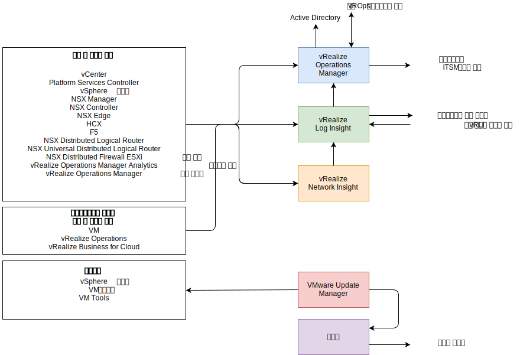

---

copyright:

  years:  2016, 2019

lastupdated: "2019-05-17"

---

# 오퍼레이션 관리 아키텍처 개요
{: #opsmgmt-arch}
오퍼레이션 관리 계층에 있는 제품의 아키텍처는 {{site.data.keyword.vmwaresolutions_full}}의 로깅 데이터를 사용하여 중앙 집중식 모니터링을 제공합니다. 오퍼레이션 관리 계층은 실시간으로 실제 인프라, 가상 인프라 및 클라이언트의 컴퓨팅 워크로드(선택사항)를 모니터합니다. 

상위 레벨에서 다음 정보가 수집됩니다. 
* 토폴로지 데이터. 예를 들면, 실제 및 가상 컴퓨팅, 네트워킹 및 스토리지 오브젝트입니다. 
* 모니터링 데이터. 예를 들면, 다음과 같습니다. 
  * 메트릭 - 구조화된 데이터입니다(예: 성능 및 용량). 
  * 로그 - 구조화되지 않은 데이터입니다(예: 시스템 이벤트). 

## 오퍼레이션 관리 플로우
{: #opsmgmt-arch-flows}

다음 다이어그램은 오퍼레이션 관리 도구의 핵심 상호작용 및 통합을 보여줍니다. 

{{site.data.keyword.vmwaresolutions_short}} 오퍼레이션 관리는 다음 단계로 구성됩니다. 
* 모니터링 - vROps(vRealize Operations Manager)는 분석 알고리즘을 사용하여 {{site.data.keyword.vmwaresolutions_short}} 아키텍처에서 다중 오브젝트의 오퍼레이션을 추적하고 분석합니다. 이 알고리즘을 통해 vROps는 이 오브젝트의 동작에 대해 알아보고 예측할 수 있습니다. 시스템 관리자는 보기, 보고서 및 대시보드를 사용하여 이 정보에 액세스합니다. 

  환경에서 문제가 발생하면 vROps는 다음 세 가지 영향 유형의 경보를 생성합니다. 
    * 상태 경보 - 환경의 상태에 영향을 주고 즉각적인 주의를 요하는 문제를 표시합니다. 
    * 위험 경보 - 즉각적인 위협은 아니지만 곧 해결되어야 하는 문제(용량 문제)를 표시합니다. 
    * 효율성 경보 - 성능을 향상시키거나 리소스를 재확보하기 위한 정보입니다. 

  vROps 경보는 데이터 분석이 정상 메트릭 값의 편차를 표시하는 경우 또는 모니터된 컴포넌트 중 하나에 문제가 발생하는 경우 모니터된 오브젝트에서 발생하는 이벤트입니다. vROps 경보는 다음 세 가지 카테고리 중 하나로 지정됩니다. 
    * 위험 - 발생 즉시 조치를 취해야 합니다. 
    * 즉각적 - 가능한 빨리 조치를 취해야 합니다. 
    * 경고 - 시간이 허용되면 확인해야 합니다. 

* 로깅 - vRLI(vRealize Log Insight)는 {{site.data.keyword.vmwaresolutions_short}} 아키텍처의 실제 및 가상 오브젝트에서 기계 학습 기반 지능형 그룹화, 고성능 검색 및 문제점 해결 기능을 갖춘 실시간 로그 관리 및 로그 분석을 제공합니다. vRLI는 Syslog 프로토콜을 사용한 vSphere 호스트부터 기타 VMware 제품(예: vCenter Server)에 이르는 데이터를 수집하여 이벤트, 태스크 및 알람 데이터를 수집합니다. vRops와 통합하여 알림 이벤트를 전송하고 텍스트에서 실행할 수 있도록 합니다. Syslog 데이터를 전송할 수 있는 {{site.data.keyword.vmwaresolutions_short}} 아키텍처의 기타 오브젝트는 vRLI로 지정됩니다. 선택적으로 클라이언트는 Syslog 데이터를 전송할 수 있는 시스템을 구성하여 이 날짜를 vRLI로 전달할 수 있습니다. 

* 네트워크 상태 - vRealize Network Insight는 사전 예방적인 사용에 중점을 둔 분석 도구입니다. 
  * 네트워크 상태 및 성능 모니터링
  * 엔드 투 엔드 문제점 해결
  * 360° 가시성 및 분석
  * 마이크로 세그먼트화 기반 규제 준수 관리

* 패치 및 업그레이드 - VUM(vSphere Update Manager)는 VMware vSphere 호스트 및 가상 머신(VM)(OS 및 앱 아님) 중앙 집중식 자동화된 패치 및 버전 관리를 제공합니다. 

## 오퍼레이션 관리 네트워킹
{: #opsmgmt-arch-network}

네트워크 개요 다이어그램은 다음과 같습니다. 

* 도구 사설 포터블 서브넷은 도구 VM의 초기 프로비저닝에 사용되는 {{site.data.keyword.cloud_notm}} IP 주소 공간을 제공하도록 프로비저닝되지만, 클라이언트는 도구의 스케일 확장을 위해 IP 주소 공간을 관리해야 하는 책임이 있습니다. 이 서브넷의 VM에는 관리 및 내부 관리 서브넷에서 호스트된 컴포넌트에 대한 액세스 권한이 필요합니다. 
* 도구 VXLAN 서브넷은 도구 VM의 초기 프로비저닝에 사용되는 BYOIP IP 공간을 제공하도록 사용되지만, 클라이언트는 도구의 스케일 확장을 위해 IP 주소 공간을 관리해야 하는 책임이 있습니다. 이 서브넷의 VM에는 오버레이 서브넷에서 호스트된 컴포넌트에 대한 액세스 권한이 필요합니다. ESG는 {{site.data.keyword.cloud_notm}}와 BYOIP 주소 공간 사이에 NAT를 제공합니다. 
* vROps 원격 콜렉터는 컴퓨팅 VM을 모니터하도록 vROps의 이점을 활용할 경우 클라이언트로 배치됩니다. 
* vRLI 포워더는 오버레이 컴포넌트에서 vRLI 클러스터로 로그 메시지를 전달합니다. 클라이언트는 필요에 따라 이 포워더를 사용하도록 컴퓨팅 VM을 구성할 수도 있습니다. 
* VUM(VMware Update Manager)는 vSphere 호스트 및 VM 하드웨어와 도구의 업데이트를 제공합니다. VUM은 프록시를 사용하여 인터넷 저장소에 대한 액세스 권한을 얻습니다. 

vROps는 환경의 오브젝트에서 데이터를 수집합니다. 수집된 각 데이터 조각은 메트릭 관찰 또는 값이라고 합니다. vROps는 vCenter 어댑터를 사용하여 vCenter에서 원시 데이터를 수집합니다. 수집하는 메트릭 외에도 vROps는 용량 메트릭, 배지 메트릭 및 시스템의 상태를 모니터할 메트릭을 계산합니다. 경보 정의는 문제점을 식별하고 해당 영역에 대해 수행하는 경보를 생성하는 증상과 권장사항의 조합입니다. 

## 모니터된 컴포넌트
{: #opsmgmt-arch-components}

### vCenter의 모니터링
{: #opsmgmt-arch-components-vcenter}

vCenter의 모니터링은 vROps 및 VMware SDDC Health Management Pack을 사용하여 수행됩니다. vRLI는 vCenter에서 로그 데이터를 수집하고 Content Pack for vSphere는 특정 이해를 로그에 추가하고 다시 경보를 vROPs에 전송합니다. 

VMware SDDC Health Management Pack은 SDDC Management 스택을 모니터하고 vCenter를 포함한 SDDC 제품 컴포넌트의 구성 및 규제 준수와 관련된 상태와 경보에 대한 배지를 제공합니다. 

### vSphere 호스트의 모니터링
{: #opsmgmt-arch-components-hosts}

vSphere 호스트의 모니터링은 vCenter를 통해 vROps로 수행되고 vRLI를 통해 로그의 콜렉션으로 수행됩니다. 

### vSAN의 모니터링
{: #opsmgmt-arch-components-vsan}

vSAN을 모니터하기 위해 vROps 및 vRLI가 사용됩니다. vCenter에는 사용할 수 있는 추가적인 vSAN 상태 검사 세트가 있습니다. Management Pack for vSAN을 설치하면 vSAN의 모니터링에 도움이 되는 추가 대시보드가 제공됩니다. 

VMware vSAN 어댑터가 모니터하는 스토리지 영역 네트워크의 SDDC 제품 컴포넌트에서 문제점이 발생하는 경우 vROps는 경보를 생성합니다. 구성 규제 준수 및 상태와 관련된 경보는 VMware vSAN Management Pack의 VMware SDDC Health Solution Management Pack을 통해 전달됩니다. vSAN은 vSAN 어댑터를 사용하여 vCentre 어플라이언스를 통해 vROps vSAN Management Pack으로 모니터됩니다. 기본 콜렉션 간격은 5분이며 vSAN 어댑터는 vSphere 오브젝트에서 상태 검사 서비스 및 성능 서비스 메트릭도 수집합니다. 상태 검사 서비스 간격은 vSphere 인터페이스에서 구성되며 기본적으로 60분입니다. 

vSAN 어댑터가 모든 성능 데이터를 수집할 수 있는지 확인하려면 vSAN 성능 서비스가 vSphere에서 사용으로 설정되어야 합니다. 

### NSX for vSphere의 모니터링
{: #opsmgmt-arch-components-nsxv}

NSX를 모니터하기 위해 다음 도구가 구현됩니다. 
* vROps(vRealize Operations Manager)
* vRLI(vRealize Log Insight)
* vRNI(vRealize Network Insight)

이를 통해 시스템 관리자는 VMware NSX를 모니터하고, 관리하고, 문제점을 해결할 수 있습니다. vROps Management Pack for VMware NSX는 네트워크 토폴로지에 대한 가시성을 제공합니다. NSX 대시보드는 NSX 환경의 빠른 개요와 컴포넌트의 상태를 제공합니다. NSX 오브젝트와 vSphere 오브젝트 간의 상관은 문제점을 쉽게 해결할 수 있도록 합니다. 

vROps는 관리 팩을 사용하여 구성, 성능 및 지원 데이터에 적합한 VMware NSX를 폴링합니다. vROps 대신, 관리 팩은 폴링 요청을 REST API 호출로 변환하여 NSX Manager에서 필요한 데이터를 검색합니다. 

NSX 컴포넌트는 Syslog를 vRLI에 전송하도록 구성되어야 합니다. 

* NSX Manager - [Syslog 서버 구성](https://pubs.vmware.com/NSX-6/topic/com.vmware.nsx.admin.doc/GUID-EA70974C-07F8-469D-8A9D-0ED54F0C8F34.html#GUID-EA70974C-07F8-469D-8A9D-0ED54F0C8F34){:new_window}.
* NSX Controller - [NSX Controller 구성](https://kb.vmware.com/s/article/2092228){:new_window}.
* NSX Edge - [원격 Syslog 서버 구성](https://pubs.vmware.com/NSX-6/topic/com.vmware.nsx.admin.doc/GUID-9C25E097-E2CC-461A-9DA6-E8118D16EE62.html#GUID-9C25E097-E2CC-461A-9DA6-E8118D16EE62){:new_window}.
* 방화벽 - 방화벽을 사용으로 설정한 각 클러스터마다 원격 Syslog 서버를 구성해야 합니다. 원격 Syslog 서버는 `Syslog.global.logHost` 속성에서 지정됩니다. 

NSX Flow Monitoring은 허용되는 플로우와 차단되는 플로우를 판별하도록 NSX Manager에서 사용될 수 있습니다. 필요한 경우 vSphere Distributed Switch를 위해 포트 미러링을 구성할 수 있습니다. 

### NSX-T의 모니터링
{: #opsmgmt-arch-components-nsxt}

NSX-T를 모니터하기 위해 다음 도구가 구현됩니다. 

* vROps(vRealize Operations Manager)
* vRLI(vRealize Log Insight)

VMware SDDC Health Management Pack은 다음을 모니터합니다. 
* 논리 스위치 - 논리 스위치의 관리 상태를 모니터합니다. 
* 제어기 클러스터 - HA에 대해 배치된 클러스터 노드 수를 모니터하고 쿼럼을 유지보수합니다. 
* 제어기 노드 - 제어기 클러스터 및 관리자 노드와의 노드 연결을 모니터합니다. 
* 에지 노드 - 에지 노드 실행 상태와 제어기 클러스터 및 관리자 노드와의 연결을 모니터합니다. 
* NSX-T 관리 서비스 
* T0 라우터 서비스 - 정적 라우트, NAT, BGP, BFD 및 라우트 재분배 서비스를 모니터합니다.
* T1 라우터 서비스 - 정적 라우트, NAT 및 라우트 알림 서비스를 모니터합니다.

### vRealize Operations Manager의 모니터링
{: #opsmgmt-arch-components-vrops}

VMware SDDC Health Management Pack에는 다음 이벤트에 대한 경보 정의가 있습니다. 
* vRealize Operations Manager 노드의 현재 크기 지정은 지정된 로드에 충분하지 않습니다. 
* 클러스터 노드 구성은 vRealize Operations Manager 크기 지정 가이드라인을 따르지 않습니다. 
* 원격 콜렉터의 현재 크기 지정은 지정된 로드에 충분하지 않습니다. 
* 원격 콜렉터 구성은 vRealize Operations Manager 크기 지정 가이드라인을 따르지 않습니다. 
* vRealize Operations Cluster는 권장되는 분석 노드 수를 초과했습니다. 

### vRealize Log Insight의 모니터링
{: #opsmgmt-arch-components-vrli}

예를 들어, 디스크 공간이 거의 다 사용되고 vRealize Log Insight가 이전 로그 파일의 삭제 또는 아카이브를 시작해야 하는 경우 vRLI는 상태에 대한 알림을 트리거하는 경보를 지원하고 중요한 시스템 이벤트가 발생할 때 알림을 생성합니다.

## 시스템 요구사항
{: #opsmgmt-arch-requirements}

디자인에서 사용하는 어플라이언스의 양과 크기는 다음과 같습니다. 

표 1. 오퍼레이션 도구 요약 시스템 요구사항

||vROps|vRLI|vRNI| 프록시|
|---|---|---|---|---|---|
|VM 양|4|4|1+1|1|
|vCPU|8|8|4 + 8|4|
|RAM(GB)|32|16|12 + 32| 0.5|
|디스크(GB)| 254|1042|158 + 1000|80|

## 소프트웨어 버전
{: #opsmgmt-arch-versions}

표 2. 운영 도구 소프트웨어 버전

|제품 이름|버전|
|---|---|
|VMware vRealize Operations Manager Advanced 이상 |7.0|
|vRealize Operations Management Pack for NSX for vSphere|3.5.2|
|vRealize Operations Management Pack for Storage Devices|7.0.0|
|vRealize Operations Management Pack for Site Recovery Manager|8.1.1|
|VMware vRealize Log Insight|4.7|
|vRealize Log Insight Content Pack for NSX for vSphere|3.8|

## 관련 링크
{: #opsmgmt-arch-components-related}

* [vCenter Server on {{site.data.keyword.cloud_notm}} with Hybridity Bundle 개요](/docs/services/vmwaresolutions/archiref/vcs?topic=vmware-solutions-vcs-hybridity-intro)
