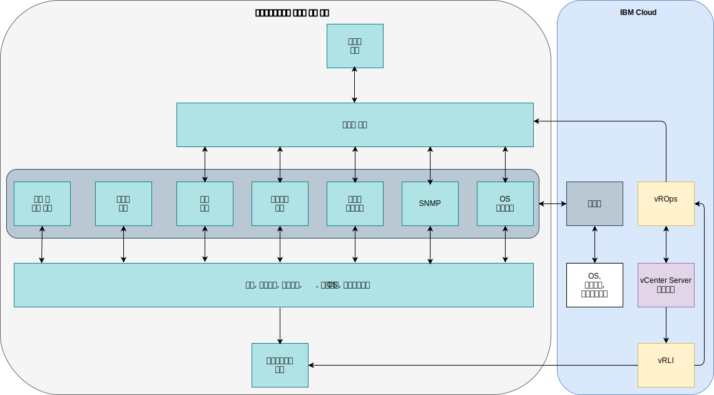

---

copyright:

  years:  2016, 2019

lastupdated: "2019-08-05"

---

# 통합
{: #opsmgmt-integration}

이 주제는 디자인의 운영 관리 계층에 중점을 두고 있습니다. 그러나 일부 엔터프라이즈에서는 이 계층을 서비스 관리 계층과 통합하려고 할 수 있습니다. 이 절에서는 해당 통합에 대한 지시사항을 제공합니다. 이 디자인에서 vROps는 모든 경보가 표시되는 중심점입니다.

다음 통합 카테고리가 사용 가능합니다.
* 북쪽 방향 - vROps에서 다른 도구로의 통합.
  * SMTP 서버 또는 도구(예: Slack 또는 PagerDuty)에 대한 경보 알림
  * 서비스 데스크 도구(예: ServiceNow)로 티켓 통합
  * vROps에서 발견한 문제를 수정하도록 vRealize Orchestrator 워크플로우 초기화
* 남쪽 방향 - 서비스 관리 도구 또는 클라우드 관리 도구에서의 통합.
  * vRealize Automation은 새 워크로드 추가 시 모니터링을 구성합니다.
  * 외부 소스의 이벤트 인리치먼트로 vROps 오브젝트를 업데이트합니다.

vROps는 다음과 같은 아웃바운드 경보 플러그인을 제공합니다.
* 자동화된 조치 - 기본적으로 사용으로 설정됩니다.
* 표준 이메일 - SMTP(Simple Mail Transfer Protocol)를 사용하여 관심 있는 사용자에게 vRealize Operations Manager 경보 알림을 이메일로 전송합니다.
* SNMP 트랩 - SNMP 트랩 서버에 대한 경보를 로깅합니다.
* REST 알림 - 이 메시지를 허용하도록 REST 웹 서비스를 빌드한 다른 REST 사용 애플리케이션에 vROps 경보를 전송합니다.
* 로그 파일 - vROps를 통해 각 vRealize Operations Manager 노드마다 파일에 대한 경보를 로깅합니다. 다중 노드 클러스터로 vRealize Operations Manager를 설치한 경우 각 노드는 모니터하는 오브젝트에 대한 경보를 처리하고 로깅합니다. 각 노드는 처리하는 오브젝트에 대한 경보를 로깅합니다.
* Smarts SAM 알림 - 경보 알림을 EMC Smarts Server Assurance Manager에 전송합니다.
* 네트워크 공유 - 보고서를 공유 위치로 전송하고 SMB 버전 2.0을 지원합니다.

알림은 북쪽 경계의 외부 시스템으로 전송되기 전에 알림 규칙의 필터 기준을 충족시키는 경보 알림입니다. 알림 규칙은 선택된 외부 시스템으로 전송되기 전에 필터링될 수 있도록 필요한 아웃바운드 경보에 대해 구성됩니다. 알림 목록은 이 규칙을 관리하는 데 사용됩니다.

## 통합 유스 케이스
{: #opsmgmt-integration-usecase}

이 유스 케이스 예는 엔터프라이즈에서 사용하는 기존의 일반 서비스 관리 계층을 기반으로 합니다. 클라이언트는 오퍼레이션 관리 옵션을 사용하여 vCenter Server 인스턴스를 프로비저닝했으며 이 플랫폼을 서비스 관리 플랫폼으로 통합하려고 합니다. 이벤트 집계 시스템을 사용하여 다음과 같은 도메인별 모니터링 도구에서 생성된 경보를 통합합니다.

* UNIX, Linux 및 Windows 워크로드에서 OS, 미들웨어 및 애플리케이션을 모니터하도록 설정된 도구입니다. 그러나 이 도구는 인프라 컴포넌트(예: VMware, 네트워킹 디바이스 또는 스토리지)를 모니터하지 않습니다.
* 네트워크 인프라에서 SNMP 트랩을 수신하는 SNMP 관리자입니다. 이 도구는 성능 및 용량 경보를 사용으로 설정하도록 SNMP 메트릭도 수집합니다.
* 백업을 관리하는 백업 관리 도구입니다.
* 스토리지 배열을 관리하는 스토리지 관리 도구입니다.
* 디바이스 접근성을 테스트하도록 Ping을 사용하는 가용성 도구입니다.

서비스 관리 계층은 다음으로 구성되어 있습니다.

* 보고서를 제공하도록 메트릭을 수집하는 서버 용량 및 성능 도구입니다.
* OS, 미들웨어 및 애플리케이션을 업데이트하고 이 플랫폼에 대한 규제 준수 정도를 측정하는 패치 및 규제 준수 서버입니다.
* 인시던트, 문제점 및 변경사항에 대한 티켓을 관리하는 데 사용되는 티켓팅 도구입니다. 이 도구는 엔터프라이즈의 CMDB(Configuration Management Database)이기도 합니다. 도구는 SMS 메시지뿐만 아니라 오퍼레이션 팀에 이메일을 발송할 수 있습니다.
* 모든 시스템에서 로그를 캡처하고 보안 팀에서 관리하는 엔터프라이즈 로깅 시스템입니다.

vROps를 보유함에 따라 SNMP 트랩 플러그인을 사용하는 북쪽 경계의 알림을 사용하여 이 도구를 통합합니다. vROps를 통합하기 위해 vROps를 통해 전송된 트랩은 클라이언트의 이벤트 관리 환경이 경보를 작성하고 이를 강화할 수 있는 방식으로 구문 분석되어야 합니다. 관리 도구 팀은 VMware에서 VMware MIB를 다운로드했으며 이벤트 관리 환경에서 이를 설치했습니다.

vRLI는 클라이언트의 정책에 따라 모든 이벤트를 엔터프라이즈 로깅 시스템으로 전달하도록 구성되어 있습니다.

클라이언트가 기존 OS, 미들웨어 및 애플리케이션 모니터링 도구를 사용하려고 하므로, 메트릭 및 경보를 수집하고 전달하도록 {{site.data.keyword.cloud}}에서 프록시를 사용했습니다.

## 관련 링크
{: #opsmgmt-integration-related}

* [vRealize Operations RESTful API](https://docs.vmware.com/en/vRealize-Operations-Manager/7.0/vrealize-operations-manager-70-api-guide.pdf){:new_window}
* [VMware Code API Explorer](https://code.vmware.com/apis?socv=1&numPerPage=164&sorter=pv){:new_window}
* [Postman Client Collection Tool for vRealize Operations](https://code.vmware.com/samples/4663/postman-client-collection-for-vrealize-operations-rest-apis){:new_window}
* [VMware PowerCLI 블로그](https://blogs.vmware.com/PowerCLI/2016/05/getting-started-with-powercli-for-vrealize-operations-vr-ops.html){:new_window}
* [Webhook Shims](https://blogs.vmware.com/management/2017/01/vrealize-webhooks-infinite-integrations.html){:new_window}
