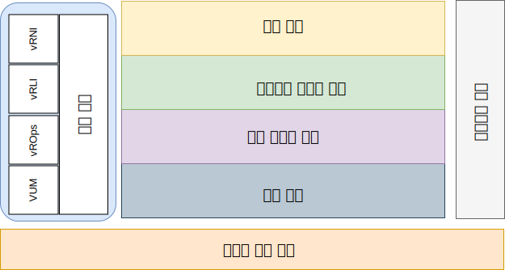

---

copyright:

  years:  2016, 2019

lastupdated: "2019-05-29"

---

# 소개
{: #opsmgmt-intro}

이 참조 아키텍처에서는 {{site.data.keyword.vmwaresolutions_full}} 아키텍처의 인스턴스화를 안내하고 통제합니다.

또한 다음을 수행합니다.
* 다양한 이해 당사자(stakeholder)를 위한 공통 언어를 제공합니다.
* 문제를 해결하기 위해 기술 구현의 일관성을 제공합니다.
* 증명된 참조 아키텍처에 대해 솔루션의 유효성 검증을 지원합니다.
* 공통 표준, 스펙 및 패턴을 준수하도록 권장합니다.

이 참조 아키텍처의 기본 목표는 클라이언트를 위해 배치된 {{site.data.keyword.vmwaresolutions_short}} 환경의 모니터링 및 경보를 제공하도록 오퍼레이션 관리 기능을 문서화하는 것입니다. 도구는 클라이언트의 오퍼레이션 팀이 사용할 수 있도록 우수 사례 매개변수 및 임계값으로 구성되어 있습니다.

디자인을 통해 클라이언트가 다음 태스크를 완료할 수 있습니다.
* 필요에 따라 스케일 확장 또는 스케일 축소합니다.
* 운영 정책에 따라 고유한 엔터프라이즈 모니터링 도구를 설치합니다.
* 도구를 고유한 ITSM(IT Service Management) 플랫폼으로 통합합니다.

## 오퍼레이션 관리
{: #opsmgmt-intro-opsmgmt}

{{site.data.keyword.vmwaresolutions_short}}는 다음 아키텍처 계층을 기반으로 합니다.

* 실제 계층 - 아키텍처의 최하위 계층은 {{site.data.keyword.cloud_notm}}에서 활용되는 컴퓨팅, 네트워크 및 스토리지 컴포넌트로 구성되는 실제 계층입니다. 
  * 관리, 에지 및 컴퓨팅 워크로드를 실행하는 {{site.data.keyword.baremetal_short}}
  * VLAN, 서브넷, 프론트엔드 및 백엔드 고객 라우터(FCR/BCR)로 구성되는 {{site.data.keyword.cloud_notm}} 네트워크
  * {{site.data.keyword.baremetal_short}}의 SSD에서 통합되는 데이터 저장소인 vSAN 스토리지 및 Endurance 스토리지

* 가상 인프라 계층 - 가상 인프라 계층은 실제 계층 컴포넌트에서 실행됩니다. 가상 인프라 계층은 기본 실제 인프라에 대한 액세스를 제어하고 관리 및 컴퓨팅 워크로드에 대한 리소스를 제어하고 할당합니다. 관리 워크로드는 가상 인프라 계층의 요소로 자체적으로 구성되거나 클라우드 관리, 서비스 관리, 비즈니스 연속성 및 보안 계층의 요소와 함께 구성됩니다.

* 비즈니스 연속성 계층 - 이 계층에는 데이터 백업, 복원 및 재해 복구를 제공하여 비즈니스 연속성을 지원하는 요소가 포함됩니다. 자세한 정보는 {{site.data.keyword.vmwaresolutions_short}} 백업 및 복원 아키텍처, Veeam, IBM Spectrum Protect Plus 및 Zerto 재해 복구 참조 아키텍처를 참조하십시오. 

* 보안 계층 - 이 계층에는 위험을 줄이고 규제 준수를 늘리는 요소가 포함됩니다. 자세한 정보는 Fortinet, F5, NSX, HyTrust 및 Caveonix 참조 아키텍처를 참조하십시오.

이 문서는 다음 계층을 {{site.data.keyword.vmwaresolutions_short}} 아키텍처에 추가합니다.

* 오퍼레이션 관리 계층 - 오퍼레이션 관리 계층의 아키텍처에는 실제 계층 및 가상 계층과 실시간 컴퓨팅 워크로드(선택사항)에 대한 지원을 제공하는 관리 컴포넌트가 포함됩니다. 오퍼레이션 관리 계층은 실제, 가상, 컴퓨팅, 네트워킹 및 스토리지 리소스의 {{site.data.keyword.vmwaresolutions_short}} 토폴로지를 이해하고 있습니다. 오퍼레이션 관리 계층은 주로 모니터링 및 로깅 기능으로 구성됩니다. 

  정보는 다음 양식으로 수집됩니다.
    * 메트릭 - 구조화된 데이터입니다(예: 성능 및 용량).
    * 로그 - 구조화되지 않은 데이터입니다(예: 시스템 이벤트).

오퍼레이션 관리 계층은 다음 도구로 구성됩니다.

* vROps(vRealize Operations Manager) - vROps는 시스템 리소스(오브젝트)에서 수집된 데이터를 사용하여 모니터된 시스템 컴포넌트에서 문제를 식별하고, 많은 문제의 경우 수행할 정정 조치를 제안하여 문제를 해결합니다. 좀 더 어려운 문제의 경우 vROps는 숨겨진 문제를 밝히거나, 복잡한 기술 문제점을 조사하거나, 경향을 식별하거나, 단일 오브젝트의 상태를 측정하도록 드릴 다운하기 위해 다양한 분석 도구를 제공합니다.
* vRLI(vRealize Log Insight) - vRLI는 모든 환경에서 인프라 및 애플리케이션을 위한 지능형 로그 관리를 제공합니다. 고도로 스케일링할 수 있는 이 로그 관리 솔루션은 실제, 가상 및 클라우드 환경에서 직관적이고 실행 가능한 대시보드, 정교한 분석 및 넓은 서드파티 확장성을 제공합니다.
* vRNI(vRealize Network Insight) - vRNI는 소프트웨어 정의 네트워킹 및 보안을 위해 지능형 오퍼레이션을 제공합니다. 가상 및 실제 네트워크에서 가시성을 지원하고, 운영 보기를 제공하여 NSX 배치를 관리 및 스케일링하고, 마이크로 세그먼트화 계획 및 배치를 가속화합니다.
* VUM(VMware Update Manager) - VUM을 사용하면 VMware vSphere에 대한 자동화된 중앙 집중식 패치 및 버전 관리가 가능하며 vSphere 호스트의 업그레이드 및 패치, 호스트에 서드파티 소프트웨어의 설치 및 업데이트, VM 하드웨어, VMware Tools 및 가상 어플라이언스의 업그레이드를 제공합니다.

전체 엔터프라이즈 아키텍처의 경우 다음 계층이 필요할 수 있으나 {{site.data.keyword.vmwaresolutions_short}} 아키텍처의 외부에 있습니다. 

* 클라우드 관리 계층 - 클라우드 관리 계층은 클라우드 아키텍처의 상위 계층입니다. 이 계층은 리소스를 요청하고 사용자 인터페이스 또는 API(Application Programming Interface)에서 하위 계층을 조정합니다. vRealize Automation은 {{site.data.keyword.cloud_notm}}에서 클라우드 자동화를 사용으로 설정합니다. 자세한 정보는 [vRA(vRealize Automation) 참조 아키텍처](https://www.ibm.com/cloud/garage/files/IBM_Cloud_for_VMware_Solutions_VRA_Architecture_v1.pdf){:new_window}를 참조하십시오.

이 아키텍처가 Chef 통합을 사용하여 확장될 수 있는 방법에 대한 자세한 정보는 [Chef 통합을 사용한 vRA 참조 아키텍처](https://www.ibm.com/cloud/garage/files/IBM_Cloud_for_VMware_Solutions_VRA_Chef_Integration_Architecture.pdf){:new_window}를 참조하십시오.

* 서비스 관리 계층 - 이 계층은 IT 환경의 전체 라이프사이클에 중점을 두고 있으며 일반적으로 IT 오퍼레이션과 기술에 대한 모든 사일로의 입력을 결합하여 엔터프라이즈 레벨에서 구현됩니다. 이 계층은 예전부터 ITIL(IT Infrastructure Library) 및 ISO/IEC 20000과 같은 ITSM(IT Service Management) 프레임워크에서 구성되었습니다. 이는 IT 서비스 라이프사이클의 프로세스 및 단계를 통해 IT 서비스를 제공하기 위한 우수 사례의 프레임워크입니다. 제품 레벨에서 ITSM은 구성 관리 데이터베이스에 연결된 인시던트, 서비스 요청, 문제점, 변경사항 및 지식을 처리하기 위한 중앙 집중식 워크플로우 관리 시스템이 특징입니다.

## 관련 링크
{: #opsmgmt-intro-related}

* [vCenter Server on {{site.data.keyword.cloud_notm}} with Hybridity Bundle 개요](/docs/services/vmwaresolutions/archiref/vcs?topic=vmware-solutions-vcs-hybridity-intro)
