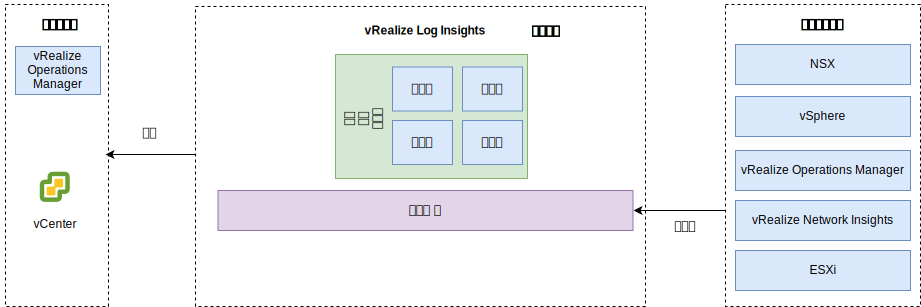

---

copyright:

  years:  2016, 2019

lastupdated: "2019-08-05"

---

# vRealize Log Insights
{: #opsmgmt-vrli}

vRLI(vRealize Log Insight) 환경은 통합된 로드 밸런서가 포함된 네 개의 가상 머신(VM)으로 구성됩니다.

이 패턴은 다음을 지원합니다.
* 30,000개의 VM
* 하루당 75Gbs 로그 수집
* 초당 5,000개의 이벤트

vRLI(vRealize Log Insight)는 {{site.data.keyword.vmwaresolutions_full}} 환경에서 컴포넌트를 위한 실시간 로깅을 사용으로 설정합니다. 디자인은 각 인스턴스당 네 개의 노드로 구성되는 vRLI 클러스터를 배치합니다. 이 구성은 지속적인 가용성과 증가된 로그 수집 비율을 제공합니다.

이 디자인의 각 위치에는 관리 클러스터에 배치된 별도의 vRLI 클러스터가 있습니다. vRLI 클러스터는 {{site.data.keyword.cloud_notm}} 포터블 IP 주소를 사용하여 도구 서브넷에 배치됩니다. 이를 통해 {{site.data.keyword.cloud_notm}} RFC1918 주소 공간 밖에서 처리되는 모든 컴포넌트와 쉽게 통신할 수 있습니다. 이 컴포넌트에는 vSphere 호스트, Platform Services Controller, NSX Manager 및 NSX Controller가 포함됩니다. vRLI 클러스터에는 마스터 노드와 최소 두 개의 작업자 노드(통합된 로드 밸런서 포함)가 있습니다.

* 마스터 노드 - 클러스터에 필요한 초기 노드입니다. 마스터 노드는 조회 및 로그 수집을 담당합니다. 마스터 노드 웹 UI는 해당 vRealize Log Insight Cluster의 단일 분할창 방식입니다. 데이터에 대한 모든 조회는 워크로드를 다시 작업자에게 분배하는 마스터를 대상으로 합니다.
* 마스터 노드 - 스케일 확장을 위해 더 많은 작업자를 추가할 수 있는 기능을 사용하여 클러스터를 구성하려면 최소 세 개의 노드가 필요합니다. 작업자 노드는 로그를 수집하고 로컬로 로그를 저장합니다.
* 통합된 로드 밸런서 - 전용 로드 밸런싱 구성을 사용하여 고가용성을 제공합니다(추가 로드 밸런서는 필요하지 않음).
* Log Insight 포워더 - NSX 오버레이 컴포넌트에서 로그를 수신하도록 배치됩니다. 또한 컴퓨팅 VM에서 로그를 전송할 경우 클라이언트에서 활용할 수 있습니다. Log Insight 포워더는 vRLI 클러스터에 경보를 전송하도록 원격 Syslog 집계자로 사용되는 단일 vRealize Log Insight 마스터 노드입니다. VXLAN 지원 주소가 BYOIP 주소 공간 외부에 있으므로 NAT 규칙은 NSX ESG에서 구현되어야 합니다.

다음 크기가 사용 가능하며 적합한 크기가 선택됩니다.
* 소형 - 초당 2,000개의 이벤트
* 중형 - 초당 5,000개의 이벤트
* 대형 - 초당 15,000개의 이벤트

vRLI는 중앙 위치에서 환경에 대한 모니터링 정보를 제공하기 위해 로그를 수집합니다.

vRLI는 다음과 같은 가상 인프라 및 클라우드 관리 컴포넌트(로깅 클라이언트)에서 로그 이벤트를 수집합니다.
* vCenter
*  ESXi 호스트
* NSX Manager
* NSX
Controller
* NSX Edge 서비스 게이트웨이
* NSX Distributed Logical Router 인스턴스
* NSX Universal Distributed Logical Router
* NSX Distributed Firewall ESXi 커널 모듈
* vRealize Operations Manager Analytics 클러스터 노드 및 원격 콜렉터
* 이벤트 전달의 결과로 다른 인스턴스에 있는 vRLI 인스턴스

다음 로깅 클라이언트는 지원되지만 이 디자인에서는 통합되지 않습니다.
* Realize Automation Appliance
* vRealize Orchestrator(vRealize Automation Appliance에서 임베드됨)
* vRealize IaaS Web Server
* vRealize IaaS Management Server
* vRealize IaaS DEM
* vRealize IaaS Proxy Agents
* vRealize Business 서버
* vRealize Business 데이터 콜렉터

## 시스템 요구사항
{: #opsmgmt-vrli-requirements}

환경에서 로그 소스의 모든 로그 데이터를 수용하려면 vRLI 노드는 올바르게 크기 지정되야 합니다. 이 디자인은 중형 크기 어플라이언스를 기반으로 합니다.

표 1. Log Insight 마스터 및 복제본 노드 시스템 설정

| 속성                | 스펙                     |
| ------------------------ | --------------------------------- |
|vCPU                     |8                                 |
|메모리                   | 18GB                             |
| 디스크(Thick 프로비저닝됨) | 530GB(이벤트 스토리지용 490GB) |

각 vRLI 가상 어플라이언스에는 세 가지 기본 가상 디스크가 있으며 스토리지를 위해 더 많은 가상 디스크를 사용할 수 있습니다.
* 하드 디스크 1 - 20GB(루트 파일 시스템용)
* 하드 디스크 2 - 510GB(중형 크기 배치용). 다음과 같은 두 개의 파티션이 포함됩니다.
  * /storage/var - 시스템 로그용
  * /storage/core storage - 수집된 로그용(약 475GB 디스크 공간 사용 가능)

## 네트워킹
{: #opsmgmt-vrli-network}

vRLI 어플라이언스 배치 시 도구 사설 포터블 서브넷에서 세 개의 IP 주소를 필요로 합니다. vRLI에는 다음 액세스 권한이 필요합니다.
* vCenter Appliance
* vRealize Log Insight Appliance
* NSX-V/T 어플라이언스
* 도구 확장 VXLAN
* 고객 네트워크
* NTP 서버(`time.services.softlayer.com`)
* {{site.data.keyword.vmwaresolutions_short}} Active Directory/DNS
* 원격 콜렉터에는 마스터 노드, 마스터 노드 복제본 및 데이터 노드에 대한 연결을 사용으로 설정할 수 있도록 NSX ESG의 NAT 규칙이 필요합니다.

## 포트
{: #opsmgmt-vrli-ports}

표 2. Log Insight 포트

|설명                                                   | 포트       | 프로토콜 |
| ------------------------------------------------------------- | ---------- | -------- |
| 포워더 대상으로 구성된 아웃바운드 Syslog 트래픽 | 514        | TCP, UDP |
| SSL을 통한 Syslog 데이터                                          | 1514, 6514 | TCP      |
| Log Insight Ingestion API                                     |9000       | TCP      |
| SSL을 통한 Log Insight Ingestion API                            | 9543       | TCP      |
| 어플라이언스에 대한 SSH 액세스                                       | 22         | TCP      |
| 사용자 인터페이스                                                | 80, 443    | TCP      |
|NTP                                                           | 123        | UDP      |
| SMTP                                                          |25GB         | TCP      |
|DNS                                                           | 53         | UDP      |
| LDAP/LDAPS                                                    | 389, 636   | TCP      |
| LDAP GC                                                       | 3268/3269  | TCP      |
|vCenter                                                       | 443        | TCP      |
| vRealize Operations Manager 어플라이언스                         | 443        | TCP      |

## 인증
{: #opsmgmt-vrli-auth}

vRLI를 위한 사용자 관리에는 Active Directory와 통합하는 vIDM(VMware Identity Manager)가 필요합니다. 서비스 계정은 메트릭 콜렉션 및 토폴로지 맵핑에 필요한 최소 권한 세트를 사용하여 vRealize Operations Manager부터 다음 어댑터까지의 애플리케이션 대 애플리케이션 통신에 사용됩니다.
* NSX Manager
* vCenter
* vSAN

## vRealize Log Insight의 컨텐츠 팩
{: #opsmgmt-vrli-content}

컨텐츠 팩은 가상 인프라에서 더 많은 세분화된 모니터링을 제공하고 로그를 검색하고, 추출하고, 읽을 수 있는 형식으로 구문 분석할 수 있도록 합니다. 이러한 방식으로 vRLI는 로그 조회 및 경보를 저장하고 사용자는 효율적인 모니터링을 위해 대시보드를 사용할 수 있습니다.

기본적으로 다음이 설치됩니다.
* 일반사항
* VMware vSphere
* VMware vSAN
* VMware vROps

이 디자인으로 다음도 설치됩니다.
* VMware NSX for vSphere
* vRealize Network Insight

기타 컨텐츠 팩은 [vRealize Log Insight Content Pack](https://marketplace.vmware.com/vsx/?contentType=2&listingStyle=table){:new_window}에서 다운로드할 수 있습니다.

## 관련 링크
{: #opsmgmt-vrli-related}

* [vRealize Log Insight Virtual Appliance 크기 지정](https://docs.vmware.com/en/vRealize-Log-Insight/4.6/com.vmware.log-insight.getting-started.doc/GUID-284FC5F4-B832-47A7-912E-D407A760CAE4.html){:new_window}
* [vRealize Log Insight](https://docs.vmware.com/en/vRealize-Log-Insight/index.html){:new_window}
