---

copyright:

  years:  2016, 2019

lastupdated: "2019-08-05"

---

# vRealize Network Insight
{: #opsmgmt-vrni}

vRNI(vRealize Network Insight) 환경은 두 개의 가상 머신(VM)인 플랫폼(UI)과 제어 노드로 구성됩니다.

vRNI 플랫폼 어플라이언스는 분석, 사용자 인터페이스 및 데이터 관리를 제공하며 NSX Edges, vCenter와 같은 다양한 데이터 소스에서 수집하는 제어기 어플라이언스에 연결합니다. 모든 vRNI 컴포넌트는 {{site.data.keyword.cloud}} 사설 포터블 IP 주소를 사용합니다. vRLI는 vRNI용 Syslog 서버로 구성됩니다.

## 시스템 요구사항
{: #opsmgmt-vrni-requirements}

이 아키텍처는 중형 브릭 크기를 사용하여 3000개의 VM을 지원합니다.

표 1. Network Insight Platform 시스템 요구사항

| 속성 | 스펙 |
|---|---|
|vCPU |8 |
| 메모리 |32GB |
| 디스크(씬 프로비저닝됨) |1TB |

표 2. Network Insight Collector 시스템 요구사항

| 속성 | 스펙 |
|---|---|
|vCPU | 4 |
| 메모리 | 12GB |
| 디스크(씬 프로비저닝됨) |200GB |

## 네트워킹
{: #opsmgmt-vrni-network}

vRNI 어플라이언스 배치 시 도구 사설 포터블 서브넷에서 두 개의 IP 주소를 필요로 합니다. 네트워크 연결 vRNI에는 다음 액세스 권한이 필요합니다.
* vCenter Appliance
* vRealize Log Insight Appliance
* NSX-V/T 어플라이언스
* 도구 확장 VXLAN
* 고객 네트워크
* NTP 서버(`time.services.softlayer.com`)
* {{site.data.keyword.vmwaresolutions_short}} Active Directory/DNS

## 포트
{: #opsmgmt-vrni-ports}

표 3. Network Insight 포트

|설명 | 포트 | 프로토콜 |
|---|---|---|
| vRealize Network Insight의 VM 간 통신 | 443 | HTTPS |
| 인터넷 액세스가 필요한 서비스 svc.ni.vmware.com support2.ni.vmware.com reg.ni.vmware.com| 443| HTTPS
| Log Insight Ingestion API |9000 | TCP |
| SSL을 통한 Log Insight Ingestion API | 9543 | TCP |
| 사용자 인터페이스 | 80,443 | TCP |
|NTP | 123 | UDP |
| SMTP |25GB | TCP |
|DNS| 53 | UDP |
| LDAP/LDAPS | 389, 636 | TCP |
|ESXi | 2055 | TCP |
| VMware vSphere/NSX | 443 | TCP |

## 인증
{: #opsmgmt-vrni-auth}

vRNI 사용자 인증은 Active Directory Server에서 직접 수행됩니다.

## 관련 링크
{: #opsmgmt-vrni-links}

* [vRealize Network Insights](https://docs.vmware.com/en/VMware-vRealize-Network-Insight/index.html){:new_window}
