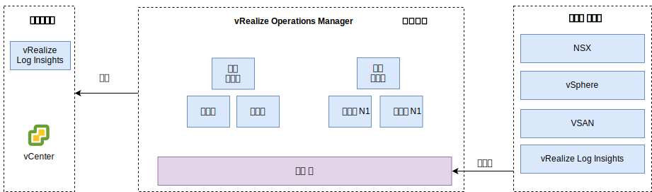

---

copyright:

  years:  2016, 2019

lastupdated: "2019-06-03"

---

# vRealize Operations Manager 디자인
{: #opsmgmt-vrops}

vROps 분석 클러스터에는 모니터된 컴포넌트의 데이터를 분석 및 저장하는 노드가 포함되어 있으며, 이 배치에서는 네 개의 노드가 배치되고 두 개의 NSX 로드 밸런서가 배치됩니다. 이 크기를 설정하면 최대 30,000개의 VM과 9,000,000개의 메트릭에 대한 모니터링을 수집할 수 있습니다. 

4 노드 분석 클러스터는 다음 컴포넌트로 구성됩니다. 
* 마스터 노드 - 마스터 노드는 vROps 클러스터의 초기 노드입니다. 대형 환경에서 이 노드는 기타 모든 노드를 관리합니다.
* 마스터 노드 복제본 - 이 노드는 마스터 노드의 고가용성을 사용으로 설정합니다.
* 데이터 노드 - 데이터 노드는 대형 환경에서 vROps의 스케일 확장을 사용으로 설정하고, 두 개의 노드가 이 디자인에서 배치됩니다.

또한 디자인은 데이터만 수집하고 수집된 데이터를 마스터/데이터 노드로 전달하도록 프록시/전달 서버의 역할을 수행하는 원격 콜렉터 노드를 사용합니다. 데이터 노드 및 원격 콜렉터가 추가되어 환경 크기에 따라 스케일 확장될 수 있습니다. VLAN/VXLAN으로의 vROps 컴포넌트 배치는 다음 다이어그램에 표시되어 있습니다.

* 마스터 노드, 마스터 노드 복제본 및 데이터 노드가 {{site.data.keyword.cloud_notm}} 포터블 IP 주소를 사용하여 도구 서브넷에 배치되어 vSphere 호스트, vCenter, Platform Services Controller, NSX Manager 및 NSX Controller를 포함한 {{site.data.keyword.cloud_notm}} RFC1918 주소 공간 밖에서 처리되는 모든 컴포넌트와 쉽게 통신할 수 있습니다. NSX 로드 밸런서는 HA용 VIP와 함께 사용됩니다.
* 고객 워크로드가 BYOIP 주소 공간의 IP 주소 처리를 사용하는 경우 이 디자인에서는 VXLAN에서 호스팅되는 원격 콜렉터를 사용합니다. 이 원격 콜렉터는 {{site.data.keyword.vmwaresolutions_full}} 자동화의 일부로 구성되지 않으며 클라이언트를 통해 수동으로 구현되어야 합니다.

vROps 분석 클러스터는 관리 사용자 인터페이스를 사용하거나 API를 사용하여 액세스되고 컴포넌트와 통합됩니다. 
* vCenter
* vRealize Log Insight

클라이언트는 수동으로 다음 제품에 통합될 수 있습니다(배치된 경우).
* vRealize Automation
* vRealize Business

vROps는 다음에서 데이터를 수집합니다.
* vSphere - vCenter, Platform Services Controller, vSphere 호스트
* NSX - NSX Manager, NSX Controller 및 NSX Edge
* vRLI

클라이언트는 vRealize Automation 및 vRealize Business for Cloud에서 데이터를 수집하도록 vROps를 수동으로 구성할 수 있습니다. 

## 시스템 요구사항
{: #opsmgmt-vrops-requirements}

분석 서버는 한 개의 마스터 노드, 한 개의 마스터 복제본 노드, 스케일 확장 및 고가용성을 사용으로 설정할 두 개의 데이터 노드로 구성됩니다. 추가 데이터 노드가 스케일 확장을 위해 추가됩니다. 분석 클러스터는 최대 여덟 개의 중형 노드로 확장할 수 있습니다. 

표 1. 오퍼레이션 관리자 마스터/복제본 노드 시스템 설정

| 속성 | 스펙 |
|---|---|
| vCPU | 8 |
| 메모리 | 32GB |
| 디스크(Thick 프로비저닝됨) | 254GB |

표 2. 오퍼레이션 관리자 데이터 노드 시스템 설정

| 속성 | 스펙 |
|---|---|
|vCPU |8 |
| 메모리 |32GB |
| 디스크(Thick 프로비저닝됨) | 254GB |

컴퓨팅 VM의 모니터링이 필요한 경우 클라이언트는 VXLAN에 두 개의 원격 콜렉터 노드를 설치해야 합니다. 표준 원격 콜렉터 가상 어플라이언스의 크기가 2vCPU(4GB의 RAM 포함)이고 기본 어플라이언스 VMDK 크기가 충분합니다. 원격 콜렉터가 분석 오퍼레이션을 수행하거나 데이터를 저장하지 않으므로 원격 콜렉터 노드가 씬 프로비저닝된 디스크로 배치됩니다.

표 3. 오퍼레이션 관리자 로드 밸런서 설정

|설정 | 로드 밸런서 1 | 로드 밸랜서 2|
|---|---|---|
|이름 | vrops-ui | vrops-data |
| 간격 | 30 |5 |
| 제한시간 |5 | 15 |
| 최대 재시도 수 | 3 | |
|유형 | HTTPS | TCP |
| 메소드 | Get | -- |
| URL | /suite-api/api/deployment/node/status | -- |
| 수신 | ONLINE | -- |
| 알고리즘 | ROUND-ROBIN | LEASTCONN |
| 풀 | vROP의 네 개의 노드 | vROP의 네 개의 노드 |

자세한 정보는 [vRealize 자동화
로드 밸런싱(PDF)](https://docs.vmware.com/en/vRealize-Automation/7.5/vrealize-automation-load-balancing.pdf){:new_window}을 참조하십시오.

## 네트워킹
{: #opsmgmt-vrops-network}

vROps 어플라이언스 배치 시 도구 사설 포터블 서브넷에서 여섯 개의 IP 주소를 필요로 합니다. 네트워크 연결 vROps에는 다음 액세스 권한이 필요합니다.
* vCenter Appliance
* vRealize Log Insight Appliance
* NSX-V/T 어플라이언스
* 도구 확장 VXLAN
* 고객 네트워크
* NTP 서버(`time.services.softlayer.com`)
* {{site.data.keyword.vmwaresolutions_short}} Active Directory/DNS
* 원격 콜렉터에는 마스터 노드, 마스터 노드 복제본 및 데이터 노드에 대한 연결을 사용으로 설정할 수 있도록 NSX ESG의 NAT 규칙이 필요합니다. 

## 포트
{: #opsmgmt-vrops-ports}

표 4. 오퍼레이션 관리자 포트

| 컴포넌트 | 프로토콜 | 포트 |
|---|---|---|
|vCenter | TCP | 443 |
|DNS | TCP/UDP | 53 |
| LDAP/LDAPS | TCP | 389/636 |
| LDAP GC | TCP | 3268/3269 |
|NTP | UDP | 123 |
| SMTP | TCP |25GB |
| SNMP | UDP | 161 |

### 인증
{: #opsmgmt-vrops-auth}

vROps를 위한 사용자 관리에는 Active Directory와 통합하는 vIDM(VMware Identity Manager)가 필요합니다. 서비스 계정은 메트릭 콜렉션 및 토폴로지 맵핑에 필요한 최소 권한 세트를 사용하여 vRealize Operations Manager부터 다음 어댑터까지의 애플리케이션 대 애플리케이션 통신에 사용됩니다. 

* NSX Manager
* vCenter
* vSAN

## 관리 팩
{: #opsmgmt-vrops-management}

Management Packs for vROps는 제품별 경보 및 대시보드를 제공하도록 vROps 플랫폼의 운영 관리 기능을 확장합니다. 

기본적으로 다음 관리 팩이 vROps에 설치됩니다.
* Management Pack for VMware vCenter Server
* Management Pack for vRealize Log Insight
* Management Pack for vSAN
* Management Pack for vRealize Automation
* Management Pack for vRealize Business for Cloud

다음 컴포넌트는 {{site.data.keyword.vmwaresolutions_short}}에서 설치됩니다.
* VMware SDDC Health Management Pack
* Management Pack for NSX for vSphere
* vRealize Operations Federation Management Pack
* Management Pack for Hybrid Cloud Extension(HCX)

기타 관리 팩이 클라이언트로 설치될 수 있습니다. 자세한 정보는 [VMware Exchange의 관리 팩](https://marketplace.vmware.com/vsx/?contentType=1&listingStyle=table){:new_window}을 참조하십시오.

### Management Pack for VMware vCenter Server
{: #opsmgmt-vrops-management-vCenter}

이 기본 관리 팩은 오브젝트, 메트릭 및 경보의 콜렉션을 사용으로 설정하도록 vROps의 기능을 vCenter로 확장합니다.

### Management Pack for vRealize Log Insight
{: #opsmgmt-vrops-management-vrli}

이 기본 관리 팩은 vRLI에서 vROps로의 이벤트 및 경보의 통합을 비롯하여 vRLI 환경의 모니터링을 사용으로 설정하도록 vROps의 기능을 vRLI로 확장합니다.

### Management Pack for vSAN
{: #opsmgmt-vrops-management-vsan}

vRealize Operations Management Pack for vSAN은 vSAN 오브젝트 및 vSAN 사용 오브젝트의 성능을 평가, 관리 및 최적화할 수 있도록 vSAN별 대시보드를 사용으로 설정합니다.

### VMware SDDC Health Management Pack
{: #opsmgmt-vrops-management-sddc}

VMware SDDC Health Management Pack for vROps는 SDDC 관리 스택을 모니터하고 SDDC 관리 스택의 일부로 존재하는 여러 컴포넌트의 상태 및 효율성에 맞게 색상 코딩된 메트릭을 제공합니다. VMware SDDC Health Management Pack의 대시보드를 사용하여 vCenter Server 인스턴스 및 관리 도구의 다음 컴포넌트를 모니터할 수 있습니다.
* vRealize Operations Manager
* NSX for vSphere/VMware NSX-T
* VMware vSAN
* vRealize Log Insight
* vCenter Server

또한 클라이언트가 다음을 설치한 경우 모니터할 수 있습니다.
* vRealize Automation
* vRealize Orchestrator
* vRealize Business for Cloud
* VMware Site Recovery Manager

VMware SDDC Health Management Pack은 다음 대시보드를 제공합니다.
* SDDC Management Health 개요 대시보드 - SDDC Management Health 개요 대시보드를 사용하여 SDDC 컴포넌트에서 애플리케이션별 문제점을 보고 분석할 수 있습니다. 
* SDDC 상태 히스토리 경향 대시보드 - VMware SDDC Health Management Pack은 SDDC 스택의 각 컴포넌트마다 상태 경향을 표시하는 SDDC 상태 히스토리 경향 대시보드로 구성됩니다.
* SDDC vRealize Operations Manager 크기 지정 대시보드 - SDDC vRealize Operations Manager 크기 지정 대시보드는 오브젝트 및 메트릭을 처리하도록 vRealize Operations Manager 클러스터 용량을 제공합니다.

VMware SDDC Health Management Pack의 플러그인은 플러그인에 포함된 오브젝트 유형에 맞는 메트릭을 수집합니다. 이 관리 팩은 다음 컴포넌트에 대한 상태 메트릭을 수집합니다. 
* vCenter Server
* Management Pack for NSX for vSphere
* vRealize Automation
* vRealize Operations Manager
* vRealize Business
* vRealize Log Insight
* VMware Site Recovery Manager
* vCenter HA
* vMware vSAN Health
* Services in vCenter Server Appliance
* vRealize Operations Manager 크기 지정
* vRealize Orchestrator

### Management Pack for NSX-T
{: #opsmgmt-vrops-management-nsxt}

NSX-T 관리 팩은 vROps 코어 분석, 상관, 예측 용량 및 가상화 기능을 가상 네트워크로 확장합니다. 이 팩에는 다음이 포함됩니다.
* 구성 보장
* 상태
* 성능
* 용량
* NSX-T 오브젝트의 문제점 해결

### Management Pack for NSX for vSphere
{: #opsmgmt-vrops-management-nsxv}

NSX for vSphere 관리 팩은 VMware NSX 가상 네트워킹 기술의 배치를 위해 오퍼레이션 관리 범위를 제공합니다. 이 관리 팩은 vROps 코어 분석, 상관, 예측 용량 및 가상화 기능을 가상 네트워크로 확장합니다. 범위에는 NSX 논리 스위치, 논리 라우터, 에지 서비스, 분산 방화벽 및 로드 밸런서에 대한 구성 보장, 상태, 성능, 용량 및 문제점 해결이 포함됩니다.

NSX for vSphere 관리 팩은 vROps와 밀접하게 통합되며 vSphere 호스트 데이터는 이러한 호스트에서 실행되는 NSX 서비스와 상관됩니다. vRLI를 통한 로그 통합, 오류 및 가동 중단 조건, 로그 메시지를 통한 트리거를 사용하여 관리 팩 오브젝트 및 문제점 창에서 경보가 발행됩니다.

### vRealize Operations Federation Management Pack
{: #opsmgmt-vrops-management-federation}

vRealize Operations Federation Management Pack은 다중 사이트 vROps를 단일 분할창 방식으로 배치할 수 있도록 합니다. vROps 배치에서 지정된 오브젝트에 대한 핵심 메트릭을 수신하는 기능을 사용하여 vROps를 배치할 수 있습니다.

### Management Pack for Hybrid Cloud Extension(HCX)
{: #opsmgmt-vrops-management-hcx}

vRealize Operations Management Pack for HCX는 vROps의 오퍼레이션 관리 기능을 HCX로 표시되는 하이브리드 기능으로 확장합니다. 이 관리 팩을 사용하면 HCX에서 메트릭, 변경 이벤트 및 리소스 토폴로지 정보를 수집할 수 있습니다. 이를 통해 HCX 상호연결, 마이그레이션 또는 보호된 워크로드에서 성능 병목 현상을 모니터하고, 분리하고, 해결할 수 있습니다. 

## 관련 링크
{: #opsmgmt-vrops-management-links}

* [vCenter Server on {{site.data.keyword.cloud_notm}} with Hybridity Bundle 개요](/docs/services/vmwaresolutions/archiref/vcs?topic=vmware-solutions-vcs-hybridity-intro)
* [vRealize Operations Manager 7.0 크기 지정 가이드라인](https://kb.vmware.com/s/article/57903){:new_window}
* [vRealize Operations Manager 문서](https://docs.vmware.com/en/vRealize-Operations-Manager/index.html){:new_window}
* [Management Pack for vSAN](https://marketplace.vmware.com/resources/vsx/product_files/31742/original/Management-Pack-for-vSAN-Guide6d2a8895b022a5f626a86e8e84b031b5.pdf){:new_window}
* [vSAN 클러스터 업데이트 검토 지시사항](/docs/services/vmwaresolutions/archiref/vum?topic=vmware-solutions-vum-updating-vsan)
* [Management-Pack-for-vSAN-Guide](https://marketplace.vmware.com/resources/vsx/product_files/31742/original/Management-Pack-for-vSAN-Guide6d2a8895b022a5f626a86e8e84b031b5.pdf){:new_window}
* [vSAN 상태 검사 정보](https://kb.vmware.com/s/article/2114803){:new_window}
* [VMware NSX 운영화](https://www.vmware.com/content/dam/digitalmarketing/vmware/en/pdf/products/nsx/vmware-operationalizing-nsx.pdf){:new_window}
* [NSX 오퍼레이션 안내서](https://communities.vmware.com/servlet/JiveServlet/previewBody/30079-102-2-40474/NSX-Operations-Guide-v6.1.pdf){:new_window}
