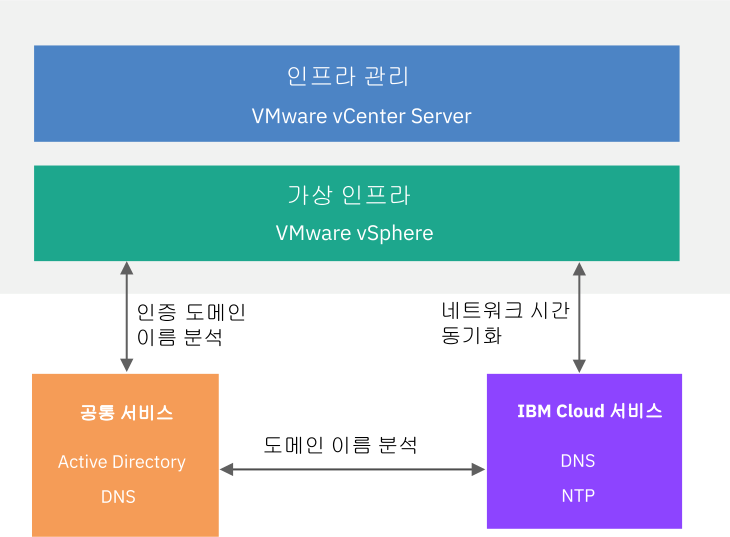

---

copyright:

  years:  2016, 2018

lastupdated: "2018-07-10"

---

# 공통 서비스 디자인

공통 서비스는 클라우드 관리 플랫폼의 기타 서비스에서 사용하는 서비스를 제공합니다. 솔루션의 공통 서비스에는 ID 및 액세스 서비스, 도메인 이름 서비스, NTP 서비스, SMTP 서비스 및 인증 기관 서비스가 포함됩니다. 

## ID 및 액세스 서비스

이 디자인에서 Microsoft Active Directory(AD)는 ID 관리에 사용됩니다. 이 디자인은 1 - 2개의 Windows Active Directory 가상 머신을 Cloud Foundation 및 vCenter Server 배치 자동화의 일부로서 배치합니다. vCenter는 AD 자동화를 활용하도록 구성됩니다. 

### Microsoft Active Directory

기본적으로, 단일 Active Directory VSI는 {{site.data.keyword.cloud}} 인프라에 배치됩니다. 이 디자인에서는 관리 클러스터의 전용 Windows Server VM으로서 2개의 고가용성 Microsoft Active Directory 서버를 배치하는 옵션도 제공합니다. 

**참고**: 이 옵션을 선택하는 경우에는 Microsoft 라이센싱 및 활성화를 제공할 책임이 있습니다. 

Active Directory는 배치된 인스턴스에서 워크로드의 일반 사용자 수용이 아닌 VMware 인스턴스 관리를 위한 액세스 인증만 서비스합니다. Active Directory 서버의 포레스트 루트 도메인 이름은 사용자가 지정하는 DNS 도메인 이름과 동일합니다. 여러 인스턴스가 링크된 경우, 이 도메인 이름은 기본 Cloud Foundation 및 vCenter Server 인스턴스에 대해서만 지정됩니다. 링크된 인스턴스의 경우, 각 인스턴스에는 포레스트 루트 복제본 링에 있는 Active Directory 서버가 포함되어 있습니다. DNS 구역 파일도 Active Directory 서버에서 복제됩니다. 

### vSphere SSO 도메인

vSphere 싱글 사인온(SSO) 도메인은 단일 인스턴스 또는 다중 링크된 인스턴스에 대한 초기 인증 메커니즘으로서 사용됩니다. 또한 SSO 도메인은 VMware 인스턴스 또는 다중 링크된 인스턴스를 Microsoft Active Directory 서버에 연결하는 서비스도 제공합니다. 다음의 SSO 구성이 적용됩니다.   
* `vsphere.local`의 SSO 도메인은 항상 사용됨
* 기존 인스턴스에 연결된 VMware 인스턴스의 경우, PSC는 기존 인스턴스의 SSO 도메인에 결합됨
* SSO 사이트 이름은 인스턴스 이름과 동일함

## DNS(Domain Name Service)

이 디자인의 DNS는 클라우드 관리 및 인프라 컴포넌트 전용입니다. 

### VMware vCenter Server

vCenter Server 배치에서는 배치된 Active Directory 서버를 인스턴스의 DNS 서버로서 사용합니다. 배치된 모든 컴포넌트(vCenter, PSC, NSX 및 ESXi 호스트)는 자체 기본 DNS 서버로서 Active Directory 서버를 지시하도록 구성되어 있습니다. 해당 구성이 배치된 컴포넌트의 구성에 관여하지 않는 경우, 사용자는 DNS 구역 구성을 사용자 정의할 수 있습니다. 

이 디자인은 다음의 구성을 통해 Active Directory 서버에서 DNS 서비스를 통합합니다. 
* 사용자는 도메인 구조를 지정할 수 있습니다. 도메인 이름은 임의의 수의 레벨일 수 있습니다(vCenter Server 컴포넌트가 처리할 최대값까지). 최하위 레벨은 인스턴스에 대한 하위 도메인입니다. 
   * 사용자가 지정하는 DNS 도메인 이름은 Active Directory 루트 포레스트 도메인 이름으로서 사용됩니다. 예를 들어, DNS 도메인 이름이 `cloud.ibm.com`이면 Active Directory 포레스트 도메인 이름은 `cloud.ibm.com`입니다. 이 DNS 및 Active Directory 도메인 이름은 링크된 모든 vCenter Server 인스턴스 간에 동일합니다. 
   * 사용자는 인스턴스에 대한 하위 도메인 이름을 추가로 지정할 수 있습니다. 하위 도메인 이름은 링크된 모든 vCenter Server 인스턴스 간에 고유해야 합니다. 
* Active Directory DNS 서버는 DNS 도메인과 하위 도메인 영역 모두에 대해 권한을 갖도록 구성되어 있습니다. 
* Active Directory DNS 서버는 기타 모든 구역에 대한 {{site.data.keyword.cloud_notm}} DNS 서버를 지시하도록 구성되어 있습니다. 
* 기존 대상 인스턴스에 통합되는 인스턴스는 기본 인스턴스와 동일한 도메인 이름을 사용해야 합니다. 

### VMware Cloud Foundation

Cloud Foundation 배치에서는 VMware Cloud Foundation 자동화를 사용하며, 이는 SDDC Manager VM 컴포넌트 내에 상주하는 자체 DNS 서버를 사용합니다. vCenter, PSC, NSX 및 ESXi 호스트를 포함하여 SDDC Manager에서 관리하는 Cloud Foundation 컴포넌트는 디자인상 기본 DNS로서 SDDC Manager VM IP 주소를 사용하도록 구성되어 있습니다. 

SDDC Manager가 자신이 관리하는 컴포넌트에 대한 호스트 이름을 생성하고 유지보수하므로, 호스트를 추가하고 제거할 목적으로 DNS 구역 파일을 직접 조작하지 않도록 권장합니다. 

이 디자인은 다음의 구성에서 Active Directory 서버의 DNS 서비스를 SDDC Manager VM과 통합합니다. 
* 사용자는 도메인 구조를 지정할 수 있습니다. 도메인 이름은 임의의 수의 레벨일 수 있습니다(Cloud Foundation 컴포넌트가 처리할 최대값까지). 
* 최하위 레벨은 SDDC Manager가 권한을 갖는 하위 도메인입니다. 
* 사용자가 지정하는 DNS 도메인 이름은 Active Directory 루트 포레스트 도메인 이름으로서 사용됩니다. 예를 들어, DNS 도메인 이름이 `cloud.ibm.com`이면 Active Directory 도메인 포레스트 루트는 `cloud.ibm.com`입니다. 이 DNS 도메인과 Active Directory 도메인은 링크된 모든 Cloud Foundation 인스턴스 간에 동일합니다. 
* 사용자는 인스턴스에 대한 하위 도메인 이름을 추가로 지정할 수 있습니다. 하위 도메인 이름은 링크된 모든 Cloud Foundation 인스턴스 간에 고유해야 합니다.   
* SDDC Manager DNS 구성은 자신이 담당하는 구역을 제외한 모든 구역에 대한 Active Directory 서버를 지시하도록 변경되었습니다. 
* Active Directory DNS 서버는 SDDC Manager 및 Cloud Foundation 인스턴스 하위 도메인 위의 DNS 도메인 영역에 대한 권한을 갖도록 구성되어 있습니다. 
* Active Directory DNS 서버는 SDDC Manager가 권한을 갖는 구역의 하위 도메인 위임에 대해 SDDC Manager IP 주소를 지시하도록 구성되어 있습니다. 
* Active Directory DNS 서버는 기타 모든 구역에 대한 {{site.data.keyword.cloud_notm}} DNS 서버를 지시하도록 구성되어 있습니다. 
* 첫 번째 또는 대상 인스턴스에 통합되는 보조 인스턴스는 SDDC Manager 하위 도메인 위에서 동일한 DNS 이름 구조를 활용해야 합니다. 

## NTP 서비스

이 디자인은 {{site.data.keyword.cloud_notm}} 인프라 NTP 서버를 활용합니다. 배치된 모든 컴포넌트는 이러한 NTP 서버를 활용하도록 구성되어 있습니다. 동일한 NTP 서버를 사용하여 디자인 내에 모든 컴포넌트를 보유하는 것은 인증서와 Active Directory 인증이 제대로 작동하기 위해 반드시 필요합니다. 

그림 1. NTP 서비스

## 인증 기관 서비스

기본적으로 VMware vSphere는 VMCA(VMware Certificate Authority)에서 서명한 TLS 인증서를 사용하며, 이는 VMware Platform Services Controller 어플라이언스에 상주합니다. 이러한 인증서를 일반 사용자 디바이스 또는 브라우저는 신뢰하지 않습니다. 사용자 대면 인증서를 써드파티 또는 엔터프라이즈 인증 기관(CA)에서 서명한 인증서로 대체하는 것이 보안 측면에서 가장 좋습니다. 시스템간 통신을 위한 인증서는 VMCA 서명된 인증서로서 유지될 수 있지만, 일반적으로 식별된 엔터프라이즈 CA 사용이 포함된 조직에 맞는 우수 사례를 따르도록 권장합니다. 

이 디자인 내에서 Windows AD 서버를 사용하여 로컬 인스턴스에서 서명한 인증서를 작성할 수 있습니다. 그러나 필요하면 CA 서비스를 구성하도록 선택할 수도 있습니다. 

### 관련 링크

* [실제 인프라 디자인](design_physicalinfrastructure.html)
* [가상 인프라 디자인](design_virtualinfrastructure.html)
* [인프라 관리 디자인](design_infrastructuremgmt.html)
