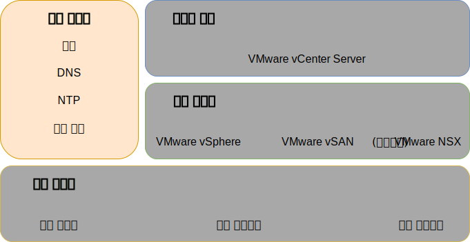
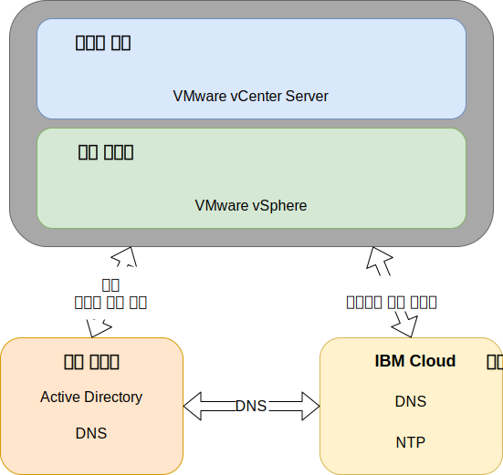

---

copyright:

  years:  2016, 2019

lastupdated: "2019-03-19"

subcollection: vmware-solutions

---

{:tip: .tip}
{:note: .note}
{:important: .important}

# 공통 서비스 디자인
{: #design_commonservice}

공통 서비스는 클라우드 관리 플랫폼의 기타 서비스에서 사용하는 서비스를 제공합니다. 솔루션의 공통 서비스에는 ID 및 액세스 서비스, 도메인 이름 서비스, NTP 서비스, SMTP 서비스 및 인증 기관 서비스가 포함됩니다.

그림 1. 공통 서비스 

## ID 및 액세스 서비스
{: #design_commonservice-identity-access}

이 디자인에서 Microsoft Active Directory(MSAD)는 ID 관리에 사용됩니다. 이 디자인은 1 - 2개의 Active Directory 가상 머신을 vCenter Server 배치 자동화의 일부로서 배치합니다. vCenter는 MSAD 인증을 사용하도록 구성됩니다.

### Microsoft Active Directory
{: #design_commonservice-msad}

기본적으로, 단일 Active Directory VSI는 {{site.data.keyword.cloud}} 인프라에 배치됩니다.

이 디자인에서는 관리 클러스터의 전용 Windows Server VM으로서 2개의 고가용성 MSAD 서버를 배치하는 옵션도 제공합니다.

2개의 고가용성 MSAD 서버에서 옵션을 선택하는 경우 Microsoft 라이센스 부여 및 활성화를 제공해야 합니다.
{:note}

Active Directory는 배치된 인스턴스에 있는 워크로드의 사용자를 수용하기 위해서가 아니라 VMware 인스턴스만을 관리하기 위해 액세스 인증을 제공합니다. Active Directory 서버의 포레스트 루트 도메인 이름은 사용자가 지정하는 DNS 도메인 이름과 동일합니다. 여러 인스턴스가 링크된 경우, 이 도메인 이름은 기본 vCenter Server 인스턴스에 대해서만 지정됩니다. 링크된 인스턴스의 경우, 각 인스턴스에는 포레스트 루트 복제본 링에 있는 Active Directory 서버가 포함되어 있습니다. DNS 구역 파일도 Active Directory 서버에서 복제됩니다.

### vSphere SSO 도메인
{: #design_commonservice-vsphere-sso}

vSphere 싱글 사인온(SSO) 도메인은 단일 인스턴스 또는 다중 링크된 인스턴스에 대한 초기 인증 메커니즘으로서 사용됩니다. 또한 SSO 도메인은 VMware 인스턴스 또는 다중 링크된 인스턴스를 MSAD 서버에 연결하는 서비스도 제공합니다. 다음의 SSO 구성이 적용됩니다.  
* `vsphere.local`의 SSO 도메인은 항상 사용됨
* 기존 인스턴스에 연결된 VMware 인스턴스의 경우, 통합된 PSC는 기존 인스턴스의 SSO 도메인에 결합됨
* SSO 사이트 이름은 인스턴스 이름과 동일함

## Domain Name Service
{: #design_commonservice-dns}

이 디자인의 DNS(Domain Name Service)는 클라우드 관리 및 인프라 컴포넌트 전용입니다.

### 기본 vCenter Server 인스턴스
{: #design_commonservice-primary-vcs}

vCenter Server 배치에서는 배치된 AD VSI를 인스턴스를 위한 DNS 서버로 사용합니다. 배치된 모든
컴포넌트(임베디드 PSC가 포함된 vCenter, NSX 및 ESXi 호스트)는 자체 기본 DNS로서 AD를 지시하도록 구성되어 있습니다. 해당 구성이 배치된 컴포넌트의
구성에 관여하지 않는 경우, 사용자는 DNS 구역 구성을 사용자 정의할 수 있습니다.
- 이 디자인은 다음의 구성의 AD VSI에서 DNS 서비스를 통합합니다.
- 사용자가 도메인 구조를 지정합니다. 도메인 이름은 모든 vCenter Server 컴포넌트가 처리하는 최대값까지 임의의 수의 레벨일 수 있으며, 최하위 레벨은 인스턴스의 하위 도메인임을 보장합니다.
    - 사용자가 제공하는 DNS 도메인 이름은 vCenter Server 배치 AD 루트 포레스트 도메인 이름으로 사용됩니다. 예를 들어, DNS 도메인 이름이 cloud.ibm.com이면 AD 도메인 포레스트 루트는 cloud.ibm.com입니다. vCenter Server의 모든 연합된 인스턴스에서 DNS 도메인 및 AD 도메인이 동일합니다.
    - vCenter Server 인스턴스 하위 도메인으로 추가 이름을 선택합니다. 이 하위 도메인 이름은 링크된 모든 vCenter Server 인스턴스 간에 고유해야 합니다.
- AD DNS 서버는 DNS 도메인과 하위 도메인 영역 모두에 대해 권한을 갖도록 구성되어 있습니다.
- AD DNS 서버는 기타 모든 구역에 대한 {{site.data.keyword.cloud_notm}} DNS 서버를 지시하도록 구성되어 있습니다.
- 첫 번째 또는 대상 배치 클라우드 지역에 통합된 보조 클라우드 지역은 하위 도메인 위에서 동일한 DNS 이름 구조를 사용해야 합니다.
- 선택적으로 vCenter Server 클러스터 내에 중복 DNS 서버를 배치합니다. 2개의 AD/DNS 서버가 라이센스 없이 구성됩니다. 사용자는 이 서버에 Windows 운영 체제의 라이센스를 제공해야 합니다.
- 단일 사이트가 하나의 AD/DNS 서버로만 프로비저닝되는 경우 구성된 모든 vCenter Server 컴포넌트에는 DNS 항목으로서 단일 IP만 제공되어야 합니다.

### 보조 vCenter Server 인스턴스
{: #design_commonservice-secondary-vcs}

교차 인스턴스 중복성의 경우, 첫 번째 보조 vCenter Server 인스턴스가 기존의 기본 vCenter Server 인스턴스 또는 현재 독립형 vCenter Server 인스턴스에 추가되면 해당 기본 인스턴스 AD DNS 서버 IP 주소는 보조 vCenter Server 인스턴스 및 DNS 서버 항목이 필요한 모든 컴포넌트에 대한 모든 후속 보조 vCenter Server 인스턴스 "보조 DNS" 항목에서 사용됩니다. 예를 들면, ESXi, vCenter 및 NSX 관리자입니다. 여기에는 추가 컴포넌트(예: HCX, Zerto 및 Veeam)가 포함됩니다. 그런 다음 기본 사이트 보조 DNS 항목이 첫 번째 보조 vCenter Server 인스턴스 AD/DNS IP 주소로 변경됩니다.

## NTP 서비스
{: #design_commonservice-ntp}

이 디자인은 {{site.data.keyword.cloud_notm}} 인프라 NTP 서버를 활용합니다. 배치된 모든 컴포넌트는 이러한 NTP 서버를 활용하도록 구성되어 있습니다. 동일한 NTP 서버를 사용하여 디자인 내에 모든 컴포넌트를 보유하는 것은 인증서와 Active Directory 인증이 제대로 작동하기 위해 반드시 필요합니다.

그림 2. NTP 및 DNS 서비스 

## 인증 기관 서비스
{: #design_commonservice-cas}

기본적으로 VMware vSphere는 VMCA(VMware Certificate Authority)에서 서명한 TLS 인증서를 사용하며, 이는 VMware Platform Services Controller 어플라이언스에 상주합니다.이러한 인증서를 일반 사용자 디바이스 또는 브라우저는 신뢰하지 않습니다. 사용자 대면 인증서를 서드파티 또는 엔터프라이즈 인증 기관(CA)에서 서명한 인증서로 대체하는 것이 보안 측면에서 가장 좋습니다. 시스템간 통신을 위한 인증서는 VMCA 서명된 인증서로서 유지될 수 있지만, 일반적으로 식별된 엔터프라이즈 CA 사용이 포함된 조직에 맞는 우수 사례를 따르도록 권장합니다.

이 디자인 내에서 Windows AD 서버를 사용하여 로컬 인스턴스에서 서명한 인증서를 작성할 수 있습니다. 그러나 필요하면 CA 서비스를 구성하도록 선택할 수도 있습니다.

## 관련 링크
{: #design_commonservice-related}

* [실제 인프라 디자인](/docs/services/vmwaresolutions/archiref/solution?topic=vmware-solutions-design_physicalinfrastructure)
* [가상 인프라 디자인](/docs/services/vmwaresolutions/archiref/solution?topic=vmware-solutions-design_virtualinfrastructure)
* [인프라 관리 디자인](/docs/services/vmwaresolutions/archiref/solution?topic=vmware-solutions-design_infrastructuremgmt)
