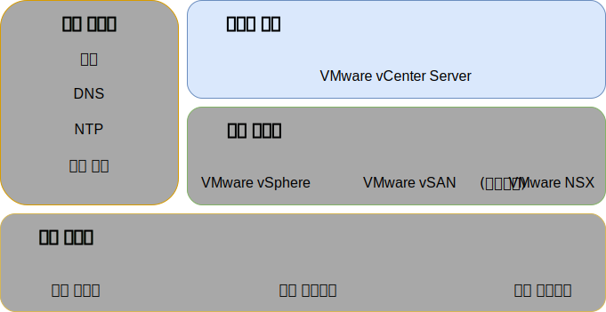

---

copyright:

  years:  2016, 2019

lastupdated: "2019-03-19"

subcollection: vmwaresolutions

---

{:tip: .tip}
{:note: .note}
{:important: .important}

# 인프라 관리 디자인
{: #design_infrastructuremgmt}

인프라 관리는 VMware 인프라를 관리하는 컴포넌트를 의미합니다.
* 임베디드 PSC(Platform Services Controller)가 포함된 vCenter Server는 vSphere 환경 관리를 위한 중앙 집중식 플랫폼이며 이 솔루션의 기반 컴포넌트 중 하나입니다.
* 이 솔루션에서 PSC를 사용하여 VMware vCenter 싱글 사인온, 라이센스 서비스, 검색 서비스 및 VMware 인증 기관을 포함하는 인프라 서비스 세트를 제공할 수 있습니다.

이 디자인은 vCenter Server의 인스턴스로 통합된 PSC 기능을 사용합니다. PSC 및 vCenter Server는 동일한 가상 머신(VM) 내에 수용됩니다. 

그림 1. 인프라 관리 

기본 인스턴스에 있는 PSC에는 `vsphere.local`의 기본 SSO 도메인이 지정됩니다.

## vCenter Server 디자인
{: #design_infrastructuremgmt-vcenter}

임베디드 PSC가 포함된 vCenter Server는 관리 VM과 연관된 사설 VLAN의 포터블 서브넷에 설치됩니다. 이의 기본 게이트웨이는 해당 특정 서브넷에 대한 BCR에서 지정된 IP 주소로 설정됩니다. 가상 어플라이언스는 다음 표의 스펙으로 구성되어 있습니다.

표 1. vCenter Server Appliance 스펙

| 속성                    | 스펙                       |
|------------------------------|-------------------------------------|
|vCenter Server               | 가상 어플라이언스                   |
| 어플라이언스 설치 크기  | 대형(최대 1,000개의 호스트 및 10,000개의 VM) |
|Platform Services Controller | 통합됨                            |
| vCPU 수              |16                                   |
|메모리                       |32GB                               |
| 디스크                         | 로컬 데이터 저장소의 990GB(대형 디스크 배치) |
| 디스크 유형                    | 씬 프로비저닝됨                    |

### vCenter Server 데이터베이스
{: #design_infrastructuremgmt-vcenter-db}

vCenter Server 구성에서는 어플라이언스에 포함된 로컬, 임베디드 PostgreSQL 데이터베이스를 사용합니다. 임베디드 데이터베이스는 외부 데이터베이스와 라이센싱의 종속성을 제거하는 데 사용됩니다.

### vCenter Server 클러스터 스펙
{: #design_infrastructuremgmt-vcenter-cluster}

이 디자인을 사용하면 솔루션을 통해 프로비저닝되는 vSphere ESXi 호스트를 클러스터링할 수 있습니다. 그러나 클러스터가 작성되기 전에, 데이터 센터 내의 팟(Pod)은 물론 vSphere ESXi 호스트의 위치를 나타내는 데이터 센터 오브젝트가 작성됩니다. 클러스터는 데이터 센터 오브젝트가 작성된 후에 작성됩니다. 클러스터는 VMware vSphere HA(High Availability) 및 VMware vSphere DRS(Distributed Resource Scheduler)가 사용되어 배치됩니다.

### vSphere Distributed Resource Scheduler
{: #design_infrastructuremgmt-vsphere-drs}

이 디자인에서는 초기 클러스터의 vSphere DRS(Distributed Resource Scheduling)를 사용하여 VM을 배치하며, 추가 클러스터의 DRS을 사용하여 VM을 동적으로 마이그레이션함으로써 밸런스가 유지된 클러스터를 구성합니다. 자동화 레벨은 vSphere에서 초기 배치 및 마이그레이션 권장사항을 실행할 수 있도록 완전히 자동화되도록 설정됩니다. 또한 vCenter가 우선순위 1, 2, 3 권장사항을 적용하여 클러스터의 로드 밸런싱에서 최소한의 적절한 개선이 이루어질 수 있도록, 마이그레이션 임계값이 적절하게 설정됩니다.

**Distributed Power Management** 기능을 통한 전력 관리는 이 디자인에서는 사용되지 않습니다.
{:note}

### vSphere High Availability
{: #design_infrastructuremgmt-vsphere-ha}

이 디자인은 초기 클러스터와 추가 클러스터에서 vSphere High Availability(HA)를 사용하여 컴퓨팅 장애를 감지하고 클러스터 내에서 실행되는 VM을 복구합니다. 이 디자인의 vSphere HA 기능은 클러스터에서 사용으로 설정된 **호스트 모니터링** 및 **허가 제어** 옵션을 모두 사용하여 구성됩니다. 또한 초기 클러스터는 1개 노드의 리소스를 허가 제어 정책을 위한 여유 용량으로서 예약합니다.

클러스터가 나중에 확장되거나 축소될 때 사용자는 허가 제어 정책을 조정해야 합니다.
{:note}

기본적으로, **VM 재시작 우선순위** 옵션은 "중간"으로 설정되어 있으며 **호스트 격리 응답** 옵션은 사용되지 않습니다. 또한 **VM 모니터링**은 사용되지 않으며 **데이터 저장소 하트비트** 기능은 클러스터 데이터 저장소를 포함하도록 구성되어 있습니다. 이 접근 방법에서는 NAS 데이터 저장소를 사용합니다(존재하는 경우).

## Enhanced vMotion Compatibility
{: #design_infrastructuremgmt-evc}

잠재적으로 다른 CPU 기능이 있는 클러스터 노드에서 vMotion 호환성을 단순화하기 위해 EVC(Enhanced vMotion Compatibility) 모드는 최신 프로세서가 {{site.data.keyword.cloud_notm}} 인벤토리 내에서 도달할 때 클러스터 노드에서 vMotion 호환성을 보장하도록 Skylake 레벨에서 사용으로 설정되고 Skylake 프로세서가 인벤토리에 없는 경우 향후 클러스터 확장을 허용합니다. 

### IBM CloudDriver
{: #design_infrastructuremgmt-cloud-driver}

이러한 솔루션의 초석은 자동화입니다. 자동화는 배치의 복잡도를 감소시키고, 배치 시간을 크게 줄이며, VMware 인스턴스가 일관된 방식으로 배치되도록 보장합니다.

IBM CloudBuilder는 새 VMware 인스턴스를 가져오고 라이프사이클 관리 기능을 수행하는 일시적인
{{site.data.keyword.cloud_notm}} VM 가상 서버 인스턴스(VSI)입니다. 전체 vCenter Server 인스턴스 관리가 필요할 때 배치되고, 프로세스가 완료될 때 영구 삭제됩니다. 

IBM CloudDriver는 메시지 큐로서 {{site.data.keyword.cloud_notm}} 오브젝트 스토리지를 통한 사설 네트워크 연결을 통해(선택적으로) 또는 공용 네트워크 연결을 통해 {{site.data.keyword.vmwaresolutions_short}} 관리 인프라로 다시 전달하도록 구성될 수 있습니다. IBM CloudDriver는 IBM 개발 컴포넌트이며 사용자가 액세스할 수 없고 다음 속성 및 기능을 갖고 있습니다. 

- 사용자 계정 내 vCenter Server 인스턴스의 배치 및 구성
- vCenter Server 클러스터에서 호스트 추가 및 제거
- vCenter Server 인스턴스에서 클러스터 추가 및 제거
- vCenter Server 인스턴스에 대한 추가 서비스
또는 기능 제거

### 자동화 플로우
{: #design_infrastructuremgmt-auto-flow}

다음은 {{site.data.keyword.vmwaresolutions_short}} 콘솔을 사용하여 VMware 인스턴스의 순서를 지정할 때 이벤트의 순서에 대해 설명합니다.
1. {{site.data.keyword.cloud_notm}}에서 네트워킹에 대한 VLAN 및 서브넷의 순서 지정.
2. vSphere Hypervisor가 설치된 {{site.data.keyword.cloud_notm}} {{site.data.keyword.baremetal_short}}의 순서 지정.
3. Active Directory 도메인 제어기의 역할을 수행하기 위한 Microsoft Windows VSI의 순서 지정.
4. Cloud Driver VSI의 배치.
5. 네트워킹 및 배치된 하드웨어의 유효성 검증.
6. 해당되는 경우, 단일 노드 vSAN의 초기 구성.
7. vCenter(임베디드 PSC 포함) 및 NSX의 배치 및 구성.
8. 나머지 ESXi 노드의 클러스터링, vSAN의 확장(해당되는 경우) 및 NSX 컴포넌트의 구성(VTEP).
9. 환경의 설치와 구성에 대한 유효성 검증.
10. 백업 서버와 스토리지 등의 선택적 서비스의 배치.
11. Cloud Driver VSI의 제거.

## ID 및 비밀번호
{: #design_infrastructuremgmt-ids-pwd}

IC4V 관리 인프라에서는 {{site.data.keyword.cloud_notm}} 관리 플레인 내에 암호화된 상태로 ID 및 비밀번호가 포함된 모든 vCenter Server를 저장합니다. 사용자가 이 비밀번호를 변경하면 vCenter Server 내의 자동화 기능이 중단될 수 있습니다.

자동화가 인터럽트되지 않은 기능을 처리할 수 있도록 IC4V 솔루션 포털에서 변경된 비밀번호를 제공할 수 있습니다. 선택적으로 솔루션 포털은 입력된 비밀번호의 확인을 허용합니다. 

## 관련 링크
{: #design_infrastructuremgmt-related}

* [실제 인프라 디자인](/docs/services/vmwaresolutions/archiref/solution?topic=vmware-solutions-design_physicalinfrastructure)
* [가상 인프라 디자인](/docs/services/vmwaresolutions/archiref/solution?topic=vmware-solutions-design_virtualinfrastructure)
* [공통 서비스 디자인](/docs/services/vmwaresolutions/archiref/solution?topic=vmware-solutions-design_commonservice)
