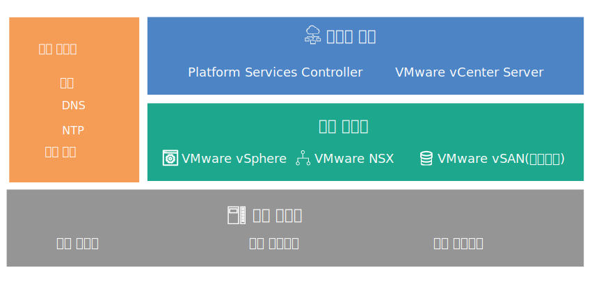

---

copyright:

  years:  2016, 2019

lastupdated: "2018-07-10"

---
# 디자인 개요

{{site.data.keyword.vmwaresolutions_full}}에서는 전세계에서 {{site.data.keyword.CloudDataCents_notm}}에 VMware 기술 컴포넌트를 배치하기 위한 자동화를 제공합니다.

## 솔루션 오퍼링

솔루션 오퍼링에는 자동으로 배치되고 구성된 클러스터 내에 다음의 VMware vSphere 제품이 포함되어 있습니다.
* VMware Cloud Foundation: vSphere ESXi, PSC(Platform Services Controller), VMware vCenter Server Appliance, SDDC Manager, VMware NSX 및 VMware vSAN.
* VMware vCenter Server: vSphere ESXi, PSC(Platform Services Controller), vCenter Server Appliance, NSX 및 선택사항으로 vSAN.

이 디자인에서 초기 주문 시에 인스턴스는 {{site.data.keyword.CloudDataCent_notm}}의 단일 팟(Pod)에 배치됩니다. 초기 배치 이후에 사용자는 동일 데이터 센터 내의 기타 팟(Pod)으로 또는 기타 데이터 센터로 가상 환경을 확장할 수 있습니다.

이 디자인은 Cloud Foundation 또는 vCenter Server 인스턴스 내에서 가상 용량의 자동화된 확장과 축소도 허용합니다.

## VMware on IBM Cloud 컴포넌트

그림 1. {{site.data.keyword.cloud_notm}}에서 VMware의 컴포넌트

### 관련 링크

* [실제 인프라 디자인](design_physicalinfrastructure.html)
* [가상 인프라 디자인](design_virtualinfrastructure.html)
* [공통 서비스 디자인](design_commonservice.html)
* [인프라 관리 디자인](design_infrastructuremgmt.html)
