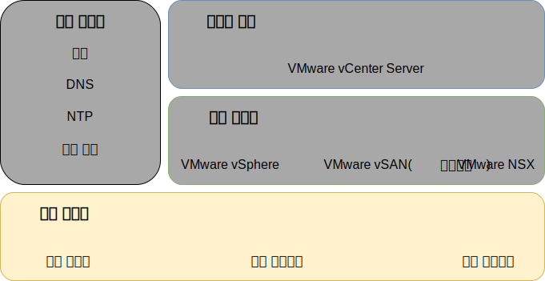
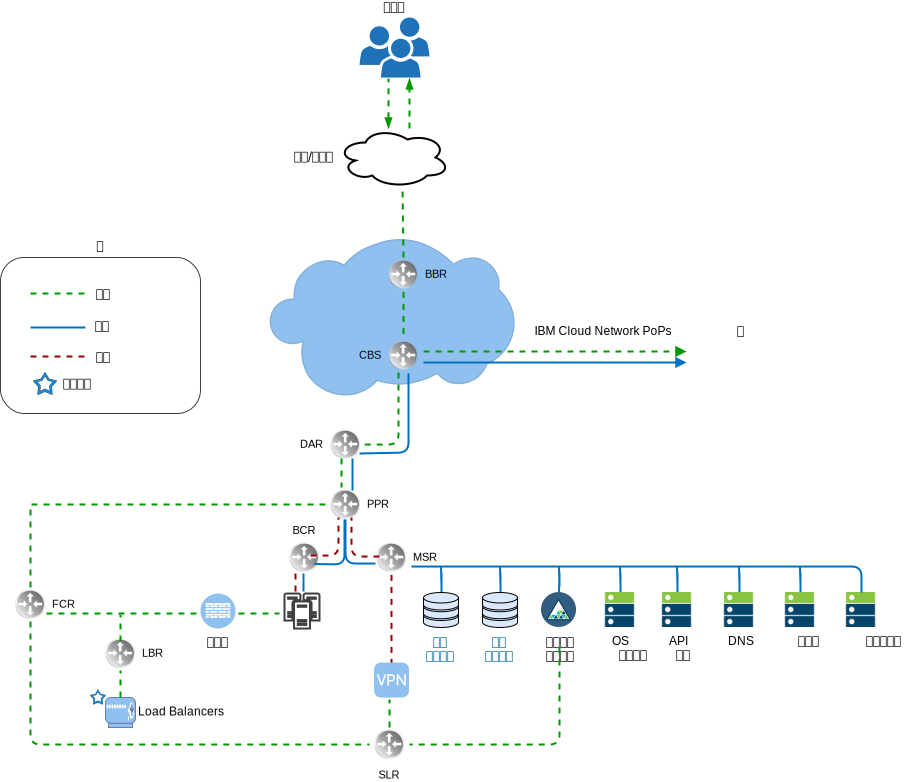
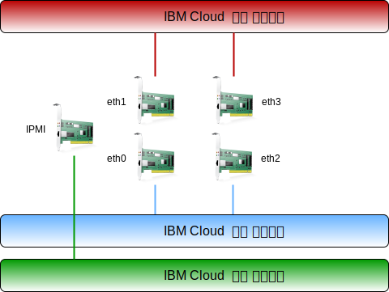

---

copyright:

  years:  2016, 2019

lastupdated: "2019-07-02"

subcollection: vmware-solutions

---

{:tip: .tip}
{:note: .note}
{:important: .important}

# 실제 인프라 디자인
{: #design_physicalinfrastructure}

실제 인프라는 다음 컴포넌트로 구성되어 있습니다.

<dl class="dl">
  <dt class="dt dlterm">실제 컴퓨팅</dt>
  <dd class="dd">실제 컴퓨팅은 가상화 인프라에서 사용하는 실제 처리와 메모리를 제공합니다. 이 디자인의 경우, 컴퓨팅 컴포넌트는 {{site.data.keyword.baremetal_long}}에 의해 제공되며 [VMware HCG(Hardware Compatibility Guide)](https://www.vmware.com/resources/compatibility/search.php)에 나열되어 있습니다.</dd>
  <dt class="dt dlterm">실제 스토리지</dt>
  <dd class="dd">실제 스토리지는 가상화 인프라에서 사용하는 원시 스토리지 용량을 제공합니다. 스토리지 컴포넌트는 NFS v3를 사용하는 공유 NAS(Network Attached Storage) 어레이 또는 {{site.data.keyword.baremetal_short}}에 의해 제공됩니다.</dd>
  <dt class="dt dlterm">실제 네트워크</dt>
  <dd class="dd">실제 네트워크는 해당 환경으로의 네트워크 연결을 제공하며, 이는 다시 네트워크 가상화에 의해 사용됩니다. 네트워크는 {{site.data.keyword.cloud_notm}} 서비스 네트워크에서 제공하며 여기에는 DNS 및 NTP 등의 추가 서비스가 포함되어 있습니다.</dd>
</dl>

실제 컴포넌트에 대한 자세한 정보는 [vCenter Server 명세서](/docs/services/vmwaresolutions/vcenter?topic=vmware-solutions-vc_bom)를 참조하십시오.

스토리지에 대한 자세한 정보는 [공유 스토리지 아키텍처](/docs/services/vmwaresolutions/archiref/attached-storage?topic=vmware-solutions-storage-benefits#storage-benefits)를 참조하십시오.

## 실제 컴퓨팅 디자인
{: #design_physicalinfrastructure-host-design}

솔루션에서 사용 가능한 서버 구성은 vSphere ESXi를 설치, 구성하고 관리하기 위한 최소 요구사항을 충족하거나 초과합니다. 서로 다른 요구사항을 충족하기 위해 다양한 구성을 사용할 수 있습니다. VMware on {{site.data.keyword.cloud_notm}} 솔루션에 사용되는 정확한 스펙의 세부 목록은 [vCenter Server 인스턴스](/docs/services/vmwaresolutions/vcenter?topic=vmware-solutions-vc_bom)의 명세서를 참조하십시오.

{{site.data.keyword.baremetal_short}}는 {{site.data.keyword.cloud_notm}}에 상주합니다.
{:note}

각 vCenter Server 인스턴스는 스토리지 솔루션의 선택사항에 따라 3-호스트 배치 또는 4-호스트 배치로 시작됩니다.

실제 호스트는 vSphere ESXi 하이퍼바이저에 할당되는 2개의 로컬로 연결된 디스크를 이용합니다. _실제 스토리지 디자인_ 섹션에 설명된 대로 vSAN을 사용하거나 [NetApp ONTAP Select 아키텍처](https://www.ibm.com/cloud/garage/files/IBM_Cloud_for_VMware_Solutions_NetApp_Architecture.pdf)에 설명된 대로 NetApp ONTAP을 사용하여 추가로 디스크를 할당할 수 있습니다. 각각의 실제 호스트에는 공용 및 사설 네트워크 액세스 둘 다를 위한 중복 10Gbps 네트워크 연결이 있습니다.

Bare Metal Server의 스펙은 다음과 같습니다.
* CPU: 듀얼 또는 쿼드 Intel Xeon, 다양한 코어 및 속도 구성
* 메모리: 다양한 구성, 64GB 이상
* 네트워크: 4 x 10Gbps
* 드라이브 수: 2개 이상

## 실제 네트워크 디자인
{: #design_physicalinfrastructure-net-design}

실제 네트워크는 {{site.data.keyword.cloud_notm}}에서 처리됩니다. IBM Cloud에서 제공하는 실제 네트워크 및 이전에 설명된 실제 호스트와 연관된 실제 호스트 연결(VLAN, MTU)에 대한 다음 설명을 검토하십시오.

### IBM Cloud 네트워크 개요
{: #design_physicalinfrastructure-ibm-cloud-network}

{{site.data.keyword.cloud_notm}}의 실제 네트워크는 2개의 개별 네트워크(공용 및 사설)로 분류됩니다. 사설 네트워크에는 실제 서버에 대한 관리 IPMI(Intelligent Platform Management Interface) 트래픽도 포함되어 있습니다.

#### 공용 네트워크
{: #design_physicalinfrastructure-public-net}

{{site.data.keyword.CloudDataCents_notm}} 및 네트워크 PoP(Points of Presence)에는 피어링 네트워크 캐리어 및 최상위 티어 전송에 대한 다중 1Gbps 또는 10Gbps 연결이 있습니다. 전세계 모든 위치에서의 네트워크 트래픽이 최인접 네트워크 PoP에 연결되고 네트워크를 직접 거쳐서 해당 데이터 센터로 이동하므로, 제공업체 간의 네트워크 홉과 핸드오프의 수를 최소화합니다.

데이터 센터 내에서 {{site.data.keyword.cloud_notm}}는 별도의 피어 집계 프론트 엔드 고객 스위치(FCS) 쌍을 통해 1Gbps 또는 10Gbps의 네트워크 대역폭을 개별 서버에 제공합니다. 집계된 해당 스위치는 L3 네트워킹을 위해 개별 라우터, FCR, 쌍에 연결됩니다.

이 다중 티어 디자인은 {{site.data.keyword.CloudDataCent_notm}} 내의 랙, 행 및 팟(Pod)에서 네트워크의 스케일링을 허용합니다.

#### 사설 네트워크
{: #design_physicalinfrastructure-private-net}

모든 {{site.data.keyword.CloudDataCents_notm}} 및 PoP는 사설 네트워크 백본에 의해 연결되어 있습니다. 이 사설 네트워크는 공용 네트워크와는 분리되며, 이는 전세계에서 {{site.data.keyword.CloudDataCents_notm}}의 서비스에 대한 연결을 가능하게 합니다. {{site.data.keyword.CloudDataCents_notm}} 간의 데이터 이동은 사설 네트워크에 대한 다중 10Gbps 또는 40Gbps 연결을 통해 이루어집니다.

공용 네트워크와 유사하게 사설 네트워크는 해당 서버에서 다중 티어이며, 기타 인프라 컴포넌트는 집계된 백엔드 고객 스위치(BCS)에 연결됩니다. 집계된 해당 스위치는 L3 네트워킹을 위해 개별 백엔드 고객 라우터(BCR)에 연결됩니다. 사설 네트워크는 실제 호스트 연결을 위한 점보 프레임(MTU 9000)을 사용하는 기능도 지원합니다.

#### 관리 네트워크
{: #design_physicalinfrastructure-mgmt-net}

공용 및 사설 네트워크에 추가하여, 각각의 {{site.data.keyword.cloud_notm}} 서버는 관리를 위해 기본 네트워크 서브넷에 연결되어 있습니다. 이 연결은 유지보수 및 관리 용도로 해당 CPU, 펌웨어 및 운영 체제와 독립적으로 서버에 대한 IPMI(Intelligent Platform Management Interface) 액세스를 허용합니다.

#### 기본 및 포터블 IP 블록
{: #design_physicalinfrastructure-ip-blocks}

{{site.data.keyword.cloud_notm}}는 {{site.data.keyword.cloud_notm}} 인프라 내에서 사용되는 두 가지 유형의 IP 주소를 할당합니다.
* 기본 IP 주소는 디바이스, 베어메탈 및 {{site.data.keyword.cloud_notm}}에서 프로비저닝하는 가상 서버에 지정됩니다. 이러한 블록에 IP 주소를 지정하지 마십시오.
* 포터블 IP 주소는 사용자가 필요에 따라 지정 및 관리할 수 있도록 제공됩니다. vCenter Server는 용도에 맞게 여러 포터블 IP 범위를 사용합니다. 고객 사용을 위해 지정되고 특정 NSX-T 또는 NSX-V 컴포넌트에 지정된 포터블 IP 주소 범위만 사용하십시오. 예를 들면, **Customer EDGE**입니다.

기본 및 포터블 IP 주소는 계정이 **VRF(virtual Virtual and Forwarding)** 계정으로 구성된 경우에 사용자 계정 내에서 임의의 VLAN으로 라우팅 가능합니다.

#### VRF(Virtual Routing and Forwarding)
{: #design_physicalinfrastructure-vrf}

{{site.data.keyword.slportal}} 계정은 서브넷 IP 블록 간에 자동 글로벌 라우팅을 사용하여 VRF(Virtual Routing and Forwarding) 계정으로 구성될 수 있습니다. Direct-Link 연결의 모든 계정은 VRF 계정으로 변환되거나 VRF 계정으로 작성되어야 합니다.

네트워크 라우팅 옵션과 함께 다양한 연결 옵션을 사용하려면 {{site.data.keyword.cloud_notm}} 계정이 VRF 모드에 있어야 하므로, vCenter Server를 프로비저닝하기 전에 계정이 VRF 모드에 있는 것이 좋습니다.

#### 실제 호스트 연결
{: #design_physicalinfrastructure-host-connect}

이 디자인에서 각각의 실제 호스트에는 각 {{site.data.keyword.cloud_notm}} ToR(Top of Rack) 스위치(공용 및 사설)로 유입되는 10Gbps 이더넷 연결의 2개 중복 쌍이 있습니다. 어댑터는 총 4 x 10Gbps 연결을 위해 개별 연결(비부착)로 설정됩니다. 이렇게 하면 네트워크 인터페이스 카드(NIC) 연결이 서로 간에 독립적으로 작동할 수 있습니다.

vCenter Server 오퍼링 내에서 사용되는 베어메탈 서버의 경우 공용 또는 사설 네트워크에 대한 실제 네트워크 연결을 제거할 수 없습니다. 베어메탈의 내부 NIC에 있는 실제 포트는 사용 안함으로 설정될 수 있으나 케이블 분리는 지원되지 않습니다.

#### VLAN과 언더레이 - 오버레이 라우팅
{: #design_physicalinfrastructure-vlans}

{{site.data.keyword.vmwaresolutions_short}} 오퍼링은 배치 시에 지정된 3개의 VLAN(1개의 공용 및 2개의 사설)으로 디자인되어 있습니다. 이전 그림에 표시된 대로, 공용 VLAN은 `eth1` 및 `eth3`에 지정되어 있으며 사설 VLAN은 `eth0` 및 `eth2`에 지정되어 있습니다.

이 디자인에서 작성되고 지정된 첫 번째 사설 VLAN 및 공용 VLAN은 {{site.data.keyword.cloud_notm}} 내에서 기본적으로 태그 지정이 없습니다. 그런 다음 추가적인 사설 VLAN은 실제 스위치 포트에서 선택되며 이러한 서브넷을 사용 중인 VMware 포트 내에서 태그 지정됩니다.

사설 네트워크는 이 디자인 내에서 2개의 VLAN으로 구성되어 있습니다. 3개의 서브넷이 이러한 VLAN의 첫 번째에 할당됩니다(여기서는 지정된 사설 VLAN A).
* 첫 번째 서브넷은 {{site.data.keyword.cloud_notm}}가 실제 호스트에 지정하는 기본 사설 IP 서브넷 범위입니다.
* 두 번째 서브넷은 관리 가상 머신(예: vCenter Server Appliance 및 Platform Services Controller)에 사용됩니다.
* 세 번째 서브넷은 NSX Manager를 통해 각 호스트에 지정된 캡슐화된 오버레이 네트워크 터널 엔드포인트(VTEP)에 사용됩니다.

사설 VLAN A 외에도, 두 번째 사설 VLAN(여기서는 지정된 사설 VLAN B)은 vSAN, vMotion 및 NFS<!--, and iSCSI--> 등의 VMware 기능을 지원하기 위해 존재합니다. 이와 같이, VLAN은 2개, 3개 또는 4개의 포터블 서브넷으로 분리됩니다:
* 첫 번째 서브넷은 vMotion 트래픽을 위해 커널 포트 그룹에 지정됩니다.
* 나머지 서브넷은 스토리지 트래픽에 사용됩니다.
   * vSAN을 사용할 때 서브넷은 vSAN 트래픽에 사용되는 커널 포트 그룹에 지정됩니다.
   * NFS 연결 NAS를 사용할 때 서브넷은 NFS 트래픽 전용인 포트 그룹에 지정됩니다.

vCenter Server 자동화된 배치의 일부로 구성된 모든 서브넷은 {{site.data.keyword.cloud_notm}} 관리 범위를 사용합니다. 이는 지금 또는 향후에 연결이 필요할 때 {{site.data.keyword.cloud_notm}} 계정 내의 임의의 데이터 센터로 IP 주소가 라우팅될 수 있도록 보장합니다.

요약을 보려면 다음 표를 검토하십시오.

표 1. VLAN 및 서브넷 요약

|VLAN |유형 |설명 |
|:---- |:---- |:----------- |
| 공용|기본  |공용 네트워크 액세스를 위해 실제 호스트에 지정됩니다. 호스트에 공인 IP 주소가 지정되지만 이 IP 주소는 호스트에서 구성되지 않습니다. 그러므로 공용 네트워크에서 직접 액세스할 수 없습니다. 대신, 공용 VLAN에서는 NSX ESG(Edge Services Gateway)와 같은 기타 컴포넌트에 대한 공용 인터넷 액세스를 제공합니다. |
| 사설 A |기본  |{{site.data.keyword.cloud_notm}}에 의해 지정된 실제 호스트에 지정된 단일 서브넷입니다. vSphere 관리 트래픽에 대한 관리 인터페이스에 의해 사용됩니다. |
| 사설 A |포터블 | 관리 컴포넌트로서 작동하는 가상 머신에 지정된 단일 서브넷 |
| 사설 A |포터블 | NSX-V 또는 NSX-T VTEP에 지정된 단일 서브넷 |
| 사설 B |포터블 | vSAN용으로 지정된 단일 서브넷(사용 중인 경우) |
| 사설 B |포터블 | NAS용으로 지정된 단일 서브넷(사용 중인 경우) |
| 사설 B |포터블 | vMotion용으로 지정된 단일 서브넷 |

이 디자인에서 모든 VLAN 지원 호스트 및 가상 머신은 기본 라우트로서 {{site.data.keyword.cloud_notm}} 백엔드 “사설 네트워크” 고객 라우터(BCR)를 지시하도록 구성됩니다. vCenter Server 인스턴스로 인해 SDN(Software-Defined Networking)의 사용은 가능하지만, 내부 서브넷으로의 라우팅이 포함된 VMware 인스턴스 내에서 작성된 네트워크 오버레이를 {{site.data.keyword.cloud_notm}} 관리 라우터는 알지 못합니다.

오버레이와 언더레이 간을 라우팅하려면 vCenter Server 인스턴스를 배치할 때 특정 언더레이 사설 VLAN에 대한 IBM 방화벽 디바이스를 배치해야 합니다. 이 디바이스는 언더레이와 오버레이 간을 라우팅할 수 있도록 오버레이 네트워킹 디바이스로의 정적 라우트 및 동적 라우팅 프로토콜 피어링의 삽입을 허용합니다.

사설 네트워크 연결은 스토리지 및 vMotion 등의 대형 데이터 전송의 성능 개선을 위해 9000의 점보 프레임 MTU 크기를 사용하도록 구성되어 있습니다. 이는 {{site.data.keyword.cloud_notm}}에 의해 VMware 내에서 허용되는 최대 MTU입니다. 공용 네트워크 연결은 1500의 표준 이더넷 MTU를 사용합니다. 이를 변경하면 인터넷 상에서 패킷 단편화가 발생할 수 있으므로 이를 그대로 유지해야 합니다.

## 실제 스토리지 디자인
{: #design_physicalinfrastructure-storage-design}

실제 스토리지 디자인은 실제 호스트에 설치된 실제 디스크의 구성 및 공유 네트워크 연결 스토리지의 구성으로 이루어져 있습니다. 여기에는 운영 체제(vSphere ESXi)와 가상 머신(VM)의 스토리지에 사용되는 디스크가 포함됩니다. VM용 스토리지는 VMware vSAN, 공유 파일 레벨 스토리지 또는 공유 블록 레벨 스토리지에 의해 가상화된 로컬 디스크로 구성할 수 있습니다.

### 운영 체제 디스크
{: #design_physicalinfrastructure-os-disks}

vSphere ESXi 하이퍼바이저는 지속적 위치에 설치됩니다. 따라서 실제 호스트는 vSphere ESXi 하이퍼바이저에 대한 중복성을 지원하기 위해 RAID-1 구성에서 2개의 디스크로 구성됩니다.

### vSAN 디스크
{: #design_physicalinfrastructure-vsan-disks}

이 디자인에서는 가상 머신에 대한 기본 데이터 저장소로서 VMware vSAN 또는 공유 네트워크 연결 스토리지를 사용하는 옵션을 허용합니다. VMware vSAN의 경우 이는 올플래시(all-flash) 구성을 사용하여 구성됩니다. 이 디자인에서는 2U 및 4U 섀시, 여러 개의 디스크 및 다양한 디스크 크기를 포함하여 여러 구성 옵션을 허용합니다. 모든 구성에서는 2개의 vSAN 디스크 그룹을 사용합니다(캐시용 1개의 SSD(Solid State Disk) 및 용량용 2개 이상의 SSD). vSAN 사용을 위해 할당된 모든 드라이브는 단일 디스크 RAID-0으로 구성됩니다.

지원되는 구성에 대한 자세한 정보는 [vCenter Server 명세서](/docs/services/vmwaresolutions/vcenter?topic=vmware-solutions-vc_bom)를 참조하십시오.

### 호스트 간의 공유 파일 스토리지
{: #design_physicalinfrastructure-shared-storage}

공유 파일 스토리지를 사용하는 경우에는 2TB NFS 공유가 초기 VMware 클러스터를 구성하는 호스트에 연결됩니다. 관리 공유라고 하는 이 공유는 VMware vCenter Server, Platform Services Controller 및 VMware NSX 등의 관리 컴포넌트에 사용됩니다.

스토리지는 IBM Cloud에서 2 IOPS/GB 레벨에서 NFSv3 프로토콜을 사용하여 연결됩니다.

구매 시에 또는 나중에 콘솔 내에서 워크로드에 대한 모든 호스트 간의 추가 파일 공유를 할당하고 마운트할 수 있습니다. 대응되는 {{site.data.keyword.CloudDataCent_notm}}의 사용 가능한 {{site.data.keyword.cloud_notm}} Endurance 파일 스토리지 용량 옵션 및 성능 티어에서 선택할 수 있습니다. 모든 공유는 NFS v3 프로토콜을 사용하여 연결됩니다. 또한 NetApp ONTAP Select 오퍼링을 적용하여 NFS v3 파일 공유를 연결할 수 있습니다.

10 IOPS/GB의 가용성은 IBM Cloud Data Center에 따라 달라집니다. 10 IOPS/GB 성능 티어를 제공하는 {{site.data.keyword.CloudDataCents_notm}}에는 저장 데이터의 제공자 관리 암호화(AES-256 암호화)도 포함되어 있으며, 올플래시(all-flash) 스토리지에 의해 백업됩니다. 10 IOPS/GB 성능 티어는 4TB의 최대 용량으로 제한됩니다. 이 스토리지에서 사용된 공유 NAS에 대한 자세한 정보는 [공유 스토리지 아키텍처](/docs/services/vmwaresolutions/archiref/attached-storage?topic=vmware-solutions-storage-benefits#storage-benefits)를 참조하십시오.

이 스토리지에서 사용된 공유 NAS에 대한 자세한 정보는 [공유 스토리지 아키텍처](/docs/services/vmwaresolutions/archiref/attached-storage?topic=vmware-solutions-storage-benefits#storage-benefits)를 참조하십시오.

## 관련 링크
{: #design_physicalinfrastructure-related}

* [vCenter Server 명세서](/docs/services/vmwaresolutions/vcenter?topic=vmware-solutions-vc_bom)
* [공유 스토리지 아키텍처](/docs/services/vmwaresolutions/archiref/attached-storage?topic=vmware-solutions-storage-benefits#storage-benefits)
* [NetApp ONTAP Select 아키텍처](https://www.ibm.com/cloud/garage/files/IBM_Cloud_for_VMware_Solutions_NetApp_Architecture.pdf)
