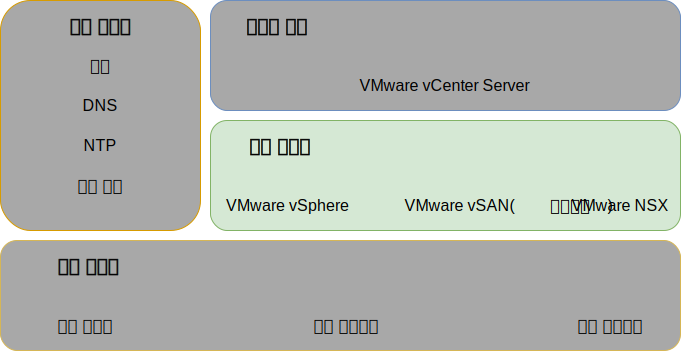
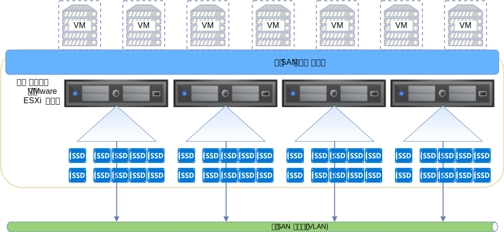
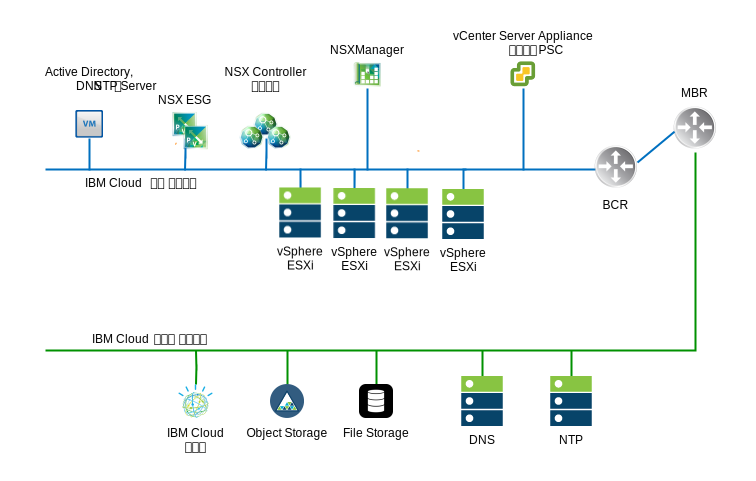
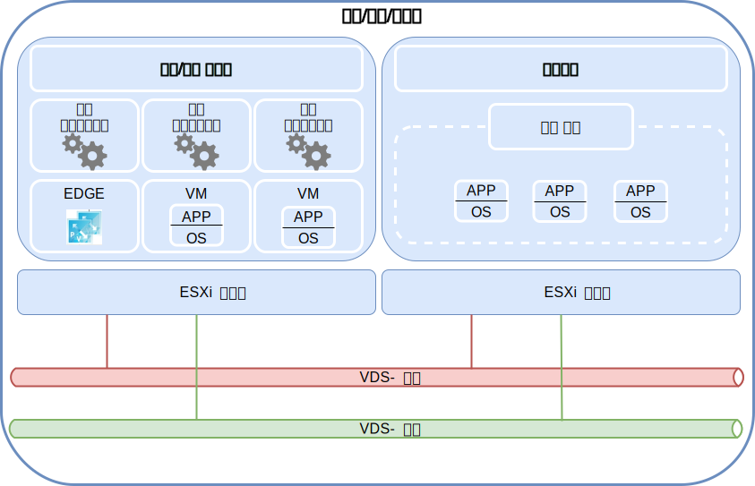

---

copyright:

  years:  2016, 2019

lastupdated: "2019-05-07"

subcollection: vmware-solutions

---

{:tip: .tip}
{:note: .note}
{:important: .important}

# 가상 인프라 디자인
{: #design_virtualinfrastructure}

가상 인프라 계층에는 VMware vSphere ESXi, VMware NSX-V 또는 NSX-T 및 선택사항으로 VMware vSAN 등의 실제 인프라 계층에서 제공된 컴퓨팅, 스토리지 및 네트워크 리소스를 가상화하는 VMware 소프트웨어 컴포넌트가 포함되어 있습니다.

## VMware vSphere 디자인
{: #design_virtualinfrastructure-vsphere-design}

vSphere ESXi 구성은 다음과 같은 측면으로 구성되어 있습니다.
* 부트 구성
* 시간 동기화
* 호스트 액세스
* 사용자 액세스
* DNS 구성

다음 표에는 각 측면에 대한 스펙이 개략적으로 설명되어 있습니다. ESXi의 구성 및 설치 이후에 호스트는 VMware vCenter Server에 추가되며 여기에서 관리됩니다.

이 디자인을 사용하면 DCUI(Direct Console User Interface) 및 vSphere Web Client를 통해 가상 호스트에 액세스할 수 있습니다. SSH(Secure Shell) 및 ESXi Shell은 우수 사례로서 프로비저닝된 후에 사용 안함으로 설정됩니다.

기본적으로, 직접 로그인할 수 있는 유일한 사용자는 호스트의 실제 시스템에 대한 _root_ 및 _ibmvmadmin_ 사용자입니다. 관리자는 MSAD(Microsoft Active Directory) 도메인에서 사용자를 추가하여 호스트에 대한 사용자 액세스를 사용으로 설정할 수 있습니다. vCenter Server 솔루션 디자인의 모든 호스트는 중앙 NTP 서버와 동기화하도록 구성되어 있습니다.

표 1. vSphere ESXi 구성

| 속성              | 구성 매개변수 |
|:---------------------- |:----------------------- |
| ESXi 부트 위치     | RAID-1에 구성되는 로컬 디스크 사용 |
| 시간 동기화   | {{site.data.keyword.cloud}} NTP 서버 사용 |
| 호스트 액세스            | DCUI 지원. SSH 및 ESXi Shell은 지원되지만 기본적으로 사용으로 설정되지는 않습니다. |
| 사용자 액세스            | 로컬 인증 및 MSAD |
| 도메인 이름 분석 |[공통 서비스 디자인](/docs/services/vmwaresolutions/archiref/solution?topic=vmware-solutions-design_commonservice)에서 설명된 대로 DNS 사용 |
| EVC 모드 | Skylake("그린필드" vSphere 6.7 배치에만 해당) |

vSphere 클러스터는 사용자 워크로드에 대한 컴퓨팅 리소스를 비롯하여 vCenter Server 인스턴스를 관리하는 가상 머신(VM)을 수용합니다.

* vCenter Server 인스턴스가 vSAN을 사용하는 경우, 초기 배치 시에 ESXi 호스트의 최소 수는 4개입니다.
* vCenter Server 인스턴스가 공유 파일 레벨 또는 블록 레벨 스토리지를 사용하는 경우, 초기 배치 시에 ESXi 호스트의 최소 수는 3개입니다.

초기 배치 중이나 그 이후에는 최대 59개의 ESXi 호스트까지 확장할 수 있습니다.

추가 사용자 워크로드를 지원하려면 다음으로 환경을 확장할 수 있습니다.  
* 기존 클러스터에 추가 컴퓨팅 호스트 배치
* 동일한 vCenter Server Appliance에서 관리하는 추가 클러스터 배치
* 고유의 vCenter Server Appliance를 사용하여 새 vCenter Server 인스턴스 배치

클러스터에 대한 자세한 정보는 [VMware 클러스터 솔루션 아키텍처를 실행하는 {{site.data.keyword.cloud_notm}}](https://www.ibm.com/cloud/garage/files/IBM-Cloud-for-VMware-Solutions-Multicluster-Architecture.pdf)를 참조하십시오.

## VMware vSAN 디자인
{: #design_virtualinfrastructure-vsan-design}

이 디자인에서 VMware vSAN 스토리지는 vSphere 호스트에 대한 공유 스토리지를 제공하기 위해 vCenter Server 인스턴스에서 채택됩니다.

그림 1에서 표시된 대로 vSAN은 vSphere 클러스터 내에서 다중 ESXi 호스트 간의 로컬 스토리지를 집계하며, 집계된 스토리지를 단일 VM 데이터 저장소로서 관리합니다. 이 디자인 내에서 컴퓨팅 노드에는 ESXi 운영 체제(OS) 및 vSAN 데이터 저장소에 대한 로컬 디스크 드라이브가 포함되어 있습니다. 노드가 속한 클러스터와는 무관하게, ESXi 설치를 수용하기 위해 2개의 OS 드라이브가 각 노드에 포함되어 있습니다.

vSAN에서는 다음 컴포넌트를 채택합니다.
* 2-디스크 그룹 vSAN 디자인. 각 디스크 그룹에 두 개 이상의 디스크 포함. 그룹에서 최소 크기의 하나의 SSD 또는 NVMe 드라이브는 캐시 티어로서 제공되며, 나머지 SSD는 용량 티어로서 제공됩니다.
* 온보드 RAID 제어기는 2개의 OS 드라이브를 제외한 각 드라이브마다 RAID-0 배열에서 구성됩니다.
* 단일 vSAN 데이터 저장소가 모든 스토리지에서 작성됩니다.

사용 가능한 vSAN 기능은 인스턴스를 주문할 때 선택하는 라이센스 에디션에 따라 다릅니다. 자세한 정보는 [VMware vSAN 에디션 비교](/docs/services/vmwaresolutions/archiref/solution?topic=vmware-solutions-solution-appendix#vmware-vsan-edition-comparison)를 참조하십시오.

### vSAN의 가상 네트워크 설정
{: #design_virtualinfrastructure-net-setup}

이 디자인의 경우, vSAN 트래픽은 전용 사설 VLAN에서 ESXi 호스트 간에 이동합니다. 사설 네트워크 스위치에 연결된 2개의 네트워크 어댑터는 업링크로 두 개 네트워크 어댑터가 포함된 vSphere Distributed Switch(vDS)로 vSphere 내에서 구성됩니다. vSAN VLAN에 대해 구성된 전용 vSAN 커널 포트 그룹은 vDS 내에 상주합니다. 점보 프레임(MTU 9000)은 사설 vDS용으로 사용됩니다.

vSAN은 업링크 간의 트래픽을 로드 밸런싱하지 않습니다. 따라서 고가용성(HA)을 지원하기 위해 다른 어댑터가 대기 중인 동안 하나의 어댑터는 활성입니다. vSAN에 대한 네트워크 장애 복구 정책은 실제 네트워크 포트 간에 **명시적 장애 복구**로서 구성됩니다.

실제 NIC 연결에 대한 자세한 정보는 [실제 호스트 NIC 연결](/docs/services/vmwaresolutions/services?topic=vmware-solutions-design_physicalinfrastructure#design_physicalinfrastructure-host-connect)을 참조하십시오.

### vSAN 정책 디자인
{: #design_virtualinfrastructure-storage-policy}

vSAN이 사용되어 구성된 경우에는 VM 스토리지 특성을 정의하기 위해 스토리지 정책이 구성됩니다. 스토리지 특성은 서로 다른 VM에 대해 서로 다른 서비스 레벨을 지정합니다.

이 디자인의 기본 스토리지 정책은 단일 장애를 허용합니다. 기본 정책은 **내장애성 방법**이 **RAID-5/6(삭제 코딩) - 용량**으로 설정되고 **기본 장애 레벨**이 1로 설정된 삭제 코딩으로 구성되어 있습니다. RAID 5 구성에서는 최소 4개의 호스트가 필요합니다.

또는 **내장애성 방법**이 **RAID-5/6(삭제 코딩) - 용량**으로 설정되고 **기본 장애 레벨**이 2로 설정된 RAID 6 구성을 선택할 수도 있습니다. RAID 6 구성에서는 최소 6개의 호스트가 필요합니다. **중복** 및 **압축**은 기본 스토리지 정책에서도 사용됩니다.

vSphere 콘솔에서 달리 지정되지 않는 한 인스턴스는 기본 정책을 사용합니다. 사용자 정의 정책이 구성된 경우, vSAN은 가급적 이를 보장합니다. 그러나 정책을 보장할 수 없는 경우, 프로비저닝을 강제 실행하도록 설정되어 있지 않는 한 정책을 사용하는 VM을 프로비저닝할 수 없습니다.

스토리지 정책은 새 ESXi 호스트 또는 ESXi 호스트의 패치가 추가된 후에 재적용되어야 합니다.

### vSAN 설정
{: #design_virtualinfrastructure-vsan-sett}

vSAN 설정은 {{site.data.keyword.cloud_notm}} 내에서 VMware Solutions 배치를 위한 우수 사례를 기반으로 구성됩니다. vSAN 설정에는 SIOC 설정, 명시적 장애 복구 설정 포트 그룹 및 디스크 캐시 설정이 포함됩니다.
* SSD 캐시 정책 설정: **미리 읽기**, **Write Through**, **직접** 없음(NRWTD)
* 네트워크 I/O 제어 설정
   * 관리 - 20개 공유
   * 가상 머신 - 30개 공유
   * vMotion - 50개 공유
   * vSAN - 100개 공유
* vSAN 커널 포트: **명시적 장애 복구**

## NFS 연결 스토리지
{: #design_virtualinfrastructure-nfs-storage}

NFS 네트워크 연결 스토리지를 사용 중인 경우 이 아키텍처는 NFS v4.1이 아니라 NFS v3을 사용하도록 규정합니다. NFS v4.1 사용 시 NFS 서버 LIF 마이그레이션으로 인해 과도한 대기 시간이 발생할 수 있기 때문입니다. 각 vSphere 호스트는 해당 호스트 이름을 사용하여 NFS 스토리지에 연결됩니다.

성능 티어가 4IOPS/GB인 관리 컴포넌트에서 사용하도록 하나의 2TB NFS 데이터 저장소가 클러스터에 연결됩니다. 다양한 크기 및 성능 티어의 워크로드용으로 추가 데이터 저장소가 연결될 수 있습니다.

또한 이 아키텍처에서는 모든 호스트에 NFS 스토리지가 상주하는 서브넷에 대한 서브넷 라우트가 작성되어 있어야 합니다. 이 서브넷 라우트의 목적은 모든 NFS 트래픽에 이 디자인에서 NFS 트래픽용으로 지정된 포트 그룹, 서브넷 및 VLAN을 사용하도록 지시하는 것입니다. 다중 NFS 데이터 저장소가 연결된 경우 해당 데이터 저장소가 여러 원격 서브넷에 있을 수 있으므로 다중 라우트를 구성해야 할 수 있습니다.

관리 가상 머신이 NFS 데이터 저장소에 있을 수 있습니다. 일부 관리 시스템이 NFS 호스트 이름을 분석하는 데 사용되는 DNS 서비스를 담당할 수 있으므로 이로 인해 부트스트랩 문제점이 발생합니다. 따라서 이 아키텍처는 관리 데이터 저장소용 IP 주소 중 하나 이상이 각 호스트의 `/etc/hosts`에 하드 코딩되도록 지정합니다.

## iSCSI 연결 스토리지
{: #design_virtualinfrastructure-iscsi-storage}

NFS v3 연결 스토리지와는 달리 iSCSI 연결 스토리지는 구성된 모든 NIC 카드 포트 및 대상 포트에서 활성-활성 경로를 지원합니다. 그러므로 더 높은 처리량을 달성할 수 있으며 NFS 연결 스토리지에 대한 적절한 대안이 됩니다. 복잡도 증가로 비용이 부과됩니다.

{{site.data.keyword.cloud_notm}} Endurance 블록 스토리지는 VMware 사용 시 LUN당 최대 64개의 IP 주소 연결을 지원하며, 이 디자인에 따라 최대 32개의 호스트가 허용됩니다.

관리 컴포넌트의 사용을 위해 하나의 2-TB iSCSI LUN이 vSphere 클러스터에 연결되고, 고객 워크로드 사용을 위해 최소 두 개 이상의 iSCSI LUN이 구성됩니다. 이 스토리지는 각 LUN당 VMFS 6.x 파일 시스템으로 형식화됩니다.

이 아키텍처는 iSCSI 포트 바인딩, 다중 경로에 대한 라운드 로빈 정책, 최대 큐 길이 64 및 라운드 로빈 IOPS 한계 1을 사용하도록 지정합니다.

### iSCSI의 가상 네트워크 설정
{: #design_virtualinfrastructure-setup-iscsi}

이 디자인의 경우 iSCSI 트래픽은 활성, 활성 구성에서 2개의 사설 연결 NIC 카드 포트를 사용하도록 허용됩니다. vSphere는 vDS 내 특정 포트 그룹에서 한 번에 하나의 NIC 카드 포트만 활성 상태가 되도록 허용하므로 2개의 포트 그룹이 스토리지 VLAN에서 작성되어야 합니다(A 및 B).

ESXi 커널 포트는 확장성을 허용하도록 개별 서브넷의 고유 IP 주소로 작성됩니다. 각 커널 포트는 자체 iSCSI 포트 그룹에 지정됩니다. 두 커널 포트는 ESXi 가상 ISCSI 호스트 버스 어댑터(HBA)에 지정됩니다. 각 커널 포트의 경우 기본 GW 대체 스위치는 해당 커널 포트에 대해 로컬 서브넷의 기본 게이트웨이를 사용합니다. 다음 표를 참조하십시오.

표 2. iSCSi 포트 그룹

vDS Portgroup | 커널 포트 서브넷 | VMHBA
--|:---|:--
**SDDC-Dprotgroup-iSCSI-A** |Subnet-A |  vmhba64
**SDDC-Dprotgroup-iSCSI-B** | Subnet-B | vmhba64

#### 스토리지 I/O 제어 - SIOC
{: #design_virtualinfrastructure-sioc}

iSCSI LUNS는 LUN당 하나의 파일 VMFS 파일 시스템으로 프로비저닝되고 형식화됩니다. 권장되는 기본 SIOC 설정은 최대 처리량의 90%입니다.

## VMware NSX-V 디자인
{: #design_virtualinfrastructure-nsx-design}

네트워크 가상화는 가상 계층 내에 존재하는 네트워크 오버레이를 제공합니다. 네트워크 가상화에서는 On-Demand 가상 네트워크의 빠른 프로비저닝, 배치, 재구성 및 폐기 등의 기능을 아키텍처에 제공합니다. 이 디자인은 vDS 및 VMware NSX for vSphere를 사용하여 가상 네트워킹을 구현합니다.

이 디자인에서 NSX Manager는 초기 클러스터에 배치됩니다. NSX Manager에는 사설 포터블 주소 블록의 VLAN 지원 IP 주소가 지정됩니다. 이는 관리 컴포넌트용으로 지정되고 [공통 서비스 디자인](/docs/services/vmwaresolutions/archiref/solution?topic=vmware-solutions-design_commonservice)에 표시되는 DNS 및 NTP 서버로 구성됩니다.

다음 그림에서는 아키텍처의 기타 컴포넌트와 연관된 NSX Manager의 배치를 보여줍니다.

초기 배치 이후 {{site.data.keyword.cloud_notm}} 자동화는 초기 클러스터 내에 3개의 NSX Controller를 배치합니다. 각 제어기에는 관리 컴포넌트용으로 지정된 **사설 A** 포터블 서브넷의 VLAN 지원 IP 주소가 지정됩니다. 또한 이 디자인은 클러스터의 호스트 간에 제어기를 분리하기 위해 VM-VM 비유사성 규칙을 작성합니다. 초기 클러스터에는 제어기에 대한 고가용성을 보장할 수 있도록 최소한 3개의 노드가 포함되어 있어야 합니다.

제어기에 추가하여, {{site.data.keyword.cloud_notm}} 자동화는 VTEP(VXLAN Tunnel Endpoint)를 통한 가상화된 네트워크의 사용이 가능하도록 NSX VIBS의 배치된 vSphere 호스트를 준비합니다. VTEP에는 [VLAN](/docs/services/vmwaresolutions/services?topic=vmware-solutions-design_physicalinfrastructure#design_physicalinfrastructure-vlans)에서 나열된 대로 VTEP에 지정된 **사설 A** 포터블 IP 주소 범위의 VLAN 지원 IP 주소가 지정됩니다. VXLAN 트래픽은 태그가 지정되지 않은 VLAN에 상주하며 사설 vDS에 지정됩니다.

그런 다음 세그먼트 ID 풀이 지정되고 클러스터에 있는 호스트가 전송 구역에 추가됩니다. IGMP(Internet Group Management Protocol) 스누핑이 {{site.data.keyword.cloud_notm}} 내에서 구성되지 않으므로 전송 구역에서는 유니캐스트만 사용됩니다. VMW 우수 사례마다 동일한 VTEP 전용 서브넷에서 호스트당 2개의 VTEP 커널 포트가 구성됩니다.

그런 다음 인스턴스에 공용 네트워크 인터페이스가 있는 경우 두 개의 NSX Edge Services Gateway 쌍이 배치됩니다. 하나의 게이트웨이 쌍은 사설 네트워크에 상주하는 자동화 컴포넌트의 아웃바운드 트래픽에 사용됩니다. 고객 관리 에지라고 하는 두 번째 게이트웨이가 배치되며 사설 네트워크에 지정된 인터페이스와 공용 네트워크에 대한 업링크로 구성됩니다. 솔루션의 일부로서 배치된 NSX Edge Services Gateway에 대한 자세한 정보는 [NSX Edge Services Gateway 솔루션 아키텍처](/docs/services/vmwaresolutions/services?topic=vmware-solutions-nsx_overview#nsx_overview)를 참조하십시오.

클라우드 관리자는 임의의 필수 컴포넌트(예: DLR(Distributed Logical Router), 논리 스위치 및 방화벽)를 구성할 수 있습니다. 사용 가능한 NSX 기능은 인스턴스를 주문할 때 선택하는 NSX 라이센스 에디션에 따라 다릅니다. 자세한 정보는 [VMware NSX 에디션 비교](/docs/services/vmwaresolutions/archiref/solution?topic=vmware-solutions-solution-appendix#vmware-nsx-edition-comparison)를 참조하십시오.

NSX Manager는 다음 표에 나열된 스펙으로 설치됩니다.

표 3. NSX Manager 요구사항

| 속성       | 스펙 |
|:--------------- |:------------- |
| NSX Manager     | 가상 어플라이언스 |
| vCPU 수 | 4 |
| 메모리          | 16GB |
| 디스크            | 관리 NFS 공유의 60GB |
| 디스크 유형       | 씬 프로비저닝됨 |
| 네트워크         | 관리 컴포넌트용으로 지정된 **사설 A** 포터블 |

### 분배 스위치 디자인
{: #design_virtualinfrastructure-distr-switch}

디자인에서는 최소한의 vDS 스위치를 사용합니다. 클러스터의 호스트는 공용 및 사설 네트워크에 연결됩니다. 호스트는 2개의 분배 가상 스위치로 구성되어 있습니다. 2개 스위치의 사용은 공용 및 사설 네트워크를 분리하는 {{site.data.keyword.cloud_notm}} 네트워크의 사례를 따릅니다. 다음 다이어그램은 vDS 디자인을 보여줍니다.

이전 그림에 표시된 대로, 하나의 vDS는 공용 네트워크 연결(SDDC-Dswitch-Public)용으로 구성되고 다른 vDS는 사설 네트워크 연결(SDDC-Dswitch-Private)용으로 구성되어 있습니다. 경합과 대기 시간을 줄이고 보안을 강화하기 위해 서로 다른 유형의 트래픽을 분리해야 합니다.

VLAN은 실제 네트워크 기능을 세그먼트화하는 데 사용됩니다. 이 디자인에서는 3개의 VLAN(사설 네트워크 트래픽용으로 2개와 공용 네트워크 트래픽용으로 1개)을 사용합니다. 다음 표에서는 트래픽 분리를 보여줍니다.

표 4. 트래픽 유형으로 VLAN 맵핑

|VLAN  | 대상 | 트래픽 유형 |
|:----- |:----------- |:------------ |
|VLAN 1 | 사설 A   | ESXi 관리, 관리, VXLAN(VTEP) |
|VLAN 2 | 사설 B   | vSAN, NFS, vMotion, iSCSI |
|VLAN 3 | 공용      |인터넷 액세스를 위해 사용 가능 |

워크로드의 트래픽이 VXLAN-지원 논리 스위치에서 이동합니다.

vSphere 클러스터는 다음 표에서 처럼 구성된 2개의 vSphere 분배 스위치를 사용합니다.

표 5. 통합 클러스터 분배 스위치

| vSphere 분배 스위치 이름 |기능 |네트워크 I/O 제어 |로드 밸런싱 모드 |실제 NIC 포트 | MTU |
|:------------- |:------------- |:------------- |:------------- |:------------- |:------------- |
| SDDC-Dswitch-Private | ESXi 관리, vSAN, vSphere vMotion, VXLAN 터널 엔드포인트, NFS(VTEP) |사용 | 명시적 장애 복구(vSAN, vMotion)의 원래 가상 포트 기반 라우트(기타 모두) |2 | 9,000 (점보 프레임) |
| SDDC-Dswitch-Public | 외부 관리 트래픽(north-south) |사용 | 원래 가상 포트 기반 라우트 |2 | 1,500 (기본값) |

호스트 NIC의 이름, 번호 및 순서는 {{site.data.keyword.CloudDataCent_notm}} 및 호스트 하드웨어 선택에 따라 다를 수 있습니다.
{:note}

표 6. 통합 클러스터 분배 스위치 포트 그룹 구성 설정

|매개변수          |설정       |
|:------------------ |:------------- |
|로드 밸런싱     |원래 가상 포트 기반 라우트 \* |
|장애 복구 발견 | 링크 상태만 |
|알림 스위치    |사용 |
| 장애 조치           |아니오 |
|장애 복구 순서     |활성 업링크: Uplink1, Uplink2 \* |

\* vSAN 스토리지 트래픽의 로드 밸런싱을 지원하지 않으므로 vSAN 포트 그룹은 활성/대기의 명시적 장애 복구를 사용합니다. iSCSI 포트 그룹은 한 번에 하나의 활성 업링크만 갖게 됩니다(iSCSI A - Uplink1, iSCSI B - Uplink2).
{:note}

표 7. 통합 클러스터 가상 스위치 포트 그룹 및 VLAN, 분배 스위치 **SDDC-Dswitch-Private**

포트 그룹| 팀 구성|업링크| VLAN ID
---|---|---|--
 SDDC-DPortGroup-Mgmt| 원래 가상 포트| 활성: 0, 1|VLAN 1
 SDDC-DPortGroup-vMotion| 원래 가상 포트| 활성: 0, 1|VLAN 2
 SDDC-DPortGroup-VSAN| 명시적 장애 복구|활성: 0, 대기: 1|VLAN 2
 SDDC-DPortGroup-NFS| 원래 가상 포트| 활성: 0, 1|VLAN 2
NSX 생성| 원래 가상 포트|활성: 0, 1|VLAN 1
 SDDC-DPortGroup-External| 원래 가상 포트| 활성: 0, 1|VLAN 3
SDDC-DPortGroup-iSCSI-A| 원래 가상 포트| 활성: 0|VLAN 2
SDDC-DPortGroup-iSCSI-B| 원래 가상 포트| 활성: 0|VLAN 2

표 8. 통합 클러스터 VMkernel 어댑터, 분배 스위치 **SDDC-Dswitch-Private**

 용도| 연결된 포트 그룹| 사용 가능한 서비스| MTU
--|---|---|---|--
관리| SDDC-DPortGroup-Mgmt|관리 트래픽|1500(기본값)
 vMotion| SDDC-DPortGroup-vMotion|vMotion 트래픽|9000
 VTEP|NSX 생성|-|9000
vSAN| SDDC-DPortGroup-VSAN|vSAN|9000
NAS| SDDC-DPortGroup-NFS|NAS|9000
iSCSI|SDDC-DPortGroup-iSCSI-A|iSCSI|9000
iSCSI|SDDC-DPortGroup-iSCSI-B|iSCSI|9000

### NSX 구성
{: #design_virtualinfrastructure-nsx-config}

이 디자인은 NSX 컴포넌트의 구성을 지정하지만 네트워크 오버레이 컴포넌트 구성은 적용하지 않습니다. 사용자는 자체 요구사항에 따라 네트워크 오버레이를 디자인할 수 있습니다.

다음과 같은 측면이 사전 구성되어 있습니다.
* 관리 서버 및 제어기가 설치되어 vCenter 웹 UI에 통합됨
* ESXi 에이전트가 설치되며 VTEP IP IP 주소가 ESXi 호스트마다 구성됨
* VTEP 구성, 제어기 구성 및 VXLAN 구성(전송 구역)
* 관리 컴포넌트에서 사용하는 NSX Edge Services Gateway 어플라이언스
* 고객 사용을 위한 NSX Edge Services Gateway 어플라이언스
* DLR과 고객 ESG 간의 전송 VXLAN으로 분배 로컬 라우터(DLR)에 연결된 NSX VXLAN 작업 고객 워크로드
* 고객 ESG에서 유출 네트워크로 사용하기 위한 VXLAN의 RFC 1918 주소 공간 및 IBM Cloud 사설 및 공용 포터블 IP 주소

다음과 같은 측면은 구성되어 있지 않습니다.
* 마이크로 세그먼트화
* 기타 VMware 인스턴스에 링크된 NSX Management

## 공용 네트워크 연결

인스턴스에 공용 네트워크 연결이 필요한 데에는 여러 가지 이유가 있습니다. 이때 사용자 워크로드에 적합한 공용 업데이트 서비스 또는 기타 공용 서비스(예: 지리 위치 데이터베이스 또는 날씨 데이터)에 대한 액세스 권한이 필요할 수 있습니다. 가상화 관리 및 추가 서비스도 공용 연결이 필요하거나 공용 연결의 이점을 얻을 수 있습니다. 예를 들어, vCenter는 HCL 데이터베이스를 업데이트하고 공용 네트워크를 통해 [VUM(VMware Update Manager)](/docs/services/vmwaresolutions/archiref/vum?topic=vmware-solutions-vum-intro) 업데이트를 다운로드할 수 있습니다. Zerto, Veeam, VMware HCX, F5 BIG-IP 및 FortiGate-VM은 제품 라이센스 부여, 활성화 또는 사용량 보고의 일부분에 대해 모두 공용 네트워크 연결을 사용합니다. 또한 복제를 목적으로 온프레미스 데이터 센터에 연결하기 위해 공용 네트워크를 통해 터널을 사용할 수 있습니다.

보통 이 통신은 관리 또는 고객 에지 서비스 게이트웨이(ESG)를 통해 공용 네트워크에 선택적으로 라우트되고 NAT를 수행합니다. 그러나 추가 보안 요구사항이 있거나 통신 경로를 단순화하는 데 프록시 사용을 선호할 수 있습니다. 또한 공용 인터페이스가 사용 불가능한 상태에서 인스턴스를 배치한 경우 공용 네트워크에 라우트하는 데 ESG를 사용할 수 없습니다.

이 아키텍처에서는 공용 네트워크에 대한 트래픽을 라우트하고 프록시할 수 있도록 다음 옵션을 사용할 수 있습니다.

메소드|설명|제약사항
--|--|--
가상화된 게이트웨이|사설 및 공용 네트워크를 교차하여 가상화된 게이트웨이(예: NSX ESG, F5 BIG-IP, FortiGate-VM 또는 원하는 가상 어플라이언스)를 배치합니다. 소스 시스템(예: vCenter, Zerto, 워크로드)에서 라우팅을 구성하여 게이트웨이로 공용 네트워크 트래픽만 지정하고, 필요에 따라 게이트웨이를 구성합니다.|공용 인터페이스가 사용 가능한 상태에서만 적용됩니다. 이 구성에서는 아웃바운드 및 인바운트 트래픽 패턴을 모두 사용할 수 있습니다.
프록시가 사용된 가상화된 게이트웨이|위와 같이 가상화된 게이트웨이를 배치합니다. 이 게이트웨이 뒤에 [프록시 서버를 배치](/docs/services/vmwaresolutions/archiref/vum?topic=vmware-solutions-vum-init-config#vum-init-config)하고 이 프록시를 통해 공용 네트워크에 연결하도록 서비스 및 애플리케이션을 구성합니다.|공용 인터페이스가 사용 가능한 상태에서만 적용됩니다. 아웃바운드 트래픽 패턴은 프록시를 사용할 수 있으나 인바운드 트래픽 패턴은 게이트웨이에서 관리되어야 합니다.
하드웨어 게이트웨이|[하드웨어 게이트웨이 어플라이언스](https://cloud.ibm.com/catalog/infrastructure/gateway-appliance)를 관리 VLAN에 배치합니다. 필요에 따라 공용 네트워크에 대한 아웃바운드에 NAT를 수행하도록 게이트웨이를 구성합니다.|공용 인터페이스가 사용 가능하거나 사용 불가능한 상태에서 모든 인스턴스에 적용됩니다. 이 구성에서는 아웃바운드 및 인바운트 트래픽 패턴을 모두 사용할 수 있습니다.
프록시가 사용된 하드웨어 게이트웨이|위와 같이 게이트웨이 어플라이언스를 배치합니다. 이 게이트웨이 뒤에 [프록시 서버를 배치](/docs/services/vmwaresolutions/archiref/vum?topic=vmware-solutions-vum-init-config#vum-init-config)하고 이 프록시를 통해 공용 네트워크에 연결하도록 서비스 및 애플리케이션을 구성합니다.|공용 인터페이스가 사용 가능하거나 사용 불가능한 상태에서 모든 인스턴스에 적용됩니다. 아웃바운드 트래픽 패턴은 프록시를 사용할 수 있으나 인바운드 트래픽 패턴은 게이트웨이에서 관리되어야 합니다.
로드 밸런서|IBM Cloud는 애플리케이션에 대한 인바운드 네트워크 액세스 권한을 제공하는 데 사용할 수 있는 여러 [로드 밸런서 서비스](https://cloud.ibm.com/catalog/infrastructure/load-balancer-group)를 제공합니다.|모든 인스턴스에 적용되지만 인바운드 트래픽 패턴으로 제한됩니다.

## 관련 링크
{: #design_virtualinfrastructure-related}

* [VMware 클러스터 솔루션 아키텍처를 실행하는 {{site.data.keyword.cloud_notm}}](https://www.ibm.com/cloud/garage/files/IBM-Cloud-for-VMware-Solutions-Multicluster-Architecture.pdf)
* [NSX Edge Services Gateway 솔루션 아키텍처](/docs/services/vmwaresolutions/services?topic=vmware-solutions-nsx_overview#nsx_overview)
