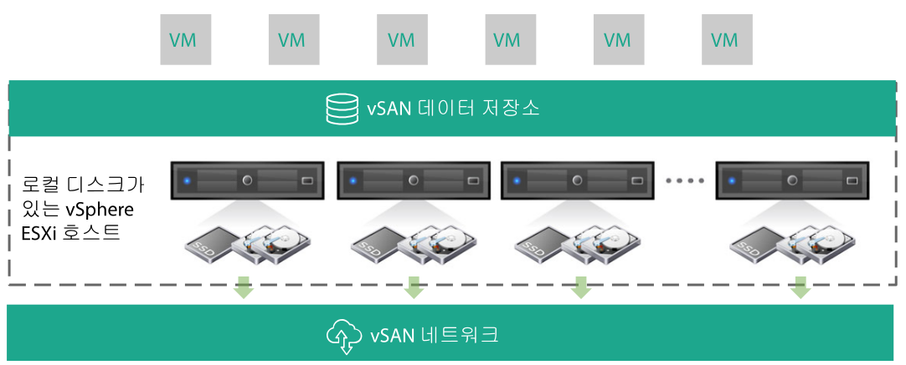
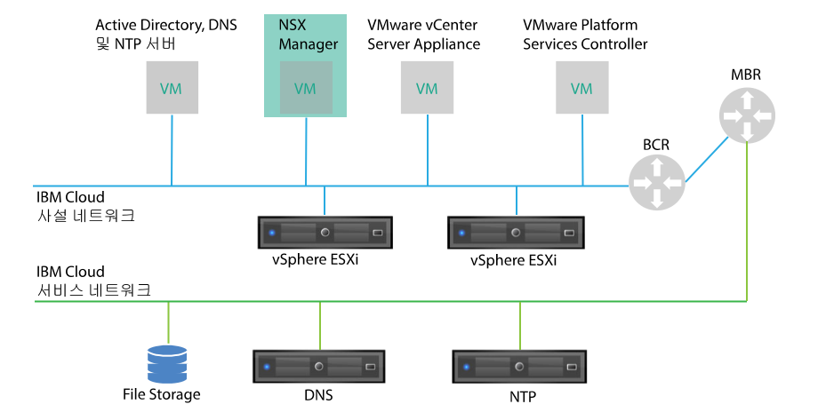
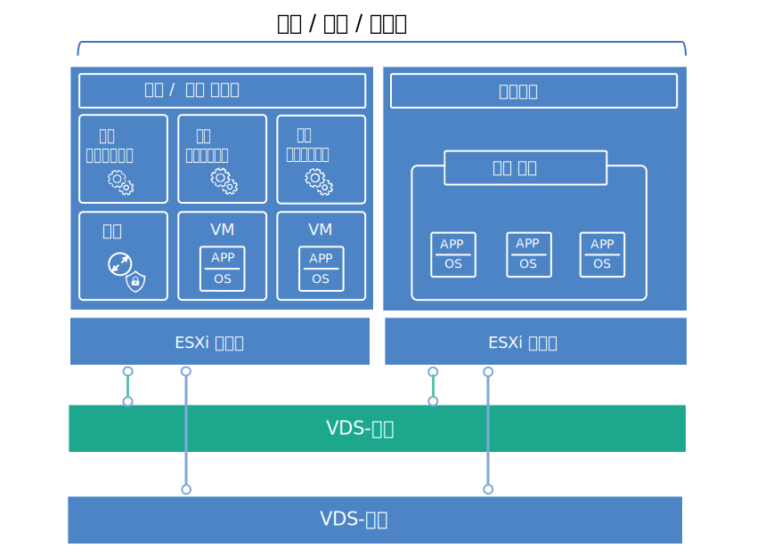

---

copyright:

  years:  2016, 2018

lastupdated: "2018-07-17"

---

# 가상 인프라 디자인

가상 인프라 계층에는 VMware vSphere ESXi, VMware NSX 및 선택사항으로 VMware vSAN 등의 실제 인프라 계층에서 제공된 컴퓨팅, 스토리지 및 네트워크 리소스를 가상화하는 VMware 소프트웨어 컴포넌트가 포함되어 있습니다. 

## VMware vSphere 디자인

vSphere ESXi 구성은 다음과 같은 측면으로 구성되어 있습니다. 
* 부트 구성
* 시간 동기화
* 호스트 액세스
* 사용자 액세스
* DNS 구성

표 1에는 각 측면에 대한 스펙이 개략적으로 설명되어 있습니다. ESXi의 구성 및 설치 이후에 호스트는 VMware vCenter Server에 추가되며 여기에서 관리됩니다. 

이 디자인을 사용하면 DCUI(Direct Console User Interface), ESXi 쉘 및 SSH(Secure Shell)를 통해 가상 호스트에 액세스할 수 있습니다. 

기본적으로, 직접 로그인할 수 있는 유일한 사용자는 호스트의 실제 시스템에 대한 _root_ 및 _ibmvmadmin_ 사용자입니다. 관리자는 MSAD(Microsoft Active Directory) 도메인의 일반 사용자를 추가하여 호스트에 대한 사용자 액세스를 가능하게 할 수 있습니다. vCenter Server 솔루션 디자인의 모든 호스트는 중앙 NTP 서버와 동기화하도록 구성되어 있습니다. 

표 1. vSphere ESXi 구성

| 속성                         | 구성 매개변수 |
|:---------------------- |:----------------------- |
| ESXi 부트 위치         | RAID-1에서 구성된 로컬 디스크 사용 |
| 시간 동기화            | {{site.data.keyword.cloud}} NTP 서버 사용 |
| 호스트 액세스          | DCUI, ESXi 쉘 또는 SSH 지원 |
| 사용자 액세스          | 로컬 인증 및 MSAD |
| 도메인 이름 해석       |[공통 서비스 디자인](design_commonservice.html)에서 설명된 대로 DNS 사용 |

vSphere 클러스터는 사용자 워크로드에 대한 컴퓨팅 리소스는 물론 중앙 클라우드를 관리하는 가상 머신(VM)을 수용합니다. 

Cloud Foundation 인스턴스의 경우:
* 초기 배치 시에 인스턴스에 4개의 ESXi 호스트가 포함되어 있습니다. 
* 배치 후에는 최대 32개의 ESXi 호스트까지 인스턴스를 확장할 수 있습니다. 

vCenter Server 인스턴스의 경우:
* 인스턴스가 NFS만 사용하는 경우, 초기 배치 시에 ESXi 호스트의 최소 수는 2개이지만 HA의 경우에는 3개를 권장합니다. 초기 배치 중이나 그 이후에는 최대 59개의 ESXi 호스트까지 확장할 수 있습니다. 
* 인스턴스가 vSAN을 사용하는 경우, 초기 배치 시에 ESXi 호스트의 최소 수는 4개입니다. 초기 배치 중이나 그 이후에는 최대 59개의 ESXi 호스트까지 확장할 수 있습니다. 

추가 사용자 워크로드를 지원하려면 다음으로 환경을 확장할 수 있습니다.   
* 기존 클러스터의 추가 컴퓨팅 호스트 배치
* 동일한 vCenter Server Appliance에서 관리하는 추가 클러스터 배치
* 자체 vCenter Server Appliance를 사용하여 새 vCenter Server 또는 Cloud Foundation 인스턴스 배치

클러스터에 대한 자세한 정보는 [VMware 클러스터 솔루션 아키텍처를 실행하는 {{site.data.keyword.cloud_notm}}
문서](https://www.ibm.com/cloud/garage/files/IBM-Cloud-for-VMware-Solutions-Multicluster-Architecture.pdf)를 참조하십시오. 

## VMware vSAN 디자인

이 디자인에서 VMware vSAN 스토리지는 vSphere 호스트에 대한 공유 스토리지를 제공하기 위해 Cloud Foundation 인스턴스에서 채택되며, 선택적으로 vCenter Server 인스턴스에서도 채택됩니다. 

그림 1에서 표시된 대로 vSAN은 vSphere 클러스터 내에서 다중 ESXi 호스트 간의 로컬 스토리지를 집계하며, 집계된 스토리지를 단일 VM 데이터 저장소로서 관리합니다. 이 디자인 내에서 컴퓨팅 노드에는 ESXi OS 및 vSAN 데이터 저장소에 대한 로컬 디스크 드라이브가 포함되어 있습니다. 노드가 속한 클러스터와는 무관하게, ESXi 설치를 수용하기 위해 2개의 1TB SATA 드라이브가 각 노드에 포함되어 있습니다. 

그림 1. vSAN 개념

vSAN에서는 다음 컴포넌트를 채택합니다. 
* 각 디스크 그룹이 2개 이상의 디스크로 구성된 2-디스크 그룹 vSAN 디자인. 그룹에서 최소 크기의 하나의 SSD는 캐시 티어로서 제공되며, 나머지 SSD는 용량 티어로서 제공됩니다. 
* 온보드 RAID 제어기는 RAID-0 레벨에서 2개의 OS 드라이브를 제외한 각 드라이브마다 구성됩니다. 
* 단일 vSAN 데이터 저장소가 모든 스토리지에서 작성됩니다. 

사용 가능한 vSAN 기능은 인스턴스를 주문할 때 선택하는 라이센스 에디션에 따라 다릅니다. 자세한 정보는 [VMware vSAN 에디션 비교](appendix.html#vmware-vsan-edition-comparison)를 참조하십시오. 

### vSAN의 가상 네트워크 설정

이 디자인의 경우, vSAN 트래픽은 전용 사설 VLAN에서 ESXi 호스트 간에 이동합니다. 사설 네트워크 스위치에 연결된 2개의 네트워크 어댑터는 업링크로서 두 네트워크 어댑터 모두의 vSphere 분배 스위치(VDS)로 vSphere 내에서 구성됩니다. vSAN VLAN에 대해 구성된 전용 vSAN 커널 포트 그룹은 VDS 내에 상주합니다. 점보 프레임(MTU 9000)은 사설 VDS용으로 사용됩니다. 

vSAN은 업링크 간의 트래픽을 로드 밸런싱하지 않습니다. 따라서 고가용성(HA)을 지원하기 위해 다른 어댑터가 대기 중인 동안 하나의 어댑터는 활성입니다. vSAN에 대한 네트워크 장애 복구 정책은 실제 네트워크 포트 간에 **명시적 장애 복구**로서 구성됩니다. 

실제 NIC 연결에 대한 자세한 정보는 그림 2. [실제 인프라 디자인](design_physicalinfrastructure.html)의 실제 호스트 NIC 연결을 참조하십시오. 

### 스토리지 정책 디자인

vSAN이 사용되어 구성된 경우에는 VM 스토리지 특성을 정의하기 위해 스토리지 정책이 구성됩니다. 스토리지 특성은 서로 다른 VM에 대해 서로 다른 서비스 레벨을 지정합니다. 

이 디자인의 기본 스토리지 정책은 단일 장애를 허용합니다. 기본 정책은 **장애 허용 방법**이 **RAID-5/6(삭제 코딩) - 용량**으로 설정되고 **기본 장애 레벨**이 1로 설정된 RAID 5 삭제 코딩으로 구성되어 있습니다. 

RAID 5 구성에서는 최소 4개의 호스트가 필요합니다. 또는 **장애 허용 방법**이 **RAID-5/6(삭제 코딩) - 용량**으로 설정되고 **기본 장애 레벨**이 2로 설정된 RAID 6 구성을 선택할 수도 있습니다. 

RAID 6 구성에서는 최소 6개의 호스트가 필요합니다. **중복** 및 **압축**은 기본 스토리지 정책에서도 사용됩니다. 

vSphere 콘솔에서 달리 지정되지 않는 한 인스턴스는 기본 정책을 사용합니다. 사용자 정의 정책이 구성된 경우, vSAN은 가급적 이를 보장합니다. 그러나 정책을 보장할 수 없는 경우, 프로비저닝 강제 실행을 사용하지 않는 한 정책을 사용하는 VM을 프로비저닝할 수 없습니다. 

스토리지 정책은 새 ESXi 호스트 또는 ESXi 호스트의 패치가 추가된 후에 재적용되어야 합니다. 

### vSAN 설정

vSAN 설정은 {{site.data.keyword.cloud_notm}} 내에서 VMware 솔루션 배치를 위한 우수 사례를 기반으로 설정됩니다. 여기에는 SIOC 설정, 명시적 장애 복구 설정 포트 그룹 및 디스크 캐시 설정이 포함됩니다. 
* SSD 캐시 정책 설정: **미리 읽기**, **Write Through**, **직접** 없음(NRWTD) 
* 네트워크 I/O 제어 설정
   * 관리: 20 공유
   * 가상 머신: 30 공유
   * vMotion: 50 공유
   * vSAN: 100 공유
* vSAN 커널 포트: **명시적 장애 복구**

## VMware NSX 디자인

네트워크 가상화는 가상 계층 내에 존재하는 네트워크 오버레이를 제공합니다. 이는 요청 시(On Demand) 가상 네트워크의 빠른 프로비저닝, 배치, 재구성 및 폐기 등의 기능이 있는 아키텍처를 제공합니다. 이 디자인은 vSphere Distributed Switch(vDS) 및 VMware NSX for vSphere를 사용하여 가상 네트워킹을 구현합니다. 

이 디자인에서 NSX Manager는 초기 클러스터에 배치됩니다. NSX Manager에는 사설 포터블 주소 블록의 VLAN 지원 IP 주소가 지정됩니다. 이는 관리 컴포넌트용으로 지정되며 [공통 서비스 디자인](design_commonservice.html)에서 논의한 DNS 및 NTP 서버로 구성되어 있습니다. NSX Manager는 표 2에 나열된 스펙으로 설치됩니다. 

표 2. NSX Manager 속성

| 속성                         | 스펙                           |
|:--------------- |:------------- |
| NSX Manager     | 가상 어플라이언스              |
| vCPU 수                      |4개 |
|메모리          | 16GB |
| 디스크                       | 관리 NFS 공유의 60GB |
| 디스크 유형                  | 씬 프로비저닝됨 |
|네트워크         |관리 컴포넌트용으로 지정된 사설 A 포터블|

다음 그림에서는 아키텍처의 기타 컴포넌트와 연관된 NSX Manager의 배치를 보여줍니다. 

그림 2. NSX Manager 네트워크 개요

초기 배치 이후 {{site.data.keyword.cloud_notm}} 자동화는 초기 클러스터 내에 3개의 NSX 제어기를 배치합니다. 각 제어기에는 관리 컴포넌트용으로 지정된 사설 A 포터블 서브넷의 VLAN 지원 IP 주소가 지정됩니다. 또한 이 디자인은 클러스터의 호스트 간에 제어기를 분리하기 위해 VM-VM 역-친화성 규칙을 작성합니다. 초기 클러스터에는 제어기에 대한 고가용성을 보장할 수 있도록 최소한 3개의 노드가 포함되어 있어야 합니다. 

제어기에 추가하여, {{site.data.keyword.cloud_notm}} 자동화는 VTEP(VXLAN Tunnel Endpoint)를 통한 가상화된 네트워크의 사용이 가능하도록 NSX VIBS의 배치된 vSphere 호스트를 준비합니다. VTEP에는 [VLAN 및 서브넷 요약](design_physicalinfrastructure.html#table_vlan_subnet_summary)에 나열된 대로 VTEP에 대해 지정된 사설 A 포터블 IP 주소 범위의 VLAN-지원 IP 주소가 지정됩니다. VXLAN 트래픽은 태그 지정되지 않은 VLAN에 상주하며 사설 vSphere 분배 스위치(VDS)에 지정됩니다. 

그 이후에 세그먼트 ID 풀이 지정되며 클러스터의 호스트가 전송 구역에 추가됩니다. IGMP(Internet Group Management Protocol) 스누핑이 {{site.data.keyword.cloud_notm}} 내에서 구성되지 않으므로 전송 구역에서는 유니캐스트만 사용됩니다. 

이후에 NSX Edge Services Gateway 쌍이 배치됩니다. 모든 경우에, 하나의 게이트웨이 쌍은 사설 네트워크에 상주하는 자동화 컴포넌트의 아웃바운드 트래픽에 사용됩니다. vCenter Server의 경우, 고객 관리 에지라고 하는 두 번째 게이트웨이가 배치되며 사설 네트워크에 지정된 인터페이스와 공용 네트워크에 대한 업링크로 구성됩니다. 솔루션의 일부로서 배치된 NSX Edge Services Gateway에 대한 자세한 정보는 [NSX Edge on {{site.data.keyword.cloud_notm}} 솔루션 아키텍처](https://www.ibm.com/cloud/garage/files/IBM_Cloud_for_VMware_Solutions_NSX_Edge_Services_Gateway.pdf)를 참조하십시오. 

클라우드 관리자는 임의의 필수 컴포넌트(예: DLR(Distributed Logical Router), 논리 스위치 및 방화벽)를 구성할 수 있습니다. 사용 가능한 NSX 기능은 인스턴스를 주문할 때 선택하는 NSX 라이센스 에디션에 따라 다릅니다. 자세한 정보는 [VMware NSX 에디션 비교](appendix.html#vmware-nsx-edition-comparison)를 참조하십시오. vCenter Server 인스턴스의 경우, {{site.data.keyword.cloud_notm}} 자동화는 vCenter Server Appliance 및 Platform Services Controller(PSC)를 NSX Manager 분배 방화벽 제외 목록에 추가합니다. 

### 분배 스위치 디자인

이 디자인에서는 최소 수의 vSphere 분배 스위치(VDS)를 사용합니다. 클러스터의 호스트는 공용 및 사설 네트워크에 연결됩니다. 호스트는 2개의 분배 가상 스위치로 구성되어 있습니다. 2개 스위치의 사용은 공용 및 사설 네트워크를 분리하는 {{site.data.keyword.cloud_notm}} 네트워크의 사례를 따릅니다. 다음 다이어그램에서는 VDS 디자인을 보여줍니다. 

그림 3. 분배 스위치 디자인

그림에 표시된 대로, 하나의 VDS는 공용 네트워크 연결(SDDC-Dswitch-Public)용으로 구성되어 있으며 다른 VDS는 사설 네트워크 연결(SDDC-Dswitch-Private)용으로 구성되어 있습니다. 

경합과 대기 시간을 줄이고 보안을 강화하기 위해 서로 다른 유형의 트래픽을 분리해야 합니다. VLAN은 실제 네트워크 기능을 세그먼트화하는 데 사용됩니다. 

이 디자인에서는 3개의 VLAN(사설 네트워크 트래픽용으로 2개와 공용 네트워크 트래픽용으로 1개)을 사용합니다. 다음 표에서는 트래픽 분리를 보여줍니다. 

표 3. 트래픽 유형으로 VLAN 맵핑

|VLAN  | 대상 |트래픽 유형|
|:----- |:----------- |:------------ |
|VLAN1 | 공용|인터넷 액세스를 위해 사용 가능 |
|VLAN2 | 사설 A   | ESXi 관리, 관리, VXLAN(VTEP) |
|VLAN3 | 사설 B | vSAN, NFS, vMotion |

워크로드의 트래픽이 VXLAN-지원 논리 스위치에서 이동합니다. 

vSphere 클러스터는 다음 표에서와 같이 구성된 2개의 vSphere 분배 스위치를 사용합니다. 

표 4. 통합된 교환 분배 스위치

| vSphere Distributed 스위치 이름|기능 |네트워크 I/O 제어|로드 밸런싱 모드|실제 NIC 포트| MTU |
|:------------- |:------------- |:------------- |:------------- |:------------- |:------------- |
| SDDC-Dswitch-Private | ESXi 관리, 가상 SAN, vSphere vMotion, VXLAN Tunnel Endpoint, NFS(VTEP) |사용|명시적 장애 복구(vSAN, vMotion) 원래 가상 포트 기반 라우트(기타 모두) |2 | 9,000  (점보 프레임) |
| SDDC-Dswitch-Public | 외부 관리 트래픽(North-South) |사용| 원래 가상 포트 기반 라우트 |2 | 1,500 (기본값)|

**참고:** 호스트 NIC의 이름, 번호 및 순서는 {{site.data.keyword.CloudDataCent_notm}} 및 호스트 하드웨어 선택에 따라 서로 다를 수 있습니다. 

표 5. 통합 클러스터 분배 스위치 포트 그룹 구성 설정

|매개변수          |설정|
|:------------------ |:------------- |
|로드 밸런싱|원래 가상 포트 기반 라우트 \* |
|장애 복구 발견| 링크 상태만 |
|알림 스위치|사용|
| 장애 조치           |아니오 |
|장애 복구 순서|활성 업링크: Uplink1, Uplink2 \* |

\* **참고**: vSAN 스토리지 트래픽의 로드 밸런싱을 지원하지 않으므로 vSAN 포트 그룹은 활성/대기의 명시적 장애 복구를 사용합니다. 

표 6. 통합 클러스터 가상 스위치 포트 그룹 및 VLAN

| vSphere 분배 스위치|포트 그룹 이름| 팀 구성 |업링크| VLAN ID |
|:------------- |:------------- |:------------- |:------------- |:---------- |
| SDDC-Dswitch-Private | SDDC-DPortGroup-Mgmt | 원래 가상 포트 | 활성: 0, 1 |VLAN1 |
| SDDC-Dswitch-Private | SDDC-DPortGroup-vMotion | 원래 가상 포트 | 활성: 0, 1 |VLAN2 |
| SDDC-Dswitch-Private | SDDC-DPortGroup-VSAN | 명시적 장애 복구 | 활성: 0 대기: 1 |VLAN2 |
| SDDC-Dswitch-Private | SDDC-DPortGroup-NFS | 원래 가상 포트 | 활성: 0, 1 |VLAN2 |
| SDDC-Dswitch-Private | NSX에 의해 자동으로 생성됨 | 원래 가상 포트 | 활성: 0, 1 |VLAN1 |
| SDDC-Dswitch-Public | SDDC-DPortGroup-External | 원래 가상 포트 | 활성: 0, 1 |VLAN3 |

표 7. 통합 클러스터 VM 커널 어댑터

| vSphere 분배 스위치| 용도 | 연결된 포트 그룹 |사용되는 서비스| MTU |
|:-------------------------- |:------- |:-------------------- |:---------------- |:--- |
| SDDC-Dswitch-Private |관리| SDDC-DPortGroup-Mgmt |관리 트래픽| 1,500 (기본값)|
| SDDC-Dswitch-Private | vMotion | SDDC-DPortGroup-vMotion | vMotion 트래픽| 9,000 |
| SDDC-Dswitch-Private | VTEP | *NSX에 의해 자동으로 생성됨* | \- | 9,000 |
| SDDC-Dswitch-Private |VSAN| SDDC-DPortGroup-VSAN |VSAN| 9,000 |
| SDDC-Dswitch-Private |NAS| SDDC-DPortGroup-NFS | \-  | 9,000 |

### NSX 구성

이 디자인은 NSX 컴포넌트의 구성을 지정하지만 네트워크 오버레이 컴포넌트 구성은 적용하지 않습니다. 사용자는 자체 요구사항에 따라 네트워크 오버레이를 디자인할 수 있습니다. 다음과 같은 측면이 사전 구성되어 있습니다.

* 관리 서버 및 제어기가 설치되어 vCenter 웹 UI에 통합됨
* ESXi 에이전트가 설치되며 VTEP IP IP 주소가 ESXi 호스트마다 구성됨
* VTEP 구성, 제어기 구성 및 VXLAN 구성(전송 구역)
* 관리 컴포넌트에서 사용하는 NSX Edge Services Gateway 어플라이언스
* vCenter Server 인스턴스에만 해당: 고객 사용을 위한 NSX Edge Services Gateway 어플라이언스

다음과 같은 측면은 구성되어 있지 않습니다.
* 가상 분배 라우터
* 마이크로 분석 방식
* VXLAN
* 기타 VMware 인스턴스에 링크된 NSX Management

### 관련 링크

* [{{site.data.keyword.cloud_notm}} running VMware Clusters solution architecture](https://www.ibm.com/cloud/garage/files/IBM-Cloud-for-VMware-Solutions-Multicluster-Architecture.pdf)
* [NSX Edge on {{site.data.keyword.cloud_notm}} 솔루션 아키텍처](https://www.ibm.com/cloud/garage/files/IBM_Cloud_for_VMware_Solutions_NSX_Edge_Services_Gateway.pdf)
