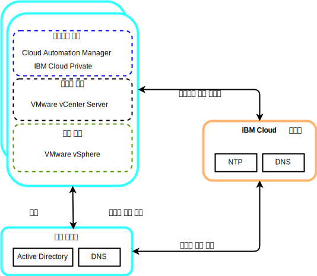

---

copyright:

  years:  2016, 2019

lastupdated: "2019-05-07"

subcollection: vmware-solutions

---

# VMware 및 Skate Advisor Concept Car의 공통 서비스 컴포넌트
{: #vcscar-commonservices}

공통 서비스는 클라우드 관리 플랫폼의 기타 서비스에서 사용하는 서비스를 제공합니다. 공통 서비스는 ID 및 액세스 서비스, Domain Name Service 및 NTP 서비스가 포함됩니다.

## ID 및 액세스 서비스
{: #vcscar-commonservices-identity}

VMware vCenter Server on {{site.data.keyword.cloud_notm}} 자동화의 일부로 Microsoft Active Directory(AD)는 Identity  Management에 사용됩니다. 단일 AD VSI(Virtual Server Instance)가 배치됩니다. vCenter는 AD 인증을 사용하도록 구성되며 LDAP 인증을 위해서도 {{site.data.keyword.icpfull_notm}}를 구성할 수 있습니다.

## Domain Name Service
{: #vcscar-commonservices-dns}

배치에서는 배치된 AD VSI를 인스턴스를 위한 DNS(Domain Name System) 서버로 사용합니다. 배치된 모든 컴포넌트는 기본 DNS로 MS AD를 지정하도록 구성됩니다. 배치된 컴포넌트의 예로 vCenter, PSC, NSX과 ESXi 호스트가 있습니다.

## Network Time Protocol 서비스
{: #vcscar-commonservices-ntp}

vCenter Server 배치에서는 {{site.data.keyword.cloud_notm}} 인프라 NTP(Network Time Protocol) 서버를 사용합니다. 배치된 모든 컴포넌트는 이러한 NTP 서버를 사용하도록 구성되어 있습니다. 인증서와 AD 인증이 올바르게 작동하려면 동일한 NTP 서버를 사용하는 모든 컴포넌트가 있어야 합니다.

## 관련 링크
{: #vcscar-commonservices-related}

* [vCenter Server on {{site.data.keyword.cloud_notm}} with Hybridity Bundle 개요](/docs/services/vmwaresolutions/archiref/vcs?topic=vmware-solutions-vcs-hybridity-intro)
