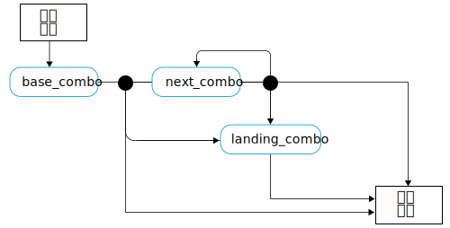

---

copyright:

  years:  2016, 2019

lastupdated: "2019-06-26"

subcollection: vmware-solutions


---

# 스케이트보딩 언어 개념
{: #vcscar-concepts}

## 스케이터 언어
{: #vcscar-concepts-skater}

Skate Advisor의 중요한 점은 Watson 구동 챗봇과의 대화입니다. 다음 섹션에서는 사람과 Skate Advisor 챗봇의 통신을 정의하는 대화 규칙을 자세히 설명합니다.

스케이터 언어는 시스템의 핵심이고 다음 방식으로 사용됩니다.
* 트릭 인식: Watson Discovery에서 사용되어 온라인 소스에서 자료를 수집합니다. 이를 통해 기존 트릭을 인식하여 소스 자료에 맵핑합니다.
* 스케이트 대화: 챗봇에서 사용되어 시스템 사용자와 의미 있는 대화를 나눕니다.
* 트릭 분류: 트릭에 대한 텍스트적 설명을 기반으로 트릭을 저장하고 분류합니다. 위치 및 비디오 참조와 같은 메타데이터를 분류된 트릭에 첨부할 수 있습니다.

## 언어 요소
{: #vcscar-concepts-lang-elem}

### 핵심 요소
{: #vcscar-concepts-core-elem}

다음은 트릭을 구성하기 위한 핵심 언어 요소입니다.

표 1. 핵심 언어 요소

요소 유형 | 언어 텍스트
---|---|---
Direction | fakie<br>nollie<br>switch
Rotation | halfcab<br>cab<br>180<br>360<br>540
 Base | kickflip<br>heelflip<br>hardflip<br>bigspin<br>shuvit<br>impossible
landing | manual(뒤로 2개의 휠)<br>nosemanual(앞으로 2개의 휠)<br>5-0(grind)<br>nosegrind<br>tailslide<br>noseslide<br>crooked grind<br>smithgrind<br>boardslide<br>lipslide<br>

### 요소 수정자
{: #vcscar-concepts-elem-modifiers}

요소 수정자는 언어의 특정한 측면에 컨텍스트를 제공하는 특수 언어 요소입니다.

표 2. 언어 수정자

요소 유형 | 언어 텍스트 |주의사항
---|---|---
Turn Prefix | Frontside<br>backside | Turn Prefix는 턴(turn)의 방향과 관계가 있습니다.
Varial | Inward<br>outward |

## 언어 규칙
{: #vcscar-concepts-lang-rules}

다음 규칙 세트가 언어를 구성합니다. 트릭은 "콤보"로 참조되는 하나 이상의 요소 조합으로 나뉩니다. 달리 지정하지 않는 한, 방향이 기본 콤보와 동일하다고 가정하는 것에서 첫 번째 콤보와 다음 콤보 간에 차이가 있습니다.

다음 규칙에 대해서는 언어 구성에 사용될 때 참조되는 핵심 요소 및 요소 수정자를 참조하십시오.

### 트릭 규칙 세트
{: #vcscar-concepts-trick-ruleset}

```
base_combo = 'direction \+ \[varial | turn_prefix\] \+ \[rotation\] \+ \[base_trick\]'
next_combo = ''\[varial | turn_prefix\] \+ \[rotation\] \+ \[base_trick\]'
landing_combo = ''\[varial | turn_prefix\] \+ landing'
trick = 'combo \+ \[“to” + combo\] \+ \[“to” \+ landing_combo\]'
```

### 트릭 규칙 엔진
{: #vcscar-concepts-trick-rule-engine}

다음 다이어그램은 규칙 엔진을 시각적으로 요약하여 설명합니다.



## 샘플 트릭 언어
{: #vcscar-concepts-sample-trick}

다음 예는 샘플 트릭의 목록입니다.

```
fakie-kickflip
fakie-kickflip to fakie-5-0 to fronside-halfcab (out)
fakie-heeflip
fakie-heeflip to fakie-maual to fakie-hardflip
fakie-inward (varial) heeflip to fakie-backside tailslide to fakie
switch-heeflip to fakie-maual to fakie-hardflip
switch-hardflip to fakie-manual
fakie-hardflp to fakie-nosegrind
nollie-hardflip-to-tailslide
nollie-inward-heelflip to frontside noseslide
kickflip-frontside to crooked grind
halfcab-heelflip to crooked grind
frontside-shuvit to nosegrind to nollie-flip (out)
kickflip to nosegrind to nollie-impossilbe (out)
nollie-kickflip to noseslide to nollieflip
nollie-kickflip to frontside-lipslide
nollie-impossible to manual
nollie-impossible to 5-0
nollie-kickflip to crooked grind
nollie-kickflip to crooked grind to nollie-halfcab-kickflip (out)
frontside-nollie-halfcab-heelflip to fakie-nosegrind
backside-nollie-halfcab-kickflip to backside-tailslide to backside-180-out
frontside-nollie-cab-kicflip halfcab to backside-smithgrind
halfcab to backside-smithgrind to backside-180-bigspin (out)
kickflip-backside-tailslide to backside-180-kickflip
kickflip-backside-tailslide to backside-backside-bigspin
360-kicflip to nosemanual to nollie-360-kickflip
360-kicflip to frontside-lipslide
harflip to backside-lipslide
kicflip to frontside-boardslidev
nollie-heelflip to frontside-boardslide
```

## 관련성
{: #vcscar-concepts-relevance}

트릭 언어는 스케이팅 문서 및 매체를 인식하고 수집하도록 Watson을 훈련시키는 데 사용되고 사용자 대화의 기반을 형성하는 주요 구성입니다.

## 관련 링크
{: #vcscar-concepts-related}

* [vCenter Server on {{site.data.keyword.cloud}} with Hybridity Bundle 개요](/docs/services/vmwaresolutions/archiref/vcs?topic=vmware-solutions-vcs-hybridity-intro)  
