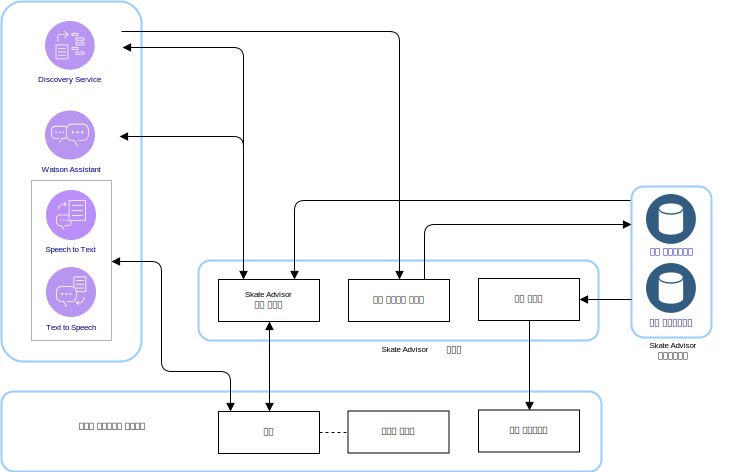

---

copyright:

  years:  2016, 2019

lastupdated: "2019-01-23"

---

# Skate Advisor 논리적 디자인

다음 정보는 시스템의 논리적 디자인을 형성하는 애플리케이션 요소를 설명합니다.

## 시스템 구성요소

그림 1. Skate Advisor 컴포넌트

Skate Advisor는 구조화된 방식으로 시스템과 상호작용하기 위해 텍스트 또는 음성 인식을 허용할 수 있는 챗봇으로 주로
구성됩니다.

## 트릭

Skate Advisor의 핵심 데이터 요소는 트릭입니다. 트릭 언어는 트릭을 고유하게 정의합니다. 이 언어를 사용하여 다음 태스크를 완료할 수 있습니다.
- 트릭에 대하여 챗봇과 대화를 나누십시오.
- Watson Discovery를 통해 트릭을 검색하십시오.
- 소스 문서를 통해 Watson Discovery를 훈련할 때 트릭을 식별하고 분류하십시오.
- 위치와 매체 표시 목적으로 트릭을 식별하십시오.

### 트릭 정의

트릭은 트릭을 설명하는 언어 구조에 의해 고유하게 정의됩니다. 완전한 정의는 트릭 규칙 엔진을 참조하십시오.

### 트릭 목록

트릭 목록은 언어 요소에 정의된 기본 트릭 또는 랜딩의 조회로 리턴됩니다.

### 트릭 데이터

트릭 데이터가 리턴되면 트릭에는 다음 정보가 포함될 수 있습니다.
- 트릭 설명
- 하나 이상의 매체 아티팩트
- 위치 정보

## 대화 스트림

챗봇에는 사전 정의된 제한된 수의 가능한 대화가 있습니다. 대화는 다음 정보로 정의됩니다.
- 트릭 찾기: 기본 트릭 또는 랜딩을 나타내는 조회 매개변수를 기반으로 유효한 트릭 세트를 찾습니다.
- 위치 찾기: 가까이에서 트릭을 수행할 수 있는 위치를 찾습니다.
- 매체 표시: 트릭을 분류하고 찾은 온라인 동영상과 같은 매체 항목을 표시합니다.

표 1. 대화

대화 | 구조 | 결과
---|---|---
트릭 찾기 | 트릭 설명 |트릭 목록
위치 찾기 | 이 트릭을 수행할 위치? | 특정 트릭을 위한 위치 목록
매체 표시 | 트릭 동영상 표시 |매체 결과 목록

## 사용자 인터페이스 컴포넌트

### 챗봇

챗봇은 사용자와 대화를 나누는 웹 컴포넌트입니다. 챗봇은 텍스트 또는 음성 인식을 허용할 수 있습니다. 목록과 같은 결과가 결과를 나타내는 음성과 함께 텍스트로 렌더링됩니다.

챗봇은 다음 방법으로 시스템과 상호작용합니다.

그림 2. 일반적인 챗봇 조회

표 2. 챗봇 상호작용

단계 |설명
---|---
1 | 유효한 대화를 초기화하고 Conversation Streams의 섹션을 참조하십시오.
2 | 챗봇이 음성을 Speech to Text 서비스로 보냅니다.
 3 | Speech to Text service가 텍스트를 챗봇으로 보냅니다.
 4개 | 챗봇이 텍스트 조회를 Skate Advisor로 보냅니다.
5 | Skate Advisor가 요청을 평가하여 Watson Assistant로 보냅니다.
 6 | Watson Assistant가 요청을 분류하고 수행할 조치를 Skate Advisor로 보내 응답합니다.
7 | Skate Advisor가 Discovery Service에서 데이터 세트를 요청합니다.
8 | Discovery Service가 조회를 평가하고 응답을 보냅니다.
9 |Skate Advisor가 응답을 만들어 챗봇에 텍스트로 보냅니다.
10 | 챗봇이 텍스트 응답을 Text To Speech 서비스로 보냅니다.
11 | 챗봇을 통해 결과가 사용자에게 전송됩니다.

### 동영상 렌더링

동영상 렌더링 컴포넌트는 동영상을 재생하거나 문서를 표시합니다. 이러한 아티팩트는 트릭이 검색된 소스 아티팩트를 나타냅니다.

동영상 렌더링 컴포넌트는 비디오를 보여주는 웹 인터페이스에 임베디드된 위젯입니다. 동영상은 시스템 사용자의 조회 결과에 따라 챗봇에 표시됩니다. 결과 동영상 링크를 선택하면 동영상 렌더링을 트리거합니다.

### 위치 인터페이스

Skate Advisor에는 특정 트릭의 위치를 기록하기 위한 시스템 사용자의 인터페이스가 포함되어 있습니다. 웹 인터페이스 컴포넌트에는 두 가지 주요 요소가 있습니다.
1. 시스템 사용자의 위치를 특정 트릭을 수행하기 위한 최적의 장소로 승인하십시오.
2. 특정 트릭에 대해 권장되는 하나 이상의 위치를 표시하십시오.

## Watson 컴포넌트

다음 Watson 컴포넌트가 이 아키텍처에 포함됩니다.
* Knowledge Studio - Watson Studio는 시스템을 위한 스케이트 언어를 디자인하고 이 언어를 사용하여 스케이트 언어를 구현하는 웹의 문서를 인식하는 도구입니다. Knowledge Studio는 사용할 Watson Discovery의 모델을 제공합니다.
* Speech to Text - 음성을 문자로 변환합니다. 이 컴포넌트는 챗봇이 실행되는 디바이스에서 음성을 허용하고, 이 음성을 Watson에서 처리할 수 있도록 텍스트로 변환합니다.
* Text to Speech - 문자를 음성으로 합성합니다. 이 컴포넌트는 Skate Advisor 애플리케이션에서 텍스트를 승인하고, 챗봇이 실행되는 장치를 위해 음성으로 변환하여 재생합니다.
* Discovery Service - 시스템에서 Watson Discovery Service를 사용하여 요청 매개변수와 일치하는 스케이트 관련 컨텐츠를 검색합니다. 예로 "캐스퍼 트릭에 대한 모든 레코드 나열"이 있습니다. Watson Discovery는 고급 기계 학습 기술을 사용하여 수집된 컨텐츠에서 가장 관련된 부분을 드러냅니다.
* Watson Assistant - Watson Assistant는 사용자와 시스템(챗봇) 사이의 상호작용을 디자인하는 도구입니다. 이는 Assistant가 인식하고 적절한 응답을 만들기 위한 일련의 문법 형식으로 도메인별 언어(예: 스케이트보딩)로 훈련되어야 합니다.

## Skate Advisor 서비스

Skate Advisor 서비스는 요청을 렌더링하기 위해 API 서비스 세트를 제공하는 애플리케이션 컴포넌트입니다. 노출되는 서비스에는 이전에 설명된 대화 스트림과의 직접적인 상관 관계가 있습니다. 노출된 API에는 다음 일반 카테고리가 있습니다.
* get_tricks - Discovery Service에 표시되는 자연어로 된 <query\>를 기반으로 트릭 목록이 리턴됩니다.
* show_tricks - 특정 트릭에 대한 매체 목록을 리턴합니다.
* find_trick - 특정 트릭을 리턴합니다.
* accept_command - 챗봇에서 텍스트 명령을 승인하고 요청에 대한 서비스를 제공합니다.

## 검색 서비스 교육

Watson Discovery는 기계 학습 모델을 통해 훈련되어야 합니다. 이 모델은 분야 전문가가 Watson Knowledge Studio를 사용하여 반복적인 스타일로 작성됩니다.

그림 3. Discovery Service 훈련

Skate Advisor의 경우, 모델은 모델 작성을 위한 규칙 기반 훈련과 사전 기반 훈련이 조합된 엔티티 유형 간의 관계로 구성됩니다. 이 모델을 사용하면 Discovery Service가 훈련 세트로 사용되는 문서와 동영상 설명에서 수집된 트릭을 인식하고 분류할 수 있습니다.

훈련된 후 Discovery Service는 다음과 같은 조회에 응답할 수 있습니다.
- heelflip 기본 트릭이 있는 모든 트릭을 보여주십시오.
- 모든 트릭을 보여주십시오.
- 여러 콤보가 있는 모든 트릭을 보여주십시오.

### 관련 링크

* [vCenter Server on {{site.data.keyword.cloud}} with Hybridity Bundle 개요](/docs/services/vmwaresolutions/archiref/vcs/vcs-hybridity-intro.html)
